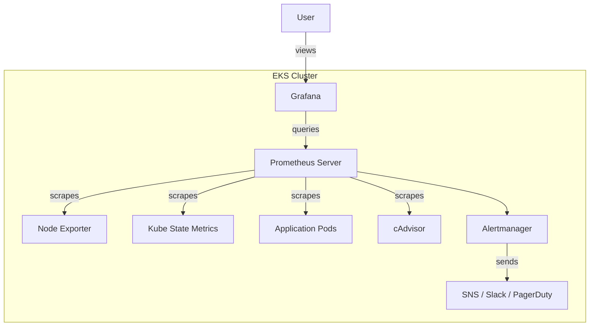

# How to Set Up Prometheus and Grafana on EKS

Author: [nawazdhandala](https://github.com/nawazdhandala)

Tags: AWS, EKS, Kubernetes, Prometheus, Grafana, Monitoring

Description: A practical guide to deploying Prometheus and Grafana on Amazon EKS for comprehensive cluster monitoring, custom metrics, and visualization dashboards.

---

Prometheus and Grafana are the de facto standard for monitoring Kubernetes clusters, and for good reason. Prometheus scrapes metrics from your pods, nodes, and cluster components with incredible granularity, while Grafana turns those metrics into dashboards that actually help you understand what's happening. While AWS offers [Container Insights](https://oneuptime.com/blog/post/set-up-container-insights-for-eks/view) as a managed alternative, running your own Prometheus stack gives you far more flexibility and control.

This guide walks through deploying the kube-prometheus-stack on EKS using Helm, which bundles Prometheus, Grafana, Alertmanager, and a bunch of pre-configured dashboards.

## Architecture Overview



## Prerequisites

You'll need:

- An EKS cluster with at least 3 nodes (the monitoring stack needs resources)
- kubectl and Helm 3 configured
- Persistent storage available (EBS CSI driver installed)

## Step 1: Add the Helm Repository

The kube-prometheus-stack chart is maintained in the prometheus-community Helm repository:

```bash
# Add the Prometheus community Helm repo
helm repo add prometheus-community https://prometheus-community.github.io/helm-charts
helm repo update
```

## Step 2: Create a Values File

The default configuration works, but you'll want to customize it for EKS. Create a values file:

```yaml
# prometheus-values.yaml - Custom values for EKS deployment
prometheus:
  prometheusSpec:
    retention: 15d
    retentionSize: "45GB"
    resources:
      requests:
        cpu: 500m
        memory: 2Gi
      limits:
        cpu: 1000m
        memory: 4Gi
    storageSpec:
      volumeClaimTemplate:
        spec:
          storageClassName: gp3
          accessModes: ["ReadWriteOnce"]
          resources:
            requests:
              storage: 50Gi
    # Scrape all pods with prometheus.io annotations
    podMonitorSelectorNilUsesHelmValues: false
    serviceMonitorSelectorNilUsesHelmValues: false

grafana:
  adminPassword: "change-me-in-production"
  persistence:
    enabled: true
    storageClassName: gp3
    size: 10Gi
  resources:
    requests:
      cpu: 250m
      memory: 512Mi
  dashboardProviders:
    dashboardproviders.yaml:
      apiVersion: 1
      providers:
        - name: default
          orgId: 1
          folder: ''
          type: file
          disableDeletion: false
          editable: true
          options:
            path: /var/lib/grafana/dashboards/default

alertmanager:
  alertmanagerSpec:
    storage:
      volumeClaimTemplate:
        spec:
          storageClassName: gp3
          accessModes: ["ReadWriteOnce"]
          resources:
            requests:
              storage: 5Gi

# Node exporter runs on every node
nodeExporter:
  enabled: true

# Kube State Metrics
kubeStateMetrics:
  enabled: true
```

## Step 3: Install the Stack

Create a dedicated namespace and install:

```bash
# Create the monitoring namespace
kubectl create namespace monitoring

# Install the kube-prometheus-stack
helm install prometheus-stack prometheus-community/kube-prometheus-stack \
  --namespace monitoring \
  --values prometheus-values.yaml \
  --wait
```

This takes a few minutes. It deploys Prometheus, Grafana, Alertmanager, node-exporter, and kube-state-metrics.

Verify everything is running:

```bash
# Check all monitoring pods
kubectl get pods -n monitoring

# Check persistent volume claims
kubectl get pvc -n monitoring
```

## Step 4: Access Grafana

The simplest way to access Grafana is through port-forwarding:

```bash
# Port-forward Grafana to your local machine
kubectl port-forward -n monitoring svc/prometheus-stack-grafana 3000:80
```

Open http://localhost:3000 in your browser. Log in with username `admin` and the password you set in the values file.

For production access, set up an [ALB Ingress](https://oneuptime.com/blog/post/set-up-ingress-with-alb-on-eks/view) with proper authentication.

## Step 5: Explore Pre-Built Dashboards

The kube-prometheus-stack comes with dozens of pre-built dashboards. The most useful ones include:

- **Kubernetes / Compute Resources / Cluster** - overall cluster resource usage
- **Kubernetes / Compute Resources / Namespace (Pods)** - per-namespace breakdown
- **Kubernetes / Compute Resources / Node (Pods)** - per-node resource usage
- **Node Exporter / Nodes** - detailed node hardware metrics
- **CoreDNS** - DNS performance metrics

These dashboards work out of the box. Browse them in Grafana under Dashboards > Browse.

## Adding Custom Metrics

To scrape metrics from your own applications, add Prometheus annotations to your pods:

```yaml
# deployment-with-metrics.yaml - Application with Prometheus scraping
apiVersion: apps/v1
kind: Deployment
metadata:
  name: my-app
spec:
  replicas: 3
  selector:
    matchLabels:
      app: my-app
  template:
    metadata:
      labels:
        app: my-app
      annotations:
        prometheus.io/scrape: "true"
        prometheus.io/port: "8080"
        prometheus.io/path: "/metrics"
    spec:
      containers:
        - name: my-app
          image: my-app:latest
          ports:
            - containerPort: 8080
```

Or use a ServiceMonitor for more control:

```yaml
# servicemonitor.yaml - Define how Prometheus scrapes your service
apiVersion: monitoring.coreos.com/v1
kind: ServiceMonitor
metadata:
  name: my-app-monitor
  namespace: monitoring
spec:
  selector:
    matchLabels:
      app: my-app
  endpoints:
    - port: http-metrics
      interval: 30s
      path: /metrics
  namespaceSelector:
    matchNames:
      - default
```

## Configuring Alerting

Set up alert rules and configure Alertmanager to send notifications. Here's an example PrometheusRule:

```yaml
# alerts.yaml - Custom alerting rules
apiVersion: monitoring.coreos.com/v1
kind: PrometheusRule
metadata:
  name: custom-alerts
  namespace: monitoring
spec:
  groups:
    - name: pod-alerts
      rules:
        - alert: PodCrashLooping
          expr: rate(kube_pod_container_status_restarts_total[5m]) > 0.1
          for: 5m
          labels:
            severity: warning
          annotations:
            summary: "Pod {{ $labels.namespace }}/{{ $labels.pod }} is crash looping"
            description: "Pod has restarted more than 3 times in the last 5 minutes."

        - alert: HighMemoryUsage
          expr: container_memory_working_set_bytes / container_spec_memory_limit_bytes > 0.9
          for: 10m
          labels:
            severity: warning
          annotations:
            summary: "Container {{ $labels.container }} in {{ $labels.namespace }}/{{ $labels.pod }} is using >90% memory"

        - alert: NodeNotReady
          expr: kube_node_status_condition{condition="Ready",status="true"} == 0
          for: 2m
          labels:
            severity: critical
          annotations:
            summary: "Node {{ $labels.node }} is not ready"
```

Configure Alertmanager to route alerts to Slack:

```yaml
# alertmanager-config in prometheus-values.yaml
alertmanager:
  config:
    global:
      resolve_timeout: 5m
    route:
      receiver: slack-notifications
      group_by: ['alertname', 'namespace']
      group_wait: 30s
      group_interval: 5m
      repeat_interval: 4h
    receivers:
      - name: slack-notifications
        slack_configs:
          - channel: '#eks-alerts'
            api_url: 'https://hooks.slack.com/services/YOUR/WEBHOOK/URL'
            send_resolved: true
            title: '{{ .GroupLabels.alertname }}'
            text: '{{ range .Alerts }}{{ .Annotations.summary }}{{ end }}'
```

## Persistent Storage Considerations

Prometheus data needs to survive pod restarts. The values file above configures a 50GB gp3 volume. Size this based on your retention period and the number of time series you're collecting. A rough formula:

```
Storage needed = retention_days * ingestion_rate * bytes_per_sample * 1.5 (overhead)
```

For most clusters, 50-100GB with 15-day retention is a reasonable starting point.

## Scaling Prometheus

For larger clusters, a single Prometheus instance might not cut it. Options include:

- **Thanos** - adds long-term storage and global querying across multiple Prometheus instances
- **Amazon Managed Service for Prometheus** - fully managed, eliminates operational overhead
- **Victoria Metrics** - drop-in replacement that's more memory-efficient

## Useful PromQL Queries

Here are queries you'll use regularly:

```promql
# CPU usage by namespace
sum(rate(container_cpu_usage_seconds_total{container!=""}[5m])) by (namespace)

# Memory usage by pod
sum(container_memory_working_set_bytes{container!=""}) by (pod, namespace)

# Request rate by service
sum(rate(http_requests_total[5m])) by (service)

# Pod restart count in the last hour
sum(increase(kube_pod_container_status_restarts_total[1h])) by (pod, namespace) > 0
```

A solid Prometheus and Grafana setup is essential for running EKS in production. It takes more effort than Container Insights, but the depth of observability you get is in a completely different league.
