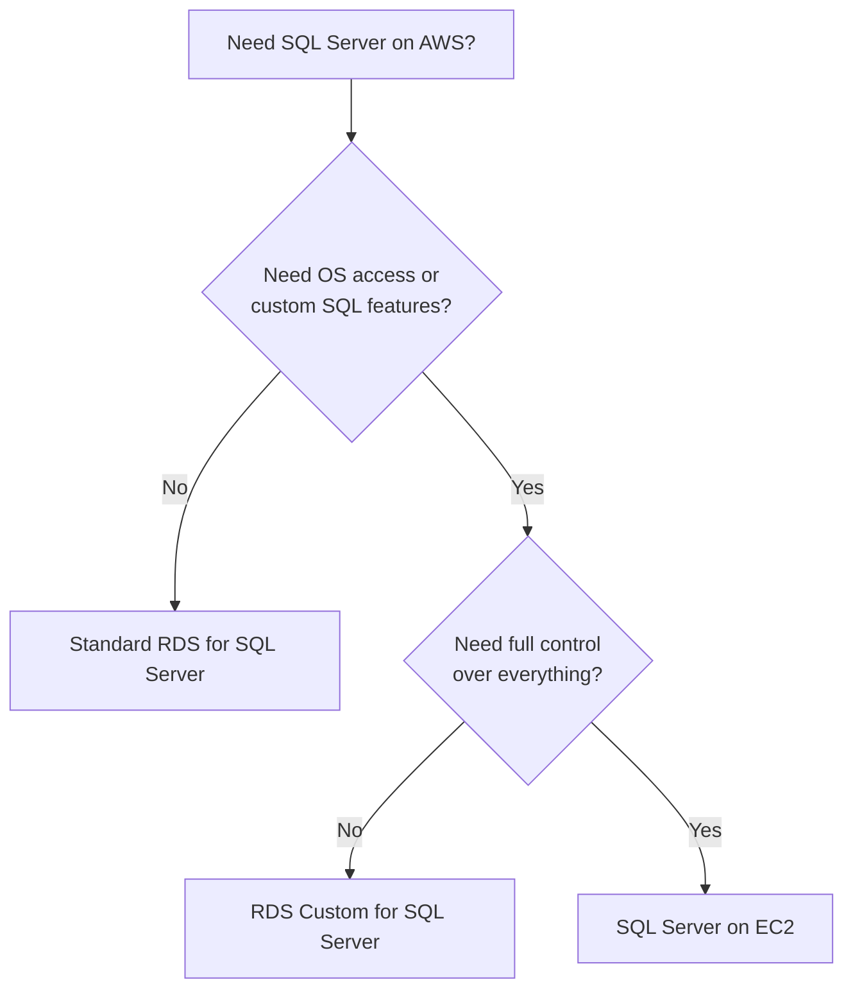

# How to Set Up RDS Custom for SQL Server Workloads

Author: [nawazdhandala](https://github.com/nawazdhandala)

Tags: AWS, RDS, SQL Server, Database, RDS Custom, Windows

Description: Deploy SQL Server on RDS Custom to get managed database automation with OS-level access for custom configurations and third-party tools.

---

SQL Server workloads often come with requirements that standard RDS cannot accommodate. Maybe you need to run SQL Server Agent jobs with custom configurations, install third-party backup tools, use linked servers, or configure specific Windows OS settings. In the past, this meant running SQL Server on EC2 and managing everything yourself.

RDS Custom for SQL Server solves this. You get a managed SQL Server instance with automated backups, patching infrastructure, and monitoring, while keeping the ability to RDP into the Windows host, install software, and customize SQL Server configurations that are not exposed through parameter groups.

## RDS Custom for SQL Server vs. Standard RDS

Here is a quick comparison to help you decide which fits your use case.



Use RDS Custom when you need:
- Custom SQL Server Agent jobs that require OS-level access
- Third-party monitoring or backup agents
- Linked servers to on-premises databases
- Custom CLR assemblies
- FILESTREAM or FileTable features
- Specific Windows registry settings

## Prerequisites

### Step 1: Create the IAM Instance Profile

RDS Custom for SQL Server needs an instance profile to manage the underlying Windows EC2 instance.

```bash
# Create the IAM role for RDS Custom SQL Server
aws iam create-role \
  --role-name AmazonRDSCustomSQLServerRole \
  --assume-role-policy-document '{
    "Version": "2012-10-17",
    "Statement": [{
      "Effect": "Allow",
      "Principal": {"Service": "ec2.amazonaws.com"},
      "Action": "sts:AssumeRole"
    }]
  }'

# Attach the managed policy
aws iam attach-role-policy \
  --role-name AmazonRDSCustomSQLServerRole \
  --policy-arn arn:aws:iam::aws:policy/AmazonRDSCustomInstanceProfileRolePolicy

# Create and configure the instance profile
aws iam create-instance-profile \
  --instance-profile-name AmazonRDSCustomSQLServerProfile

aws iam add-role-to-instance-profile \
  --instance-profile-name AmazonRDSCustomSQLServerProfile \
  --role-name AmazonRDSCustomSQLServerRole
```

### Step 2: Set Up Networking

```bash
# Create a DB subnet group spanning two AZs
aws rds create-db-subnet-group \
  --db-subnet-group-name rds-custom-sqlserver-subnet \
  --db-subnet-group-description "Subnets for RDS Custom SQL Server" \
  --subnet-ids '["subnet-0abc123","subnet-0def456"]'

# Create security group allowing SQL Server traffic
aws ec2 create-security-group \
  --group-name rds-custom-sqlserver-sg \
  --description "RDS Custom SQL Server security group" \
  --vpc-id vpc-0abc123

# Allow SQL Server default port from application subnets
aws ec2 authorize-security-group-ingress \
  --group-id sg-0abc123 \
  --protocol tcp \
  --port 1433 \
  --cidr 10.0.0.0/16
```

### Step 3: Create a KMS Key

```bash
# KMS key required for RDS Custom encryption at rest
aws kms create-key \
  --description "Encryption key for RDS Custom SQL Server" \
  --tags TagKey=Purpose,TagValue=rds-custom-sqlserver
```

## Creating the Instance

Unlike RDS Custom for Oracle, SQL Server does not require a Custom Engine Version. AWS provides the SQL Server installation.

```bash
# Create the RDS Custom SQL Server instance
aws rds create-db-instance \
  --db-instance-identifier my-sqlserver-custom \
  --engine custom-sqlserver-ee \
  --engine-version 15.00.4355.3.v1 \
  --db-instance-class db.m5.xlarge \
  --master-username admin \
  --master-user-password 'YourStr0ngP@ssword!' \
  --allocated-storage 200 \
  --storage-type gp3 \
  --db-subnet-group-name rds-custom-sqlserver-subnet \
  --vpc-security-group-ids sg-0abc123 \
  --kms-key-id arn:aws:kms:us-east-1:123456789012:key/abcd1234 \
  --custom-iam-instance-profile AmazonRDSCustomSQLServerProfile \
  --backup-retention-period 7 \
  --license-model license-included
```

Available SQL Server editions:
- `custom-sqlserver-ee` - Enterprise Edition
- `custom-sqlserver-se` - Standard Edition
- `custom-sqlserver-web` - Web Edition

Instance creation takes roughly 30-45 minutes.

## Connecting to the Instance

### SQL Server Management Studio

Once the instance is available, connect using SSMS.

```bash
# Get the endpoint for your RDS Custom SQL Server instance
aws rds describe-db-instances \
  --db-instance-identifier my-sqlserver-custom \
  --query 'DBInstances[0].Endpoint.{Address:Address,Port:Port}'
```

### RDP to the Windows Host

For OS-level access, use SSM Session Manager with port forwarding.

```bash
# Get the underlying EC2 instance ID
INSTANCE_ID=$(aws ec2 describe-instances \
  --filters "Name=tag:Name,Values=do-not-delete-rds-custom-*my-sqlserver-custom*" \
  --query 'Reservations[0].Instances[0].InstanceId' \
  --output text)

# Start an RDP port forwarding session
aws ssm start-session \
  --target $INSTANCE_ID \
  --document-name AWS-StartPortForwardingSession \
  --parameters '{"portNumber":["3389"],"localPortNumber":["9999"]}'
```

Then connect your RDP client to `localhost:9999`.

## Custom Configurations

### Pausing Automation

Always pause automation before making changes to the OS or SQL Server configuration.

```bash
# Pause RDS Custom automation for 120 minutes
aws rds modify-db-instance \
  --db-instance-identifier my-sqlserver-custom \
  --automation-mode full \
  --resume-full-automation-mode-minutes 120
```

### Configuring SQL Server Agent Jobs

Once connected via RDP, you can configure SQL Server Agent.

```sql
-- Create a custom SQL Server Agent job for database maintenance
USE msdb;
GO

EXEC sp_add_job
  @job_name = 'Custom Index Maintenance',
  @description = 'Rebuild fragmented indexes nightly';
GO

EXEC sp_add_jobstep
  @job_name = 'Custom Index Maintenance',
  @step_name = 'Rebuild Indexes',
  @subsystem = 'TSQL',
  @command = N'
    DECLARE @sql NVARCHAR(MAX) = ''''
    SELECT @sql = @sql + ''ALTER INDEX ALL ON '' +
      QUOTENAME(s.name) + ''.'' + QUOTENAME(t.name) +
      '' REBUILD;'' + CHAR(13)
    FROM sys.dm_db_index_physical_stats(DB_ID(), NULL, NULL, NULL, ''LIMITED'') ips
    JOIN sys.tables t ON ips.object_id = t.object_id
    JOIN sys.schemas s ON t.schema_id = s.schema_id
    WHERE ips.avg_fragmentation_in_percent > 30
    EXEC sp_executesql @sql',
  @database_name = 'YourDatabase';
GO

EXEC sp_add_schedule
  @schedule_name = 'Nightly',
  @freq_type = 4,
  @freq_interval = 1,
  @active_start_time = 020000;
GO

EXEC sp_attach_schedule
  @job_name = 'Custom Index Maintenance',
  @schedule_name = 'Nightly';
GO

EXEC sp_add_jobserver
  @job_name = 'Custom Index Maintenance';
GO
```

### Setting Up Linked Servers

Linked servers to on-premises databases are a common use case for RDS Custom.

```sql
-- Create a linked server to an on-premises SQL Server
EXEC sp_addlinkedserver
  @server = 'ON_PREM_SERVER',
  @srvproduct = '',
  @provider = 'SQLNCLI',
  @datasrc = '10.0.1.50,1433';
GO

EXEC sp_addlinkedsrvlogin
  @rmtsrvname = 'ON_PREM_SERVER',
  @useself = 'FALSE',
  @rmtuser = 'linked_user',
  @rmtpassword = 'LinkedUserPassword123!';
GO
```

### Installing Custom CLR Assemblies

```sql
-- Enable CLR integration and deploy a custom assembly
EXEC sp_configure 'clr enabled', 1;
RECONFIGURE;
GO

EXEC sp_configure 'clr strict security', 0;
RECONFIGURE;
GO

-- Create an assembly from a DLL on the host file system
CREATE ASSEMBLY CustomFunctions
FROM 'D:\CustomAssemblies\CustomFunctions.dll'
WITH PERMISSION_SET = SAFE;
GO
```

### Installing Third-Party Monitoring Agents

Via RDP, you can install any Windows software. For example, installing a custom monitoring agent:

```powershell
# PowerShell - Install a monitoring agent on the Windows host
$installerPath = "D:\Installers\monitoring-agent.msi"

# Download from S3
Read-S3Object -BucketName my-installers -Key monitoring-agent.msi -File $installerPath

# Install silently
Start-Process msiexec.exe -ArgumentList "/i $installerPath /quiet /norestart" -Wait
```

## Resuming Automation

After completing your customizations, resume RDS Custom automation.

```bash
# Resume full automation
aws rds modify-db-instance \
  --db-instance-identifier my-sqlserver-custom \
  --automation-mode all-paused \
  --resume-full-automation-mode-minutes 0
```

## Monitoring

RDS Custom supports CloudWatch metrics, Enhanced Monitoring, and Performance Insights.

```bash
# Enable Performance Insights for query-level monitoring
aws rds modify-db-instance \
  --db-instance-identifier my-sqlserver-custom \
  --enable-performance-insights \
  --performance-insights-retention-period 731 \
  --performance-insights-kms-key-id arn:aws:kms:us-east-1:123456789012:key/abcd1234
```

## Support Perimeter

Stay within the support perimeter to keep RDS Custom automation working:

- Do not change the default database file locations
- Do not stop or modify the RDS Custom agent service
- Do not delete RDS Custom-managed tags on the EC2 instance
- Do not modify the Windows firewall rules added by RDS Custom

## Summary

RDS Custom for SQL Server gives you the best of both worlds - managed database infrastructure with the flexibility to customize the OS and SQL Server to your specific needs. It is particularly valuable for enterprise workloads that depend on SQL Server Agent, linked servers, or custom CLR assemblies that standard RDS simply cannot support.

For more on database migrations and management, see our guides on [RDS Custom for Oracle](https://oneuptime.com/blog/post/2026-02-12-set-up-rds-custom-for-oracle-workloads/view) and [DMS for SQL Server to RDS migration](https://oneuptime.com/blog/post/2026-02-12-set-up-dms-for-sql-server-to-rds-migration/view).
