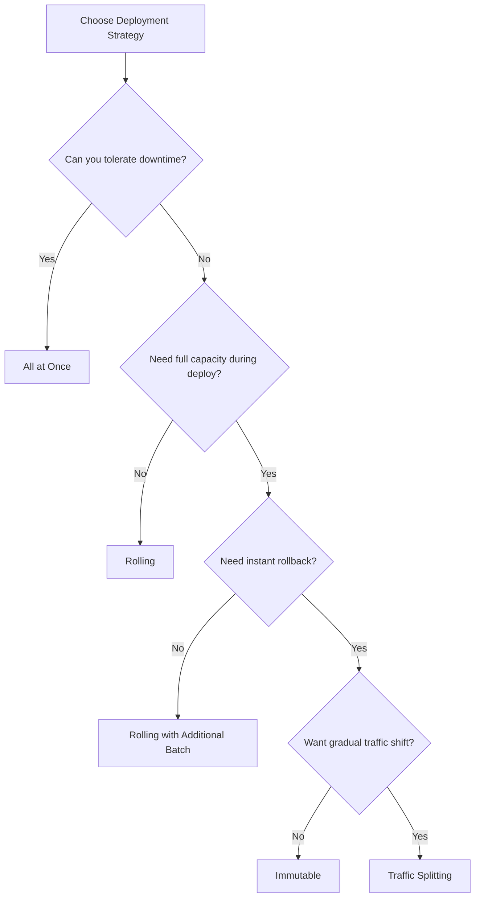

# How to Set Up Rolling Deployments in Elastic Beanstalk

Author: [nawazdhandala](https://github.com/nawazdhandala)

Tags: AWS, Elastic Beanstalk, Deployment, Zero Downtime

Description: Learn how to configure rolling deployments in AWS Elastic Beanstalk for zero-downtime updates, including rolling with additional batch, immutable, and blue-green strategies.

---

Deploying to production shouldn't mean downtime. If your users see a 503 page every time you push an update, something's wrong with your deployment strategy. Elastic Beanstalk offers several deployment policies that keep your application available during updates, and rolling deployments are the most commonly used.

This guide covers every deployment strategy Elastic Beanstalk supports, when to use each one, and how to configure them properly.

## Deployment Strategies Overview

Elastic Beanstalk supports five deployment policies:

1. **All at once** - Updates all instances simultaneously. Fast but causes downtime.
2. **Rolling** - Updates instances in batches. Reduced capacity during deployment.
3. **Rolling with additional batch** - Launches new instances first, then updates in batches. Maintains full capacity.
4. **Immutable** - Launches entirely new instances, then swaps. Safest option.
5. **Traffic splitting** - Sends a percentage of traffic to new version. Canary deployment.



## Rolling Deployments

Rolling deployments update your instances in batches. While one batch is being updated, the remaining instances continue serving traffic.

```yaml
# .ebextensions/rolling.config - Rolling deployment configuration
option_settings:
  aws:elasticbeanstalk:command:
    DeploymentPolicy: Rolling
    BatchSizeType: Percentage
    BatchSize: 25
    Timeout: 600
  aws:elasticbeanstalk:healthreporting:system:
    SystemType: enhanced
```

With 8 instances and a 25% batch size, the deployment updates 2 instances at a time across 4 batches. During each batch, you have 6 instances serving traffic. The total deployment takes about 4 times as long as an all-at-once deploy, but your application stays up.

### Batch Size Considerations

You can specify batch size as a percentage or a fixed number.

```yaml
# Fixed batch size - always update exactly 2 instances at a time
option_settings:
  aws:elasticbeanstalk:command:
    DeploymentPolicy: Rolling
    BatchSizeType: Fixed
    BatchSize: 2
```

The right batch size depends on your tolerance for reduced capacity:

- **25%** - Conservative. Maintains 75% capacity. Use for critical applications.
- **33%** - Balanced. Deploys faster while keeping good capacity.
- **50%** - Aggressive. Deploys quickly but halves your capacity temporarily.

## Rolling with Additional Batch

This is the sweet spot for most production deployments. Elastic Beanstalk launches a fresh batch of instances first, then performs a rolling update. You never lose capacity.

```yaml
# .ebextensions/rolling-additional.config
option_settings:
  aws:elasticbeanstalk:command:
    DeploymentPolicy: RollingWithAdditionalBatch
    BatchSizeType: Percentage
    BatchSize: 25
    Timeout: 600
  aws:autoscaling:updatepolicy:rollingupdate:
    RollingUpdateEnabled: true
    MaxBatchSize: 2
    MinInstancesInService: 4
    PauseTime: PT5M
```

The deployment flow looks like this:

1. Launch 2 new instances with the new version
2. Wait for them to pass health checks
3. Update the first batch of existing instances
4. Continue rolling through remaining batches
5. Terminate the extra instances

The only downside is cost - you're temporarily running extra instances. For a 15-minute deployment, that's pennies.

## Immutable Deployments

Immutable deployments are the safest option. Elastic Beanstalk launches a completely new set of instances in a temporary auto scaling group, verifies they're healthy, then swaps them into the original group.

```yaml
# .ebextensions/immutable.config - Immutable deployment
option_settings:
  aws:elasticbeanstalk:command:
    DeploymentPolicy: Immutable
    Timeout: 900
  aws:elasticbeanstalk:healthreporting:system:
    SystemType: enhanced
```

Immutable deployments have two big advantages:

1. **Clean environment**: New instances start fresh, with no leftover state from previous deployments.
2. **Easy rollback**: If the new instances fail health checks, Elastic Beanstalk terminates them and leaves the old instances untouched. Rollback is instant.

The tradeoff is time and cost. Immutable deployments take longer (launching fresh instances) and temporarily double your fleet size.

## Traffic Splitting (Canary Deployments)

Traffic splitting lets you test a new version with a small percentage of real traffic before going all-in. This is Elastic Beanstalk's version of canary deployments.

```yaml
# .ebextensions/traffic-splitting.config - Canary deployment
option_settings:
  aws:elasticbeanstalk:command:
    DeploymentPolicy: TrafficSplitting
    Timeout: 600
  aws:elasticbeanstalk:trafficsplitting:
    NewVersionPercent: 10
    EvaluationTime: 10
```

This sends 10% of traffic to the new version for 10 minutes. If the new instances stay healthy during that evaluation period, the deployment continues with a full rolling update. If they fail, the deployment is rolled back automatically.

Traffic splitting is ideal when you want to catch issues that only show up under real traffic - things like memory leaks, slow database queries, or edge cases that unit tests miss.

## Configuring Health Checks

Deployment policies rely on health checks to decide whether a deployment is succeeding or failing. Enhanced health reporting gives you more accurate checks.

```yaml
# .ebextensions/health.config - Enhanced health reporting
option_settings:
  aws:elasticbeanstalk:healthreporting:system:
    SystemType: enhanced
    HealthCheckSuccessThreshold: Ok
  aws:elasticbeanstalk:environment:process:default:
    HealthCheckPath: /health
    HealthCheckInterval: 15
    HealthCheckTimeout: 5
    UnhealthyThresholdCount: 3
    MatcherHTTPCode: 200
```

Your health check endpoint should verify that the application is genuinely ready to serve traffic.

```python
# health.py - Health check endpoint
from flask import jsonify

@app.route('/health')
def health_check():
    checks = {
        'database': check_database(),
        'cache': check_cache(),
        'disk_space': check_disk_space()
    }

    healthy = all(checks.values())

    return jsonify({
        'status': 'healthy' if healthy else 'unhealthy',
        'checks': checks
    }), 200 if healthy else 503

def check_database():
    try:
        db.session.execute('SELECT 1')
        return True
    except Exception:
        return False

def check_cache():
    try:
        redis_client.ping()
        return True
    except Exception:
        return False

def check_disk_space():
    import shutil
    total, used, free = shutil.disk_usage('/')
    # Unhealthy if less than 10% disk space remaining
    return (free / total) > 0.10
```

## Deployment Lifecycle Hooks

You can run custom scripts at various points during deployment using platform hooks.

```bash
#!/bin/bash
# .platform/hooks/predeploy/01_backup.sh
# Run database backup before deployment
echo "Creating pre-deployment backup..."
pg_dump $DATABASE_URL > /tmp/pre-deploy-backup-$(date +%Y%m%d%H%M%S).sql
echo "Backup complete"
```

```bash
#!/bin/bash
# .platform/hooks/postdeploy/01_notify.sh
# Send deployment notification
VERSION=$(cat /var/app/current/version.txt 2>/dev/null || echo "unknown")
curl -X POST "https://hooks.slack.com/services/YOUR/WEBHOOK/URL" \
    -H 'Content-type: application/json' \
    -d "{\"text\": \"Deployment complete: version $VERSION\"}"
```

## Rollback Configuration

When a deployment fails, you want to get back to the working version quickly.

```bash
# Roll back to the previous version
eb deploy --version previous-version-label

# List available versions to roll back to
eb appversion --list

# Delete a failed version
eb appversion --delete failed-version-label
```

For immutable and traffic-splitting deployments, rollback is automatic - failed instances are terminated and old instances keep serving traffic. For rolling deployments, you need to trigger a manual rollback.

## Comparing Strategies

Here's a quick reference for choosing the right deployment policy:

| Strategy | Downtime | Rollback Speed | Cost | Deployment Speed |
|----------|----------|---------------|------|-----------------|
| All at once | Yes | Manual redeploy | None | Fastest |
| Rolling | No (reduced capacity) | Manual redeploy | None | Moderate |
| Rolling + batch | No | Manual redeploy | Extra instances temporarily | Moderate |
| Immutable | No | Instant (automatic) | Double fleet temporarily | Slow |
| Traffic splitting | No | Instant (automatic) | Extra instances temporarily | Slowest |

## Wrapping Up

For most production applications, start with "Rolling with additional batch." It maintains full capacity, deploys reasonably fast, and the extra cost during deployment is negligible. If you need stronger safety guarantees - like for financial or healthcare applications - use immutable deployments.

Traffic splitting is worth considering if you're deploying frequently and want to catch regressions early. The 10-minute evaluation window gives you a real-world test before committing to the full rollout.

Whatever strategy you choose, make sure your health checks are meaningful. A health check that always returns 200 is worse than no health check at all - it gives you false confidence that your deployment succeeded. For troubleshooting when deployments go sideways, check out our guide on [troubleshooting Elastic Beanstalk deployment failures](https://oneuptime.com/blog/post/troubleshoot-elastic-beanstalk-deployment-failures/view).
