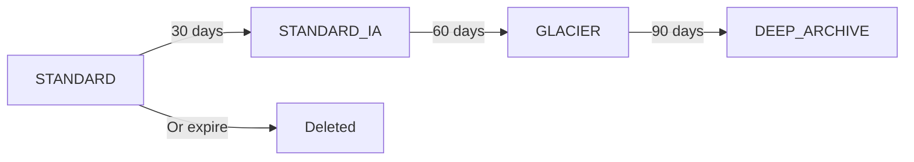

# How to Set Up S3 Lifecycle Policies with Terraform

Author: [nawazdhandala](https://github.com/nawazdhandala)

Tags: AWS, S3, Terraform, Cost Optimization

Description: A practical guide to configuring S3 lifecycle policies using Terraform for automatic storage tiering, object expiration, and cost optimization.

---

S3 storage costs add up fast. If you're storing logs, backups, or analytics data, you might be paying premium prices for objects nobody's accessed in months. Lifecycle policies fix this by automatically moving objects to cheaper storage tiers or deleting them when they're no longer needed.

Terraform makes these policies easy to manage as code. Let's walk through the different lifecycle configurations you'll need and how to set them up properly.

## Understanding S3 Storage Classes

Before writing any Terraform, it helps to understand what you're transitioning between:



- **STANDARD** - Default. Fast access, highest cost per GB.
- **STANDARD_IA** (Infrequent Access) - Cheaper storage, but with a retrieval fee. Good for data accessed less than once a month.
- **GLACIER** - Very cheap storage, but retrieval takes minutes to hours.
- **DEEP_ARCHIVE** - Cheapest option. Retrieval takes 12-48 hours.

The savings are significant. GLACIER costs about $0.004 per GB/month compared to $0.023 for STANDARD - that's roughly 83% cheaper.

## Basic Lifecycle Configuration

Here's the Terraform resource for lifecycle rules. Note that since AWS provider v4, lifecycle rules use a separate resource:

```hcl
# Create the bucket first
resource "aws_s3_bucket" "data" {
  bucket = "my-company-data-2026"
}

# Define lifecycle rules as a separate resource
resource "aws_s3_bucket_lifecycle_configuration" "data_lifecycle" {
  bucket = aws_s3_bucket.data.id

  rule {
    id     = "transition-to-cheaper-storage"
    status = "Enabled"

    transition {
      days          = 30
      storage_class = "STANDARD_IA"
    }

    transition {
      days          = 90
      storage_class = "GLACIER"
    }

    transition {
      days          = 180
      storage_class = "DEEP_ARCHIVE"
    }
  }
}
```

Objects start in STANDARD, move to STANDARD_IA after 30 days, GLACIER after 90 days, and DEEP_ARCHIVE after 180 days. Each transition is relative to the object creation date, not the previous transition.

## Object Expiration

For temporary data like logs or session files, you probably want to delete objects after a certain period:

```hcl
# Automatically delete log files after 90 days
resource "aws_s3_bucket_lifecycle_configuration" "logs_lifecycle" {
  bucket = aws_s3_bucket.logs.id

  rule {
    id     = "expire-old-logs"
    status = "Enabled"

    filter {
      prefix = "logs/"
    }

    expiration {
      days = 90
    }
  }
}
```

The `filter` block with a `prefix` means this rule only applies to objects under the `logs/` path. Everything else in the bucket is unaffected.

## Handling Versioned Buckets

If your bucket has versioning enabled (and it should for production data), lifecycle rules get more nuanced. You need to handle both current and noncurrent versions:

```hcl
# Enable versioning on the bucket
resource "aws_s3_bucket_versioning" "data_versioning" {
  bucket = aws_s3_bucket.data.id

  versioning_configuration {
    status = "Enabled"
  }
}

# Lifecycle rules for versioned objects
resource "aws_s3_bucket_lifecycle_configuration" "versioned_lifecycle" {
  bucket = aws_s3_bucket.data.id

  # Depends on versioning being enabled first
  depends_on = [aws_s3_bucket_versioning.data_versioning]

  rule {
    id     = "manage-current-versions"
    status = "Enabled"

    transition {
      days          = 30
      storage_class = "STANDARD_IA"
    }

    transition {
      days          = 90
      storage_class = "GLACIER"
    }
  }

  rule {
    id     = "manage-noncurrent-versions"
    status = "Enabled"

    noncurrent_version_transition {
      noncurrent_days = 30
      storage_class   = "STANDARD_IA"
    }

    noncurrent_version_transition {
      noncurrent_days = 60
      storage_class   = "GLACIER"
    }

    noncurrent_version_expiration {
      noncurrent_days = 90
    }
  }
}
```

The `noncurrent_version_expiration` block is critical. Without it, old versions pile up forever and your costs keep climbing even though you think you're deleting things.

## Cleaning Up Incomplete Multipart Uploads

This is the rule everyone forgets. When a multipart upload fails or is abandoned, the partial parts stay in your bucket and you keep paying for them. Add this to every bucket:

```hcl
# Always clean up incomplete multipart uploads
resource "aws_s3_bucket_lifecycle_configuration" "cleanup_lifecycle" {
  bucket = aws_s3_bucket.data.id

  rule {
    id     = "abort-incomplete-uploads"
    status = "Enabled"

    abort_incomplete_multipart_upload {
      days_after_initiation = 7
    }
  }
}
```

Seven days is a reasonable default. If a multipart upload hasn't completed in a week, something went wrong and it should be cleaned up.

## Tag-Based Lifecycle Rules

You can target lifecycle rules at objects with specific tags. This is useful when different types of data in the same bucket have different retention requirements:

```hcl
# Apply different rules based on object tags
resource "aws_s3_bucket_lifecycle_configuration" "tagged_lifecycle" {
  bucket = aws_s3_bucket.data.id

  rule {
    id     = "archive-compliance-data"
    status = "Enabled"

    filter {
      tag {
        key   = "DataType"
        value = "compliance"
      }
    }

    transition {
      days          = 365
      storage_class = "GLACIER"
    }
  }

  rule {
    id     = "delete-temporary-data"
    status = "Enabled"

    filter {
      tag {
        key   = "DataType"
        value = "temporary"
      }
    }

    expiration {
      days = 7
    }
  }
}
```

This approach keeps everything in one bucket but applies different retention policies based on what the data is.

## Combining Prefix and Tag Filters

If you need to filter on both prefix and tags, use the `and` block:

```hcl
# Filter on both prefix and tags simultaneously
rule {
  id     = "archive-old-reports"
  status = "Enabled"

  filter {
    and {
      prefix = "reports/"
      tags = {
        Department = "finance"
      }
    }
  }

  transition {
    days          = 60
    storage_class = "GLACIER"
  }
}
```

## Using Variables for Reusability

When managing multiple buckets with similar lifecycle patterns, use Terraform variables:

```hcl
# variables.tf - define lifecycle configuration as a variable
variable "standard_lifecycle_rules" {
  description = "Standard lifecycle rules for data buckets"
  type = object({
    ia_transition_days       = number
    glacier_transition_days  = number
    expiration_days          = optional(number)
    noncurrent_expiration    = number
  })
  default = {
    ia_transition_days      = 30
    glacier_transition_days = 90
    expiration_days         = null
    noncurrent_expiration   = 60
  }
}
```

Then use those variables in your lifecycle configuration:

```hcl
# Apply the configurable lifecycle rules
resource "aws_s3_bucket_lifecycle_configuration" "configurable" {
  bucket = aws_s3_bucket.data.id

  rule {
    id     = "tiered-storage"
    status = "Enabled"

    transition {
      days          = var.standard_lifecycle_rules.ia_transition_days
      storage_class = "STANDARD_IA"
    }

    transition {
      days          = var.standard_lifecycle_rules.glacier_transition_days
      storage_class = "GLACIER"
    }

    dynamic "expiration" {
      for_each = var.standard_lifecycle_rules.expiration_days != null ? [1] : []
      content {
        days = var.standard_lifecycle_rules.expiration_days
      }
    }

    noncurrent_version_expiration {
      noncurrent_days = var.standard_lifecycle_rules.noncurrent_expiration
    }
  }
}
```

## Monitoring Your Lifecycle Policies

After deploying lifecycle rules, you'll want to verify they're working. Check S3 Storage Lens or CloudWatch metrics to see if objects are actually transitioning. You can also use S3 Inventory to get a full report of your objects and their storage classes.

For broader infrastructure monitoring, consider setting up alerts when storage costs spike unexpectedly. Our guide on [monitoring AWS infrastructure](https://oneuptime.com/blog/post/monitor-aws-infrastructure/view) covers how to keep an eye on your cloud resources.

## Common Pitfalls

There are a few things to watch out for. First, STANDARD_IA has a minimum object size of 128 KB. Smaller objects get charged as if they're 128 KB, which can make the transition more expensive than keeping them in STANDARD. Second, STANDARD_IA and One-Zone IA have a minimum 30-day storage duration charge. If you delete an object after 10 days, you still pay for 30 days. Third, transition days are cumulative from object creation, not from the previous transition. So if you set IA at 30 days and GLACIER at 60 days, objects spend 30 days in IA before moving to GLACIER - not 60 days.

## Wrapping Up

S3 lifecycle policies are one of the easiest ways to cut your AWS bill. Set them up once with Terraform and forget about them - your data automatically moves to cheaper storage as it ages. Start with the basics: transition to IA at 30 days, GLACIER at 90 days, and always clean up incomplete multipart uploads. Then refine based on your actual access patterns and compliance requirements.
