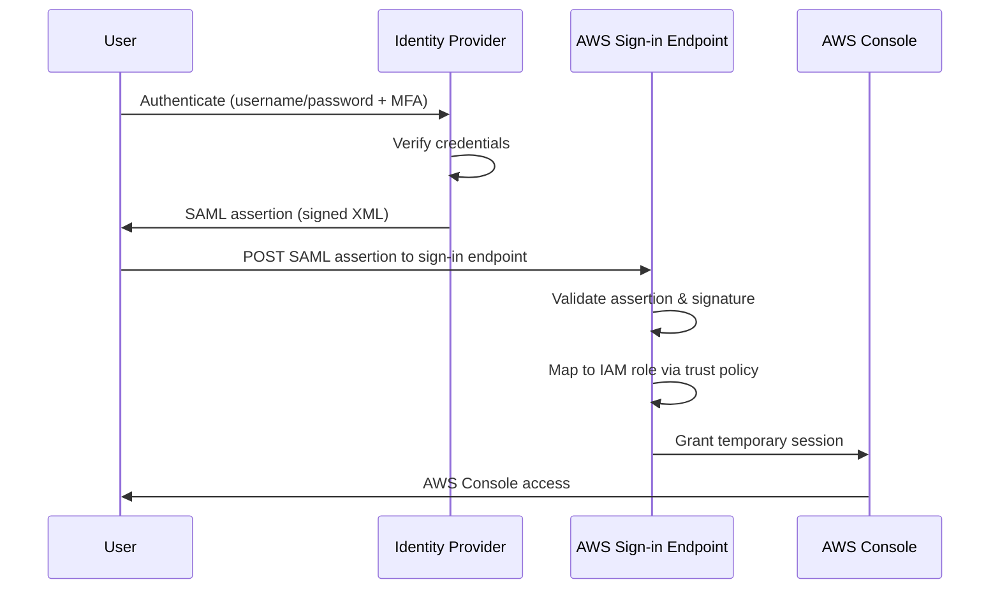

# How to Set Up SAML-Based Federation for AWS Console Access

Author: [nawazdhandala](https://github.com/nawazdhandala)

Tags: AWS, IAM, SAML, Security, Federation

Description: A detailed guide to setting up SAML 2.0 federation for AWS Console access, including identity provider configuration, IAM roles, and trust policies.

---

SAML federation lets your users sign into the AWS Console using their corporate credentials - no separate AWS username or password needed. When someone authenticates through your identity provider (IdP), a SAML assertion is sent to AWS, and AWS grants temporary access based on the roles mapped in that assertion. It's more secure than IAM users because credentials never touch AWS directly, and all sessions are temporary.

While IAM Identity Center is the recommended approach for new setups, SAML federation directly with IAM is still widely used - especially in organizations that need granular control over the federation process or have custom identity provider setups.

## How SAML Federation Works



The key pieces are:

1. An identity provider that supports SAML 2.0
2. An IAM SAML provider resource in AWS
3. IAM roles with trust policies that accept SAML assertions
4. Attribute mappings that tell AWS which role to assume

## Step 1: Export Your IdP's SAML Metadata

Every SAML IdP provides a metadata XML file. This contains the IdP's entity ID, SSO URL, and signing certificate. Where you find it depends on your IdP:

- **Okta**: Application > Sign On > SAML Metadata
- **Azure AD**: Enterprise Application > SAML > Federation Metadata XML
- **Google Workspace**: Apps > SAML app > Download metadata
- **AD FS**: `https://adfs.company.com/FederationMetadata/2007-06/FederationMetadata.xml`
- **KeyCloak**: Realm Settings > SAML 2.0 Identity Provider Metadata

Save this file as `idp-metadata.xml`.

## Step 2: Create a SAML Identity Provider in IAM

```bash
# Create an IAM SAML provider using your IdP's metadata
aws iam create-saml-provider \
  --saml-metadata-document file://idp-metadata.xml \
  --name CompanyIdP
```

This returns the provider ARN, which you'll need for role trust policies:

```
arn:aws:iam::123456789012:saml-provider/CompanyIdP
```

To update the metadata later (e.g., when the IdP certificate rotates):

```bash
# Update the SAML provider metadata
aws iam update-saml-provider \
  --saml-provider-arn arn:aws:iam::123456789012:saml-provider/CompanyIdP \
  --saml-metadata-document file://new-idp-metadata.xml
```

## Step 3: Create IAM Roles for Federated Users

Each role represents a level of access. Create roles for different teams or access levels:

```bash
# Create a trust policy document for SAML federation
cat > trust-policy.json << 'POLICY'
{
  "Version": "2012-10-17",
  "Statement": [
    {
      "Effect": "Allow",
      "Principal": {
        "Federated": "arn:aws:iam::123456789012:saml-provider/CompanyIdP"
      },
      "Action": "sts:AssumeRoleWithSAML",
      "Condition": {
        "StringEquals": {
          "SAML:aud": "https://signin.aws.amazon.com/saml"
        }
      }
    }
  ]
}
POLICY

# Create an admin role for federated users
aws iam create-role \
  --role-name SAML-Admin \
  --assume-role-policy-document file://trust-policy.json \
  --max-session-duration 14400

# Attach the AdministratorAccess policy
aws iam attach-role-policy \
  --role-name SAML-Admin \
  --policy-arn arn:aws:iam::aws:policy/AdministratorAccess

# Create a developer role
aws iam create-role \
  --role-name SAML-Developer \
  --assume-role-policy-document file://trust-policy.json \
  --max-session-duration 28800

aws iam attach-role-policy \
  --role-name SAML-Developer \
  --policy-arn arn:aws:iam::aws:policy/PowerUserAccess

# Create a read-only role
aws iam create-role \
  --role-name SAML-ReadOnly \
  --assume-role-policy-document file://trust-policy.json \
  --max-session-duration 28800

aws iam attach-role-policy \
  --role-name SAML-ReadOnly \
  --policy-arn arn:aws:iam::aws:policy/ReadOnlyAccess
```

## Step 4: Configure SAML Attributes in Your IdP

Your IdP needs to include specific attributes in the SAML assertion for AWS to know which role to grant. The two required attributes are:

### Role Attribute

```
Name: https://aws.amazon.com/SAML/Attributes/Role
Value: arn:aws:iam::123456789012:role/SAML-Developer,arn:aws:iam::123456789012:saml-provider/CompanyIdP
```

Notice it's a comma-separated pair of role ARN and provider ARN. If a user can assume multiple roles, include multiple values.

### RoleSessionName Attribute

```
Name: https://aws.amazon.com/SAML/Attributes/RoleSessionName
Value: user.email (or user.username)
```

This appears in CloudTrail logs, so use something that identifies the user.

### Optional: Session Duration

```
Name: https://aws.amazon.com/SAML/Attributes/SessionDuration
Value: 28800 (seconds - this is 8 hours)
```

## Step 5: Configure the IdP's Service Provider Settings

In your IdP's SAML application configuration, set:

- **ACS URL / Reply URL**: `https://signin.aws.amazon.com/saml`
- **Entity ID / Audience**: `urn:amazon:webservices`
- **Name ID Format**: Email or Persistent
- **Name ID Value**: User's email address

## Step 6: Test the Federation

### IdP-Initiated Flow

Most users will start from the IdP:

1. Log into your IdP (Okta, Azure AD, etc.)
2. Click the AWS application tile
3. If the user has multiple roles, they'll see a role selection screen
4. Select a role and click "Sign In"
5. They're now in the AWS Console with temporary credentials

### SP-Initiated Flow

You can also start from AWS:

1. Go to `https://signin.aws.amazon.com/saml`
2. You'll be redirected to your IdP
3. Authenticate and the IdP sends you back to AWS

## Programmatic Federation

For CLI access, you can use SAML assertions programmatically:

```python
import boto3
import base64
import xml.etree.ElementTree as ET

def assume_role_with_saml(saml_response, role_arn, principal_arn):
    """
    Use a SAML response to get temporary AWS credentials.
    The saml_response is the base64-encoded SAML assertion from your IdP.
    """
    sts = boto3.client("sts")

    response = sts.assume_role_with_saml(
        RoleArn=role_arn,
        PrincipalArn=principal_arn,
        SAMLAssertion=saml_response,
        DurationSeconds=3600
    )

    credentials = response["Credentials"]

    print(f"Access Key: {credentials['AccessKeyId']}")
    print(f"Expiration: {credentials['Expiration']}")

    return credentials

# For tools like saml2aws, the process is automated:
# saml2aws login --idp-account=default
# This handles the IdP authentication and credential extraction
```

Tools like `saml2aws` and `aws-vault` automate this flow:

```bash
# Install saml2aws
brew install saml2aws

# Configure it for your IdP
saml2aws configure \
  --idp-provider Okta \
  --url https://company.okta.com/app/amazon_aws/xxx/sso/saml \
  --username jane@company.com \
  --mfa Auto

# Login (authenticates through IdP and stores temp credentials)
saml2aws login

# Use the credentials
aws s3 ls --profile saml
```

## Multi-Account Federation

For organizations with multiple AWS accounts, you have two approaches:

### Approach 1: SAML Provider in Each Account

Create the SAML provider and roles in every account. The IdP sends a role ARN specific to each account.

### Approach 2: Hub-and-Spoke with Cross-Account Roles

Federate into a central "hub" account, then assume roles in other accounts:

```json
{
  "Version": "2012-10-17",
  "Statement": [
    {
      "Effect": "Allow",
      "Action": "sts:AssumeRole",
      "Resource": [
        "arn:aws:iam::111111111111:role/CrossAccount-Admin",
        "arn:aws:iam::222222222222:role/CrossAccount-Developer",
        "arn:aws:iam::333333333333:role/CrossAccount-ReadOnly"
      ]
    }
  ]
}
```

For more on cross-account roles, see our guide on [setting up cross-account IAM roles](https://oneuptime.com/blog/post/2026-02-12-set-up-cross-account-iam-roles-shared-services/view).

## Restricting Federation by MFA

Add an MFA condition to the trust policy to ensure only MFA-authenticated SAML assertions are accepted:

```json
{
  "Version": "2012-10-17",
  "Statement": [
    {
      "Effect": "Allow",
      "Principal": {
        "Federated": "arn:aws:iam::123456789012:saml-provider/CompanyIdP"
      },
      "Action": "sts:AssumeRoleWithSAML",
      "Condition": {
        "StringEquals": {
          "SAML:aud": "https://signin.aws.amazon.com/saml"
        },
        "Bool": {
          "aws:MultiFactorAuthPresent": "true"
        }
      }
    }
  ]
}
```

Note: Whether the `aws:MultiFactorAuthPresent` condition works depends on your IdP including the authentication context class in the SAML assertion.

## CloudTrail Logging

Federated sessions appear in CloudTrail with the role session name you configured:

```bash
# Find federated login events
aws cloudtrail lookup-events \
  --lookup-attributes AttributeKey=EventName,AttributeValue=AssumeRoleWithSAML \
  --max-items 10 \
  --query 'Events[*].{Time:EventTime,User:Username}'
```

## When to Use SAML Federation vs Identity Center

Use **IAM Identity Center** when:
- You want the simplest setup
- You need centralized multi-account management
- You want built-in permission set management

Use **direct SAML federation** when:
- You need custom role-to-group mappings your IdP controls
- You have a complex multi-IdP setup
- You need to integrate with legacy systems
- Your organization requires specific SAML attribute customizations

Both approaches are secure and use temporary credentials. Identity Center is built on top of SAML federation, so you're using the same underlying technology either way.
