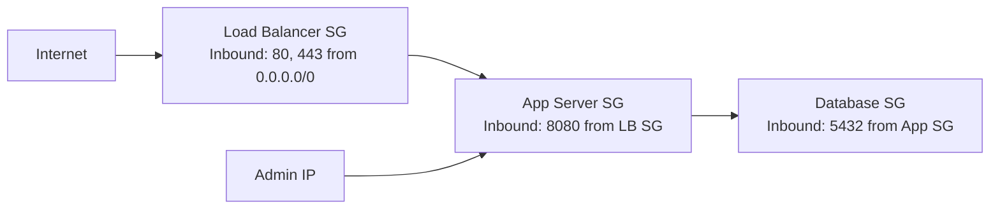

# How to Set Up Security Groups for EC2 Instances

Author: [nawazdhandala](https://github.com/nawazdhandala)

Tags: AWS, EC2, Security Groups, Networking, Firewall

Description: Learn how to configure AWS security groups as virtual firewalls for your EC2 instances, with practical rules for common scenarios and security best practices.

---

Security groups are the first line of defense for your EC2 instances. They act as virtual firewalls that control inbound and outbound traffic at the instance level. Every EC2 instance must be associated with at least one security group, and getting the rules right is critical for both functionality and security.

This guide covers how security groups work, how to configure them for common scenarios, and mistakes you'll want to avoid.

## How Security Groups Work

A few key things to understand upfront:

**Security groups are stateful.** If you allow inbound traffic on port 80, the response traffic is automatically allowed out. You don't need a matching outbound rule.

**Rules are allow-only.** You can't create deny rules. If traffic doesn't match any allow rule, it's implicitly denied.

**All rules are evaluated together.** Unlike network ACLs (which process rules in order), security groups evaluate all rules and allow traffic if any rule matches.

**Security groups are per-VPC.** A security group belongs to a specific VPC and can only be attached to instances in that VPC.

**Multiple security groups can be combined.** An instance can have up to 5 security groups. The rules from all attached groups are merged together.

## Creating a Security Group

### Via the Console

1. Go to EC2 > Security Groups in the left navigation
2. Click "Create security group"
3. Fill in:
   - **Name**: Something descriptive like "web-server-sg" or "api-backend-sg"
   - **Description**: Required field - briefly describe what this group is for
   - **VPC**: Select your VPC

### Via the AWS CLI

```bash
# Create a security group in the default VPC
aws ec2 create-security-group \
    --group-name web-server-sg \
    --description "Security group for web servers" \
    --vpc-id vpc-0abc123def456

# The command returns the security group ID
# sg-0123456789abcdef0
```

## Adding Inbound Rules

Inbound rules control what traffic can reach your instance. The most common patterns:

### Web Server (HTTP/HTTPS)

```bash
# Allow HTTP from anywhere
aws ec2 authorize-security-group-ingress \
    --group-id sg-0123456789abcdef0 \
    --protocol tcp \
    --port 80 \
    --cidr 0.0.0.0/0

# Allow HTTPS from anywhere
aws ec2 authorize-security-group-ingress \
    --group-id sg-0123456789abcdef0 \
    --protocol tcp \
    --port 443 \
    --cidr 0.0.0.0/0
```

Opening 80 and 443 to 0.0.0.0/0 is standard for public web servers. That's the whole point - you want the public to reach your website.

### SSH Access (Restricted)

```bash
# Allow SSH only from your office IP
aws ec2 authorize-security-group-ingress \
    --group-id sg-0123456789abcdef0 \
    --protocol tcp \
    --port 22 \
    --cidr 203.0.113.50/32
```

Never open SSH to 0.0.0.0/0 in production. Bots scan for open SSH ports constantly. Restrict it to known IP addresses or CIDR blocks.

### Database Access (Internal Only)

```bash
# Allow PostgreSQL from the web server security group only
aws ec2 authorize-security-group-ingress \
    --group-id sg-database-0123456 \
    --protocol tcp \
    --port 5432 \
    --source-group sg-webserver-0123456
```

This is a powerful pattern - instead of specifying an IP range, you reference another security group. Any instance in the source security group can connect. This is the recommended approach for internal service communication.

## Common Security Group Configurations

Here are complete configurations for typical scenarios:

### Web Application Stack



**Load Balancer Security Group:**
| Type | Protocol | Port | Source |
|------|----------|------|--------|
| HTTP | TCP | 80 | 0.0.0.0/0 |
| HTTPS | TCP | 443 | 0.0.0.0/0 |

**Application Server Security Group:**
| Type | Protocol | Port | Source |
|------|----------|------|--------|
| Custom TCP | TCP | 8080 | sg-loadbalancer |
| SSH | TCP | 22 | 203.0.113.0/24 (office) |

**Database Security Group:**
| Type | Protocol | Port | Source |
|------|----------|------|--------|
| PostgreSQL | TCP | 5432 | sg-appserver |

Each layer only accepts traffic from the layer in front of it. The database is never directly accessible from the internet.

### Microservices

When services need to talk to each other, create a shared security group:

```bash
# Create a security group that allows all traffic from itself
aws ec2 create-security-group \
    --group-name microservices-internal \
    --description "Internal communication between microservices" \
    --vpc-id vpc-0abc123

# Allow all traffic from instances in the same security group
aws ec2 authorize-security-group-ingress \
    --group-id sg-microservices-internal \
    --protocol -1 \
    --source-group sg-microservices-internal
```

Attach this security group to all your microservice instances. They can all talk to each other on any port. Then use additional security groups for external-facing rules.

## Outbound Rules

By default, security groups allow all outbound traffic. This is usually fine, but you might want to restrict it for sensitive instances:

```bash
# Remove the default "allow all outbound" rule
aws ec2 revoke-security-group-egress \
    --group-id sg-0123456789abcdef0 \
    --protocol -1 \
    --cidr 0.0.0.0/0

# Allow only HTTPS outbound (for API calls, package managers, etc.)
aws ec2 authorize-security-group-egress \
    --group-id sg-0123456789abcdef0 \
    --protocol tcp \
    --port 443 \
    --cidr 0.0.0.0/0

# Allow DNS resolution
aws ec2 authorize-security-group-egress \
    --group-id sg-0123456789abcdef0 \
    --protocol udp \
    --port 53 \
    --cidr 0.0.0.0/0
```

Be careful with restrictive outbound rules. If your instance needs to reach AWS services (CloudWatch, SSM, S3), you'll need to allow outbound HTTPS or set up VPC endpoints.

## Modifying Security Groups on Running Instances

One of the nice things about security groups is that changes take effect immediately - no need to restart anything.

### Adding a Security Group to an Instance

```bash
# Add a security group to a running instance
aws ec2 modify-instance-attribute \
    --instance-id i-0123456789abcdef0 \
    --groups sg-group1 sg-group2 sg-group3
```

Note: This command replaces all security groups, not adds to them. Include all groups you want attached.

### Modifying Rules

```bash
# Add a new inbound rule
aws ec2 authorize-security-group-ingress \
    --group-id sg-0123456789abcdef0 \
    --protocol tcp \
    --port 8080 \
    --cidr 10.0.0.0/16

# Remove an existing rule
aws ec2 revoke-security-group-ingress \
    --group-id sg-0123456789abcdef0 \
    --protocol tcp \
    --port 8080 \
    --cidr 10.0.0.0/16
```

## Tagging and Naming Conventions

With even a modest infrastructure, you'll end up with dozens of security groups. Use consistent naming:

```
{environment}-{service}-{role}-sg
```

Examples:
- `prod-api-webserver-sg`
- `staging-backend-database-sg`
- `dev-monitoring-agent-sg`

Tag them with Environment, Service, and Team tags for filtering and cost tracking.

## Security Group Limits

AWS has default limits you should know:

- 2,500 security groups per VPC
- 60 inbound and 60 outbound rules per security group
- 5 security groups per network interface

You can request increases for these limits through AWS Support, but if you're hitting them, it's usually a sign that your security group design needs simplification.

## Common Mistakes

**Opening SSH/RDP to 0.0.0.0/0.** This is the most common security mistake on AWS. Always restrict administrative access to known IPs or use Session Manager.

**Using one security group for everything.** Don't put your web server, app server, and database rules all in one group. Separate them by function so you can apply the principle of least privilege.

**Forgetting about IPv6.** If your VPC has IPv6 enabled, adding a rule for 0.0.0.0/0 doesn't cover IPv6. You also need ::/0 for full coverage.

**Not auditing regularly.** Security groups accumulate stale rules over time. Review them quarterly and remove rules that are no longer needed. Set up [monitoring](https://oneuptime.com) to track security group changes.

**Hardcoding IP addresses that change.** If your office uses a dynamic IP, you'll need to update the security group every time it changes. Consider using a VPN with a static IP instead.

Security groups are deceptively simple - it's easy to get a basic setup working, but designing a secure, maintainable configuration takes thought. Start with the principle of least privilege: deny everything by default and only open what you need, from where you need it.
