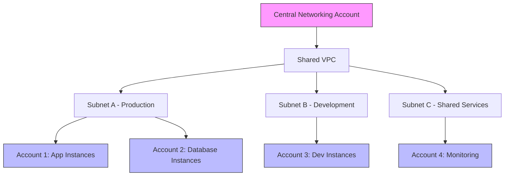

# How to Set Up Shared VPCs with AWS Resource Access Manager

Author: [nawazdhandala](https://github.com/nawazdhandala)

Tags: AWS, VPC, RAM, Resource Access Manager, Networking, Multi-Account

Description: Learn how to share VPC subnets across AWS accounts using Resource Access Manager to simplify networking and reduce costs in multi-account environments.

---

Managing networking across multiple AWS accounts gets complicated fast. Every account needs its own VPC, its own subnets, its own route tables, and its own connections back to on-premises. AWS Resource Access Manager (RAM) with VPC sharing changes this equation entirely. Instead of duplicating networking infrastructure, you create it once and share it.

## How VPC Sharing Works

With VPC sharing, a central networking account owns the VPC and subnets. Other accounts (participant accounts) can launch resources into those shared subnets without creating their own VPCs.



The key distinction: the VPC owner manages the networking (subnets, route tables, NACLs, internet gateways, NAT gateways). Participant accounts manage their own resources within the shared subnets (EC2 instances, RDS databases, security groups).

## Prerequisites

Before you start, you need:

- AWS Organizations set up with at least two accounts
- The networking account designated as the VPC owner
- RAM sharing enabled in your organization (it is by default in newer setups)

### Enable RAM Sharing in Organizations

```bash
# Enable RAM sharing within your organization (run from management account)
aws ram enable-sharing-with-aws-organization
```

## Step 1: Create the VPC in the Owner Account

Design your VPC with enough CIDR space for all participant accounts.

```bash
# Create the shared VPC with a large CIDR block
aws ec2 create-vpc \
    --cidr-block 10.0.0.0/16 \
    --tag-specifications 'ResourceType=vpc,Tags=[{Key=Name,Value=shared-vpc}]'

# Enable DNS support and hostnames
aws ec2 modify-vpc-attribute \
    --vpc-id vpc-0123456789abcdef0 \
    --enable-dns-support '{"Value": true}'

aws ec2 modify-vpc-attribute \
    --vpc-id vpc-0123456789abcdef0 \
    --enable-dns-hostnames '{"Value": true}'
```

## Step 2: Create Subnets with Clear Separation

Create subnets for different purposes and availability zones. Use a naming convention that makes ownership clear.

```bash
# Production subnets - will be shared with production accounts
aws ec2 create-subnet \
    --vpc-id vpc-0123456789abcdef0 \
    --cidr-block 10.0.1.0/24 \
    --availability-zone us-east-1a \
    --tag-specifications 'ResourceType=subnet,Tags=[{Key=Name,Value=shared-prod-1a},{Key=Environment,Value=production}]'

aws ec2 create-subnet \
    --vpc-id vpc-0123456789abcdef0 \
    --cidr-block 10.0.2.0/24 \
    --availability-zone us-east-1b \
    --tag-specifications 'ResourceType=subnet,Tags=[{Key=Name,Value=shared-prod-1b},{Key=Environment,Value=production}]'

# Development subnets - will be shared with dev accounts
aws ec2 create-subnet \
    --vpc-id vpc-0123456789abcdef0 \
    --cidr-block 10.0.10.0/24 \
    --availability-zone us-east-1a \
    --tag-specifications 'ResourceType=subnet,Tags=[{Key=Name,Value=shared-dev-1a},{Key=Environment,Value=development}]'

aws ec2 create-subnet \
    --vpc-id vpc-0123456789abcdef0 \
    --cidr-block 10.0.11.0/24 \
    --availability-zone us-east-1b \
    --tag-specifications 'ResourceType=subnet,Tags=[{Key=Name,Value=shared-dev-1b},{Key=Environment,Value=development}]'
```

## Step 3: Set Up Routing

Configure route tables, NAT gateways, and internet gateways as needed.

```bash
# Create an internet gateway
aws ec2 create-internet-gateway \
    --tag-specifications 'ResourceType=internet-gateway,Tags=[{Key=Name,Value=shared-igw}]'

aws ec2 attach-internet-gateway \
    --internet-gateway-id igw-0123456789abcdef0 \
    --vpc-id vpc-0123456789abcdef0

# Create NAT gateway for private subnets
aws ec2 allocate-address --domain vpc
# Returns: AllocationId: eipalloc-0123456789abcdef0

aws ec2 create-nat-gateway \
    --subnet-id subnet-public-1a \
    --allocation-id eipalloc-0123456789abcdef0 \
    --tag-specifications 'ResourceType=natgateway,Tags=[{Key=Name,Value=shared-nat-1a}]'

# Create and configure route tables
aws ec2 create-route-table \
    --vpc-id vpc-0123456789abcdef0 \
    --tag-specifications 'ResourceType=route-table,Tags=[{Key=Name,Value=shared-private-rt}]'

aws ec2 create-route \
    --route-table-id rtb-0123456789abcdef0 \
    --destination-cidr-block 0.0.0.0/0 \
    --nat-gateway-id nat-0123456789abcdef0

# Associate route table with shared subnets
aws ec2 associate-route-table \
    --route-table-id rtb-0123456789abcdef0 \
    --subnet-id subnet-0123456789abcdef0
```

## Step 4: Share Subnets Using RAM

Now share the subnets with participant accounts using Resource Access Manager.

```bash
# Create a resource share for production subnets
aws ram create-resource-share \
    --name "production-subnet-share" \
    --resource-arns \
        "arn:aws:ec2:us-east-1:111111111111:subnet/subnet-prod-1a" \
        "arn:aws:ec2:us-east-1:111111111111:subnet/subnet-prod-1b" \
    --principals \
        "arn:aws:organizations::111111111111:ou/o-abc123/ou-def456" \
    --tags 'key=Environment,value=production'

# Create a separate share for development subnets
aws ram create-resource-share \
    --name "development-subnet-share" \
    --resource-arns \
        "arn:aws:ec2:us-east-1:111111111111:subnet/subnet-dev-1a" \
        "arn:aws:ec2:us-east-1:111111111111:subnet/subnet-dev-1b" \
    --principals \
        "arn:aws:organizations::111111111111:ou/o-abc123/ou-ghi789" \
    --tags 'key=Environment,value=development'
```

You can share with:
- Specific AWS account IDs
- Organizational Units (OUs) - all accounts in the OU get access
- The entire organization

## Step 5: Launch Resources from Participant Accounts

Once the share is accepted (automatic within Organizations), participant accounts can launch resources into shared subnets.

```bash
# From a participant account, list available shared subnets
aws ec2 describe-subnets \
    --filters 'Name=owner-id,Values=111111111111' \
    --query 'Subnets[].{SubnetId:SubnetId,CIDR:CidrBlock,AZ:AvailabilityZone,Name:Tags[?Key==`Name`].Value|[0]}'

# Launch an EC2 instance into a shared subnet
aws ec2 run-instances \
    --image-id ami-0abcdef1234567890 \
    --instance-type t3.medium \
    --subnet-id subnet-prod-1a \
    --security-group-ids sg-participant-sg \
    --tag-specifications 'ResourceType=instance,Tags=[{Key=Name,Value=my-app-server}]'
```

Note that the participant account creates its own security groups within the shared VPC. Security groups are account-specific even in a shared VPC.

## What the VPC Owner Controls vs. Participants

Understanding the responsibility split is critical:

| Resource | Owner | Participant |
|----------|-------|-------------|
| VPC | Creates and manages | Can view, cannot modify |
| Subnets | Creates and manages | Can launch resources into |
| Route Tables | Creates and manages | Cannot modify |
| NACLs | Creates and manages | Cannot modify |
| Internet/NAT Gateways | Creates and manages | Benefits from automatically |
| Security Groups | Can create for own resources | Creates for own resources |
| EC2 Instances | Can launch | Can launch |
| RDS Databases | Can launch | Can launch |
| ENIs | Can create | Can create |

## Security Considerations

### Network ACLs Apply to Everyone

NACLs set by the VPC owner apply to all resources in the subnet, regardless of which account owns them. This gives the networking team centralized control over network-level security.

### Security Groups are Account-Scoped

Each account manages its own security groups. A participant cannot reference security groups from another participant account. If cross-account security group references are needed, you will need to use CIDR-based rules instead.

```bash
# Participant account creates its own security group in the shared VPC
aws ec2 create-security-group \
    --group-name app-server-sg \
    --description "Security group for application servers" \
    --vpc-id vpc-0123456789abcdef0

# Use CIDR ranges instead of security group IDs for cross-account rules
aws ec2 authorize-security-group-ingress \
    --group-id sg-participant-sg \
    --protocol tcp \
    --port 443 \
    --cidr 10.0.1.0/24
```

### VPC Flow Logs

The VPC owner should enable flow logs for visibility across all participant traffic. For monitoring DNS queries in your shared VPC, check our guide on [monitoring Route 53 DNS query logging](https://oneuptime.com/blog/post/2026-02-12-monitor-route-53-dns-query-logging/view).

## Cost Implications

VPC sharing reduces costs in several ways:

- **Fewer NAT gateways**: One set of NAT gateways serves all accounts
- **Fewer VPN/Direct Connect connections**: One VPC connects to on-premises, all accounts benefit
- **Fewer Transit Gateway attachments**: One attachment per shared VPC instead of per account
- **Simpler IP address management**: One CIDR plan instead of many

For a detailed cost analysis approach, see our post on [calculating TCO for AWS migration](https://oneuptime.com/blog/post/2026-02-12-calculate-tco-for-aws-migration/view).

## Limitations to Be Aware Of

- Participant accounts cannot modify VPC-level settings (DNS, DHCP options)
- VPC peering and VPN connections are managed only by the owner
- Some services have restrictions in shared subnets (check AWS docs for specifics)
- Default security group is not shared - participants create their own
- You cannot share a default VPC

## Conclusion

VPC sharing with RAM is one of the most impactful networking simplifications available in AWS multi-account environments. It centralizes network management, reduces costs, and eliminates the complexity of inter-VPC connectivity for resources that should logically share a network. Start with non-production environments to build confidence, then extend to production once your team is comfortable with the ownership model.
