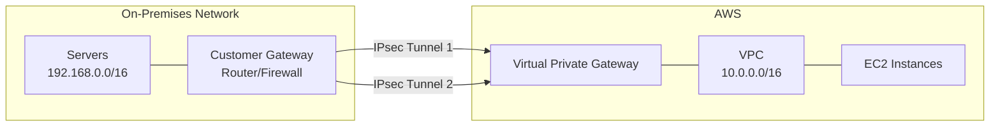

# How to Set Up a Site-to-Site VPN Connection

Author: [nawazdhandala](https://github.com/nawazdhandala)

Tags: AWS, VPN, Networking, Hybrid Cloud

Description: Configure an AWS Site-to-Site VPN to securely connect your on-premises network to your AWS VPC using IPsec tunnels with step-by-step instructions.

---

A site-to-site VPN creates an encrypted tunnel between your on-premises network and your AWS VPC. It's the most common way to build hybrid cloud connectivity - your servers in the data center can talk to EC2 instances, RDS databases, and other AWS resources as if they're on the same network.

Setting it up requires work on both sides: AWS provides a virtual private gateway (or transit gateway), and you configure your on-premises router as the customer gateway. Two IPsec tunnels are established for redundancy.

## How It Works



AWS always creates two tunnels to separate endpoints for redundancy. If one tunnel goes down, traffic automatically fails over to the other.

## Step 1: Create a Customer Gateway

The customer gateway represents your on-premises router in AWS. You need the public IP address of your router and its BGP ASN (if using BGP):

```bash
# Create a customer gateway with your on-premises router's public IP
CGW_ID=$(aws ec2 create-customer-gateway \
  --type ipsec.1 \
  --public-ip 203.0.113.50 \
  --bgp-asn 65000 \
  --tag-specifications 'ResourceType=customer-gateway,Tags=[{Key=Name,Value=office-router}]' \
  --query 'CustomerGateway.CustomerGatewayId' \
  --output text)

echo "Customer Gateway: $CGW_ID"
```

If you're not using BGP (static routing instead), use `65000` as a placeholder ASN - it's required but won't matter for static routing.

## Step 2: Create a Virtual Private Gateway

The virtual private gateway is the AWS side of the VPN connection:

```bash
# Create a virtual private gateway
VGW_ID=$(aws ec2 create-vpn-gateway \
  --type ipsec.1 \
  --amazon-side-asn 64512 \
  --tag-specifications 'ResourceType=vpn-gateway,Tags=[{Key=Name,Value=office-vpn-gateway}]' \
  --query 'VpnGateway.VpnGatewayId' \
  --output text)

# Attach it to your VPC
aws ec2 attach-vpn-gateway \
  --vpn-gateway-id $VGW_ID \
  --vpc-id $VPC_ID

echo "Virtual Private Gateway: $VGW_ID"
```

## Step 3: Create the VPN Connection

Now connect the two gateways with a VPN connection:

```bash
# Create VPN connection with BGP
VPN_ID=$(aws ec2 create-vpn-connection \
  --type ipsec.1 \
  --customer-gateway-id $CGW_ID \
  --vpn-gateway-id $VGW_ID \
  --options '{"StaticRoutesOnly": false}' \
  --tag-specifications 'ResourceType=vpn-connection,Tags=[{Key=Name,Value=office-vpn}]' \
  --query 'VpnConnection.VpnConnectionId' \
  --output text)

echo "VPN Connection: $VPN_ID"
```

For static routing instead of BGP:

```bash
# Create VPN connection with static routes
VPN_ID=$(aws ec2 create-vpn-connection \
  --type ipsec.1 \
  --customer-gateway-id $CGW_ID \
  --vpn-gateway-id $VGW_ID \
  --options '{"StaticRoutesOnly": true}' \
  --query 'VpnConnection.VpnConnectionId' \
  --output text)

# Add your on-premises network range as a static route
aws ec2 create-vpn-connection-route \
  --vpn-connection-id $VPN_ID \
  --destination-cidr-block 192.168.0.0/16
```

## Step 4: Download the Configuration

AWS generates a configuration file tailored to your specific router:

```bash
# Download the configuration for your router type
aws ec2 describe-vpn-connections \
  --vpn-connection-ids $VPN_ID \
  --query 'VpnConnections[0].CustomerGatewayConfiguration' \
  --output text > vpn-config.xml
```

This XML file contains everything you need: tunnel endpoints, pre-shared keys, BGP configuration, and IPsec parameters. AWS also provides vendor-specific configurations through the console for popular routers (Cisco, Juniper, Palo Alto, etc.).

The key parameters you'll find in the config:

```
Tunnel 1:
  Outside IP: 35.x.x.x (AWS endpoint)
  Inside IP: 169.254.x.x/30 (tunnel interface)
  Pre-shared Key: <random-string>
  BGP ASN (AWS): 64512

Tunnel 2:
  Outside IP: 52.x.x.x (AWS endpoint)
  Inside IP: 169.254.x.x/30 (tunnel interface)
  Pre-shared Key: <random-string>
  BGP ASN (AWS): 64512
```

## Step 5: Configure Your On-Premises Router

The exact configuration depends on your router. Here's a generic example for a Linux-based router using strongSwan:

```bash
# /etc/ipsec.conf - strongSwan configuration
conn aws-tunnel1
    auto=start
    type=tunnel
    authby=secret
    left=%defaultroute
    leftid=203.0.113.50
    leftsubnet=192.168.0.0/16
    right=35.x.x.x
    rightsubnet=10.0.0.0/16
    ike=aes256-sha256-modp2048
    esp=aes256-sha256-modp2048
    keyexchange=ikev2
    ikelifetime=28800s
    lifetime=3600s
    dpddelay=10s
    dpdtimeout=30s
    dpdaction=restart

conn aws-tunnel2
    auto=start
    type=tunnel
    authby=secret
    left=%defaultroute
    leftid=203.0.113.50
    leftsubnet=192.168.0.0/16
    right=52.x.x.x
    rightsubnet=10.0.0.0/16
    ike=aes256-sha256-modp2048
    esp=aes256-sha256-modp2048
    keyexchange=ikev2
    ikelifetime=28800s
    lifetime=3600s
    dpddelay=10s
    dpdtimeout=30s
    dpdaction=restart
```

```bash
# /etc/ipsec.secrets - Pre-shared keys
203.0.113.50 35.x.x.x : PSK "pre-shared-key-tunnel-1"
203.0.113.50 52.x.x.x : PSK "pre-shared-key-tunnel-2"
```

## Step 6: Update VPC Route Tables

Enable route propagation so your VPC learns routes from the VPN:

```bash
# Enable route propagation from the VPN gateway to your private route table
aws ec2 enable-vgw-route-propagation \
  --route-table-id $PRIVATE_RT_ID \
  --gateway-id $VGW_ID
```

With BGP, routes from your on-premises network are automatically propagated. With static routing, you need to add them manually in the VPC route table as well:

```bash
# For static routing: add on-premises route to VPC route table
aws ec2 create-route \
  --route-table-id $PRIVATE_RT_ID \
  --destination-cidr-block 192.168.0.0/16 \
  --gateway-id $VGW_ID
```

## Verifying the Connection

Check the tunnel status:

```bash
# Check VPN tunnel status
aws ec2 describe-vpn-connections \
  --vpn-connection-ids $VPN_ID \
  --query 'VpnConnections[0].VgwTelemetry[].{OutsideIp:OutsideIpAddress,Status:Status,StatusMessage:StatusMessage,LastStatusChange:LastStatusChange}' \
  --output table
```

You should see both tunnels with `UP` status. If a tunnel is `DOWN`, check your on-premises router configuration and ensure:

1. The pre-shared keys match
2. The IPsec parameters (encryption, hash, DH group) are compatible
3. Your firewall allows UDP 500, UDP 4500, and IP protocol 50 (ESP)

## CloudFormation Template

```yaml
# site-to-site-vpn.yaml
Parameters:
  OnPremPublicIp:
    Type: String
    Description: Public IP of on-premises router
  OnPremCidr:
    Type: String
    Default: 192.168.0.0/16
  VpcId:
    Type: AWS::EC2::VPC::Id

Resources:
  CustomerGateway:
    Type: AWS::EC2::CustomerGateway
    Properties:
      Type: ipsec.1
      BgpAsn: 65000
      IpAddress: !Ref OnPremPublicIp
      Tags:
        - Key: Name
          Value: on-prem-router

  VpnGateway:
    Type: AWS::EC2::VPNGateway
    Properties:
      Type: ipsec.1
      Tags:
        - Key: Name
          Value: vpn-gateway

  VpnGatewayAttachment:
    Type: AWS::EC2::VPCGatewayAttachment
    Properties:
      VpnGatewayId: !Ref VpnGateway
      VpcId: !Ref VpcId

  VpnConnection:
    Type: AWS::EC2::VPNConnection
    Properties:
      Type: ipsec.1
      CustomerGatewayId: !Ref CustomerGateway
      VpnGatewayId: !Ref VpnGateway
      StaticRoutesOnly: true
      Tags:
        - Key: Name
          Value: office-vpn

  VpnStaticRoute:
    Type: AWS::EC2::VPNConnectionRoute
    Properties:
      VpnConnectionId: !Ref VpnConnection
      DestinationCidrBlock: !Ref OnPremCidr
```

## Performance Expectations

A single VPN tunnel supports up to 1.25 Gbps. With two tunnels and ECMP (equal-cost multi-path) through a transit gateway, you can get up to 2.5 Gbps. If you need more, consider [AWS Direct Connect](https://oneuptime.com/blog/post/2026-02-12-set-up-aws-direct-connect-dedicated-connectivity/view).

For tunnel redundancy details, see [configuring VPN redundancy with dual tunnels](https://oneuptime.com/blog/post/2026-02-12-configure-vpn-redundancy-dual-tunnels/view).

## Wrapping Up

A site-to-site VPN is the quickest way to connect your on-premises network to AWS. The setup involves creating gateways on both sides, establishing IPsec tunnels, and configuring routes. BGP is preferred over static routing because it handles failover automatically. Always configure both tunnels for redundancy, and keep an eye on tunnel status through CloudWatch or the AWS console.
