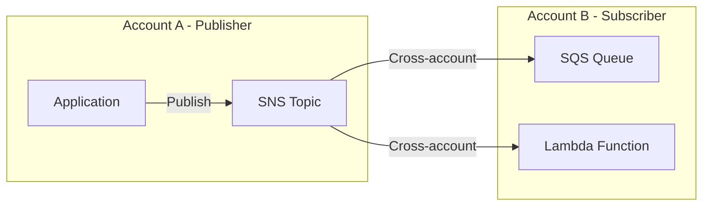

# How to Set Up SNS Cross-Account Subscriptions

Author: [nawazdhandala](https://github.com/nawazdhandala)

Tags: AWS, SNS, Cross-Account, IAM, Security

Description: Learn how to set up cross-account SNS subscriptions so applications in one AWS account can subscribe to and publish messages on topics in another account.

---

In multi-account AWS environments, services in one account often need to receive notifications from another account's SNS topics. Maybe your security account needs alerts from production, or your data team needs order events from the commerce account. Cross-account SNS subscriptions make this possible, but the IAM permissions need to be set up correctly on both sides.

## The Cross-Account Pattern



Two things need to happen:
1. The topic owner (Account A) must grant permission for Account B to subscribe
2. The subscriber (Account B) must allow SNS from Account A to deliver messages

## Setting Up the Topic Policy (Account A)

The topic owner needs to add a resource policy that allows the other account to subscribe and receive messages.

```bash
# In Account A (111111111111) - the topic owner
# Allow Account B (222222222222) to subscribe to the topic
aws sns set-topic-attributes \
  --topic-arn arn:aws:sns:us-east-1:111111111111:order-events \
  --attribute-name Policy \
  --attribute-value '{
    "Version": "2012-10-17",
    "Statement": [
      {
        "Sid": "AllowCrossAccountSubscribe",
        "Effect": "Allow",
        "Principal": {
          "AWS": "arn:aws:iam::222222222222:root"
        },
        "Action": [
          "sns:Subscribe",
          "sns:Receive"
        ],
        "Resource": "arn:aws:sns:us-east-1:111111111111:order-events"
      }
    ]
  }'
```

You can also restrict which protocols the other account can use for subscriptions.

```bash
# More restrictive - only allow SQS and Lambda subscriptions
aws sns set-topic-attributes \
  --topic-arn arn:aws:sns:us-east-1:111111111111:order-events \
  --attribute-name Policy \
  --attribute-value '{
    "Version": "2012-10-17",
    "Statement": [
      {
        "Sid": "AllowCrossAccountSQSAndLambda",
        "Effect": "Allow",
        "Principal": {
          "AWS": "arn:aws:iam::222222222222:root"
        },
        "Action": [
          "sns:Subscribe",
          "sns:Receive"
        ],
        "Resource": "arn:aws:sns:us-east-1:111111111111:order-events",
        "Condition": {
          "StringEquals": {
            "sns:Protocol": ["sqs", "lambda"]
          }
        }
      }
    ]
  }'
```

## Subscribing an SQS Queue from Account B

Now, from Account B, subscribe an SQS queue to Account A's topic.

### Step 1: Set the SQS Queue Policy

The queue needs to accept messages from SNS in Account A.

```bash
# In Account B (222222222222)
# Allow SNS from Account A to send messages to our queue
aws sqs set-queue-attributes \
  --queue-url https://sqs.us-east-1.amazonaws.com/222222222222/order-events-consumer \
  --attributes '{
    "Policy": "{\"Version\":\"2012-10-17\",\"Statement\":[{\"Sid\":\"AllowSNSFromAccountA\",\"Effect\":\"Allow\",\"Principal\":{\"Service\":\"sns.amazonaws.com\"},\"Action\":\"sqs:SendMessage\",\"Resource\":\"arn:aws:sqs:us-east-1:222222222222:order-events-consumer\",\"Condition\":{\"ArnEquals\":{\"aws:SourceArn\":\"arn:aws:sns:us-east-1:111111111111:order-events\"}}}]}"
  }'
```

### Step 2: Create the Subscription

```bash
# In Account B - subscribe our queue to Account A's topic
aws sns subscribe \
  --topic-arn arn:aws:sns:us-east-1:111111111111:order-events \
  --protocol sqs \
  --notification-endpoint arn:aws:sqs:us-east-1:222222222222:order-events-consumer
```

For SQS subscriptions, no confirmation is needed - the subscription becomes active immediately.

## Cross-Account with Python

Here's a complete setup script that handles both sides.

```python
import json
import boto3

def setup_cross_account_topic_policy(
    topic_arn,
    subscriber_account_ids,
    allowed_protocols=None
):
    """Set up the topic policy to allow cross-account subscriptions.

    Run this in the topic owner's account.
    """
    sns = boto3.client('sns')

    # Build the principal list
    principals = [
        f'arn:aws:iam::{account_id}:root'
        for account_id in subscriber_account_ids
    ]

    statement = {
        'Sid': 'CrossAccountSubscribe',
        'Effect': 'Allow',
        'Principal': {'AWS': principals},
        'Action': ['sns:Subscribe', 'sns:Receive'],
        'Resource': topic_arn,
    }

    # Optionally restrict which protocols are allowed
    if allowed_protocols:
        statement['Condition'] = {
            'StringEquals': {
                'sns:Protocol': allowed_protocols
            }
        }

    policy = {
        'Version': '2012-10-17',
        'Statement': [statement],
    }

    sns.set_topic_attributes(
        TopicArn=topic_arn,
        AttributeName='Policy',
        AttributeValue=json.dumps(policy),
    )

    print(f'Topic policy updated for accounts: {subscriber_account_ids}')

# Allow two subscriber accounts
setup_cross_account_topic_policy(
    topic_arn='arn:aws:sns:us-east-1:111111111111:order-events',
    subscriber_account_ids=['222222222222', '333333333333'],
    allowed_protocols=['sqs', 'lambda'],
)
```

```python
import json
import boto3

def setup_cross_account_sqs_subscription(
    topic_arn,
    queue_url,
    queue_arn,
    publisher_account_id
):
    """Set up SQS queue policy and subscribe to a cross-account topic.

    Run this in the subscriber's account.
    """
    sqs = boto3.client('sqs')
    sns = boto3.client('sns')

    # Set queue policy to accept messages from the topic
    policy = {
        'Version': '2012-10-17',
        'Statement': [{
            'Sid': 'AllowCrossAccountSNS',
            'Effect': 'Allow',
            'Principal': {'Service': 'sns.amazonaws.com'},
            'Action': 'sqs:SendMessage',
            'Resource': queue_arn,
            'Condition': {
                'ArnEquals': {
                    'aws:SourceArn': topic_arn,
                }
            }
        }],
    }

    sqs.set_queue_attributes(
        QueueUrl=queue_url,
        Attributes={'Policy': json.dumps(policy)},
    )

    # Subscribe to the topic
    response = sns.subscribe(
        TopicArn=topic_arn,
        Protocol='sqs',
        Endpoint=queue_arn,
    )

    print(f'Subscription created: {response["SubscriptionArn"]}')
    return response['SubscriptionArn']

# Subscribe from Account B
setup_cross_account_sqs_subscription(
    topic_arn='arn:aws:sns:us-east-1:111111111111:order-events',
    queue_url='https://sqs.us-east-1.amazonaws.com/222222222222/order-events-consumer',
    queue_arn='arn:aws:sqs:us-east-1:222222222222:order-events-consumer',
    publisher_account_id='111111111111',
)
```

## Cross-Account Publishing

Sometimes Account B also needs to publish to Account A's topic.

```bash
# In Account A - add publish permission to the topic policy
aws sns set-topic-attributes \
  --topic-arn arn:aws:sns:us-east-1:111111111111:shared-events \
  --attribute-name Policy \
  --attribute-value '{
    "Version": "2012-10-17",
    "Statement": [
      {
        "Sid": "AllowCrossAccountPublish",
        "Effect": "Allow",
        "Principal": {
          "AWS": "arn:aws:iam::222222222222:root"
        },
        "Action": "sns:Publish",
        "Resource": "arn:aws:sns:us-east-1:111111111111:shared-events"
      },
      {
        "Sid": "AllowCrossAccountSubscribe",
        "Effect": "Allow",
        "Principal": {
          "AWS": "arn:aws:iam::222222222222:root"
        },
        "Action": ["sns:Subscribe", "sns:Receive"],
        "Resource": "arn:aws:sns:us-east-1:111111111111:shared-events"
      }
    ]
  }'
```

## Setting Up with CDK (Using Cross-Stack References)

In CDK, cross-account setups require deploying stacks in both accounts.

```typescript
// Stack in Account A - the topic owner
import * as cdk from 'aws-cdk-lib';
import * as sns from 'aws-cdk-lib/aws-sns';
import * as iam from 'aws-cdk-lib/aws-iam';

const topic = new sns.Topic(this, 'OrderEvents', {
  topicName: 'order-events',
});

// Allow Account B to subscribe and receive
topic.addToResourcePolicy(new iam.PolicyStatement({
  actions: ['sns:Subscribe', 'sns:Receive'],
  principals: [new iam.AccountPrincipal('222222222222')],
  resources: [topic.topicArn],
}));

// Export the topic ARN so Account B can reference it
new cdk.CfnOutput(this, 'TopicArn', {
  value: topic.topicArn,
  exportName: 'OrderEventsTopicArn',
});
```

```typescript
// Stack in Account B - the subscriber
import * as cdk from 'aws-cdk-lib';
import * as sqs from 'aws-cdk-lib/aws-sqs';
import * as sns from 'aws-cdk-lib/aws-sns';
import * as snsSubscriptions from 'aws-cdk-lib/aws-sns-subscriptions';

// Reference the topic from Account A by ARN
const topicArn = 'arn:aws:sns:us-east-1:111111111111:order-events';
const topic = sns.Topic.fromTopicArn(this, 'OrderEvents', topicArn);

const queue = new sqs.Queue(this, 'OrderEventsConsumer', {
  queueName: 'order-events-consumer',
});

// Subscribe our queue to Account A's topic
topic.addSubscription(
  new snsSubscriptions.SqsSubscription(queue)
);
```

## Security Best Practices

- **Use specific account IDs**, not wildcard principals. Never use `"Principal": "*"` on a topic policy.
- **Restrict protocols** to only what's needed. Don't allow HTTP subscriptions cross-account unless required.
- **Use condition keys** to further limit access by source ARN, IP range, or VPC endpoint.
- **Audit subscriptions regularly** to ensure only authorized accounts are subscribed.
- **Enable delivery logging** to track cross-account message delivery.

For encrypted cross-account messaging, see [enabling SNS message encryption with KMS](https://oneuptime.com/blog/post/enable-sns-message-encryption-with-kms/view). KMS key policies also need cross-account access when topics are encrypted.
