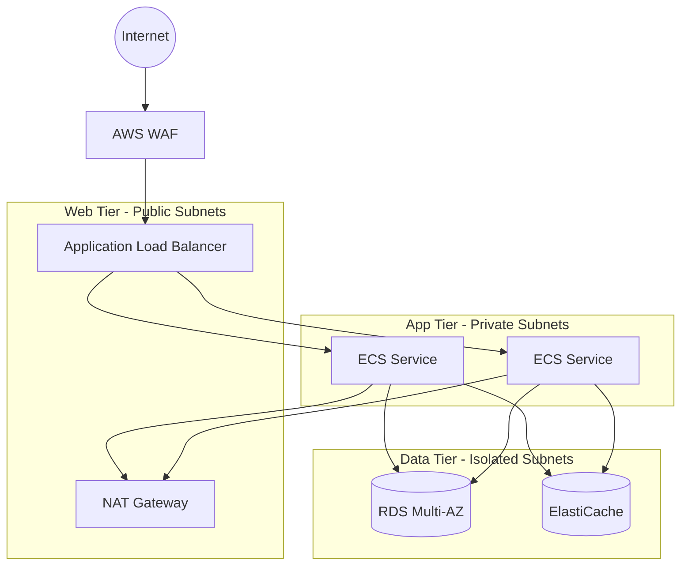

# How to Set Up a Three-Tier VPC Architecture

Author: [nawazdhandala](https://github.com/nawazdhandala)

Tags: AWS, VPC, Networking, Architecture

Description: Build a production-ready three-tier VPC architecture in AWS with separate web, application, and data layers for maximum security and scalability.

---

The three-tier architecture is the workhorse of enterprise cloud deployments. It separates your infrastructure into three distinct layers: a web tier (public-facing), an application tier (business logic), and a data tier (databases and storage). Each tier lives in its own set of subnets with carefully controlled access between them.

This isn't just an academic exercise. It's how most serious production systems are built on AWS. The isolation between tiers means a compromise in one layer doesn't automatically give an attacker access to everything else.

## The Three Tiers

Let's be clear about what goes where:

**Web Tier (Public Subnets):** Load balancers, reverse proxies, CDN origin servers. These are the only resources directly accessible from the internet.

**Application Tier (Private Subnets):** Your actual application servers, containers, or Lambda functions. They receive traffic from the web tier and process business logic. They can reach the internet through a NAT gateway for outbound calls, but nothing from the internet can reach them directly.

**Data Tier (Isolated Private Subnets):** Databases, caches, message queues. These only accept connections from the application tier. No internet access in either direction - not even through a NAT gateway.



## CIDR Block Design

A clean CIDR scheme makes troubleshooting and security rules much easier. Here's what I recommend for a `/16` VPC:

```
VPC: 10.0.0.0/16

Web Tier (Public):
  10.0.1.0/24   - us-east-1a
  10.0.2.0/24   - us-east-1b
  10.0.3.0/24   - us-east-1c

App Tier (Private):
  10.0.11.0/24  - us-east-1a
  10.0.12.0/24  - us-east-1b
  10.0.13.0/24  - us-east-1c

Data Tier (Isolated):
  10.0.21.0/24  - us-east-1a
  10.0.22.0/24  - us-east-1b
  10.0.23.0/24  - us-east-1c
```

The tens digit tells you the tier: 0x for web, 1x for app, 2x for data. The ones digit maps to the availability zone. This convention is dead simple and scales well.

## CloudFormation Implementation

Here's the full CloudFormation template. It's long, but every piece is necessary:

```yaml
# three-tier-vpc.yaml
AWSTemplateFormatVersion: '2010-09-09'
Description: Three-tier VPC architecture

Parameters:
  Environment:
    Type: String
    Default: production
    AllowedValues: [production, staging, development]

Resources:
  VPC:
    Type: AWS::EC2::VPC
    Properties:
      CidrBlock: 10.0.0.0/16
      EnableDnsSupport: true
      EnableDnsHostnames: true
      Tags:
        - Key: Name
          Value: !Sub ${Environment}-vpc

  InternetGateway:
    Type: AWS::EC2::InternetGateway

  IGWAttachment:
    Type: AWS::EC2::VPCGatewayAttachment
    Properties:
      InternetGatewayId: !Ref InternetGateway
      VpcId: !Ref VPC

  # --- Web Tier Subnets (Public) ---
  WebSubnet1:
    Type: AWS::EC2::Subnet
    Properties:
      VpcId: !Ref VPC
      CidrBlock: 10.0.1.0/24
      AvailabilityZone: !Select [0, !GetAZs '']
      MapPublicIpOnLaunch: true
      Tags:
        - Key: Name
          Value: !Sub ${Environment}-web-1a
        - Key: Tier
          Value: web

  WebSubnet2:
    Type: AWS::EC2::Subnet
    Properties:
      VpcId: !Ref VPC
      CidrBlock: 10.0.2.0/24
      AvailabilityZone: !Select [1, !GetAZs '']
      MapPublicIpOnLaunch: true
      Tags:
        - Key: Name
          Value: !Sub ${Environment}-web-1b
        - Key: Tier
          Value: web

  # --- App Tier Subnets (Private) ---
  AppSubnet1:
    Type: AWS::EC2::Subnet
    Properties:
      VpcId: !Ref VPC
      CidrBlock: 10.0.11.0/24
      AvailabilityZone: !Select [0, !GetAZs '']
      Tags:
        - Key: Name
          Value: !Sub ${Environment}-app-1a
        - Key: Tier
          Value: app

  AppSubnet2:
    Type: AWS::EC2::Subnet
    Properties:
      VpcId: !Ref VPC
      CidrBlock: 10.0.12.0/24
      AvailabilityZone: !Select [1, !GetAZs '']
      Tags:
        - Key: Name
          Value: !Sub ${Environment}-app-1b
        - Key: Tier
          Value: app

  # --- Data Tier Subnets (Isolated) ---
  DataSubnet1:
    Type: AWS::EC2::Subnet
    Properties:
      VpcId: !Ref VPC
      CidrBlock: 10.0.21.0/24
      AvailabilityZone: !Select [0, !GetAZs '']
      Tags:
        - Key: Name
          Value: !Sub ${Environment}-data-1a
        - Key: Tier
          Value: data

  DataSubnet2:
    Type: AWS::EC2::Subnet
    Properties:
      VpcId: !Ref VPC
      CidrBlock: 10.0.22.0/24
      AvailabilityZone: !Select [1, !GetAZs '']
      Tags:
        - Key: Name
          Value: !Sub ${Environment}-data-1b
        - Key: Tier
          Value: data

  # --- NAT Gateways (one per AZ for HA) ---
  NatEIP1:
    Type: AWS::EC2::EIP
    Properties:
      Domain: vpc

  NatGateway1:
    Type: AWS::EC2::NatGateway
    Properties:
      AllocationId: !GetAtt NatEIP1.AllocationId
      SubnetId: !Ref WebSubnet1

  NatEIP2:
    Type: AWS::EC2::EIP
    Properties:
      Domain: vpc

  NatGateway2:
    Type: AWS::EC2::NatGateway
    Properties:
      AllocationId: !GetAtt NatEIP2.AllocationId
      SubnetId: !Ref WebSubnet2

  # --- Route Tables ---
  # Web tier routes through internet gateway
  WebRouteTable:
    Type: AWS::EC2::RouteTable
    Properties:
      VpcId: !Ref VPC
      Tags:
        - Key: Name
          Value: !Sub ${Environment}-web-rt

  WebDefaultRoute:
    Type: AWS::EC2::Route
    DependsOn: IGWAttachment
    Properties:
      RouteTableId: !Ref WebRouteTable
      DestinationCidrBlock: 0.0.0.0/0
      GatewayId: !Ref InternetGateway

  WebSubnet1RTAssoc:
    Type: AWS::EC2::SubnetRouteTableAssociation
    Properties:
      SubnetId: !Ref WebSubnet1
      RouteTableId: !Ref WebRouteTable

  WebSubnet2RTAssoc:
    Type: AWS::EC2::SubnetRouteTableAssociation
    Properties:
      SubnetId: !Ref WebSubnet2
      RouteTableId: !Ref WebRouteTable

  # App tier routes through NAT gateway
  AppRouteTable1:
    Type: AWS::EC2::RouteTable
    Properties:
      VpcId: !Ref VPC
      Tags:
        - Key: Name
          Value: !Sub ${Environment}-app-rt-1

  AppDefaultRoute1:
    Type: AWS::EC2::Route
    Properties:
      RouteTableId: !Ref AppRouteTable1
      DestinationCidrBlock: 0.0.0.0/0
      NatGatewayId: !Ref NatGateway1

  AppSubnet1RTAssoc:
    Type: AWS::EC2::SubnetRouteTableAssociation
    Properties:
      SubnetId: !Ref AppSubnet1
      RouteTableId: !Ref AppRouteTable1

  AppRouteTable2:
    Type: AWS::EC2::RouteTable
    Properties:
      VpcId: !Ref VPC
      Tags:
        - Key: Name
          Value: !Sub ${Environment}-app-rt-2

  AppDefaultRoute2:
    Type: AWS::EC2::Route
    Properties:
      RouteTableId: !Ref AppRouteTable2
      DestinationCidrBlock: 0.0.0.0/0
      NatGatewayId: !Ref NatGateway2

  AppSubnet2RTAssoc:
    Type: AWS::EC2::SubnetRouteTableAssociation
    Properties:
      SubnetId: !Ref AppSubnet2
      RouteTableId: !Ref AppRouteTable2

  # Data tier has NO default route - completely isolated
  DataRouteTable:
    Type: AWS::EC2::RouteTable
    Properties:
      VpcId: !Ref VPC
      Tags:
        - Key: Name
          Value: !Sub ${Environment}-data-rt

  DataSubnet1RTAssoc:
    Type: AWS::EC2::SubnetRouteTableAssociation
    Properties:
      SubnetId: !Ref DataSubnet1
      RouteTableId: !Ref DataRouteTable

  DataSubnet2RTAssoc:
    Type: AWS::EC2::SubnetRouteTableAssociation
    Properties:
      SubnetId: !Ref DataSubnet2
      RouteTableId: !Ref DataRouteTable
```

Notice that the data tier route table has no default route. No `0.0.0.0/0` entry at all. This means resources in the data tier literally cannot reach the internet, even if they wanted to. It's a hard network boundary, not just a security group rule that someone might accidentally modify.

## Security Group Chain

The security groups enforce tier-to-tier communication rules:

```yaml
  # Web tier - accepts public traffic on 80 and 443
  WebSecurityGroup:
    Type: AWS::EC2::SecurityGroup
    Properties:
      GroupDescription: Web tier - public access
      VpcId: !Ref VPC
      SecurityGroupIngress:
        - IpProtocol: tcp
          FromPort: 443
          ToPort: 443
          CidrIp: 0.0.0.0/0

  # App tier - only accepts traffic from web tier
  AppSecurityGroup:
    Type: AWS::EC2::SecurityGroup
    Properties:
      GroupDescription: App tier - web tier access only
      VpcId: !Ref VPC
      SecurityGroupIngress:
        - IpProtocol: tcp
          FromPort: 8080
          ToPort: 8080
          SourceSecurityGroupId: !Ref WebSecurityGroup

  # Data tier - only accepts traffic from app tier
  DataSecurityGroup:
    Type: AWS::EC2::SecurityGroup
    Properties:
      GroupDescription: Data tier - app tier access only
      VpcId: !Ref VPC
      SecurityGroupIngress:
        - IpProtocol: tcp
          FromPort: 5432
          ToPort: 5432
          SourceSecurityGroupId: !Ref AppSecurityGroup
        - IpProtocol: tcp
          FromPort: 6379
          ToPort: 6379
          SourceSecurityGroupId: !Ref AppSecurityGroup
```

The web tier allows HTTPS from anywhere. The app tier only allows port 8080 from the web tier's security group. The data tier only allows PostgreSQL (5432) and Redis (6379) from the app tier's security group. Clean and strict.

## Cost Considerations

The biggest cost driver in this architecture is NAT gateways. Each one costs about $32/month plus data processing charges. With two NAT gateways for HA, that's $64/month before any traffic.

For development and staging environments, you can cut costs by using a single NAT gateway. Just know that you're trading availability for savings - if the AZ with the NAT gateway goes down, your app tier loses outbound internet access.

Also consider VPC endpoints for services like S3 and DynamoDB. They're free for gateway endpoints and eliminate NAT gateway data processing charges for those services. Check out [setting up VPC gateway endpoints for S3 and DynamoDB](https://oneuptime.com/blog/post/set-up-vpc-gateway-endpoints-s3-dynamodb/view) for the details.

## Wrapping Up

The three-tier VPC architecture gives you clear boundaries between your public-facing resources, your business logic, and your data. It's the pattern AWS recommends, and for good reason - it balances security, scalability, and operational simplicity. Start with this foundation and add complexity only when you need it.

For the networking primitives behind this setup, check out [creating a VPC from scratch](https://oneuptime.com/blog/post/create-vpc-from-scratch-in-aws/view) and [configuring route tables in a VPC](https://oneuptime.com/blog/post/configure-route-tables-in-vpc/view).
