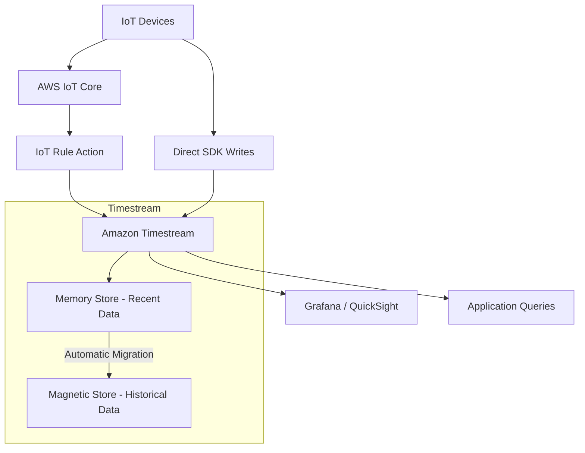

# How to Set Up Timestream for IoT Data

Author: [nawazdhandala](https://github.com/nawazdhandala)

Tags: AWS, Timestream, IoT, Time Series, Database, Sensor Data

Description: Learn how to set up Amazon Timestream to store and query IoT sensor data with automatic data lifecycle management and purpose-built time series queries.

---

IoT devices generate a relentless stream of time-stamped data. Temperature readings every second, GPS coordinates every five seconds, machine vibration data at 100 Hz. Traditional relational databases were not designed for this kind of write-heavy, append-only workload where you primarily query by time range.

Amazon Timestream is a purpose-built time series database for exactly this use case. It automatically manages the data lifecycle - keeping recent data in a fast in-memory store and moving older data to cheaper magnetic storage. It scales to handle trillions of data points and provides built-in time series functions for analysis.

## How Timestream Works



Timestream has two storage tiers:

- **Memory store**: Holds recent data in memory for fast writes and queries. You configure how long data stays here (hours to days).
- **Magnetic store**: Stores older data on cost-effective magnetic storage. Data is automatically migrated from the memory store based on your retention policy.

## Step 1: Create a Database

```bash
# Create a Timestream database
aws timestream-write create-database \
  --database-name iot_sensor_data \
  --tags Key=Environment,Value=production
```

## Step 2: Create a Table

Tables in Timestream have retention policies that control how long data stays in each tier.

```bash
# Create a table with retention policies
# Memory store: 24 hours for fast access to recent data
# Magnetic store: 365 days for historical analysis
aws timestream-write create-table \
  --database-name iot_sensor_data \
  --table-name sensor_readings \
  --retention-properties '{
    "MemoryStoreRetentionPeriodInHours": 24,
    "MagneticStoreRetentionPeriodInDays": 365
  }' \
  --magnetic-store-write-properties '{
    "EnableMagneticStoreWrites": true
  }' \
  --tags Key=DataType,Value=sensor_readings
```

Enabling magnetic store writes allows late-arriving data to be written directly to the magnetic store, which is useful when IoT devices have intermittent connectivity and send data that is older than the memory store retention period.

## Step 3: Write Data

### Using the AWS SDK (Python)

```python
# Write IoT sensor readings to Timestream
import boto3
import time

client = boto3.client('timestream-write')

DATABASE = 'iot_sensor_data'
TABLE = 'sensor_readings'

def write_sensor_data(device_id, location, temperature, humidity, battery_level):
    """Write a single sensor reading to Timestream."""
    current_time = str(int(time.time() * 1000))  # Milliseconds

    records = [
        {
            'Dimensions': [
                {'Name': 'device_id', 'Value': device_id, 'DimensionValueType': 'VARCHAR'},
                {'Name': 'location', 'Value': location, 'DimensionValueType': 'VARCHAR'},
            ],
            'MeasureName': 'sensor_metrics',
            'MeasureValueType': 'MULTI',
            'MeasureValues': [
                {'Name': 'temperature', 'Value': str(temperature), 'Type': 'DOUBLE'},
                {'Name': 'humidity', 'Value': str(humidity), 'Type': 'DOUBLE'},
                {'Name': 'battery_level', 'Value': str(battery_level), 'Type': 'DOUBLE'},
            ],
            'Time': current_time,
            'TimeUnit': 'MILLISECONDS'
        }
    ]

    try:
        client.write_records(
            DatabaseName=DATABASE,
            TableName=TABLE,
            Records=records,
            CommonAttributes={}
        )
    except client.exceptions.RejectedRecordsException as e:
        for rejected in e.response['RejectedRecords']:
            print(f"Rejected record: {rejected['Reason']}")
```

### Batch Writing for High Throughput

For IoT workloads, batch writes are essential for throughput and cost efficiency.

```python
# Batch write sensor data - up to 100 records per request
def write_batch(readings):
    """
    Write a batch of sensor readings.
    Each reading is a dict with device_id, location, temperature, humidity, battery.
    """
    records = []
    current_time = str(int(time.time() * 1000))

    for reading in readings:
        record = {
            'Dimensions': [
                {'Name': 'device_id', 'Value': reading['device_id'], 'DimensionValueType': 'VARCHAR'},
                {'Name': 'location', 'Value': reading['location'], 'DimensionValueType': 'VARCHAR'},
            ],
            'MeasureName': 'sensor_metrics',
            'MeasureValueType': 'MULTI',
            'MeasureValues': [
                {'Name': 'temperature', 'Value': str(reading['temperature']), 'Type': 'DOUBLE'},
                {'Name': 'humidity', 'Value': str(reading['humidity']), 'Type': 'DOUBLE'},
                {'Name': 'battery_level', 'Value': str(reading['battery_level']), 'Type': 'DOUBLE'},
            ],
            'Time': reading.get('timestamp', current_time),
            'TimeUnit': 'MILLISECONDS'
        }
        records.append(record)

    # Timestream accepts up to 100 records per write request
    for i in range(0, len(records), 100):
        batch = records[i:i+100]
        try:
            client.write_records(
                DatabaseName=DATABASE,
                TableName=TABLE,
                Records=batch
            )
        except client.exceptions.RejectedRecordsException as e:
            print(f"Batch starting at {i}: {len(e.response['RejectedRecords'])} records rejected")
```

## Step 4: Ingesting from AWS IoT Core

The most common pattern is to route IoT messages from AWS IoT Core directly to Timestream.

### Create an IoT Rule

```bash
# Create an IAM role for the IoT rule to write to Timestream
aws iam create-role \
  --role-name IoTTimestreamRole \
  --assume-role-policy-document '{
    "Version": "2012-10-17",
    "Statement": [{
      "Effect": "Allow",
      "Principal": {"Service": "iot.amazonaws.com"},
      "Action": "sts:AssumeRole"
    }]
  }'

# Attach permissions to write to Timestream
aws iam put-role-policy \
  --role-name IoTTimestreamRole \
  --policy-name TimestreamWritePolicy \
  --policy-document '{
    "Version": "2012-10-17",
    "Statement": [{
      "Effect": "Allow",
      "Action": ["timestream:WriteRecords", "timestream:DescribeEndpoints"],
      "Resource": "*"
    }]
  }'
```

```bash
# Create the IoT rule to route sensor data to Timestream
aws iot create-topic-rule \
  --rule-name SensorToTimestream \
  --topic-rule-payload '{
    "sql": "SELECT * FROM '\''sensors/+/data'\''",
    "actions": [{
      "timestream": {
        "roleArn": "arn:aws:iam::123456789012:role/IoTTimestreamRole",
        "databaseName": "iot_sensor_data",
        "tableName": "sensor_readings",
        "dimensions": [
          {"name": "device_id", "value": "${device_id}"},
          {"name": "location", "value": "${location}"}
        ]
      }
    }]
  }'
```

Now when IoT devices publish to topics matching `sensors/+/data`, the data flows directly into Timestream.

## Step 5: Querying Data

Timestream uses SQL with built-in time series functions.

### Recent Readings

```sql
-- Get the latest reading from each device in the last hour
SELECT device_id, location,
       MAX_BY(temperature, time) AS latest_temperature,
       MAX_BY(humidity, time) AS latest_humidity,
       MAX_BY(battery_level, time) AS latest_battery
FROM iot_sensor_data.sensor_readings
WHERE time > ago(1h)
GROUP BY device_id, location
ORDER BY device_id
```

### Time Series Aggregation

```sql
-- Average temperature per device per 15-minute interval over the last 24 hours
SELECT device_id,
       BIN(time, 15m) AS interval,
       AVG(temperature) AS avg_temp,
       MIN(temperature) AS min_temp,
       MAX(temperature) AS max_temp
FROM iot_sensor_data.sensor_readings
WHERE time > ago(24h)
  AND measure_name = 'sensor_metrics'
GROUP BY device_id, BIN(time, 15m)
ORDER BY device_id, interval DESC
```

### Anomaly Detection

```sql
-- Find devices with temperature readings more than 2 standard deviations from their average
WITH device_stats AS (
    SELECT device_id,
           AVG(temperature) AS avg_temp,
           STDDEV(temperature) AS stddev_temp
    FROM iot_sensor_data.sensor_readings
    WHERE time > ago(7d)
    GROUP BY device_id
)
SELECT r.device_id, r.time, r.temperature,
       s.avg_temp, s.stddev_temp,
       ABS(r.temperature - s.avg_temp) / s.stddev_temp AS z_score
FROM iot_sensor_data.sensor_readings r
JOIN device_stats s ON r.device_id = s.device_id
WHERE r.time > ago(1h)
  AND ABS(r.temperature - s.avg_temp) > 2 * s.stddev_temp
ORDER BY z_score DESC
```

### Battery Monitoring

```sql
-- Find devices with low battery that are draining fast
SELECT device_id, location,
       MAX_BY(battery_level, time) AS current_battery,
       MIN_BY(battery_level, time) AS battery_24h_ago,
       MAX_BY(battery_level, time) - MIN_BY(battery_level, time) AS drain_rate
FROM iot_sensor_data.sensor_readings
WHERE time > ago(24h)
GROUP BY device_id, location
HAVING MAX_BY(battery_level, time) < 20
ORDER BY drain_rate DESC
```

## Running Queries Programmatically

```python
# Query Timestream from Python
query_client = boto3.client('timestream-query')

def run_query(query_string):
    """Execute a Timestream query and return results."""
    paginator = query_client.get_paginator('query')
    results = []

    for page in paginator.paginate(QueryString=query_string):
        for row in page['Rows']:
            results.append([col.get('ScalarValue', '') for col in row['Data']])

    return results

# Get devices with high temperature
hot_devices = run_query("""
    SELECT device_id, location, MAX(temperature) AS max_temp
    FROM iot_sensor_data.sensor_readings
    WHERE time > ago(1h) AND temperature > 40
    GROUP BY device_id, location
    ORDER BY max_temp DESC
""")
```

## Monitoring Timestream

```bash
# Monitor write throughput
aws cloudwatch get-metric-statistics \
  --namespace AWS/Timestream \
  --metric-name SuccessfulRequestCount \
  --dimensions Name=DatabaseName,Value=iot_sensor_data Name=TableName,Value=sensor_readings Name=Operation,Value=WriteRecords \
  --start-time $(date -u -d '1 hour ago' +%Y-%m-%dT%H:%M:%S) \
  --end-time $(date -u +%Y-%m-%dT%H:%M:%S) \
  --period 300 \
  --statistics Sum
```

## Summary

Timestream is built for the exact workload pattern that IoT generates - high-volume writes, time-range queries, and automatic data lifecycle management. The two-tier storage model keeps recent data fast while making historical analysis affordable. Combined with direct integration from AWS IoT Core, you can have an end-to-end IoT data pipeline running in under an hour.

For more on Timestream, check out our guides on [querying Timestream with SQL](https://oneuptime.com/blog/post/query-timestream-with-sql/view) and [setting up Timestream scheduled queries](https://oneuptime.com/blog/post/set-up-timestream-scheduled-queries/view).
