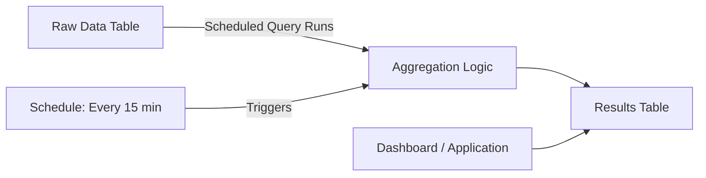

# How to Set Up Timestream Scheduled Queries

Author: [nawazdhandala](https://github.com/nawazdhandala)

Tags: AWS, Timestream, Scheduled Queries, Time Series, Analytics, Automation

Description: Automate time series data aggregation and analysis with Timestream scheduled queries to pre-compute metrics and reduce query costs.

---

Running the same analytical queries repeatedly against raw time series data is wasteful. If your dashboard shows hourly averages for the last 30 days, every time someone loads that dashboard, Timestream scans 30 days of raw data, computes the averages, and returns the results. The query cost adds up, and the latency is unnecessary since the hourly averages for completed hours will never change.

Timestream scheduled queries solve this by pre-computing aggregated results on a schedule and storing them in a destination table. Your dashboards and applications query the pre-computed results instead of the raw data, which is both faster and cheaper.

## How Scheduled Queries Work



A scheduled query consists of:
1. A SQL query that runs against your raw data
2. A schedule (how often it runs)
3. A target table where results are stored
4. A notification mechanism for success/failure

## Prerequisites

### Create a Target Table

The target table holds the pre-computed results.

```bash
# Create a table for pre-computed hourly metrics
# Longer retention since this is aggregated data
aws timestream-write create-table \
  --database-name iot_data \
  --table-name hourly_metrics \
  --retention-properties '{
    "MemoryStoreRetentionPeriodInHours": 72,
    "MagneticStoreRetentionPeriodInDays": 730
  }' \
  --magnetic-store-write-properties '{"EnableMagneticStoreWrites": true}'
```

### Create an SNS Topic for Notifications

```bash
# Create an SNS topic for scheduled query notifications
aws sns create-topic --name timestream-scheduled-query-notifications

# Subscribe your email for alerts
aws sns subscribe \
  --topic-arn arn:aws:sns:us-east-1:123456789012:timestream-scheduled-query-notifications \
  --protocol email \
  --notification-endpoint ops-team@example.com
```

### Create an IAM Role

The scheduled query needs permissions to read from the source table and write to the target table.

```bash
# Create the IAM role for scheduled queries
aws iam create-role \
  --role-name TimestreamScheduledQueryRole \
  --assume-role-policy-document '{
    "Version": "2012-10-17",
    "Statement": [{
      "Effect": "Allow",
      "Principal": {"Service": "timestream.amazonaws.com"},
      "Action": "sts:AssumeRole"
    }]
  }'

# Attach permissions policy
aws iam put-role-policy \
  --role-name TimestreamScheduledQueryRole \
  --policy-name TimestreamScheduledQueryPolicy \
  --policy-document '{
    "Version": "2012-10-17",
    "Statement": [
      {
        "Effect": "Allow",
        "Action": [
          "timestream:WriteRecords",
          "timestream:DescribeEndpoints",
          "timestream:Select"
        ],
        "Resource": "*"
      },
      {
        "Effect": "Allow",
        "Action": "sns:Publish",
        "Resource": "arn:aws:sns:us-east-1:123456789012:timestream-scheduled-query-notifications"
      },
      {
        "Effect": "Allow",
        "Action": [
          "s3:PutObject",
          "s3:GetBucketAcl"
        ],
        "Resource": [
          "arn:aws:s3:::my-timestream-errors",
          "arn:aws:s3:::my-timestream-errors/*"
        ]
      }
    ]
  }'
```

## Creating a Scheduled Query

### Example 1: Hourly Device Metrics

This query computes hourly statistics for each device and writes them to the target table.

```bash
# Create a scheduled query that computes hourly device metrics
aws timestream-query create-scheduled-query \
  --name hourly-device-metrics \
  --query-string "
    SELECT device_id, location,
           BIN(time, 1h) AS binned_time,
           AVG(temperature) AS avg_temperature,
           MIN(temperature) AS min_temperature,
           MAX(temperature) AS max_temperature,
           AVG(humidity) AS avg_humidity,
           COUNT(*) AS sample_count
    FROM iot_data.sensor_readings
    WHERE time BETWEEN @scheduled_runtime - 1h AND @scheduled_runtime
    GROUP BY device_id, location, BIN(time, 1h)
  " \
  --schedule-configuration '{"ScheduleExpression": "rate(1 hour)"}' \
  --notification-configuration '{
    "SnsConfiguration": {
      "TopicArn": "arn:aws:sns:us-east-1:123456789012:timestream-scheduled-query-notifications"
    }
  }' \
  --target-configuration '{
    "TimestreamConfiguration": {
      "DatabaseName": "iot_data",
      "TableName": "hourly_metrics",
      "TimeColumn": "binned_time",
      "DimensionMappings": [
        {"Name": "device_id", "DimensionValueType": "VARCHAR"},
        {"Name": "location", "DimensionValueType": "VARCHAR"}
      ],
      "MultiMeasureMappings": {
        "TargetMultiMeasureName": "hourly_stats",
        "MultiMeasureAttributeMappings": [
          {"SourceColumn": "avg_temperature", "MeasureValueType": "DOUBLE"},
          {"SourceColumn": "min_temperature", "MeasureValueType": "DOUBLE"},
          {"SourceColumn": "max_temperature", "MeasureValueType": "DOUBLE"},
          {"SourceColumn": "avg_humidity", "MeasureValueType": "DOUBLE"},
          {"SourceColumn": "sample_count", "MeasureValueType": "BIGINT"}
        ]
      }
    }
  }' \
  --scheduled-query-execution-role-arn arn:aws:iam::123456789012:role/TimestreamScheduledQueryRole \
  --error-report-configuration '{
    "S3Configuration": {
      "BucketName": "my-timestream-errors",
      "ObjectKeyPrefix": "scheduled-queries/hourly-metrics/"
    }
  }'
```

Key parts explained:

- `@scheduled_runtime` is a special variable that contains the time when the query was triggered
- The time filter `BETWEEN @scheduled_runtime - 1h AND @scheduled_runtime` processes only the most recent hour of data
- `DimensionMappings` map query columns to Timestream dimensions
- `MultiMeasureMappings` map aggregated values to measures

### Example 2: Rolling 24-Hour Statistics

```bash
# Compute rolling 24-hour statistics every 15 minutes
aws timestream-query create-scheduled-query \
  --name rolling-24h-stats \
  --query-string "
    SELECT device_id,
           @scheduled_runtime AS computed_at,
           AVG(temperature) AS avg_temp_24h,
           APPROX_PERCENTILE(temperature, 0.95) AS p95_temp_24h,
           APPROX_PERCENTILE(temperature, 0.99) AS p99_temp_24h,
           STDDEV(temperature) AS stddev_temp_24h,
           COUNT(*) AS total_readings
    FROM iot_data.sensor_readings
    WHERE time BETWEEN @scheduled_runtime - 24h AND @scheduled_runtime
    GROUP BY device_id
  " \
  --schedule-configuration '{"ScheduleExpression": "rate(15 minutes)"}' \
  --notification-configuration '{
    "SnsConfiguration": {
      "TopicArn": "arn:aws:sns:us-east-1:123456789012:timestream-scheduled-query-notifications"
    }
  }' \
  --target-configuration '{
    "TimestreamConfiguration": {
      "DatabaseName": "iot_data",
      "TableName": "rolling_stats",
      "TimeColumn": "computed_at",
      "DimensionMappings": [
        {"Name": "device_id", "DimensionValueType": "VARCHAR"}
      ],
      "MultiMeasureMappings": {
        "TargetMultiMeasureName": "rolling_24h",
        "MultiMeasureAttributeMappings": [
          {"SourceColumn": "avg_temp_24h", "MeasureValueType": "DOUBLE"},
          {"SourceColumn": "p95_temp_24h", "MeasureValueType": "DOUBLE"},
          {"SourceColumn": "p99_temp_24h", "MeasureValueType": "DOUBLE"},
          {"SourceColumn": "stddev_temp_24h", "MeasureValueType": "DOUBLE"},
          {"SourceColumn": "total_readings", "MeasureValueType": "BIGINT"}
        ]
      }
    }
  }' \
  --scheduled-query-execution-role-arn arn:aws:iam::123456789012:role/TimestreamScheduledQueryRole \
  --error-report-configuration '{
    "S3Configuration": {
      "BucketName": "my-timestream-errors",
      "ObjectKeyPrefix": "scheduled-queries/rolling-stats/"
    }
  }'
```

### Example 3: Anomaly Detection

Pre-compute anomaly scores and store them for quick alerting.

```bash
# Detect anomalies every 5 minutes
aws timestream-query create-scheduled-query \
  --name anomaly-detection \
  --query-string "
    WITH baseline AS (
        SELECT device_id,
               AVG(temperature) AS avg_temp,
               STDDEV(temperature) AS std_temp
        FROM iot_data.sensor_readings
        WHERE time BETWEEN @scheduled_runtime - 7d AND @scheduled_runtime - 5m
        GROUP BY device_id
    ),
    recent AS (
        SELECT device_id,
               AVG(temperature) AS recent_avg,
               MAX(temperature) AS recent_max
        FROM iot_data.sensor_readings
        WHERE time BETWEEN @scheduled_runtime - 5m AND @scheduled_runtime
        GROUP BY device_id
    )
    SELECT r.device_id,
           @scheduled_runtime AS check_time,
           r.recent_avg,
           r.recent_max,
           b.avg_temp AS baseline_avg,
           b.std_temp AS baseline_std,
           CASE
               WHEN b.std_temp > 0 THEN ABS(r.recent_avg - b.avg_temp) / b.std_temp
               ELSE 0
           END AS z_score
    FROM recent r
    JOIN baseline b ON r.device_id = b.device_id
    WHERE b.std_temp > 0
      AND ABS(r.recent_avg - b.avg_temp) > 2 * b.std_temp
  " \
  --schedule-configuration '{"ScheduleExpression": "rate(5 minutes)"}' \
  --notification-configuration '{
    "SnsConfiguration": {
      "TopicArn": "arn:aws:sns:us-east-1:123456789012:timestream-scheduled-query-notifications"
    }
  }' \
  --target-configuration '{
    "TimestreamConfiguration": {
      "DatabaseName": "iot_data",
      "TableName": "anomalies",
      "TimeColumn": "check_time",
      "DimensionMappings": [
        {"Name": "device_id", "DimensionValueType": "VARCHAR"}
      ],
      "MultiMeasureMappings": {
        "TargetMultiMeasureName": "anomaly_data",
        "MultiMeasureAttributeMappings": [
          {"SourceColumn": "recent_avg", "MeasureValueType": "DOUBLE"},
          {"SourceColumn": "recent_max", "MeasureValueType": "DOUBLE"},
          {"SourceColumn": "baseline_avg", "MeasureValueType": "DOUBLE"},
          {"SourceColumn": "baseline_std", "MeasureValueType": "DOUBLE"},
          {"SourceColumn": "z_score", "MeasureValueType": "DOUBLE"}
        ]
      }
    }
  }' \
  --scheduled-query-execution-role-arn arn:aws:iam::123456789012:role/TimestreamScheduledQueryRole \
  --error-report-configuration '{
    "S3Configuration": {
      "BucketName": "my-timestream-errors",
      "ObjectKeyPrefix": "scheduled-queries/anomalies/"
    }
  }'
```

## Querying Pre-Computed Results

Once scheduled queries are running, query the target tables instead of the raw data.

```sql
-- Fast query against pre-computed hourly metrics
SELECT device_id, time,
       avg_temperature, min_temperature, max_temperature
FROM iot_data.hourly_metrics
WHERE device_id = 'sensor-001'
  AND time > ago(30d)
ORDER BY time DESC
```

This query scans a fraction of the data compared to computing averages from raw readings.

## Managing Scheduled Queries

### List All Scheduled Queries

```bash
# List scheduled queries
aws timestream-query list-scheduled-queries
```

### Check Execution History

```bash
# Describe a scheduled query and see recent executions
aws timestream-query describe-scheduled-query \
  --scheduled-query-arn arn:aws:timestream:us-east-1:123456789012:scheduled-query/hourly-device-metrics
```

### Manually Trigger a Run

```bash
# Manually execute a scheduled query for a specific time range
aws timestream-query execute-scheduled-query \
  --scheduled-query-arn arn:aws:timestream:us-east-1:123456789012:scheduled-query/hourly-device-metrics \
  --invocation-time "2026-02-12T12:00:00Z"
```

### Update a Scheduled Query

You cannot modify a scheduled query in place. Delete and recreate it.

```bash
# Delete a scheduled query
aws timestream-query delete-scheduled-query \
  --scheduled-query-arn arn:aws:timestream:us-east-1:123456789012:scheduled-query/hourly-device-metrics
```

## Cost Optimization

Scheduled queries reduce costs in two ways:

1. **Fewer scans of raw data.** Instead of scanning raw data every time a dashboard loads, you scan it once per schedule interval.

2. **Smaller result tables.** Pre-computed aggregates have far fewer rows than raw data, making subsequent queries cheaper.

For a concrete example: if you have 1000 devices sending data every second, that is 86.4 million records per day. A dashboard query scanning 30 days of raw data processes 2.6 billion records. But if you pre-compute hourly averages, the dashboard query only scans 720,000 records (1000 devices x 24 hours x 30 days), which is 3,600 times less data.

## Summary

Timestream scheduled queries are the key to making time series analytics both fast and affordable. Instead of repeatedly computing aggregations over raw data, pre-compute them on a schedule and store the results. Your dashboards load faster, your query costs drop dramatically, and you can build more sophisticated analytics like rolling statistics and anomaly detection without worrying about query performance.

For more on Timestream, see our guides on [setting up Timestream for IoT data](https://oneuptime.com/blog/post/2026-02-12-set-up-timestream-for-iot-data/view) and [querying Timestream with SQL](https://oneuptime.com/blog/post/2026-02-12-query-timestream-with-sql/view).
