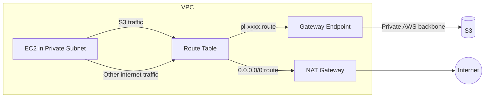

# How to Set Up VPC Gateway Endpoints for S3 and DynamoDB

Author: [nawazdhandala](https://github.com/nawazdhandala)

Tags: AWS, VPC, Networking, S3, DynamoDB

Description: Create VPC gateway endpoints to access S3 and DynamoDB privately without traversing the internet or NAT gateways, improving security and reducing costs.

---

Every time a resource in your private subnet calls S3 or DynamoDB, the traffic goes through your NAT gateway. That means you're paying NAT gateway data processing fees for every S3 download, every DynamoDB query, every backup. For data-heavy workloads, this can add hundreds or thousands of dollars to your monthly bill.

VPC gateway endpoints fix this. They create a private route between your VPC and S3 or DynamoDB that stays entirely within the AWS network. No internet gateway, no NAT gateway, no data processing charges. And they're free.

## What Are Gateway Endpoints?

Gateway endpoints are a VPC feature that adds a route to your route table pointing to the AWS service. Traffic to S3 or DynamoDB uses this route instead of going through a NAT gateway or the internet.



The route table has two paths: S3 traffic goes through the gateway endpoint (free), and everything else goes through the NAT gateway (paid).

Only two services support gateway endpoints: **Amazon S3** and **Amazon DynamoDB**. For all other AWS services, you need interface endpoints (PrivateLink). See [setting up VPC interface endpoints](https://oneuptime.com/blog/post/2026-02-12-set-up-vpc-interface-endpoints-privatelink/view) for those.

## Creating an S3 Gateway Endpoint

The setup is straightforward. Create the endpoint and associate it with your route tables:

```bash
# Create an S3 gateway endpoint
S3_ENDPOINT=$(aws ec2 create-vpc-endpoint \
  --vpc-id $VPC_ID \
  --service-name com.amazonaws.us-east-1.s3 \
  --route-table-ids rtb-private-1a rtb-private-1b rtb-private-1c \
  --tag-specifications 'ResourceType=vpc-endpoint,Tags=[{Key=Name,Value=s3-gateway-endpoint}]' \
  --query 'VpcEndpoint.VpcEndpointId' \
  --output text)

echo "S3 Endpoint: $S3_ENDPOINT"
```

That's it. AWS automatically adds a route to each specified route table. Check it:

```bash
# View the route table to see the new endpoint route
aws ec2 describe-route-tables \
  --route-table-ids rtb-private-1a \
  --query 'RouteTables[0].Routes[?GatewayId!=`local`]' \
  --output table
```

You'll see a new route with the destination as a prefix list (like `pl-63a5400a`) pointing to the VPC endpoint. The prefix list contains all the S3 IP ranges for that region. AWS keeps it updated automatically.

## Creating a DynamoDB Gateway Endpoint

Same process, different service name:

```bash
# Create a DynamoDB gateway endpoint
DDB_ENDPOINT=$(aws ec2 create-vpc-endpoint \
  --vpc-id $VPC_ID \
  --service-name com.amazonaws.us-east-1.dynamodb \
  --route-table-ids rtb-private-1a rtb-private-1b rtb-private-1c \
  --tag-specifications 'ResourceType=vpc-endpoint,Tags=[{Key=Name,Value=dynamodb-gateway-endpoint}]' \
  --query 'VpcEndpoint.VpcEndpointId' \
  --output text)

echo "DynamoDB Endpoint: $DDB_ENDPOINT"
```

## Endpoint Policies

By default, gateway endpoints allow full access to the service. You can restrict this with an endpoint policy. This is an extra layer of security - even if someone has IAM permissions to access any S3 bucket, the endpoint policy can limit which buckets are accessible from your VPC.

Restrict the S3 endpoint to specific buckets:

```bash
# Update the endpoint with a restrictive policy
aws ec2 modify-vpc-endpoint \
  --vpc-endpoint-id $S3_ENDPOINT \
  --policy-document '{
    "Version": "2012-10-17",
    "Statement": [
      {
        "Sid": "AllowSpecificBuckets",
        "Effect": "Allow",
        "Principal": "*",
        "Action": [
          "s3:GetObject",
          "s3:PutObject",
          "s3:ListBucket"
        ],
        "Resource": [
          "arn:aws:s3:::my-app-data-bucket",
          "arn:aws:s3:::my-app-data-bucket/*",
          "arn:aws:s3:::my-app-logs-bucket",
          "arn:aws:s3:::my-app-logs-bucket/*"
        ]
      }
    ]
  }'
```

For DynamoDB, restrict to specific tables:

```bash
# Restrict DynamoDB endpoint to specific tables
aws ec2 modify-vpc-endpoint \
  --vpc-endpoint-id $DDB_ENDPOINT \
  --policy-document '{
    "Version": "2012-10-17",
    "Statement": [
      {
        "Sid": "AllowSpecificTables",
        "Effect": "Allow",
        "Principal": "*",
        "Action": [
          "dynamodb:GetItem",
          "dynamodb:PutItem",
          "dynamodb:Query",
          "dynamodb:Scan",
          "dynamodb:UpdateItem",
          "dynamodb:BatchGetItem",
          "dynamodb:BatchWriteItem"
        ],
        "Resource": [
          "arn:aws:dynamodb:us-east-1:123456789012:table/users",
          "arn:aws:dynamodb:us-east-1:123456789012:table/orders"
        ]
      }
    ]
  }'
```

## S3 Bucket Policies with VPC Endpoint Conditions

You can also enforce that S3 access only comes through the VPC endpoint. This is useful for sensitive buckets:

```json
{
  "Version": "2012-10-17",
  "Statement": [
    {
      "Sid": "DenyAccessOutsideVPC",
      "Effect": "Deny",
      "Principal": "*",
      "Action": "s3:*",
      "Resource": [
        "arn:aws:s3:::sensitive-data-bucket",
        "arn:aws:s3:::sensitive-data-bucket/*"
      ],
      "Condition": {
        "StringNotEquals": {
          "aws:sourceVpce": "vpce-abc123def456"
        }
      }
    }
  ]
}
```

This bucket policy denies all access unless it comes through the specified VPC endpoint. Even users with admin IAM permissions can't access the bucket from outside the VPC.

## CloudFormation Template

Here's the complete gateway endpoint setup in CloudFormation:

```yaml
# gateway-endpoints.yaml
AWSTemplateFormatVersion: '2010-09-09'
Description: VPC Gateway Endpoints for S3 and DynamoDB

Parameters:
  VpcId:
    Type: AWS::EC2::VPC::Id
  PrivateRouteTableIds:
    Type: CommaDelimitedList
    Description: Route table IDs to associate with endpoints

Resources:
  S3Endpoint:
    Type: AWS::EC2::VPCEndpoint
    Properties:
      VpcId: !Ref VpcId
      ServiceName: !Sub com.amazonaws.${AWS::Region}.s3
      VpcEndpointType: Gateway
      RouteTableIds: !Ref PrivateRouteTableIds
      PolicyDocument:
        Version: '2012-10-17'
        Statement:
          - Sid: AllowAll
            Effect: Allow
            Principal: '*'
            Action: 's3:*'
            Resource: '*'

  DynamoDBEndpoint:
    Type: AWS::EC2::VPCEndpoint
    Properties:
      VpcId: !Ref VpcId
      ServiceName: !Sub com.amazonaws.${AWS::Region}.dynamodb
      VpcEndpointType: Gateway
      RouteTableIds: !Ref PrivateRouteTableIds
      PolicyDocument:
        Version: '2012-10-17'
        Statement:
          - Sid: AllowAll
            Effect: Allow
            Principal: '*'
            Action: 'dynamodb:*'
            Resource: '*'

Outputs:
  S3EndpointId:
    Value: !Ref S3Endpoint
  DynamoDBEndpointId:
    Value: !Ref DynamoDBEndpoint
```

Deploy with:

```bash
# Deploy the gateway endpoints
aws cloudformation deploy \
  --template-file gateway-endpoints.yaml \
  --stack-name vpc-gateway-endpoints \
  --parameter-overrides \
    VpcId=vpc-abc123 \
    PrivateRouteTableIds=rtb-111,rtb-222,rtb-333
```

## Cost Savings

Let's do the math on how much gateway endpoints save:

**Without gateway endpoint (traffic through NAT):**
- 1 TB of S3 traffic/month
- NAT data processing: 1,000 GB x $0.045 = $45/month

**With gateway endpoint:**
- 1 TB of S3 traffic/month
- Gateway endpoint cost: $0 (free!)
- Savings: $45/month

For a workload that transfers 10 TB to/from S3 monthly, that's $450/month in savings. If you have DynamoDB-heavy workloads too, the savings stack up even more.

The only cost consideration is that S3 cross-region data transfer still applies. If your VPC is in us-east-1 and you're accessing a bucket in eu-west-1, you still pay cross-region data transfer.

## Verifying the Endpoint Works

Test from an EC2 instance in a private subnet:

```bash
# Test S3 access through the gateway endpoint
aws s3 ls s3://my-bucket/ --region us-east-1

# Verify the traffic doesn't go through NAT by checking the route
# The S3 IP should resolve to an address in the prefix list
nslookup s3.us-east-1.amazonaws.com

# Check CloudWatch NAT gateway metrics - S3 traffic should drop
aws cloudwatch get-metric-statistics \
  --namespace AWS/NATGateway \
  --metric-name BytesOutToDestination \
  --dimensions Name=NatGatewayId,Value=$NAT_GW_ID \
  --start-time $(date -u -d '1 day ago' +%Y-%m-%dT%H:%M:%S) \
  --end-time $(date -u +%Y-%m-%dT%H:%M:%S) \
  --period 3600 \
  --statistics Sum
```

If everything is working, you should see a significant drop in NAT gateway data processing after enabling the gateway endpoints.

## Common Issues

**Endpoint not working for S3 buckets in other regions**: Gateway endpoints only work for the service in the same region as your VPC. If you need to access S3 in another region, traffic still goes through the NAT gateway.

**Missing route table association**: If you create the endpoint but forget to associate it with a route table, traffic still goes through NAT. Always verify the route table has the prefix list entry.

**Restrictive endpoint policies breaking things**: If you set a restrictive policy, make sure you include access to ECR, CodeDeploy, or any other service that stores artifacts in S3. A surprisingly large number of AWS services use S3 under the hood.

For VPC endpoints to other AWS services, check out [accessing AWS services privately using VPC endpoints](https://oneuptime.com/blog/post/2026-02-12-access-aws-services-privately-vpc-endpoints/view).

## Wrapping Up

Gateway endpoints for S3 and DynamoDB are one of those rare AWS features that are both free and genuinely useful. They improve security by keeping traffic off the public internet, reduce costs by bypassing NAT gateways, and require minimal configuration. If you have a VPC with private subnets, create these endpoints. There's literally no reason not to.
