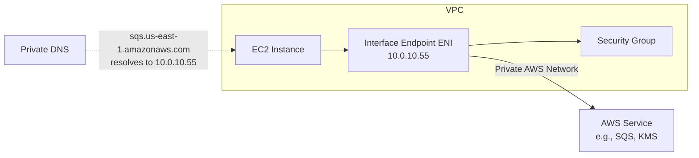

# How to Set Up VPC Interface Endpoints (PrivateLink)

Author: [nawazdhandala](https://github.com/nawazdhandala)

Tags: AWS, VPC, PrivateLink, Networking, Security

Description: Configure VPC interface endpoints using AWS PrivateLink to access AWS services privately through elastic network interfaces without internet exposure.

---

Gateway endpoints work great for S3 and DynamoDB, but what about the hundreds of other AWS services? CloudWatch, SQS, SNS, ECR, Secrets Manager, KMS - these all need interface endpoints (also known as PrivateLink endpoints) for private access.

Interface endpoints are different from gateway endpoints. Instead of adding a route to your route table, they create elastic network interfaces (ENIs) in your subnets. These ENIs get private IP addresses from your VPC, and DNS resolves the service's public endpoint to these private IPs. Your application code doesn't change at all - it still calls the same service endpoint, but traffic stays entirely within the AWS network.

## How Interface Endpoints Work



When you enable private DNS (which you should), the standard service endpoint `sqs.us-east-1.amazonaws.com` resolves to the ENI's private IP instead of the public IP. Your code uses the same SDK calls, same endpoints, same everything. The only difference is the network path.

## Creating an Interface Endpoint

Let's create an endpoint for SQS:

```bash
# Create an interface endpoint for SQS
SQS_ENDPOINT=$(aws ec2 create-vpc-endpoint \
  --vpc-id $VPC_ID \
  --vpc-endpoint-type Interface \
  --service-name com.amazonaws.us-east-1.sqs \
  --subnet-ids subnet-priv-1a subnet-priv-1b \
  --security-group-ids $ENDPOINT_SG \
  --private-dns-enabled true \
  --tag-specifications 'ResourceType=vpc-endpoint,Tags=[{Key=Name,Value=sqs-endpoint}]' \
  --query 'VpcEndpoint.VpcEndpointId' \
  --output text)

echo "SQS Endpoint: $SQS_ENDPOINT"
```

Key parameters:
- `subnet-ids`: The subnets where ENIs are created. Use multiple subnets for high availability.
- `security-group-ids`: Controls what can access the endpoint. More on this below.
- `private-dns-enabled`: Makes the service's standard DNS name resolve to the endpoint's private IP.

## Security Groups for Endpoints

Interface endpoints have security groups, unlike gateway endpoints. You control which resources can access the endpoint:

```bash
# Create a security group for the endpoint
ENDPOINT_SG=$(aws ec2 create-security-group \
  --group-name "vpc-endpoints-sg" \
  --description "Allow HTTPS from VPC to AWS service endpoints" \
  --vpc-id $VPC_ID \
  --query 'GroupId' \
  --output text)

# Allow HTTPS from the VPC CIDR
aws ec2 authorize-security-group-ingress \
  --group-id $ENDPOINT_SG \
  --protocol tcp \
  --port 443 \
  --cidr 10.0.0.0/16
```

Most AWS services communicate over HTTPS (port 443), so allowing port 443 from your VPC CIDR covers the majority of cases.

For tighter security, restrict to specific subnets:

```bash
# Only allow traffic from the application subnet
aws ec2 authorize-security-group-ingress \
  --group-id $ENDPOINT_SG \
  --protocol tcp \
  --port 443 \
  --cidr 10.0.10.0/24
```

## Common Endpoints You'll Need

Here's a list of the most commonly needed interface endpoints:

```bash
# Essential endpoints for most production workloads

# CloudWatch Logs - for log delivery
aws ec2 create-vpc-endpoint \
  --vpc-id $VPC_ID \
  --vpc-endpoint-type Interface \
  --service-name com.amazonaws.us-east-1.logs \
  --subnet-ids $SUBNET_1 $SUBNET_2 \
  --security-group-ids $ENDPOINT_SG \
  --private-dns-enabled true

# CloudWatch Monitoring - for metric publishing
aws ec2 create-vpc-endpoint \
  --vpc-id $VPC_ID \
  --vpc-endpoint-type Interface \
  --service-name com.amazonaws.us-east-1.monitoring \
  --subnet-ids $SUBNET_1 $SUBNET_2 \
  --security-group-ids $ENDPOINT_SG \
  --private-dns-enabled true

# KMS - for encryption operations
aws ec2 create-vpc-endpoint \
  --vpc-id $VPC_ID \
  --vpc-endpoint-type Interface \
  --service-name com.amazonaws.us-east-1.kms \
  --subnet-ids $SUBNET_1 $SUBNET_2 \
  --security-group-ids $ENDPOINT_SG \
  --private-dns-enabled true

# Secrets Manager - for retrieving secrets
aws ec2 create-vpc-endpoint \
  --vpc-id $VPC_ID \
  --vpc-endpoint-type Interface \
  --service-name com.amazonaws.us-east-1.secretsmanager \
  --subnet-ids $SUBNET_1 $SUBNET_2 \
  --security-group-ids $ENDPOINT_SG \
  --private-dns-enabled true

# ECR (both endpoints needed for container image pulls)
aws ec2 create-vpc-endpoint \
  --vpc-id $VPC_ID \
  --vpc-endpoint-type Interface \
  --service-name com.amazonaws.us-east-1.ecr.api \
  --subnet-ids $SUBNET_1 $SUBNET_2 \
  --security-group-ids $ENDPOINT_SG \
  --private-dns-enabled true

aws ec2 create-vpc-endpoint \
  --vpc-id $VPC_ID \
  --vpc-endpoint-type Interface \
  --service-name com.amazonaws.us-east-1.ecr.dkr \
  --subnet-ids $SUBNET_1 $SUBNET_2 \
  --security-group-ids $ENDPOINT_SG \
  --private-dns-enabled true

# STS - for assuming IAM roles
aws ec2 create-vpc-endpoint \
  --vpc-id $VPC_ID \
  --vpc-endpoint-type Interface \
  --service-name com.amazonaws.us-east-1.sts \
  --subnet-ids $SUBNET_1 $SUBNET_2 \
  --security-group-ids $ENDPOINT_SG \
  --private-dns-enabled true
```

For ECS/Fargate tasks, you typically need: ECR (api + dkr), S3 (gateway), CloudWatch Logs, STS, and Secrets Manager.

## CloudFormation Template

Here's a reusable template for creating multiple endpoints:

```yaml
# vpc-interface-endpoints.yaml
AWSTemplateFormatVersion: '2010-09-09'
Description: VPC Interface Endpoints for private AWS service access

Parameters:
  VpcId:
    Type: AWS::EC2::VPC::Id
  SubnetIds:
    Type: List<AWS::EC2::Subnet::Id>
  VpcCidr:
    Type: String
    Default: 10.0.0.0/16

Resources:
  # Shared security group for all endpoints
  EndpointSecurityGroup:
    Type: AWS::EC2::SecurityGroup
    Properties:
      GroupDescription: VPC Endpoint Security Group
      VpcId: !Ref VpcId
      SecurityGroupIngress:
        - IpProtocol: tcp
          FromPort: 443
          ToPort: 443
          CidrIp: !Ref VpcCidr
      Tags:
        - Key: Name
          Value: vpc-endpoints-sg

  # SQS Endpoint
  SQSEndpoint:
    Type: AWS::EC2::VPCEndpoint
    Properties:
      VpcId: !Ref VpcId
      VpcEndpointType: Interface
      ServiceName: !Sub com.amazonaws.${AWS::Region}.sqs
      SubnetIds: !Ref SubnetIds
      SecurityGroupIds:
        - !Ref EndpointSecurityGroup
      PrivateDnsEnabled: true

  # CloudWatch Logs Endpoint
  CloudWatchLogsEndpoint:
    Type: AWS::EC2::VPCEndpoint
    Properties:
      VpcId: !Ref VpcId
      VpcEndpointType: Interface
      ServiceName: !Sub com.amazonaws.${AWS::Region}.logs
      SubnetIds: !Ref SubnetIds
      SecurityGroupIds:
        - !Ref EndpointSecurityGroup
      PrivateDnsEnabled: true

  # KMS Endpoint
  KMSEndpoint:
    Type: AWS::EC2::VPCEndpoint
    Properties:
      VpcId: !Ref VpcId
      VpcEndpointType: Interface
      ServiceName: !Sub com.amazonaws.${AWS::Region}.kms
      SubnetIds: !Ref SubnetIds
      SecurityGroupIds:
        - !Ref EndpointSecurityGroup
      PrivateDnsEnabled: true

  # Secrets Manager Endpoint
  SecretsManagerEndpoint:
    Type: AWS::EC2::VPCEndpoint
    Properties:
      VpcId: !Ref VpcId
      VpcEndpointType: Interface
      ServiceName: !Sub com.amazonaws.${AWS::Region}.secretsmanager
      SubnetIds: !Ref SubnetIds
      SecurityGroupIds:
        - !Ref EndpointSecurityGroup
      PrivateDnsEnabled: true

  # ECR API Endpoint
  ECRApiEndpoint:
    Type: AWS::EC2::VPCEndpoint
    Properties:
      VpcId: !Ref VpcId
      VpcEndpointType: Interface
      ServiceName: !Sub com.amazonaws.${AWS::Region}.ecr.api
      SubnetIds: !Ref SubnetIds
      SecurityGroupIds:
        - !Ref EndpointSecurityGroup
      PrivateDnsEnabled: true

  # ECR Docker Endpoint
  ECRDkrEndpoint:
    Type: AWS::EC2::VPCEndpoint
    Properties:
      VpcId: !Ref VpcId
      VpcEndpointType: Interface
      ServiceName: !Sub com.amazonaws.${AWS::Region}.ecr.dkr
      SubnetIds: !Ref SubnetIds
      SecurityGroupIds:
        - !Ref EndpointSecurityGroup
      PrivateDnsEnabled: true

  # STS Endpoint
  STSEndpoint:
    Type: AWS::EC2::VPCEndpoint
    Properties:
      VpcId: !Ref VpcId
      VpcEndpointType: Interface
      ServiceName: !Sub com.amazonaws.${AWS::Region}.sts
      SubnetIds: !Ref SubnetIds
      SecurityGroupIds:
        - !Ref EndpointSecurityGroup
      PrivateDnsEnabled: true
```

## Endpoint Policies

Like gateway endpoints, interface endpoints support policies:

```bash
# Restrict the Secrets Manager endpoint to specific secrets
aws ec2 modify-vpc-endpoint \
  --vpc-endpoint-id $SM_ENDPOINT \
  --policy-document '{
    "Version": "2012-10-17",
    "Statement": [
      {
        "Effect": "Allow",
        "Principal": "*",
        "Action": [
          "secretsmanager:GetSecretValue"
        ],
        "Resource": [
          "arn:aws:secretsmanager:us-east-1:123456789012:secret:prod/*"
        ]
      }
    ]
  }'
```

## Cost Considerations

Interface endpoints aren't free like gateway endpoints:

- **Per endpoint per AZ**: $0.01/hour (~$7.20/month)
- **Data processing**: $0.01/GB

With two AZs, each endpoint costs about $14.40/month. Seven endpoints across two AZs: roughly $100/month.

Compare this to NAT gateway costs:
- NAT gateway: $0.045/hour + $0.045/GB data processing
- Interface endpoints: $0.01/hour/AZ + $0.01/GB

For high-traffic services, endpoints are significantly cheaper than NAT gateway. But for low-traffic services, the hourly fee might not be worth it. Calculate your specific usage to decide which services warrant endpoints.

## Verifying Endpoints Work

```bash
# Check DNS resolution - should resolve to private IPs
nslookup sqs.us-east-1.amazonaws.com

# Expected output with private DNS enabled:
# Address: 10.0.10.55

# Test the service
aws sqs list-queues --region us-east-1
```

If DNS still resolves to public IPs, verify that private DNS is enabled and your VPC has DNS hostnames and DNS support enabled.

For a broader overview of private service access, see [accessing AWS services privately using VPC endpoints](https://oneuptime.com/blog/post/2026-02-12-access-aws-services-privately-vpc-endpoints/view). For S3 and DynamoDB specifically, [gateway endpoints](https://oneuptime.com/blog/post/2026-02-12-set-up-vpc-gateway-endpoints-s3-dynamodb/view) are the better option since they're free.

## Wrapping Up

Interface endpoints bring AWS services inside your VPC network boundary. The setup is straightforward - create the endpoint, add a security group, enable private DNS. The biggest decision is which endpoints to create, since each one has a monthly cost. Start with the services your application actively uses, and add more as needed. For security-focused environments where private subnets have no NAT gateway at all, these endpoints are the only way your resources can reach AWS services.
