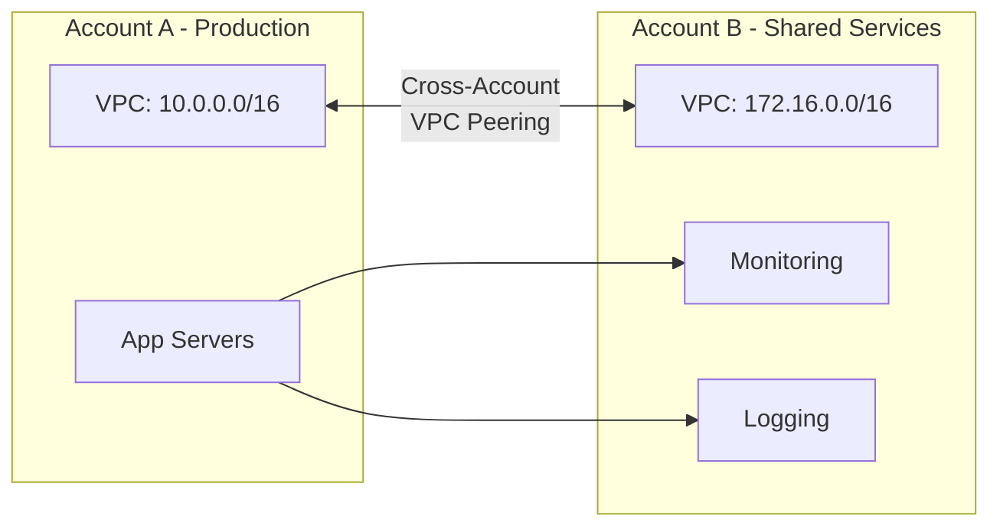

# How to Set Up VPC Peering Across AWS Accounts

Author: [nawazdhandala](https://github.com/nawazdhandala)

Tags: AWS, VPC, Networking, VPC Peering, Multi-Account

Description: Set up VPC peering between VPCs in different AWS accounts for secure cross-account communication with step-by-step instructions and best practices.

---

As organizations grow on AWS, they typically split workloads across multiple accounts. You might have one account for production, another for staging, a shared services account, and a security account. These accounts need to communicate, and VPC peering is the most straightforward way to make that happen.

Cross-account VPC peering works almost identically to same-account peering, with one important difference: the accepter account must explicitly accept the peering request. This is a security feature - you can't just peer into someone else's VPC without their permission.

## The Setup

Let's say you have two accounts:

- **Account A** (111111111111): Production VPC - `10.0.0.0/16`
- **Account B** (222222222222): Shared Services VPC - `172.16.0.0/16`

You want production instances to access monitoring and logging tools in the shared services account.



## Step 1: Create the Peering Request (Account A)

From Account A, create the peering connection request. You'll need Account B's account ID and VPC ID:

```bash
# Run this in Account A (requester)
PEERING_ID=$(aws ec2 create-vpc-peering-connection \
  --vpc-id vpc-prod-aaa \
  --peer-owner-id 222222222222 \
  --peer-vpc-id vpc-shared-bbb \
  --peer-region us-east-1 \
  --tag-specifications 'ResourceType=vpc-peering-connection,Tags=[{Key=Name,Value=prod-to-shared-services}]' \
  --query 'VpcPeeringConnection.VpcPeeringConnectionId' \
  --output text)

echo "Peering request created: $PEERING_ID"
```

The `--peer-owner-id` flag specifies the other account. The `--peer-region` flag is needed even if both VPCs are in the same region - it's good practice to always include it.

The peering connection is now in `pending-acceptance` status.

## Step 2: Accept the Peering Request (Account B)

Switch to Account B and accept the request. You'll need the peering connection ID from Step 1:

```bash
# Run this in Account B (accepter)
# First, find the pending peering request
aws ec2 describe-vpc-peering-connections \
  --filters "Name=status-code,Values=pending-acceptance" \
  --query 'VpcPeeringConnections[].{ID:VpcPeeringConnectionId,RequesterVpc:RequesterVpcInfo.VpcId,RequesterAccount:RequesterVpcInfo.OwnerId}' \
  --output table
```

Verify it's from the expected account and VPC, then accept:

```bash
# Accept the peering connection
aws ec2 accept-vpc-peering-connection \
  --vpc-peering-connection-id $PEERING_ID

# Verify it's active
aws ec2 describe-vpc-peering-connections \
  --vpc-peering-connection-ids $PEERING_ID \
  --query 'VpcPeeringConnections[0].Status'
```

## Step 3: Update Route Tables (Both Accounts)

Both accounts need routes pointing to the peering connection. This is where many people trip up - you need to update routes on both sides.

```bash
# In Account A: route traffic to shared services VPC through peering
aws ec2 create-route \
  --route-table-id rtb-prod-private \
  --destination-cidr-block 172.16.0.0/16 \
  --vpc-peering-connection-id $PEERING_ID

# Add to all relevant route tables in Account A
for RT in rtb-prod-private-1a rtb-prod-private-1b rtb-prod-private-1c; do
  aws ec2 create-route \
    --route-table-id $RT \
    --destination-cidr-block 172.16.0.0/16 \
    --vpc-peering-connection-id $PEERING_ID
done
```

```bash
# In Account B: route traffic to production VPC through peering
aws ec2 create-route \
  --route-table-id rtb-shared-private \
  --destination-cidr-block 10.0.0.0/16 \
  --vpc-peering-connection-id $PEERING_ID
```

## Step 4: Configure Security Groups

For cross-account peering, you can reference security groups from the other account using the account ID prefix:

```bash
# In Account B: allow monitoring traffic from Account A's app servers
aws ec2 authorize-security-group-ingress \
  --group-id sg-monitoring-bbb \
  --ip-permissions '[{
    "IpProtocol": "tcp",
    "FromPort": 9090,
    "ToPort": 9090,
    "UserIdGroupPairs": [{
      "GroupId": "sg-app-aaa",
      "UserId": "111111111111"
    }]
  }]'
```

This is more secure than CIDR-based rules because it only allows traffic from specific security groups, not entire subnet ranges. However, cross-account security group references only work for peering within the same region.

If you prefer CIDR-based rules (simpler but less precise):

```bash
# Allow monitoring traffic from Account A's private subnets
aws ec2 authorize-security-group-ingress \
  --group-id sg-monitoring-bbb \
  --protocol tcp \
  --port 9090 \
  --cidr 10.0.10.0/24
```

## Step 5: Enable DNS Resolution

To resolve private DNS names across the peering connection, both sides need to enable it:

```bash
# Account A enables DNS resolution for this peering connection
aws ec2 modify-vpc-peering-connection-options \
  --vpc-peering-connection-id $PEERING_ID \
  --requester-peering-connection-options '{"AllowDnsResolutionFromRemoteVpc": true}'

# Account B enables DNS resolution
aws ec2 modify-vpc-peering-connection-options \
  --vpc-peering-connection-id $PEERING_ID \
  --accepter-peering-connection-options '{"AllowDnsResolutionFromRemoteVpc": true}'
```

## Automating with CloudFormation

Since the peering involves two accounts, you'll need stacks in both. The requester stack creates the peering connection, and the accepter stack accepts it and creates routes.

Requester stack (Account A):

```yaml
# peering-requester.yaml - Deploy in Account A
Parameters:
  PeerAccountId:
    Type: String
  PeerVpcId:
    Type: String
  PeerVpcCidr:
    Type: String
  LocalVpcId:
    Type: AWS::EC2::VPC::Id
  LocalPrivateRouteTable:
    Type: String

Resources:
  PeeringConnection:
    Type: AWS::EC2::VPCPeeringConnection
    Properties:
      VpcId: !Ref LocalVpcId
      PeerOwnerId: !Ref PeerAccountId
      PeerVpcId: !Ref PeerVpcId
      Tags:
        - Key: Name
          Value: cross-account-peering

  RouteToSharedServices:
    Type: AWS::EC2::Route
    Properties:
      RouteTableId: !Ref LocalPrivateRouteTable
      DestinationCidrBlock: !Ref PeerVpcCidr
      VpcPeeringConnectionId: !Ref PeeringConnection

Outputs:
  PeeringConnectionId:
    Value: !Ref PeeringConnection
    Description: Share this ID with the accepter account
```

The accepter account needs to accept and add routes. You can use a Lambda-backed custom resource or handle acceptance manually, since CloudFormation doesn't natively support accepting cross-account peering.

## Using AWS Organizations

If both accounts are in the same AWS Organization, you can use resource sharing to simplify the process. But for VPC peering specifically, the workflow is the same - one side requests, the other accepts.

Where Organizations helps is with automation. You can use a centralized pipeline that assumes roles in both accounts:

```bash
# Assume role in Account A and create peering request
CREDS_A=$(aws sts assume-role \
  --role-arn arn:aws:iam::111111111111:role/NetworkAdmin \
  --role-session-name peering-setup \
  --query 'Credentials')

# Assume role in Account B and accept peering
CREDS_B=$(aws sts assume-role \
  --role-arn arn:aws:iam::222222222222:role/NetworkAdmin \
  --role-session-name peering-accept \
  --query 'Credentials')
```

## Security Considerations

Cross-account peering comes with responsibilities:

- **Principle of least privilege**: Don't route entire VPC CIDRs if you only need access to specific subnets. Use more specific routes like `172.16.10.0/24` instead of `172.16.0.0/16`.
- **NACLs as a safety net**: Add NACL rules to explicitly deny traffic that shouldn't cross the peering connection.
- **Audit the peering**: Regularly review peering connections and remove ones that are no longer needed.
- **VPC Flow Logs**: Enable flow logs on both VPCs to monitor cross-account traffic.

```bash
# Enable VPC flow logs to monitor peering traffic
aws ec2 create-flow-logs \
  --resource-type VPC \
  --resource-ids vpc-prod-aaa \
  --traffic-type ALL \
  --log-destination-type cloud-watch-logs \
  --log-group-name /vpc/flow-logs/production
```

## When Peering Isn't Enough

Cross-account peering works well for connecting a few accounts. But when you have ten or more accounts that all need to talk to each other, the number of peering connections explodes. Consider [using a transit gateway for multi-VPC connectivity](https://oneuptime.com/blog/post/aws-transit-gateway-multi-vpc-connectivity/view) and [sharing it across accounts](https://oneuptime.com/blog/post/share-transit-gateway-across-aws-accounts/view) instead.

For cross-region peering, see [setting up VPC peering across AWS regions](https://oneuptime.com/blog/post/set-up-vpc-peering-across-aws-regions/view).

## Wrapping Up

Cross-account VPC peering is a fundamental building block for multi-account AWS architectures. The process is request, accept, route, secure. The main thing to remember is that everything needs to happen on both sides - routes in both accounts, security groups on both ends, DNS resolution enabled in both directions. Miss one side, and traffic won't flow.
