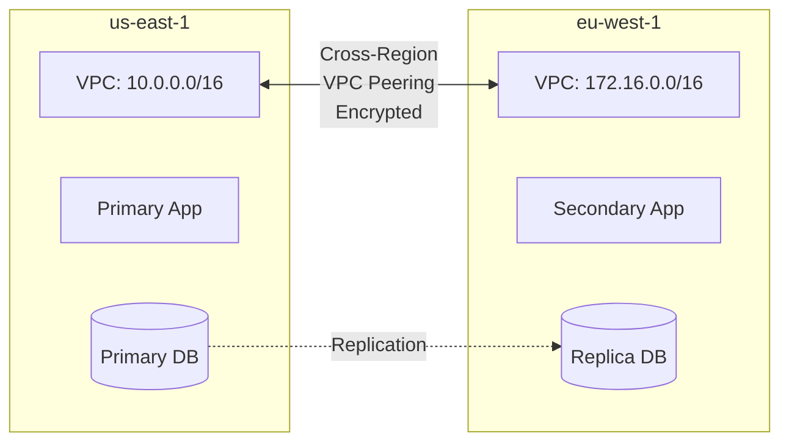

# How to Set Up VPC Peering Across AWS Regions

Author: [nawazdhandala](https://github.com/nawazdhandala)

Tags: AWS, VPC, Networking, VPC Peering

Description: Configure inter-region VPC peering to connect VPCs across different AWS regions with private networking for disaster recovery and global deployments.

---

Inter-region VPC peering lets you connect VPCs in different AWS regions over AWS's private backbone network. Your traffic between us-east-1 and eu-west-1 never touches the public internet. This is essential for global applications, disaster recovery setups, and organizations that need data replication across regions.

The setup is similar to same-region peering, but there are some differences around DNS resolution, encryption, and latency that you need to understand before diving in.

## Why Cross-Region Peering?

The most common scenarios:

- **Disaster recovery**: Replicate databases from your primary region to a DR region
- **Global applications**: Let users connect to the nearest region while keeping backend services connected
- **Data sovereignty**: Keep user data in specific regions while sharing common services
- **Multi-region deployments**: Deploy the same application in multiple regions for lower latency

Cross-region traffic on VPC peering is automatically encrypted with AES-256. This happens transparently - you don't need to configure anything.

## The Architecture



## Step 1: Create the Peering Connection

The requester specifies the peer region explicitly:

```bash
# Run in us-east-1 (requester region)
PEERING_ID=$(aws ec2 create-vpc-peering-connection \
  --vpc-id vpc-us-east-aaa \
  --peer-vpc-id vpc-eu-west-bbb \
  --peer-region eu-west-1 \
  --tag-specifications 'ResourceType=vpc-peering-connection,Tags=[{Key=Name,Value=us-to-eu-peering}]' \
  --query 'VpcPeeringConnection.VpcPeeringConnectionId' \
  --output text \
  --region us-east-1)

echo "Cross-region peering: $PEERING_ID"
```

If the VPCs are in different accounts, add `--peer-owner-id` as well:

```bash
# Cross-region AND cross-account
PEERING_ID=$(aws ec2 create-vpc-peering-connection \
  --vpc-id vpc-us-east-aaa \
  --peer-vpc-id vpc-eu-west-bbb \
  --peer-owner-id 222222222222 \
  --peer-region eu-west-1 \
  --query 'VpcPeeringConnection.VpcPeeringConnectionId' \
  --output text \
  --region us-east-1)
```

## Step 2: Accept in the Peer Region

Switch to the peer region and accept the connection:

```bash
# Run in eu-west-1 (accepter region)
# First, find the pending request
aws ec2 describe-vpc-peering-connections \
  --filters "Name=status-code,Values=pending-acceptance" \
  --region eu-west-1 \
  --query 'VpcPeeringConnections[].{ID:VpcPeeringConnectionId,RequesterRegion:RequesterVpcInfo.Region,RequesterCidr:RequesterVpcInfo.CidrBlock}' \
  --output table
```

```bash
# Accept the peering connection in eu-west-1
aws ec2 accept-vpc-peering-connection \
  --vpc-peering-connection-id $PEERING_ID \
  --region eu-west-1
```

## Step 3: Add Routes in Both Regions

Each region needs routes pointing to the peering connection. Remember to update all relevant route tables:

```bash
# In us-east-1: route EU traffic through the peering connection
aws ec2 create-route \
  --route-table-id rtb-us-private \
  --destination-cidr-block 172.16.0.0/16 \
  --vpc-peering-connection-id $PEERING_ID \
  --region us-east-1

# In eu-west-1: route US traffic through the peering connection
aws ec2 create-route \
  --route-table-id rtb-eu-private \
  --destination-cidr-block 10.0.0.0/16 \
  --vpc-peering-connection-id $PEERING_ID \
  --region eu-west-1
```

If you have multiple route tables (which you should for production), add the route to each one:

```bash
# Add peering routes to all private route tables in us-east-1
for RT in rtb-us-priv-1a rtb-us-priv-1b rtb-us-priv-1c; do
  aws ec2 create-route \
    --route-table-id $RT \
    --destination-cidr-block 172.16.0.0/16 \
    --vpc-peering-connection-id $PEERING_ID \
    --region us-east-1
done
```

## Step 4: Configure Security Groups

For cross-region peering, you cannot reference security groups from the other region. You must use CIDR-based rules:

```bash
# In eu-west-1: allow database replication traffic from us-east-1
aws ec2 authorize-security-group-ingress \
  --group-id sg-eu-db \
  --protocol tcp \
  --port 5432 \
  --cidr 10.0.10.0/24 \
  --region eu-west-1

# In us-east-1: allow app traffic from eu-west-1
aws ec2 authorize-security-group-ingress \
  --group-id sg-us-app \
  --protocol tcp \
  --port 8080 \
  --cidr 172.16.10.0/24 \
  --region us-east-1
```

This is different from same-region peering, where you can reference security groups directly. For cross-region, always use CIDR blocks.

## Step 5: Enable DNS Resolution

DNS resolution across regions requires explicit enablement:

```bash
# Enable DNS resolution for the peering connection
# Run in us-east-1
aws ec2 modify-vpc-peering-connection-options \
  --vpc-peering-connection-id $PEERING_ID \
  --requester-peering-connection-options '{"AllowDnsResolutionFromRemoteVpc": true}' \
  --region us-east-1

# Run in eu-west-1
aws ec2 modify-vpc-peering-connection-options \
  --vpc-peering-connection-id $PEERING_ID \
  --accepter-peering-connection-options '{"AllowDnsResolutionFromRemoteVpc": true}' \
  --region eu-west-1
```

With DNS resolution enabled, private hostnames in one region resolve to private IPs when queried from the peered region. This is particularly useful for RDS endpoints.

## Latency Considerations

Cross-region peering latency depends on the physical distance between regions:

```
Route                          Typical Latency
us-east-1 to us-west-2        ~60-70ms
us-east-1 to eu-west-1        ~70-90ms
us-east-1 to ap-southeast-1   ~200-250ms
eu-west-1 to ap-northeast-1   ~230-280ms
```

This latency is consistent and lower than routing over the public internet, but it's still significant for latency-sensitive operations. Don't put a synchronous database call across regions in your hot path. Use cross-region peering for asynchronous replication, batch data transfers, and management traffic.

## Data Transfer Costs

Cross-region data transfer is more expensive than same-region:

```
Same-region peering:   $0.01/GB (each direction)
Cross-region peering:  $0.02/GB (varies by region pair)
```

For high-volume data replication, these costs add up. A 1 TB daily replication job would cost roughly $600/month in cross-region transfer fees. Plan accordingly and compress data where possible.

## CloudFormation for Cross-Region Peering

CloudFormation stacks are region-specific, so you need a stack in each region. Here's the requester stack:

```yaml
# requester-stack.yaml - Deploy in us-east-1
Parameters:
  PeerRegion:
    Type: String
    Default: eu-west-1
  PeerVpcId:
    Type: String
  PeerVpcCidr:
    Type: String
    Default: 172.16.0.0/16

Resources:
  CrossRegionPeering:
    Type: AWS::EC2::VPCPeeringConnection
    Properties:
      VpcId: !Ref LocalVPC
      PeerVpcId: !Ref PeerVpcId
      PeerRegion: !Ref PeerRegion
      Tags:
        - Key: Name
          Value: cross-region-peering

  RouteToRemoteRegion:
    Type: AWS::EC2::Route
    Properties:
      RouteTableId: !Ref PrivateRouteTable
      DestinationCidrBlock: !Ref PeerVpcCidr
      VpcPeeringConnectionId: !Ref CrossRegionPeering

Outputs:
  PeeringConnectionId:
    Value: !Ref CrossRegionPeering
```

The accepter stack in eu-west-1 would accept the connection and create the return routes. Since CloudFormation can't natively accept cross-region peering, you'll typically use a Lambda-backed custom resource for the acceptance step.

## Monitoring Cross-Region Peering

Set up CloudWatch metrics to track peering health:

```bash
# Check peering connection status
aws ec2 describe-vpc-peering-connections \
  --vpc-peering-connection-ids $PEERING_ID \
  --region us-east-1 \
  --query 'VpcPeeringConnections[0].{Status:Status.Code,Message:Status.Message}'
```

Enable VPC Flow Logs in both regions to monitor cross-region traffic:

```bash
# Enable flow logs in us-east-1
aws ec2 create-flow-logs \
  --resource-type VPC \
  --resource-ids vpc-us-east-aaa \
  --traffic-type ALL \
  --log-destination-type s3 \
  --log-destination arn:aws:s3:::flow-logs-bucket/us-east-1/ \
  --region us-east-1
```

## Alternatives to Cross-Region Peering

For more complex multi-region topologies, consider:

- **Transit Gateway peering**: Connect transit gateways across regions for hub-and-spoke connectivity. See [configuring transit gateway route tables](https://oneuptime.com/blog/post/configure-transit-gateway-route-tables/view).
- **AWS Global Accelerator**: For front-end traffic routing to the nearest region.
- **AWS PrivateLink**: For exposing specific services across regions without full VPC peering.

## Wrapping Up

Cross-region VPC peering gives you private, encrypted connectivity between any two AWS regions. The setup follows the same pattern as same-region peering - create, accept, route, secure - but with the added considerations of latency, data transfer costs, and CIDR-only security group rules. Plan your cross-region architecture with these constraints in mind, and you'll have a solid foundation for global and DR deployments.
