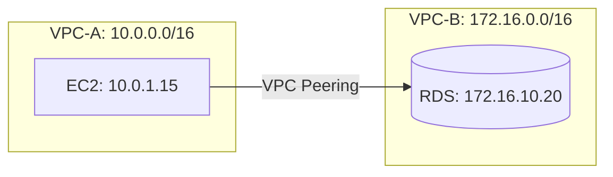

# How to Set Up VPC Peering Between Two VPCs

Author: [nawazdhandala](https://github.com/nawazdhandala)

Tags: AWS, VPC, Networking, VPC Peering

Description: Learn how to connect two VPCs using VPC peering for private, low-latency communication between resources in separate virtual networks.

---

VPC peering connects two VPCs so they can communicate using private IP addresses. Traffic between peered VPCs stays on the AWS backbone network - it never touches the public internet. This means lower latency, better security, and no bandwidth bottlenecks.

The most common use case is connecting a production VPC to a shared services VPC (containing things like CI/CD tools, monitoring, or centralized logging). But peering works for any scenario where two VPCs need to talk to each other privately.

## How VPC Peering Works

A VPC peering connection is a one-to-one networking link between two VPCs. It's not transitive - if VPC-A peers with VPC-B, and VPC-B peers with VPC-C, VPC-A cannot automatically reach VPC-C through VPC-B. You'd need a separate peering connection between A and C, or use a transit gateway instead.



Key constraints:
- CIDR blocks must not overlap
- Only one peering connection between any two VPCs
- Not transitive (A-B + B-C does not give A-C)
- Works within the same account, across accounts, and across regions

## Prerequisites

Before creating a peering connection, verify that your VPCs have non-overlapping CIDR blocks:

```bash
# Check CIDR blocks for both VPCs
aws ec2 describe-vpcs \
  --vpc-ids vpc-aaa111 vpc-bbb222 \
  --query 'Vpcs[].{VpcId:VpcId, CidrBlock:CidrBlock}' \
  --output table
```

If they overlap, you can't peer them. This is why CIDR planning matters when you first create VPCs. There's no workaround for overlapping addresses.

## Step 1: Create the Peering Connection

The requester creates the peering connection. If both VPCs are in the same account, the process is simpler:

```bash
# Create the peering connection request
PEERING_ID=$(aws ec2 create-vpc-peering-connection \
  --vpc-id vpc-aaa111 \
  --peer-vpc-id vpc-bbb222 \
  --tag-specifications 'ResourceType=vpc-peering-connection,Tags=[{Key=Name,Value=prod-to-shared-services}]' \
  --query 'VpcPeeringConnection.VpcPeeringConnectionId' \
  --output text)

echo "Peering connection: $PEERING_ID"
```

## Step 2: Accept the Peering Connection

Even within the same account, the peering connection must be accepted:

```bash
# Accept the peering connection
aws ec2 accept-vpc-peering-connection \
  --vpc-peering-connection-id $PEERING_ID
```

The connection status changes from `pending-acceptance` to `active`. You can verify:

```bash
# Check the peering connection status
aws ec2 describe-vpc-peering-connections \
  --vpc-peering-connection-ids $PEERING_ID \
  --query 'VpcPeeringConnections[0].Status'
```

## Step 3: Update Route Tables

This is the step people forget. The peering connection exists, but neither VPC knows to route traffic through it. You need to add routes in both directions:

```bash
# In VPC-A's route table: route VPC-B traffic through the peering connection
aws ec2 create-route \
  --route-table-id rtb-aaa111 \
  --destination-cidr-block 172.16.0.0/16 \
  --vpc-peering-connection-id $PEERING_ID

# In VPC-B's route table: route VPC-A traffic through the peering connection
aws ec2 create-route \
  --route-table-id rtb-bbb222 \
  --destination-cidr-block 10.0.0.0/16 \
  --vpc-peering-connection-id $PEERING_ID
```

If you have multiple route tables (public, private, data tier), add the route to every route table that needs cross-VPC access:

```bash
# Add peering routes to all private route tables in VPC-A
for RT in rtb-priv-a1 rtb-priv-a2 rtb-priv-a3; do
  aws ec2 create-route \
    --route-table-id $RT \
    --destination-cidr-block 172.16.0.0/16 \
    --vpc-peering-connection-id $PEERING_ID
done
```

## Step 4: Update Security Groups

Routes get the packets to the right VPC, but security groups decide whether they're allowed in. You can reference security groups across peered VPCs using the VPC ID prefix:

```bash
# Allow traffic from VPC-A's app security group to VPC-B's database
aws ec2 authorize-security-group-ingress \
  --group-id sg-bbb-db \
  --protocol tcp \
  --port 5432 \
  --source-group sg-aaa-app \
  --group-owner 123456789012
```

Or use CIDR-based rules if cross-referencing security groups is too complex:

```bash
# Allow PostgreSQL from VPC-A's private subnet CIDR
aws ec2 authorize-security-group-ingress \
  --group-id sg-bbb-db \
  --protocol tcp \
  --port 5432 \
  --cidr 10.0.10.0/24
```

## Step 5: Update DNS Resolution

By default, DNS queries from one VPC won't resolve private DNS names in the other VPC. Enable DNS resolution for the peering connection:

```bash
# Enable DNS resolution from VPC-A to VPC-B
aws ec2 modify-vpc-peering-connection-options \
  --vpc-peering-connection-id $PEERING_ID \
  --requester-peering-connection-options '{"AllowDnsResolutionFromRemoteVpc":true}'

# Enable DNS resolution from VPC-B to VPC-A
aws ec2 modify-vpc-peering-connection-options \
  --vpc-peering-connection-id $PEERING_ID \
  --accepter-peering-connection-options '{"AllowDnsResolutionFromRemoteVpc":true}'
```

Now resources in VPC-A can resolve RDS endpoints and other private DNS names in VPC-B.

## CloudFormation Template

Here's the peering setup as infrastructure as code:

```yaml
# vpc-peering.yaml
Parameters:
  VpcAId:
    Type: AWS::EC2::VPC::Id
  VpcBId:
    Type: AWS::EC2::VPC::Id
  VpcBCidr:
    Type: String
    Default: 172.16.0.0/16
  VpcACidr:
    Type: String
    Default: 10.0.0.0/16
  PrivateRouteTableA:
    Type: String
  PrivateRouteTableB:
    Type: String

Resources:
  # Create the peering connection
  VPCPeeringConnection:
    Type: AWS::EC2::VPCPeeringConnection
    Properties:
      VpcId: !Ref VpcAId
      PeerVpcId: !Ref VpcBId
      Tags:
        - Key: Name
          Value: vpc-a-to-vpc-b

  # Route from VPC-A to VPC-B
  RouteAToB:
    Type: AWS::EC2::Route
    Properties:
      RouteTableId: !Ref PrivateRouteTableA
      DestinationCidrBlock: !Ref VpcBCidr
      VpcPeeringConnectionId: !Ref VPCPeeringConnection

  # Route from VPC-B to VPC-A
  RouteBToA:
    Type: AWS::EC2::Route
    Properties:
      RouteTableId: !Ref PrivateRouteTableB
      DestinationCidrBlock: !Ref VpcACidr
      VpcPeeringConnectionId: !Ref VPCPeeringConnection

Outputs:
  PeeringConnectionId:
    Value: !Ref VPCPeeringConnection
```

## Troubleshooting

When peering doesn't work, check these things in order:

1. **Peering connection status**: Must be `active`
2. **Route tables**: Both VPCs must have routes pointing to the peering connection
3. **Security groups**: Must allow the specific traffic
4. **NACLs**: Must allow both inbound and outbound in both directions
5. **CIDR overlap**: Overlapping CIDRs cause silent routing failures

```bash
# Quick diagnostic: check peering status and routes
aws ec2 describe-vpc-peering-connections \
  --vpc-peering-connection-ids $PEERING_ID \
  --query 'VpcPeeringConnections[0].{Status:Status.Code,RequesterCidr:RequesterVpcInfo.CidrBlock,AccepterCidr:AccepterVpcInfo.CidrBlock}'

# Check routes in a specific route table
aws ec2 describe-route-tables \
  --route-table-ids rtb-aaa111 \
  --query 'RouteTables[0].Routes[?VpcPeeringConnectionId!=`null`]'
```

## Limitations to Know

VPC peering works great for a few connections, but it doesn't scale well. With N VPCs, you need N*(N-1)/2 peering connections for full mesh connectivity. Ten VPCs means 45 peering connections. That's a management nightmare.

If you have more than a handful of VPCs, consider using a [transit gateway for multi-VPC connectivity](https://oneuptime.com/blog/post/aws-transit-gateway-multi-vpc-connectivity/view) instead. It acts as a central hub and reduces the number of connections from O(n^2) to O(n).

For cross-account peering, see [setting up VPC peering across AWS accounts](https://oneuptime.com/blog/post/set-up-vpc-peering-across-aws-accounts/view).

## Wrapping Up

VPC peering is the simplest way to connect two VPCs. Create the connection, accept it, add routes, update security groups, and enable DNS resolution. Five steps, and your VPCs can communicate privately. Just watch out for CIDR overlap and remember that peering isn't transitive. For more complex topologies, transit gateway is the better tool.
