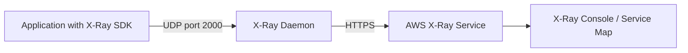

# How to Set Up X-Ray Daemon on EC2 for Tracing

Author: [nawazdhandala](https://github.com/nawazdhandala)

Tags: AWS, X-Ray, EC2, Tracing, Distributed Tracing, Observability

Description: Install and configure the AWS X-Ray daemon on EC2 instances to collect and forward distributed traces from your applications.

---

When your application runs on EC2 instances, you need the X-Ray daemon running alongside it to collect trace segments and relay them to the AWS X-Ray service. The daemon listens for UDP traffic on port 2000, buffers the trace data, and sends it in batches to the X-Ray API. Without it, your application's X-Ray SDK has nowhere to send its trace data.

This guide walks through installing the X-Ray daemon on EC2, configuring it properly, setting up the right IAM permissions, and verifying that traces are flowing.

## How the X-Ray Daemon Works

Your application uses the X-Ray SDK to instrument HTTP calls, database queries, and other operations. The SDK generates trace segments and sends them as UDP packets to the X-Ray daemon running on the same host. The daemon collects these segments, batches them, and forwards them to the X-Ray API over HTTPS.



The daemon runs as a background process and is designed to be lightweight. It typically uses less than 1% CPU and a few dozen MB of memory.

## Prerequisites

- An EC2 instance running Amazon Linux 2, Ubuntu, or another supported Linux distribution
- An IAM role attached to the EC2 instance with X-Ray permissions
- An application instrumented with the X-Ray SDK (or OpenTelemetry with X-Ray exporter)

## Step 1: Configure the IAM Role

The X-Ray daemon needs permission to call the X-Ray API. The simplest approach is to attach the `AWSXRayDaemonWriteAccess` managed policy to your EC2 instance role.

```bash
# Attach the X-Ray write policy to your EC2 instance role
aws iam attach-role-policy \
  --role-name MyEC2InstanceRole \
  --policy-arn arn:aws:iam::aws:policy/AWSXRayDaemonWriteAccess
```

This managed policy grants the following permissions:

```json
// AWSXRayDaemonWriteAccess policy document
{
  "Version": "2012-10-17",
  "Statement": [
    {
      "Effect": "Allow",
      "Action": [
        "xray:PutTraceSegments",
        "xray:PutTelemetryRecords",
        "xray:GetSamplingRules",
        "xray:GetSamplingTargets",
        "xray:GetSamplingStatisticSummaries"
      ],
      "Resource": "*"
    }
  ]
}
```

The sampling-related permissions allow the daemon to fetch centralized sampling rules, which is important for controlling trace volume.

## Step 2: Install the X-Ray Daemon

SSH into your EC2 instance and install the daemon. The installation method depends on your operating system.

### Amazon Linux 2 / RHEL / CentOS

```bash
# Download and install the X-Ray daemon RPM
curl https://s3.us-east-2.amazonaws.com/aws-xray-assets.us-east-2/xray-daemon/aws-xray-daemon-3.x.rpm \
  -o /tmp/xray-daemon.rpm

sudo yum install -y /tmp/xray-daemon.rpm
```

### Ubuntu / Debian

```bash
# Download and install the X-Ray daemon DEB package
curl https://s3.us-east-2.amazonaws.com/aws-xray-assets.us-east-2/xray-daemon/aws-xray-daemon-3.x.deb \
  -o /tmp/xray-daemon.deb

sudo dpkg -i /tmp/xray-daemon.deb
```

### Verify Installation

```bash
# Check that the daemon binary is installed
xray --version
```

## Step 3: Configure the Daemon

The daemon configuration file lives at `/etc/amazon/xray/cfg.yaml`. The defaults work for most use cases, but you may want to customize a few settings.

```yaml
# /etc/amazon/xray/cfg.yaml
# X-Ray Daemon configuration

# Total buffer size in MB for trace segments
TotalBufferSizeMB: 0

# The daemon's listening address and port
Socket:
  UDPAddress: "127.0.0.1:2000"
  TCPAddress: "127.0.0.1:2000"

# AWS region (auto-detected from instance metadata if not set)
Region: "us-east-1"

# Logging level: dev, debug, info, warn, error, prod
Logging:
  LogLevel: "info"
  LogPath: "/var/log/xray/xray.log"

# Local mode skips EC2 metadata calls (useful for testing)
LocalMode: false

# Resource ARN to tag traces with
ResourceARN: ""

# Role ARN if you want the daemon to assume a different role
RoleARN: ""
```

Key settings to consider:

- **UDPAddress**: By default, the daemon only listens on localhost. If your application runs in a container on the same host, you might need to bind to `0.0.0.0:2000`.
- **TotalBufferSizeMB**: Setting this to 0 means the daemon uses a default buffer. For high-throughput applications, increase this.
- **Region**: Usually auto-detected from the instance metadata, but set it explicitly if you are in a non-standard environment.

## Step 4: Start the Daemon

The daemon installs as a systemd service on modern Linux distributions.

```bash
# Start the X-Ray daemon
sudo systemctl start xray

# Enable it to start on boot
sudo systemctl enable xray

# Check the status
sudo systemctl status xray
```

You should see output indicating the daemon is running and listening on port 2000.

```bash
# Verify the daemon is listening on port 2000
sudo ss -ulnp | grep 2000
```

## Step 5: Configure Your Application

Your application needs to send trace segments to the daemon. Here is a quick example using the X-Ray SDK for Node.js:

```javascript
// Install: npm install aws-xray-sdk
const AWSXRay = require('aws-xray-sdk');
const express = require('express');

// Initialize X-Ray with the daemon address
AWSXRay.setDaemonAddress('127.0.0.1:2000');

const app = express();

// Enable X-Ray tracing for incoming HTTP requests
app.use(AWSXRay.express.openSegment('my-app'));

app.get('/api/users', (req, res) => {
  // X-Ray automatically traces this request
  res.json({ users: [] });
});

// Close the X-Ray segment after the response is sent
app.use(AWSXRay.express.closeSegment());

app.listen(3000);
```

For Python applications:

```python
# Install: pip install aws-xray-sdk
from aws_xray_sdk.core import xray_recorder
from aws_xray_sdk.ext.flask.middleware import XRayMiddleware
from flask import Flask

# Configure the X-Ray recorder
xray_recorder.configure(
    daemon_address='127.0.0.1:2000',
    service='my-python-app'
)

app = Flask(__name__)

# Add X-Ray middleware to trace incoming requests
XRayMiddleware(app, xray_recorder)

@app.route('/api/data')
def get_data():
    return {'data': []}
```

## Step 6: Verify Traces Are Flowing

After your application processes a few requests, check the X-Ray console. Navigate to the Service Map to see your application and its downstream dependencies visualized.

You can also check from the CLI:

```bash
# Query recent trace summaries (last 5 minutes)
aws xray get-trace-summaries \
  --start-time $(date -d '5 minutes ago' +%s) \
  --end-time $(date +%s) \
  --region us-east-1
```

If you see trace summaries, the pipeline is working end to end.

## Step 7: Set Up Log Rotation

The daemon writes logs to `/var/log/xray/xray.log`. On long-running instances, these logs can grow. Set up log rotation to keep things tidy.

```bash
# Create logrotate config for X-Ray daemon
sudo tee /etc/logrotate.d/xray << 'EOF'
/var/log/xray/xray.log {
    daily
    rotate 7
    compress
    missingok
    notifempty
    postrotate
        systemctl reload xray > /dev/null 2>&1 || true
    endscript
}
EOF
```

## Running the Daemon in User Data

For automated deployments, include the daemon installation in your EC2 user data script:

```bash
#!/bin/bash
# EC2 User Data script to install and start the X-Ray daemon
yum install -y https://s3.us-east-2.amazonaws.com/aws-xray-assets.us-east-2/xray-daemon/aws-xray-daemon-3.x.rpm
systemctl start xray
systemctl enable xray
```

This ensures every new instance in your Auto Scaling group comes up with the daemon running.

## Troubleshooting

**Daemon is running but no traces appear**: Check the daemon logs at `/var/log/xray/xray.log`. Common issues include missing IAM permissions or the application sending to the wrong address.

**Permission denied errors in logs**: The instance profile is missing the `AWSXRayDaemonWriteAccess` policy, or the role trust policy does not include `ec2.amazonaws.com`.

**High daemon memory usage**: Increase `TotalBufferSizeMB` in the config, or check if your application is sending an extremely high volume of trace segments. Consider adjusting sampling rules.

## Wrapping Up

The X-Ray daemon on EC2 is a simple but essential piece of the distributed tracing puzzle on AWS. It is lightweight, easy to install, and works reliably once configured. If you are running containers instead of bare EC2, check out our guide on [using X-Ray with ECS sidecar containers](https://oneuptime.com/blog/post/use-x-ray-with-ecs-sidecar-container/view). For more advanced trace analysis, see [X-Ray Insights for automated analysis](https://oneuptime.com/blog/post/use-x-ray-insights-for-automated-analysis/view).
