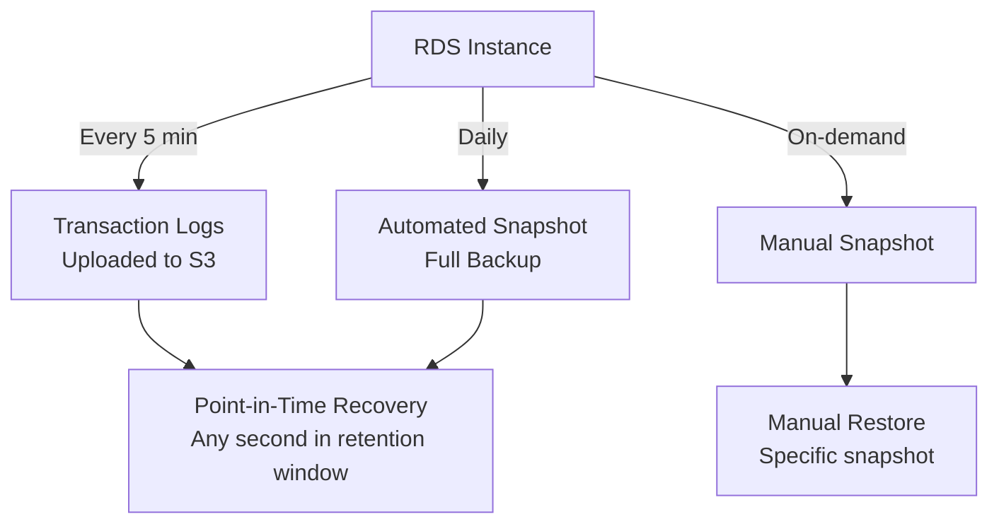

# How to Set Up RDS Automated Backups and Snapshots

Author: [nawazdhandala](https://github.com/nawazdhandala)

Tags: AWS, RDS, Backups, Disaster Recovery

Description: Learn how to configure RDS automated backups and manual snapshots for disaster recovery, including retention policies and cross-region backup copies.

---

Backups are your insurance policy against data loss. RDS provides two backup mechanisms: automated backups (daily snapshots plus transaction logs) and manual snapshots (on-demand copies you explicitly create). Together, they let you recover your database to any point in time within your retention window. Let's set them up properly.

## Automated Backups vs Manual Snapshots

Understanding the difference is important:

**Automated backups**:
- Taken daily during the backup window
- Include transaction logs uploaded every 5 minutes
- Enable point-in-time recovery (PITR)
- Retained for 1-35 days (you configure the retention period)
- Deleted automatically when the RDS instance is deleted (unless you take a final snapshot)

**Manual snapshots**:
- Created on-demand by you
- Persist until you explicitly delete them
- Survive instance deletion
- Great for before/after major changes
- Can be shared with other AWS accounts or copied to other regions



## Configuring Automated Backups

### During Instance Creation

When creating an instance, set the backup retention period and window.

```bash
aws rds create-db-instance \
  --db-instance-identifier my-production-db \
  --db-instance-class db.r6g.large \
  --engine postgres \
  --master-username admin \
  --master-user-password 'YourStrongPassword123!' \
  --allocated-storage 100 \
  --storage-type gp3 \
  --backup-retention-period 14 \
  --preferred-backup-window "03:00-04:00" \
  --copy-tags-to-snapshot \
  --db-subnet-group-name my-db-subnet-group \
  --vpc-security-group-ids sg-db-123
```

Key options:
- `--backup-retention-period 14`: Keep backups for 14 days. Range is 1-35 days. Set to 0 to disable (not recommended).
- `--preferred-backup-window "03:00-04:00"`: When the daily snapshot occurs (UTC). Choose a low-traffic period.
- `--copy-tags-to-snapshot`: Copies instance tags to automated snapshots. Useful for cost tracking.

### Modifying Backup Settings on Existing Instances

Change backup settings on a running instance.

```bash
aws rds modify-db-instance \
  --db-instance-identifier my-production-db \
  --backup-retention-period 14 \
  --preferred-backup-window "03:00-04:00" \
  --copy-tags-to-snapshot \
  --apply-immediately
```

### What Happens During Backups?

For Multi-AZ deployments, the automated snapshot is taken from the standby instance, so there's no performance impact on the primary. For single-AZ deployments, you might see briefly elevated I/O latency during the snapshot.

Transaction log backups happen every 5 minutes continuously, regardless of the backup window. These are lightweight and have minimal performance impact.

## Creating Manual Snapshots

Take a manual snapshot before any risky operation - schema changes, major deployments, data migrations.

This creates a manual snapshot with a descriptive identifier.

```bash
aws rds create-db-snapshot \
  --db-instance-identifier my-production-db \
  --db-snapshot-identifier my-db-before-migration-2026-02-12 \
  --tags Key=Purpose,Value=pre-migration Key=CreatedBy,Value=team-backend
```

Manual snapshots are full copies of your database. They're stored in S3 (managed by AWS - you don't see them in your S3 console) and persist until you delete them.

### Wait for Snapshot Completion

Snapshots can take time depending on database size.

```bash
# Wait for snapshot to complete
aws rds wait db-snapshot-available \
  --db-snapshot-identifier my-db-before-migration-2026-02-12

# Check snapshot status
aws rds describe-db-snapshots \
  --db-snapshot-identifier my-db-before-migration-2026-02-12 \
  --query 'DBSnapshots[0].{Status:Status,PercentProgress:PercentProgress,SnapshotCreateTime:SnapshotCreateTime}'
```

## Listing Snapshots

View your automated and manual snapshots.

```bash
# List automated snapshots
aws rds describe-db-snapshots \
  --db-instance-identifier my-production-db \
  --snapshot-type automated \
  --query 'DBSnapshots[*].{ID:DBSnapshotIdentifier,Created:SnapshotCreateTime,Status:Status,Size:AllocatedStorage}' \
  --output table

# List manual snapshots
aws rds describe-db-snapshots \
  --db-instance-identifier my-production-db \
  --snapshot-type manual \
  --query 'DBSnapshots[*].{ID:DBSnapshotIdentifier,Created:SnapshotCreateTime,Status:Status,Size:AllocatedStorage}' \
  --output table
```

## Cross-Region Backup Copies

For disaster recovery, copy snapshots to another region. This protects against regional failures.

### Manual Cross-Region Copy

This copies a snapshot to another region.

```bash
# Copy to eu-west-1
aws rds copy-db-snapshot \
  --source-db-snapshot-identifier arn:aws:rds:us-east-1:123456789012:snapshot:my-db-before-migration-2026-02-12 \
  --target-db-snapshot-identifier my-db-copy-eu \
  --region eu-west-1 \
  --kms-key-id arn:aws:kms:eu-west-1:123456789012:key/abc-123 \
  --copy-tags
```

### Automated Cross-Region Backup Replication

AWS supports automated cross-region backup replication for RDS.

This enables automatic backup replication to another region.

```bash
aws rds start-db-instance-automated-backups-replication \
  --source-db-instance-arn arn:aws:rds:us-east-1:123456789012:db:my-production-db \
  --backup-retention-period 7 \
  --kms-key-id arn:aws:kms:eu-west-1:123456789012:key/abc-123 \
  --region eu-west-1
```

This continuously replicates automated backups to the destination region. You can restore from these replicated backups in the destination region for DR purposes.

## Automating Snapshot Management

Here's a script that creates daily manual snapshots and cleans up old ones.

This Python script manages manual snapshots with a configurable retention policy.

```python
import boto3
from datetime import datetime, timedelta

rds = boto3.client('rds')

def create_snapshot(instance_id):
    """Create a manual snapshot with a timestamp."""
    timestamp = datetime.now().strftime('%Y-%m-%d-%H%M')
    snapshot_id = f"{instance_id}-manual-{timestamp}"

    print(f"Creating snapshot: {snapshot_id}")
    rds.create_db_snapshot(
        DBInstanceIdentifier=instance_id,
        DBSnapshotIdentifier=snapshot_id,
        Tags=[
            {'Key': 'ManagedBy', 'Value': 'automated-script'},
            {'Key': 'CreatedAt', 'Value': datetime.now().isoformat()}
        ]
    )
    return snapshot_id

def cleanup_old_snapshots(instance_id, retention_days=30):
    """Delete manual snapshots older than retention_days."""
    cutoff = datetime.now(tz=None) - timedelta(days=retention_days)

    # Get all manual snapshots for this instance
    paginator = rds.get_paginator('describe_db_snapshots')
    for page in paginator.paginate(
        DBInstanceIdentifier=instance_id,
        SnapshotType='manual'
    ):
        for snapshot in page['DBSnapshots']:
            # Only manage snapshots we created
            tags_response = rds.list_tags_for_resource(
                ResourceName=snapshot['DBSnapshotArn']
            )
            tags = {t['Key']: t['Value'] for t in tags_response.get('TagList', [])}

            if tags.get('ManagedBy') != 'automated-script':
                continue

            create_time = snapshot['SnapshotCreateTime'].replace(tzinfo=None)
            if create_time < cutoff:
                print(f"Deleting old snapshot: {snapshot['DBSnapshotIdentifier']}")
                rds.delete_db_snapshot(
                    DBSnapshotIdentifier=snapshot['DBSnapshotIdentifier']
                )

# Run
instance = 'my-production-db'
create_snapshot(instance)
cleanup_old_snapshots(instance, retention_days=30)
```

## Backup Encryption

All automated backups and snapshots use the same encryption setting as the source instance. If your instance is encrypted, all backups are encrypted. If it's not encrypted, you can still create encrypted snapshots by copying them with a KMS key.

This copies an unencrypted snapshot to an encrypted one.

```bash
aws rds copy-db-snapshot \
  --source-db-snapshot-identifier my-unencrypted-snapshot \
  --target-db-snapshot-identifier my-encrypted-snapshot \
  --kms-key-id alias/my-rds-key
```

## Sharing Snapshots

You can share manual snapshots with other AWS accounts for migration or cross-account recovery.

```bash
# Share with another account
aws rds modify-db-snapshot-attribute \
  --db-snapshot-identifier my-snapshot \
  --attribute-name restore \
  --values-to-add 987654321098
```

If the snapshot is encrypted, you also need to share the KMS key with the target account.

## Backup Storage Costs

- Backup storage up to the size of your provisioned database is free
- Storage beyond that costs $0.095 per GB-month in us-east-1
- Manual snapshots count toward your storage usage
- Cross-region copies incur data transfer charges

For a 100 GB database with 14 days of automated retention and a few manual snapshots, expect backup storage costs of $5-15/month.

## Best Practices

1. **Set retention to at least 7 days** for production. 14-35 days is better for compliance.
2. **Take manual snapshots before changes**: Major deployments, schema migrations, engine upgrades.
3. **Enable cross-region backup replication**: Protects against regional failures.
4. **Tag your snapshots**: Make it easy to identify why each snapshot was created.
5. **Test restores regularly**: A backup you've never tested is not a backup. For details on restoring, see [restoring from a snapshot](https://oneuptime.com/blog/post/2026-02-12-restore-rds-instance-from-snapshot/view) and [point-in-time recovery](https://oneuptime.com/blog/post/2026-02-12-restore-rds-instance-point-in-time/view).
6. **Monitor backup events**: Set up alerts for backup failures using [CloudWatch](https://oneuptime.com/blog/post/2026-02-13-aws-cloudwatch-alerting-best-practices/view).
7. **Final snapshot on deletion**: Always take a final snapshot before deleting an instance.

## Wrapping Up

RDS backups are one of those things you set up once and then forget about - until you need them. Automated backups with point-in-time recovery give you continuous protection with up to 5-minute granularity. Manual snapshots give you explicit checkpoints before risky operations. Cross-region copies protect against regional disasters. Configure all three for a production database, test your restore process at least quarterly, and you'll be covered when something goes wrong.
