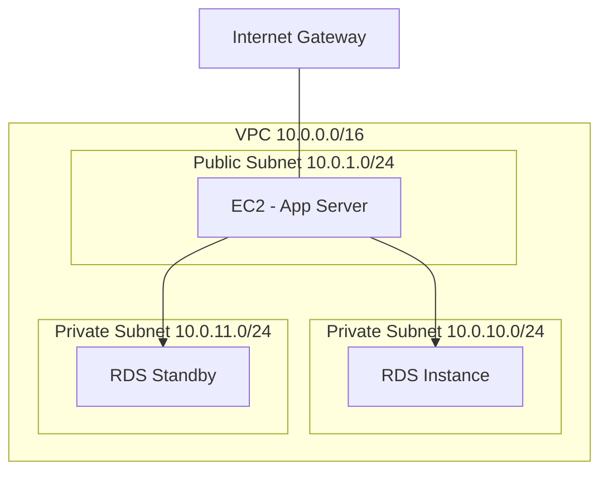

# How to Set Up RDS in a Private Subnet

Author: [nawazdhandala](https://github.com/nawazdhandala)

Tags: AWS, RDS, VPC, Networking, Security

Description: Learn how to deploy RDS instances in private subnets for maximum security, including VPC setup, subnet groups, and connectivity patterns.

---

Putting your RDS instance in a private subnet is one of the most important security decisions you'll make in AWS. A private subnet has no direct route to the internet, which means your database can't be reached from outside your VPC. Applications inside the VPC can still connect normally, but external attackers have no direct path to your database. Let's set this up from scratch.

## What Makes a Subnet Private?

A subnet is "private" because of its route table, not because of any special subnet setting. The difference is simple:

- **Public subnet**: Route table has a route to an Internet Gateway (0.0.0.0/0 -> igw-xxx)
- **Private subnet**: Route table does NOT have a route to an Internet Gateway

That's it. No magic checkbox, just routing.



## Step 1: Create the VPC

If you're building from scratch, start with a VPC.

This creates a VPC with a CIDR block large enough for multiple subnets.

```bash
# Create the VPC
VPC_ID=$(aws ec2 create-vpc \
  --cidr-block 10.0.0.0/16 \
  --tag-specifications 'ResourceType=vpc,Tags=[{Key=Name,Value=my-app-vpc}]' \
  --query 'Vpc.VpcId' --output text)

# Enable DNS hostnames (required for RDS endpoints)
aws ec2 modify-vpc-attribute \
  --vpc-id $VPC_ID \
  --enable-dns-hostnames '{"Value": true}'

aws ec2 modify-vpc-attribute \
  --vpc-id $VPC_ID \
  --enable-dns-support '{"Value": true}'
```

DNS hostnames and DNS support must be enabled for RDS. RDS uses DNS names for endpoints, and they need to resolve within the VPC.

## Step 2: Create Private Subnets

RDS requires subnets in at least two availability zones for its subnet group, even for single-AZ deployments.

These commands create two private subnets in different AZs.

```bash
# Private subnet in AZ a
PRIVATE_SUBNET_A=$(aws ec2 create-subnet \
  --vpc-id $VPC_ID \
  --cidr-block 10.0.10.0/24 \
  --availability-zone us-east-1a \
  --tag-specifications 'ResourceType=subnet,Tags=[{Key=Name,Value=db-private-a}]' \
  --query 'Subnet.SubnetId' --output text)

# Private subnet in AZ b
PRIVATE_SUBNET_B=$(aws ec2 create-subnet \
  --vpc-id $VPC_ID \
  --cidr-block 10.0.11.0/24 \
  --availability-zone us-east-1b \
  --tag-specifications 'ResourceType=subnet,Tags=[{Key=Name,Value=db-private-b}]' \
  --query 'Subnet.SubnetId' --output text)
```

## Step 3: Create a Private Route Table

Create a route table without an internet gateway route.

This creates a route table for the private subnets with only the local VPC route.

```bash
# Create route table
PRIVATE_RT=$(aws ec2 create-route-table \
  --vpc-id $VPC_ID \
  --tag-specifications 'ResourceType=route-table,Tags=[{Key=Name,Value=db-private-rt}]' \
  --query 'RouteTable.RouteTableId' --output text)

# Associate with both subnets
aws ec2 associate-route-table \
  --route-table-id $PRIVATE_RT \
  --subnet-id $PRIVATE_SUBNET_A

aws ec2 associate-route-table \
  --route-table-id $PRIVATE_RT \
  --subnet-id $PRIVATE_SUBNET_B
```

Notice we didn't add any routes. The route table only has the default local route (10.0.0.0/16 -> local), which allows traffic within the VPC. There's no path to the internet.

## Step 4: Create the DB Subnet Group

RDS uses subnet groups to know which subnets it can deploy into.

This creates a DB subnet group using the two private subnets.

```bash
aws rds create-db-subnet-group \
  --db-subnet-group-name my-db-subnet-group \
  --db-subnet-group-description "Private subnets for RDS" \
  --subnet-ids $PRIVATE_SUBNET_A $PRIVATE_SUBNET_B \
  --tags Key=Environment,Value=production
```

## Step 5: Create Security Group

Create a security group for the RDS instance in the VPC.

```bash
DB_SG=$(aws ec2 create-security-group \
  --group-name rds-private-sg \
  --description "Security group for RDS in private subnet" \
  --vpc-id $VPC_ID \
  --query 'GroupId' --output text)

# Allow PostgreSQL access from the app subnet
aws ec2 authorize-security-group-ingress \
  --group-id $DB_SG \
  --protocol tcp \
  --port 5432 \
  --cidr 10.0.1.0/24
```

For production, use security group references instead of CIDR blocks. See our guide on [configuring RDS security groups](https://oneuptime.com/blog/post/2026-02-12-configure-rds-security-groups-database-access/view) for best practices.

## Step 6: Create the RDS Instance

Now create the RDS instance using the subnet group.

This command creates a PostgreSQL instance in the private subnets.

```bash
aws rds create-db-instance \
  --db-instance-identifier my-private-db \
  --db-instance-class db.r6g.large \
  --engine postgres \
  --engine-version 16.4 \
  --master-username admin \
  --master-user-password 'YourStrongPassword123!' \
  --allocated-storage 100 \
  --storage-type gp3 \
  --db-name myappdb \
  --db-subnet-group-name my-db-subnet-group \
  --vpc-security-group-ids $DB_SG \
  --no-publicly-accessible \
  --storage-encrypted \
  --backup-retention-period 7 \
  --multi-az \
  --deletion-protection
```

The `--no-publicly-accessible` flag is critical. Even though the instance is in a private subnet, this flag ensures RDS doesn't assign a public IP address. Belt and suspenders.

## How Applications Connect

Applications in the same VPC connect normally using the RDS endpoint. The VPC's internal DNS resolves the endpoint to the private IP address.

```bash
# From an EC2 instance in the VPC
psql -h my-private-db.abc123.us-east-1.rds.amazonaws.com -U admin -d myappdb
```

The DNS name resolves to something like 10.0.10.47 - a private IP within your VPC.

## Accessing from Outside the VPC

Since the database is in a private subnet, you can't connect directly from your laptop. Here are your options:

### SSH Tunnel through Bastion
The classic approach. Put a bastion host in a public subnet and tunnel through it.

```bash
ssh -i key.pem -L 5432:my-private-db.abc123.us-east-1.rds.amazonaws.com:5432 \
  -N ec2-user@bastion-public-ip
```

### AWS Systems Manager Session Manager
No bastion needed. Uses an existing EC2 instance with SSM agent.

```bash
aws ssm start-session \
  --target i-0abc123def456 \
  --document-name AWS-StartPortForwardingSessionToRemoteHost \
  --parameters '{"host":["my-private-db.abc123.us-east-1.rds.amazonaws.com"],"portNumber":["5432"],"localPortNumber":["5432"]}'
```

### Client VPN
For teams that need regular access, set up AWS Client VPN. Once connected, you're effectively inside the VPC.

For a full comparison of these methods, see [connecting to RDS from a local machine](https://oneuptime.com/blog/post/2026-02-12-connect-rds-instance-from-local-machine/view).

## NAT Gateway for RDS Updates

RDS itself needs to download patches and updates from AWS. In a private subnet, it handles this through AWS's internal network - you don't need a NAT gateway for RDS operations. However, if you need your database to call external services (like Lambda triggers or external authentication), you'll need a NAT gateway.

This adds a NAT gateway route to the private subnet's route table for outbound internet access.

```bash
# Create NAT gateway in a public subnet
NAT_GW=$(aws ec2 create-nat-gateway \
  --subnet-id subnet-public-123 \
  --allocation-id eipalloc-0abc123 \
  --query 'NatGateway.NatGatewayId' --output text)

# Add route to private route table
aws ec2 create-route \
  --route-table-id $PRIVATE_RT \
  --destination-cidr-block 0.0.0.0/0 \
  --nat-gateway-id $NAT_GW
```

## Network ACLs

By default, the VPC's default NACL allows all traffic. If you've created custom NACLs for your private subnets, make sure they allow:

- Inbound: Database port (5432/3306/1433) from application subnets
- Outbound: Ephemeral ports (1024-65535) to application subnets
- Inbound: Ephemeral ports from wherever your database needs to talk to (for responses)

This creates a NACL that restricts traffic to just what the database needs.

```bash
# Create NACL for database subnets
DB_NACL=$(aws ec2 create-network-acl \
  --vpc-id $VPC_ID \
  --query 'NetworkAcl.NetworkAclId' --output text)

# Allow inbound PostgreSQL from app subnet
aws ec2 create-network-acl-entry \
  --network-acl-id $DB_NACL \
  --rule-number 100 \
  --protocol tcp \
  --port-range From=5432,To=5432 \
  --cidr-block 10.0.1.0/24 \
  --rule-action allow \
  --ingress

# Allow inbound ephemeral ports (for return traffic)
aws ec2 create-network-acl-entry \
  --network-acl-id $DB_NACL \
  --rule-number 200 \
  --protocol tcp \
  --port-range From=1024,To=65535 \
  --cidr-block 10.0.0.0/16 \
  --rule-action allow \
  --ingress

# Allow outbound ephemeral ports to app subnet
aws ec2 create-network-acl-entry \
  --network-acl-id $DB_NACL \
  --rule-number 100 \
  --protocol tcp \
  --port-range From=1024,To=65535 \
  --cidr-block 10.0.1.0/24 \
  --rule-action allow \
  --egress
```

## Terraform Version

Here's the same setup in Terraform for those who prefer infrastructure as code.

This Terraform configuration creates the complete private subnet setup for RDS.

```hcl
resource "aws_subnet" "db_a" {
  vpc_id            = aws_vpc.main.id
  cidr_block        = "10.0.10.0/24"
  availability_zone = "us-east-1a"
  tags = { Name = "db-private-a" }
}

resource "aws_subnet" "db_b" {
  vpc_id            = aws_vpc.main.id
  cidr_block        = "10.0.11.0/24"
  availability_zone = "us-east-1b"
  tags = { Name = "db-private-b" }
}

resource "aws_route_table" "db" {
  vpc_id = aws_vpc.main.id
  tags   = { Name = "db-private-rt" }
  # No internet gateway route - this makes it private
}

resource "aws_route_table_association" "db_a" {
  subnet_id      = aws_subnet.db_a.id
  route_table_id = aws_route_table.db.id
}

resource "aws_route_table_association" "db_b" {
  subnet_id      = aws_subnet.db_b.id
  route_table_id = aws_route_table.db.id
}

resource "aws_db_subnet_group" "main" {
  name       = "my-db-subnet-group"
  subnet_ids = [aws_subnet.db_a.id, aws_subnet.db_b.id]
  tags       = { Name = "My DB Subnet Group" }
}
```

## Wrapping Up

Setting up RDS in a private subnet is a foundational security practice. The database has no direct internet access, which dramatically reduces your attack surface. Applications in the VPC connect through internal networking, and developers can reach the database through secure tunnels when needed. The setup requires a few extra components - private subnets, route tables, and a subnet group - but once in place, it's the same experience as any other RDS deployment, just significantly more secure.
