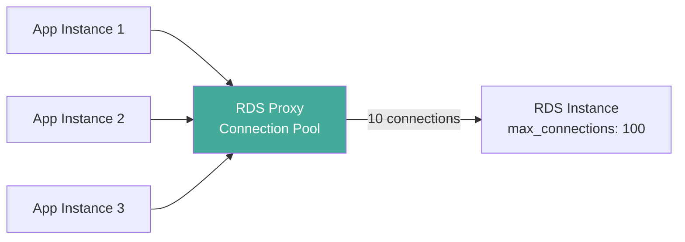

# How to Set Up RDS Proxy for Connection Pooling

Author: [nawazdhandala](https://github.com/nawazdhandala)

Tags: AWS, RDS, RDS Proxy, Connection Pooling, Database

Description: Learn how to set up AWS RDS Proxy for database connection pooling, reducing connection overhead and improving application resilience.

---

Database connections are expensive. Each one consumes memory on the database server, requires a TCP handshake, authentication, and session setup. When you have many application instances or serverless functions all opening their own connections, you can easily exhaust the database's connection limit. RDS Proxy sits between your application and database, managing a pool of connections that get reused across requests. Let's set it up.

## What RDS Proxy Does

RDS Proxy maintains a pool of established database connections and shares them among your application instances. When your application requests a connection, the proxy hands it one from the pool. When the application is done, the connection goes back to the pool instead of being closed.



Instead of 300 app connections hitting the database directly, the proxy might maintain just 10-20 actual database connections and multiplex traffic through them.

Benefits:
- **Reduced database load**: Fewer connections means less memory and CPU overhead on the database
- **Better failover handling**: The proxy handles Multi-AZ failover transparently, reducing application downtime
- **Connection reuse**: Connections are reused instead of created and destroyed for each request
- **IAM authentication**: Centralized auth through IAM instead of managing database passwords

## Prerequisites

Before creating a proxy, you need:

1. An RDS instance (MySQL or PostgreSQL)
2. Database credentials stored in AWS Secrets Manager
3. An IAM role that lets the proxy access the secret
4. Subnets and security groups for the proxy

## Step 1: Store Credentials in Secrets Manager

RDS Proxy retrieves database credentials from Secrets Manager. Create a secret with the correct format.

This creates a secret with the database credentials in the format RDS Proxy expects.

```bash
aws secretsmanager create-secret \
  --name rds-proxy/my-db-credentials \
  --description "Database credentials for RDS Proxy" \
  --secret-string '{
    "username": "admin",
    "password": "YourStrongPassword123!",
    "engine": "postgres",
    "host": "my-db.abc123.us-east-1.rds.amazonaws.com",
    "port": 5432,
    "dbname": "myappdb"
  }'
```

The secret must include at minimum the `username` and `password` fields. The other fields are optional but helpful for documentation.

## Step 2: Create the IAM Role

The proxy needs an IAM role to access Secrets Manager and KMS (for decrypting the secret).

This creates the IAM role and policy for the RDS Proxy.

```bash
# Create the trust policy
cat > /tmp/trust-policy.json << 'EOF'
{
  "Version": "2012-10-17",
  "Statement": [
    {
      "Effect": "Allow",
      "Principal": {
        "Service": "rds.amazonaws.com"
      },
      "Action": "sts:AssumeRole"
    }
  ]
}
EOF

# Create the role
aws iam create-role \
  --role-name rds-proxy-role \
  --assume-role-policy-document file:///tmp/trust-policy.json

# Create the permissions policy
cat > /tmp/proxy-policy.json << 'EOF'
{
  "Version": "2012-10-17",
  "Statement": [
    {
      "Effect": "Allow",
      "Action": [
        "secretsmanager:GetSecretValue"
      ],
      "Resource": "arn:aws:secretsmanager:us-east-1:123456789012:secret:rds-proxy/*"
    },
    {
      "Effect": "Allow",
      "Action": [
        "kms:Decrypt"
      ],
      "Resource": "arn:aws:kms:us-east-1:123456789012:key/*",
      "Condition": {
        "StringEquals": {
          "kms:ViaService": "secretsmanager.us-east-1.amazonaws.com"
        }
      }
    }
  ]
}
EOF

# Attach the policy
aws iam put-role-policy \
  --role-name rds-proxy-role \
  --policy-name rds-proxy-secrets-access \
  --policy-document file:///tmp/proxy-policy.json
```

## Step 3: Create the RDS Proxy

Now create the proxy itself.

This command creates an RDS Proxy with IAM authentication enabled.

```bash
aws rds create-db-proxy \
  --db-proxy-name my-app-proxy \
  --engine-family POSTGRESQL \
  --auth '[{
    "AuthScheme": "SECRETS",
    "SecretArn": "arn:aws:secretsmanager:us-east-1:123456789012:secret:rds-proxy/my-db-credentials-AbCdEf",
    "IAMAuth": "ALLOWED"
  }]' \
  --role-arn arn:aws:iam::123456789012:role/rds-proxy-role \
  --vpc-subnet-ids subnet-private-1 subnet-private-2 \
  --vpc-security-group-ids sg-proxy-123 \
  --require-tls \
  --idle-client-timeout 1800 \
  --debug-logging \
  --tags Key=Environment,Value=production
```

Let's break down the important options:

- `--engine-family`: POSTGRESQL or MYSQL (covers MariaDB too)
- `--auth`: Authentication configuration. `IAMAuth` can be ALLOWED or REQUIRED
- `--require-tls`: Forces all connections to use TLS
- `--idle-client-timeout`: How long idle client connections stay open (seconds)
- `--debug-logging`: Sends detailed logs to CloudWatch (turn off in production for performance)

## Step 4: Register the Target

Associate the proxy with your RDS instance.

This registers your RDS instance as a target for the proxy.

```bash
aws rds register-db-proxy-targets \
  --db-proxy-name my-app-proxy \
  --db-instance-identifiers my-primary-db
```

If you're using an Aurora cluster, use `--db-cluster-identifiers` instead.

## Step 5: Wait for the Proxy

The proxy takes a few minutes to become available.

```bash
# Check proxy status
aws rds describe-db-proxies \
  --db-proxy-name my-app-proxy \
  --query 'DBProxies[0].{Status:Status,Endpoint:Endpoint}' \
  --output table
```

Wait until the status shows "available."

## Step 6: Connect Through the Proxy

The proxy has its own endpoint. Update your application to connect to this endpoint instead of the RDS endpoint.

This shows how to connect through the proxy with standard database credentials.

```bash
# Get the proxy endpoint
PROXY_ENDPOINT=$(aws rds describe-db-proxies \
  --db-proxy-name my-app-proxy \
  --query 'DBProxies[0].Endpoint' --output text)

# Connect through the proxy
psql -h $PROXY_ENDPOINT -U admin -d myappdb -p 5432
```

From your application, just change the host to the proxy endpoint.

```python
import psycopg2

# Before: direct connection
# conn = psycopg2.connect(host='my-db.abc123.rds.amazonaws.com', ...)

# After: through proxy
conn = psycopg2.connect(
    host='my-app-proxy.proxy-abc123.us-east-1.rds.amazonaws.com',
    port=5432,
    database='myappdb',
    user='admin',
    password='YourStrongPassword123!',
    sslmode='require'
)
```

## Connection Pool Settings

You can tune how the proxy manages connections.

This modifies the proxy's target group settings for connection pooling behavior.

```bash
aws rds modify-db-proxy-target-group \
  --db-proxy-name my-app-proxy \
  --target-group-name default \
  --connection-pool-config '{
    "MaxConnectionsPercent": 90,
    "MaxIdleConnectionsPercent": 50,
    "ConnectionBorrowTimeout": 120,
    "SessionPinningFilters": ["EXCLUDE_VARIABLE_SETS"]
  }'
```

The key settings:

- **MaxConnectionsPercent**: Maximum percentage of `max_connections` the proxy can use (default 100)
- **MaxIdleConnectionsPercent**: How many idle connections to keep in the pool
- **ConnectionBorrowTimeout**: How long a client waits for a connection before timing out
- **SessionPinningFilters**: Controls when connections get "pinned" to a session (more on this below)

## Understanding Connection Pinning

Connection pinning is important to understand. Normally, the proxy can multiplex multiple client sessions over a single database connection. But certain operations force a connection to be "pinned" to a specific client session, preventing reuse.

Operations that cause pinning:
- Setting session-level variables
- Using prepared statements (in some cases)
- Using temporary tables
- Holding explicit locks
- Calling functions with side effects

Pinned connections reduce the effectiveness of the proxy because they can't be shared. The `SessionPinningFilters` setting helps by excluding certain variable sets from triggering pins.

## Security Group Configuration

The proxy needs its own security group with these rules:

```bash
# Proxy security group - allow inbound from app
aws ec2 authorize-security-group-ingress \
  --group-id sg-proxy-123 \
  --protocol tcp \
  --port 5432 \
  --source-group sg-app-123

# RDS security group - allow inbound from proxy
aws ec2 authorize-security-group-ingress \
  --group-id sg-rds-123 \
  --protocol tcp \
  --port 5432 \
  --source-group sg-proxy-123
```

The flow is: Application -> Proxy SG -> RDS SG -> Database.

## Monitoring the Proxy

RDS Proxy publishes metrics to CloudWatch under the `AWS/RDS` namespace.

Key metrics to watch:

- **DatabaseConnections**: Connections from proxy to database
- **ClientConnections**: Connections from applications to proxy
- **QueryRequests**: Number of queries processed
- **ClientConnectionsSetupSucceeded/Failed**: Connection success rate
- **AvailabilityPercentage**: Should be close to 100%

This creates a CloudWatch alarm for proxy connection usage.

```bash
aws cloudwatch put-metric-alarm \
  --alarm-name proxy-high-connections \
  --metric-name DatabaseConnections \
  --namespace AWS/RDS \
  --dimensions Name=ProxyName,Value=my-app-proxy \
  --statistic Maximum \
  --period 300 \
  --evaluation-periods 2 \
  --threshold 80 \
  --comparison-operator GreaterThanThreshold \
  --alarm-actions arn:aws:sns:us-east-1:123456789012:rds-alerts
```

For comprehensive monitoring, check out [AWS infrastructure monitoring with OneUptime](https://oneuptime.com/blog/post/2026-02-13-aws-cloudwatch-infrastructure-monitoring/view).

## Proxy and Multi-AZ Failover

One of the best features of RDS Proxy is how it handles Multi-AZ failover. Without a proxy, your application experiences 60-120 seconds of connection errors during failover. With a proxy, the downtime is typically under 10 seconds because the proxy maintains its connections and redirects traffic to the new primary transparently.

## Pricing

RDS Proxy is priced based on the instance size of your target database. It costs approximately 15-20% of the hourly cost of your RDS instance. For a db.r6g.large, that's about $0.04/hour or $29/month. It's a worthwhile investment if you have connection management issues.

## Wrapping Up

RDS Proxy is an essential piece of infrastructure for applications with many database connections, especially serverless applications with Lambda. The setup requires a Secrets Manager secret, an IAM role, and the proxy itself. Once running, just point your application at the proxy endpoint instead of the database endpoint. The proxy handles connection pooling, multiplexing, and failover, letting you focus on your application logic instead of connection management.
