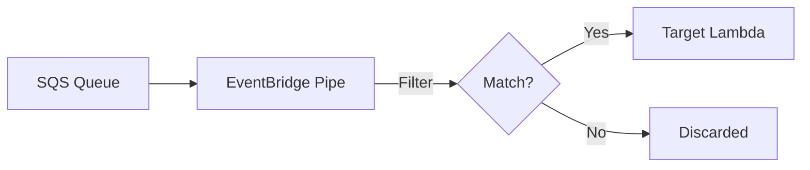

# How to Set Up SQS Message Filtering with EventBridge Pipes

Author: [nawazdhandala](https://github.com/nawazdhandala)

Tags: AWS, SQS, EventBridge Pipes, Filtering, Serverless

Description: Learn how to use EventBridge Pipes to filter, transform, and route SQS messages before they reach your consumers, reducing noise and compute costs.

---

EventBridge Pipes is one of those AWS services that doesn't get enough attention. It connects sources (like SQS queues) to targets (like Lambda functions or other AWS services) with optional filtering, enrichment, and transformation in between. Think of it as a programmable connector that sits between your queue and your consumer.

The filtering capability is particularly powerful. Instead of having your Lambda function receive every message and discard the ones it doesn't care about, you can filter at the pipe level. Messages that don't match your criteria never trigger your Lambda, saving you compute costs and reducing noise.

## Why Use Pipes Instead of Direct Integration?

When you connect SQS to Lambda directly through an event source mapping, Lambda receives every message from the queue. Your function has to inspect each message and decide whether to process it or discard it. You're paying for every invocation, even for messages you throw away.

EventBridge Pipes adds a filtering layer between SQS and your target. Only messages that match your filter criteria get forwarded. The rest are removed from the queue automatically.



## Creating a Basic Pipe

Let's start with a simple pipe that connects an SQS queue to a Lambda function with a filter.

This Terraform configuration creates an EventBridge Pipe that filters SQS messages before sending them to Lambda.

```hcl
resource "aws_pipes_pipe" "order_filter" {
  name     = "order-high-value-filter"
  role_arn = aws_iam_role.pipe_role.arn

  source = aws_sqs_queue.orders.arn
  target = aws_lambda_function.high_value_processor.arn

  source_parameters {
    sqs_queue_parameters {
      batch_size                         = 10
      maximum_batching_window_in_seconds = 5
    }

    filter_criteria {
      filter {
        pattern = jsonencode({
          body = {
            total = [{ numeric = [">", 500] }]
          }
        })
      }
    }
  }

  target_parameters {
    lambda_function_parameters {
      invocation_type = "REQUEST_RESPONSE"
    }
  }
}
```

This pipe only forwards messages where the `total` field in the message body is greater than 500. All other messages are silently removed from the queue.

## Filter Pattern Syntax

EventBridge Pipes uses the same filtering syntax as EventBridge rules. Here are the most common patterns.

### Exact Match

Match messages where a field equals a specific value.

```json
{
  "body": {
    "status": ["PENDING"]
  }
}
```

### Multiple Values (OR)

Match messages where a field equals any of the specified values.

```json
{
  "body": {
    "status": ["PENDING", "PROCESSING"]
  }
}
```

### Numeric Comparison

Filter based on numeric values.

```json
{
  "body": {
    "total": [{ "numeric": [">", 100] }],
    "quantity": [{ "numeric": [">=", 1, "<=", 100] }]
  }
}
```

### Prefix Match

Match strings that start with a specific prefix.

```json
{
  "body": {
    "order_id": [{ "prefix": "ORD-" }]
  }
}
```

### Exists Check

Match messages that have (or don't have) a specific field.

```json
{
  "body": {
    "priority": [{ "exists": true }],
    "discount_code": [{ "exists": false }]
  }
}
```

### Combining Multiple Conditions

All conditions within a filter use AND logic. All top-level fields must match.

This filter matches messages that are PENDING status AND have a total greater than 100 AND belong to the US region.

```json
{
  "body": {
    "status": ["PENDING"],
    "total": [{ "numeric": [">", 100] }],
    "region": ["us-east", "us-west"]
  }
}
```

### Multiple Filters (OR at the Filter Level)

You can define multiple filters. A message matches if it matches ANY of the filters (OR logic between filters).

```hcl
source_parameters {
  filter_criteria {
    # Filter 1: High-value orders
    filter {
      pattern = jsonencode({
        body = {
          total = [{ numeric = [">", 500] }]
        }
      })
    }

    # Filter 2: Priority orders (regardless of value)
    filter {
      pattern = jsonencode({
        body = {
          priority = ["HIGH", "URGENT"]
        }
      })
    }
  }
}
```

## Adding Enrichment

Pipes can enrich messages before sending them to the target. The enrichment step calls a Lambda function, API Gateway, or Step Functions state machine to add data to the message.

This pipe enriches order messages with customer data before sending them to the target.

```hcl
resource "aws_pipes_pipe" "enriched_orders" {
  name     = "enriched-order-pipe"
  role_arn = aws_iam_role.pipe_role.arn

  source     = aws_sqs_queue.orders.arn
  enrichment = aws_lambda_function.customer_enricher.arn
  target     = aws_lambda_function.order_processor.arn

  source_parameters {
    sqs_queue_parameters {
      batch_size = 10
    }

    filter_criteria {
      filter {
        pattern = jsonencode({
          body = {
            status = ["PENDING"]
          }
        })
      }
    }
  }

  enrichment_parameters {
    lambda_function_parameters {
      invocation_type = "REQUEST_RESPONSE"
    }
  }
}
```

The enrichment Lambda receives the filtered messages and returns them with additional data.

```python
import json
import boto3

dynamodb = boto3.resource("dynamodb")
customers_table = dynamodb.Table("customers")

def enrich_handler(event, context):
    """Add customer details to each order message."""
    enriched = []

    for record in event:
        body = json.loads(record["body"]) if isinstance(record.get("body"), str) else record.get("body", {})

        # Look up customer details
        customer = customers_table.get_item(
            Key={"customer_id": body["customer_id"]}
        ).get("Item", {})

        # Add customer data to the message
        body["customer_name"] = customer.get("name", "Unknown")
        body["customer_tier"] = customer.get("tier", "standard")

        record["body"] = json.dumps(body)
        enriched.append(record)

    return enriched
```

## Input Transformation

You can transform the message before it reaches the target, extracting only the fields you need.

```hcl
resource "aws_pipes_pipe" "transformed_orders" {
  name     = "transformed-order-pipe"
  role_arn = aws_iam_role.pipe_role.arn

  source = aws_sqs_queue.orders.arn
  target = aws_sqs_queue.processed_orders.arn

  source_parameters {
    sqs_queue_parameters {
      batch_size = 1
    }
  }

  target_parameters {
    sqs_queue_parameters {
      message_deduplication_id = "$.messageId"
      message_group_id        = "$.body.customer_id"
    }

    input_template = <<-EOT
      {
        "orderId": <$.body.order_id>,
        "amount": <$.body.total>,
        "processedAt": <aws.pipes.event.ingestion-time>
      }
    EOT
  }
}
```

## IAM Role for the Pipe

The pipe needs permission to read from SQS and invoke the target.

```hcl
resource "aws_iam_role" "pipe_role" {
  name = "eventbridge-pipe-role"

  assume_role_policy = jsonencode({
    Version = "2012-10-17"
    Statement = [{
      Effect = "Allow"
      Principal = {
        Service = "pipes.amazonaws.com"
      }
      Action = "sts:AssumeRole"
    }]
  })
}

resource "aws_iam_role_policy" "pipe_source" {
  name = "pipe-sqs-source"
  role = aws_iam_role.pipe_role.id

  policy = jsonencode({
    Version = "2012-10-17"
    Statement = [{
      Effect = "Allow"
      Action = [
        "sqs:ReceiveMessage",
        "sqs:DeleteMessage",
        "sqs:GetQueueAttributes"
      ]
      Resource = aws_sqs_queue.orders.arn
    }]
  })
}

resource "aws_iam_role_policy" "pipe_target" {
  name = "pipe-lambda-target"
  role = aws_iam_role.pipe_role.id

  policy = jsonencode({
    Version = "2012-10-17"
    Statement = [{
      Effect   = "Allow"
      Action   = "lambda:InvokeFunction"
      Resource = aws_lambda_function.order_processor.arn
    }]
  })
}
```

## Monitoring Pipes

EventBridge Pipes publishes metrics to CloudWatch. The key ones to watch are:

- **ExecutionThrottled**: Your pipe is hitting rate limits.
- **ExecutionFailed**: Something went wrong during processing.
- **Ingestion**: Messages read from the source.
- **ExecutionTimeout**: Processing took too long.

```bash
# Check pipe execution metrics
aws cloudwatch get-metric-statistics \
  --namespace "AWS/EventBridge/Pipes" \
  --metric-name "ExecutionFailed" \
  --dimensions Name=PipeName,Value=order-high-value-filter \
  --start-time "2026-02-11T00:00:00Z" \
  --end-time "2026-02-12T00:00:00Z" \
  --period 3600 \
  --statistics Sum
```

## When to Use Pipes vs Direct SQS-Lambda Integration

Use EventBridge Pipes when you need filtering, enrichment, or transformation before processing. Use direct SQS-Lambda integration when every message needs processing and you don't need to modify messages before they reach your handler.

Pipes add a small amount of latency (typically under 100ms) and cost ($0.40 per million invocations). The savings from not invoking Lambda on irrelevant messages usually outweigh the pipe cost, especially when your filter removes a significant percentage of messages.

## Wrapping Up

EventBridge Pipes gives you a powerful filtering and transformation layer between SQS and your consumers. Define filter patterns to route only relevant messages, add enrichment to augment messages with additional data, and use input transformations to reshape messages for your target. The result is cleaner consumers that only receive the messages they need, lower compute costs, and a clear separation between routing logic and business logic.
