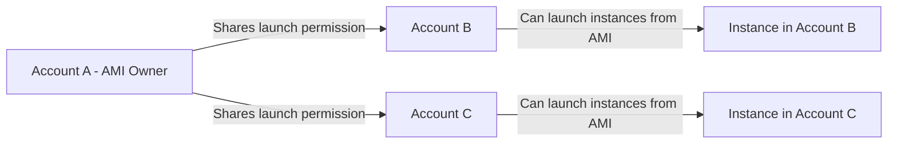

# How to Share an AMI Across AWS Accounts

Author: [nawazdhandala](https://github.com/nawazdhandala)

Tags: AWS, EC2, AMI, Multi-Account, Security

Description: A practical guide to sharing Amazon Machine Images between AWS accounts, covering permissions, encryption considerations, and organizational sharing patterns.

---

In multi-account AWS environments, you often need to share AMIs between accounts. Maybe your build pipeline creates golden images in a central account, and you need to distribute them to development, staging, and production accounts. Or maybe one team creates a hardened base image that all other teams should use.

AWS supports sharing AMIs through launch permissions, and there are a few approaches depending on your setup. This guide covers all of them, including the tricky parts around encrypted volumes.

## How AMI Sharing Works

When you share an AMI, you're granting another AWS account permission to launch instances from it. The AMI stays in your account - it doesn't get copied. The other account sees it in their EC2 console under "Private images" and can launch instances from it.

The important thing to understand: sharing an AMI also implicitly shares access to the underlying EBS snapshots. The other account can read those snapshots (to launch instances) but can't modify or delete them.



## Sharing with Specific Accounts

### Via the Console

1. Go to EC2 > AMIs
2. Select your AMI
3. Click "Actions" > "Edit AMI permissions"
4. Under "Shared accounts", click "Add account"
5. Enter the 12-digit AWS account ID (no dashes)
6. Click "Save changes"

### Via the CLI

```bash
# Share an AMI with a specific AWS account
aws ec2 modify-image-attribute \
    --image-id ami-0123456789abcdef0 \
    --launch-permission "Add=[{UserId=111122223333}]"
```

To share with multiple accounts at once:

```bash
# Share an AMI with multiple accounts
aws ec2 modify-image-attribute \
    --image-id ami-0123456789abcdef0 \
    --launch-permission "Add=[{UserId=111122223333},{UserId=444455556666},{UserId=777788889999}]"
```

### Verify the Sharing

```bash
# Check who the AMI is shared with
aws ec2 describe-image-attribute \
    --image-id ami-0123456789abcdef0 \
    --attribute launchPermission
```

## Making an AMI Public

You can also make an AMI public so anyone with an AWS account can use it:

```bash
# Make an AMI public (accessible to all AWS accounts)
aws ec2 modify-image-attribute \
    --image-id ami-0123456789abcdef0 \
    --launch-permission "Add=[{Group=all}]"
```

Be very careful with this. Public AMIs are visible to everyone. Make sure you've removed all credentials, API keys, and sensitive data before making an image public. AWS also scans public AMIs for common security issues.

To revoke public access:

```bash
# Remove public access
aws ec2 modify-image-attribute \
    --image-id ami-0123456789abcdef0 \
    --launch-permission "Remove=[{Group=all}]"
```

## Sharing with AWS Organizations

If you're using AWS Organizations, you can share AMIs with your entire organization or specific organizational units (OUs):

```bash
# Share with the entire organization
aws ec2 modify-image-attribute \
    --image-id ami-0123456789abcdef0 \
    --launch-permission "Add=[{OrganizationArn=arn:aws:organizations::123456789012:organization/o-abc123}]"

# Share with a specific OU
aws ec2 modify-image-attribute \
    --image-id ami-0123456789abcdef0 \
    --launch-permission "Add=[{OrganizationalUnitArn=arn:aws:organizations::123456789012:ou/o-abc123/ou-def456}]"
```

This is the cleanest approach for enterprise environments. New accounts added to the organization or OU automatically get access.

## Using a Shared AMI

In the receiving account, the shared AMI appears when you filter AMIs by "Private images":

```bash
# In the receiving account: list AMIs shared with you
aws ec2 describe-images \
    --executable-users self \
    --query 'Images[*].[ImageId,Name,OwnerId]' \
    --output table
```

You can launch instances from it just like any other AMI:

```bash
# Launch an instance from a shared AMI
aws ec2 run-instances \
    --image-id ami-0123456789abcdef0 \
    --instance-type t3.micro \
    --key-name my-key \
    --security-group-ids sg-0123456789abcdef0
```

## Handling Encrypted AMIs

Here's where sharing gets tricky. If the AMI's EBS volumes are encrypted with the default AWS-managed key (aws/ebs), you can't share it. AWS-managed keys can't be shared across accounts.

You have two options:

### Option 1: Use a Customer-Managed KMS Key

Create the AMI with volumes encrypted using a customer-managed KMS key, then share both the AMI and the KMS key:

```bash
# Step 1: Share the KMS key with the target account
aws kms create-grant \
    --key-id arn:aws:kms:us-east-1:111111111111:key/mrk-abc123 \
    --grantee-principal arn:aws:iam::222222222222:root \
    --operations Decrypt CreateGrant DescribeKey GenerateDataKeyWithoutPlaintext ReEncryptFrom ReEncryptTo

# Step 2: Also update the key policy to allow the target account
# This needs to be done in the KMS console or via put-key-policy

# Step 3: Share the AMI as normal
aws ec2 modify-image-attribute \
    --image-id ami-0123456789abcdef0 \
    --launch-permission "Add=[{UserId=222222222222}]"
```

The receiving account needs both the AMI launch permission and access to the KMS key used for encryption.

### Option 2: Copy and Re-encrypt

In the receiving account, copy the shared AMI and encrypt it with a local key:

```bash
# In the receiving account: copy the shared AMI with your own encryption
aws ec2 copy-image \
    --source-image-id ami-0123456789abcdef0 \
    --source-region us-east-1 \
    --name "webapp-local-copy" \
    --encrypted \
    --kms-key-id arn:aws:kms:us-east-1:222222222222:key/local-key-id
```

This creates an independent copy that doesn't depend on the original account's KMS key. It's more work but gives the receiving account full ownership.

## Revoking Access

To remove sharing permissions:

```bash
# Remove a specific account's access
aws ec2 modify-image-attribute \
    --image-id ami-0123456789abcdef0 \
    --launch-permission "Remove=[{UserId=111122223333}]"
```

Important: revoking access doesn't affect instances that were already launched from the AMI. Those instances keep running. It just prevents launching new instances.

If the receiving account copied the AMI to their own account, revoking your share has no effect on their copy. They own that independently.

## Building an AMI Distribution Pipeline

For organizations that regularly build and distribute AMIs, here's a common pattern:

```bash
#!/bin/bash
# Build AMI in central account and share with all environment accounts

AMI_ID=$1  # Pass the newly built AMI ID
DEV_ACCOUNT="111122223333"
STAGING_ACCOUNT="444455556666"
PROD_ACCOUNT="777788889999"

# Share with all accounts
for ACCOUNT in $DEV_ACCOUNT $STAGING_ACCOUNT $PROD_ACCOUNT; do
    echo "Sharing $AMI_ID with account $ACCOUNT"
    aws ec2 modify-image-attribute \
        --image-id $AMI_ID \
        --launch-permission "Add=[{UserId=$ACCOUNT}]"
done

# Tag the AMI as distributed
aws ec2 create-tags \
    --resources $AMI_ID \
    --tags Key=Distributed,Value=true Key=DistributedDate,Value=$(date +%Y-%m-%d)

echo "AMI $AMI_ID shared with all environment accounts"
```

You'd typically run this as part of a CI/CD pipeline after building and testing the AMI. Tools like HashiCorp Packer can automate the entire build-and-share process.

## Considerations When Using Shared AMIs

**Dependencies on the owner account.** If the AMI owner deregisters the AMI, you can no longer launch new instances from it. Existing instances aren't affected. If the AMI is critical to your operations, consider copying it to your account.

**Snapshot access.** When someone shares an AMI with you, you can technically describe the backing snapshots. Keep this in mind if the AMI contains sensitive data.

**Region-specific.** AMI sharing only works within the same region. If the AMI is in us-east-1 and the other account needs it in eu-west-1, the other account needs to copy it across regions after you share it. See our guide on [copying AMIs to other regions](https://oneuptime.com/blog/post/copy-ami-to-another-aws-region/view).

**Audit and monitoring.** Track which AMIs are shared and with whom. Use AWS Config rules or set up [monitoring](https://oneuptime.com) to alert on AMIs being shared publicly.

## Best Practices

1. **Never share AMIs publicly unless absolutely necessary.** Even then, audit the image thoroughly for credentials and sensitive data.

2. **Use Organizations-level sharing when possible.** It's cleaner than managing individual account permissions.

3. **Copy critical shared AMIs to your own account.** This protects you from the owner deregistering the AMI.

4. **Use customer-managed KMS keys from the start** if you know you'll need to share encrypted AMIs. Retrofitting encryption later requires creating new AMIs.

5. **Automate the distribution pipeline.** Manual sharing doesn't scale and leads to inconsistencies.

6. **Document which AMIs are shared and why.** Tags are your friend here - tag AMIs with their sharing purpose and target accounts.

Sharing AMIs is a fundamental part of multi-account AWS strategies. Get it right, and you'll have a smooth pipeline for distributing golden images across your organization.
