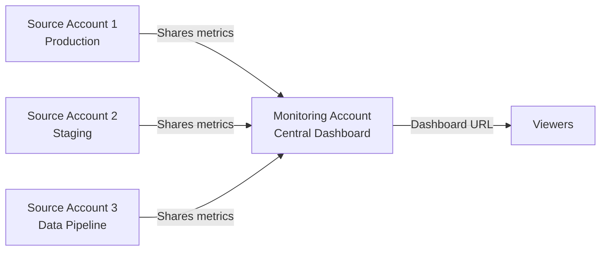

# How to Share CloudWatch Dashboards Across Accounts

Author: [nawazdhandala](https://github.com/nawazdhandala)

Tags: AWS, CloudWatch, Dashboards, Multi-Account, Observability

Description: Learn how to share CloudWatch dashboards across AWS accounts so teams can view centralized monitoring data without switching accounts or credentials.

---

Most organizations that have been on AWS for a while end up with multiple accounts. Maybe you've got separate accounts for production, staging, and development. Or you're using AWS Organizations to isolate different business units. Either way, you eventually hit the same problem: your monitoring data is scattered across accounts, and nobody wants to log into five different consoles to check if things are healthy.

CloudWatch dashboard sharing solves part of this problem. It lets you share a dashboard with people who don't have AWS credentials for the account that owns the dashboard. You can also pull metrics from multiple accounts into a single dashboard using cross-account observability, which we cover in a [separate post](https://oneuptime.com/blog/post/cloudwatch-cross-account-observability/view).

## Dashboard Sharing Options

CloudWatch gives you three ways to share dashboards:

1. **Share with specific IAM users/roles in other accounts** - standard cross-account access
2. **Share publicly with a link** - anyone with the URL can view it (no AWS credentials needed)
3. **Share with SSO users** - for organizations using AWS SSO / IAM Identity Center

Each approach has different security implications. Let's walk through them.

## Option 1: Cross-Account IAM Sharing

This is the most secure option. You create an IAM role in the dashboard account that users from other accounts can assume. Here's how to set it up.

First, create the trust policy in the account that owns the dashboard (Account A):

```json
{
  "Version": "2012-10-17",
  "Statement": [
    {
      "Effect": "Allow",
      "Principal": {
        "AWS": [
          "arn:aws:iam::111111111111:root",
          "arn:aws:iam::222222222222:root"
        ]
      },
      "Action": "sts:AssumeRole",
      "Condition": {
        "StringEquals": {
          "sts:ExternalId": "dashboard-viewer"
        }
      }
    }
  ]
}
```

Then create the role with minimal permissions:

```bash
# Create the IAM role for cross-account dashboard viewing
aws iam create-role \
  --role-name CloudWatchDashboardViewer \
  --assume-role-policy-document file://trust-policy.json

# Attach a policy that only allows viewing dashboards and metrics
aws iam put-role-policy \
  --role-name CloudWatchDashboardViewer \
  --policy-name DashboardViewOnly \
  --policy-document '{
    "Version": "2012-10-17",
    "Statement": [
      {
        "Effect": "Allow",
        "Action": [
          "cloudwatch:GetDashboard",
          "cloudwatch:ListDashboards",
          "cloudwatch:GetMetricData",
          "cloudwatch:ListMetrics",
          "cloudwatch:DescribeAlarms"
        ],
        "Resource": "*"
      }
    ]
  }'
```

Users in the other accounts then assume this role:

```bash
# From Account B, assume the dashboard viewer role in Account A
aws sts assume-role \
  --role-arn arn:aws:iam::333333333333:role/CloudWatchDashboardViewer \
  --role-session-name dashboard-session \
  --external-id dashboard-viewer
```

This works, but it requires everyone to have AWS CLI access or be able to switch roles in the console. For non-technical stakeholders, the next option is usually better.

## Option 2: Public Link Sharing

CloudWatch lets you generate a public URL for any dashboard. Anyone with the link can view it - no AWS account needed. This is incredibly useful for wall displays, sharing with non-technical team members, or embedding in internal wikis.

Here's how to enable it through the console:

1. Open your dashboard in the CloudWatch console.
2. Click the "Share" button in the top right.
3. Choose "Share your dashboard publicly."
4. CloudWatch will set up a Cognito user pool and create a shareable URL.

Behind the scenes, CloudWatch creates an Amazon Cognito user pool, sets up a CloudFront distribution, and generates a URL like `https://d-1234567890.execute-api.us-east-1.amazonaws.com/dashboard/my-app-production`.

You can also set this up programmatically:

```bash
# Enable dashboard sharing (creates Cognito resources)
aws cloudwatch enable-dashboard-sharing \
  --dashboard-name my-app-production
```

To protect the shared dashboard with a simple username/password:

```bash
# Add a user who can access the shared dashboard
aws cognito-idp admin-create-user \
  --user-pool-id us-east-1_XXXXXXXXX \
  --username viewer@example.com \
  --temporary-password TempPass123! \
  --user-attributes Name=email,Value=viewer@example.com
```

## Option 3: SSO Integration

If your organization uses AWS IAM Identity Center (formerly AWS SSO), you can share dashboards with SSO users. This is the best option for organizations that already have SSO configured.

The setup involves creating a CloudWatch dashboard sharing configuration that references your SSO identity provider:

```bash
# Configure SSO-based sharing for dashboards
aws cloudwatch put-dashboard-sharing-configuration \
  --dashboard-name my-app-production \
  --sharing-configuration '{
    "SSOEnabled": true,
    "IdentityProviderArn": "arn:aws:sso:::instance/ssoins-1234567890abcdef",
    "AllowedGroups": ["MonitoringTeam", "Engineering"]
  }'
```

Users who belong to the specified SSO groups can then access the dashboard through their SSO portal without needing any additional credentials.

## Aggregating Metrics from Multiple Accounts

Sharing a dashboard is one thing, but what if the metrics you want to display live in different accounts? You need cross-account metric access.

The recommended approach is to use CloudWatch cross-account observability, where you designate one account as the "monitoring account" and configure other accounts as "source accounts." This lets you query metrics from all source accounts in a single dashboard.

Here's a quick overview of the architecture:



We have a detailed walkthrough of this setup in our [cross-account observability guide](https://oneuptime.com/blog/post/cloudwatch-cross-account-observability/view).

## Building a Multi-Account Dashboard

Once cross-account access is configured, referencing metrics from other accounts in your dashboard is straightforward. You specify the account ID in the metric definition:

```json
{
  "widgets": [
    {
      "type": "metric",
      "properties": {
        "metrics": [
          ["AWS/ECS", "CPUUtilization", "ServiceName", "api-service", "ClusterName", "prod",
            { "accountId": "111111111111", "label": "Prod API CPU", "region": "us-east-1" }],
          ["AWS/ECS", "CPUUtilization", "ServiceName", "api-service", "ClusterName", "staging",
            { "accountId": "222222222222", "label": "Staging API CPU", "region": "us-east-1" }]
        ],
        "title": "API Service CPU - All Environments",
        "view": "timeSeries"
      }
    },
    {
      "type": "alarm",
      "properties": {
        "title": "Cross-Account Alarm Status",
        "alarms": [
          "arn:aws:cloudwatch:us-east-1:111111111111:alarm:ProdHighCPU",
          "arn:aws:cloudwatch:us-east-1:222222222222:alarm:StagingHighCPU"
        ]
      }
    }
  ]
}
```

## Security Best Practices

When sharing dashboards, keep these things in mind:

**Principle of least privilege.** If you're using IAM cross-account roles, only grant `cloudwatch:Get*` and `cloudwatch:List*` permissions. Don't give write access.

**Rotate public link credentials.** If you use the public link sharing option, treat the URL like a secret. Rotate the Cognito credentials periodically.

**Audit access.** Enable CloudTrail logging in the monitoring account so you can see who's accessing the dashboards and when.

**Be careful with log widgets.** If your shared dashboard includes log query widgets, remember that log data might contain sensitive information. The viewer can see whatever the log query returns.

**Use separate dashboards for different audiences.** Don't share an operational dashboard full of detailed metrics with business stakeholders. Create a simplified dashboard that shows the metrics they care about.

## Managing Dashboard Sharing at Scale

For organizations with many accounts and dashboards, use AWS Organizations service control policies (SCPs) to control which accounts can share dashboards and which can't. You might also want to use CloudFormation StackSets to deploy standard dashboards across all accounts automatically.

```bash
# Deploy a standard dashboard to all accounts in an OU
aws cloudformation create-stack-set \
  --stack-set-name standard-monitoring-dashboard \
  --template-body file://dashboard-template.yaml \
  --permission-model SERVICE_MANAGED \
  --auto-deployment Enabled=true,RetainStacksOnAccountRemoval=false
```

## Wrapping Up

Sharing CloudWatch dashboards across accounts doesn't have to be complicated. For quick sharing with non-technical stakeholders, the public link option works great. For secure cross-account access within your organization, IAM role assumption or SSO integration is the way to go. And for truly centralized monitoring, combine dashboard sharing with cross-account observability to pull metrics from all your accounts into one place. Check out our guide on [creating effective CloudWatch dashboards](https://oneuptime.com/blog/post/create-cloudwatch-dashboards-application-monitoring/view) for tips on what to put on those shared dashboards.
