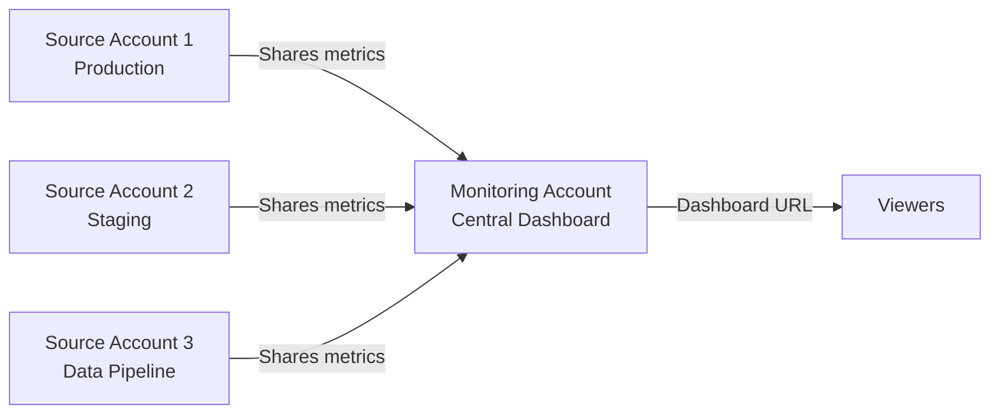

# How to Share CloudWatch Dashboards Across Accounts

Author: [nawazdhandala](https://github.com/nawazdhandala)

Tags: AWS, CloudWatch, Dashboard, Multi-Account, Observability

Description: Learn how to share CloudWatch dashboards across AWS accounts so teams can view centralized monitoring data without switching accounts or credentials.

---

Most organizations that have been on AWS for a while end up with multiple accounts. Maybe you've got separate accounts for production, staging, and development. Or you're using AWS Organizations to isolate different business units. Either way, you eventually hit the same problem: your monitoring data is scattered across accounts, and nobody wants to log into five different consoles to check if things are healthy.

CloudWatch dashboard sharing solves part of this problem. It lets you share a dashboard with people who don't have AWS credentials for the account that owns the dashboard. You can also pull metrics from multiple accounts into a single dashboard using cross-account observability, which we cover in a [separate post](https://oneuptime.com/blog/post/2026-02-12-cloudwatch-cross-account-observability/view).

## Dashboard Sharing Options

CloudWatch gives you three ways to share dashboards:

1. **Share with specific users by email address** - users sign in with a username and password
2. **Share publicly with a link** - anyone with the URL can view it (no AWS credentials needed)
3. **Share all dashboards with an SSO provider** - for organizations using a third-party SAML SSO provider integrated through Amazon Cognito

Each approach has different security implications. Let's walk through them.

## Option 1: Cross-Account IAM Access

This isn't CloudWatch's built-in dashboard sharing feature, but it is the most direct option for AWS users who already have access to another account. You create an IAM role in the dashboard account that users from other accounts can assume. Here's how to set it up.

First, create the trust policy in the account that owns the dashboard (Account A):

```json
{
  "Version": "2012-10-17",
  "Statement": [
    {
      "Effect": "Allow",
      "Principal": {
        "AWS": [
          "arn:aws:iam::111111111111:root",
          "arn:aws:iam::222222222222:root"
        ]
      },
      "Action": "sts:AssumeRole",
      "Condition": {
        "StringEquals": {
          "sts:ExternalId": "dashboard-viewer"
        }
      }
    }
  ]
}
```

Then create the role with minimal permissions:

```bash
# Create the IAM role for cross-account dashboard viewing

aws iam create-role \
  --role-name CloudWatchDashboardViewer \
  --assume-role-policy-document file://trust-policy.json

# Attach a policy that only allows viewing dashboards and metrics
aws iam put-role-policy \
  --role-name CloudWatchDashboardViewer \
  --policy-name DashboardViewOnly \
  --policy-document '{
    "Version": "2012-10-17",
    "Statement": [
      {
        "Effect": "Allow",
        "Action": [
          "cloudwatch:GetDashboard",
          "cloudwatch:ListDashboards",
          "cloudwatch:GetMetricData",
          "cloudwatch:ListMetrics",
          "cloudwatch:DescribeAlarms"
        ],
        "Resource": "*"
      }
    ]
  }'
```

Users in the other accounts then assume this role:

```bash
# From Account B, assume the dashboard viewer role in Account A
aws sts assume-role \
  --role-arn arn:aws:iam::333333333333:role/CloudWatchDashboardViewer \
  --role-session-name dashboard-session \
  --external-id dashboard-viewer
```

This works, but it requires everyone to have AWS credentials and a way to assume the role. For non-technical stakeholders, the next option is usually better.

If you want CloudWatch's built-in username/password sharing instead, use the console flow: open the dashboard, choose **Actions**, **Share dashboard**, then choose **Share your dashboard and require a username and password**. You can invite up to five email addresses, and each invited user receives credentials for the shared dashboard.

## Option 2: Public Link Sharing

CloudWatch lets you generate a public URL for any dashboard. Anyone with the link can view it - no AWS account needed. This is incredibly useful for wall displays, sharing with non-technical team members, or embedding in internal wikis.

Here's how to enable it through the console:

1. Open your dashboard in the CloudWatch console.
2. Click the "Share" button in the top right.
3. Choose "Share your dashboard publicly."
4. CloudWatch will set up a Cognito user pool and create a shareable URL.

Behind the scenes, CloudWatch creates Amazon Cognito and IAM resources in the US East (N. Virginia) Region and generates a shareable URL. AWS doesn't provide a CloudWatch API or AWS CLI command to enable dashboard sharing directly, so use the console sharing flow and avoid modifying the Cognito or IAM resources that CloudWatch creates.

To protect the shared dashboard with a simple username/password, use the specific-user sharing option described above instead of public link sharing.

## Option 3: SSO Integration

If your organization uses a third-party SSO provider that supports SAML, you can share all CloudWatch dashboards in the account with users from that provider. This is the best option for organizations that already have SAML SSO configured.

The setup involves integrating the SAML identity provider with the Amazon Cognito user pool that CloudWatch uses for dashboard sharing:

1. Open the CloudWatch console.
2. In the navigation pane, choose **Settings**.
3. In the **Dashboard sharing** section, choose **Configure**.
4. Choose **Manage SSO providers**.
5. In the Cognito console, add your SAML identity provider to the `CloudWatchDashboardSharing` user pool.

Users who belong to the SSO provider can then access the shared dashboards without separate CloudWatch dashboard passwords.

## Aggregating Metrics from Multiple Accounts

Sharing a dashboard is one thing, but what if the metrics you want to display live in different accounts? You need cross-account metric access.

The recommended approach is to use CloudWatch cross-account observability, where you designate one account as the "monitoring account" and configure other accounts as "source accounts." This lets you query metrics from all source accounts in a single dashboard.

Here's a quick overview of the architecture:


```mermaid
graph LR
    A[Source Account 1<br/>Production] -->|Shares metrics| M[Monitoring Account<br/>Central Dashboard]
    B[Source Account 2<br/>Staging] -->|Shares metrics| M
    C[Source Account 3<br/>Data Pipeline] -->|Shares metrics| M
    M -->|Dashboard URL| V[Viewers]
```

We have a detailed walkthrough of this setup in our [cross-account observability guide](https://oneuptime.com/blog/post/2026-02-12-cloudwatch-cross-account-observability/view).

## Building a Multi-Account Dashboard

Once cross-account access is configured, referencing metrics from other accounts in your dashboard is straightforward. You specify the account ID in the metric definition:

```json
{
  "widgets": [
    {
      "type": "metric",
      "properties": {
        "metrics": [
          ["AWS/ECS", "CPUUtilization", "ServiceName", "api-service", "ClusterName", "prod",
            { "accountId": "111111111111", "label": "Prod API CPU", "region": "us-east-1" }],
          ["AWS/ECS", "CPUUtilization", "ServiceName", "api-service", "ClusterName", "staging",
            { "accountId": "222222222222", "label": "Staging API CPU", "region": "us-east-1" }]
        ],
        "title": "API Service CPU - All Environments",
        "view": "timeSeries"
      }
    },
    {
      "type": "alarm",
      "properties": {
        "title": "Cross-Account Alarm Status",
        "alarms": [
          "arn:aws:cloudwatch:us-east-1:111111111111:alarm:ProdHighCPU",
          "arn:aws:cloudwatch:us-east-1:222222222222:alarm:StagingHighCPU"
        ]
      }
    }
  ]
}
```

## Security Best Practices

When sharing dashboards, keep these things in mind:

**Principle of least privilege.** If you're using IAM cross-account roles, grant only the read permissions needed to view the dashboards and their widgets, such as `cloudwatch:GetDashboard`, `cloudwatch:ListDashboards`, `cloudwatch:GetMetricData`, `cloudwatch:ListMetrics`, and `cloudwatch:DescribeAlarms`. Don't give write access.

**Treat public links like secrets.** If you use the public link sharing option, anyone with the URL can view the dashboard. Stop sharing and create a new link if the URL is exposed more widely than intended. If you use username/password sharing, manage the invited users through the CloudWatch sharing configuration.

**Audit access.** Enable CloudTrail logging in the monitoring account so you can review dashboard and sharing configuration changes. For public dashboard links, don't rely on CloudTrail to identify individual anonymous viewers.

**Be careful with log widgets.** By default, CloudWatch Logs Insights widgets are not visible to people you share a dashboard with. If you update the sharing role to allow log widgets, remember that log data might contain sensitive information. The viewer can see whatever the log query returns.

**Use separate dashboards for different audiences.** Don't share an operational dashboard full of detailed metrics with business stakeholders. Create a simplified dashboard that shows the metrics they care about.

## Managing Dashboard Sharing at Scale

For organizations with many accounts and dashboards, use AWS Organizations service control policies (SCPs) to control which accounts can share dashboards and which can't. You might also want to use CloudFormation StackSets to deploy standard dashboards across all accounts automatically.

```bash
# Deploy a standard dashboard to all accounts in an OU
aws cloudformation create-stack-set \
  --stack-set-name standard-monitoring-dashboard \
  --template-body file://dashboard-template.yaml \
  --permission-model SERVICE_MANAGED \
  --auto-deployment Enabled=true,RetainStacksOnAccountRemoval=false
```

## Wrapping Up

Sharing CloudWatch dashboards across accounts doesn't have to be complicated. For quick sharing with non-technical stakeholders, the public link option works great. For secure cross-account access within your organization, IAM role assumption or SSO integration is the way to go. And for truly centralized monitoring, combine dashboard sharing with cross-account observability to pull metrics from all your accounts into one place. Check out our guide on [creating effective CloudWatch dashboards](https://oneuptime.com/blog/post/2026-02-12-create-cloudwatch-dashboards-application-monitoring/view) for tips on what to put on those shared dashboards.
