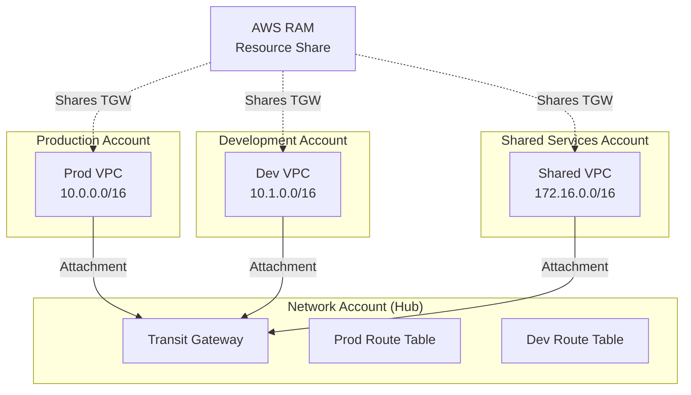

# How to Share Transit Gateway Across AWS Accounts

Author: [nawazdhandala](https://github.com/nawazdhandala)

Tags: AWS, Transit Gateway, Networking, Multi-Account, RAM

Description: Use AWS Resource Access Manager to share a transit gateway across multiple AWS accounts for centralized network management in multi-account architectures.

---

In a multi-account AWS setup, you don't want every account managing its own transit gateway. That defeats the purpose of centralized networking. Instead, you create the transit gateway in a dedicated networking account and share it with all other accounts using AWS Resource Access Manager (RAM).

This is the standard approach for enterprise AWS architectures. The networking team owns the transit gateway, controls the route tables, and grants other accounts the ability to attach their VPCs. It gives you centralized control with decentralized VPC management.

## The Architecture



## Prerequisites

Before you start, make sure:

1. All accounts are in the same AWS Organization (recommended, though not strictly required)
2. RAM sharing with Organizations is enabled
3. The transit gateway exists in the networking account

Enable RAM sharing in your Organization from the management account:

```bash
# Run in the AWS Organizations management account
aws ram enable-sharing-with-aws-organization
```

## Step 1: Create the Resource Share

In the networking account (the one that owns the transit gateway), create a RAM resource share:

```bash
# Run in the networking account
RESOURCE_SHARE=$(aws ram create-resource-share \
  --name "transit-gateway-share" \
  --resource-arns "arn:aws:ec2:us-east-1:000000000000:transit-gateway/$TGW_ID" \
  --principals "arn:aws:organizations::111111111111:organization/o-abc123" \
  --allow-external-principals false \
  --query 'resourceShare.resourceShareArn' \
  --output text)

echo "Resource share: $RESOURCE_SHARE"
```

The `--principals` flag specifies who can use the shared resource. You have several options:

```bash
# Share with the entire organization
--principals "arn:aws:organizations::111111111111:organization/o-abc123"

# Share with a specific OU
--principals "arn:aws:organizations::111111111111:ou/o-abc123/ou-def456"

# Share with a specific account
--principals "222222222222"

# Share with multiple accounts
--principals "222222222222" "333333333333" "444444444444"
```

Sharing with the entire organization is the simplest approach. Any account in the org can then attach VPCs to the transit gateway.

## Step 2: Accept the Share (If Not Using Organizations)

If you shared with specific account IDs instead of an Organization, the receiving accounts need to accept the share:

```bash
# Run in each receiving account
# First, list pending resource share invitations
aws ram get-resource-share-invitations \
  --query 'resourceShareInvitations[?status==`PENDING`]'

# Accept the invitation
aws ram accept-resource-share-invitation \
  --resource-share-invitation-arn $INVITATION_ARN
```

If you shared through AWS Organizations, acceptance is automatic. No action needed in the receiving accounts.

## Step 3: Create VPC Attachments (From Each Account)

Each account creates its own VPC attachment to the shared transit gateway:

```bash
# Run in the production account
ATTACH_PROD=$(aws ec2 create-transit-gateway-vpc-attachment \
  --transit-gateway-id $TGW_ID \
  --vpc-id vpc-prod \
  --subnet-ids subnet-prod-1a subnet-prod-1b \
  --tag-specifications 'ResourceType=transit-gateway-attachment,Tags=[{Key=Name,Value=prod-vpc-attachment},{Key=Environment,Value=production}]' \
  --query 'TransitGatewayVpcAttachment.TransitGatewayAttachmentId' \
  --output text)
```

```bash
# Run in the development account
ATTACH_DEV=$(aws ec2 create-transit-gateway-vpc-attachment \
  --transit-gateway-id $TGW_ID \
  --vpc-id vpc-dev \
  --subnet-ids subnet-dev-1a subnet-dev-1b \
  --tag-specifications 'ResourceType=transit-gateway-attachment,Tags=[{Key=Name,Value=dev-vpc-attachment},{Key=Environment,Value=development}]' \
  --query 'TransitGatewayVpcAttachment.TransitGatewayAttachmentId' \
  --output text)
```

If `AutoAcceptSharedAttachments` is enabled on the transit gateway, attachments are accepted automatically. Otherwise, you need to accept them from the networking account:

```bash
# Run in the networking account to accept a pending attachment
aws ec2 accept-transit-gateway-vpc-attachment \
  --transit-gateway-attachment-id $ATTACH_PROD
```

## Step 4: Configure Route Tables (Networking Account)

Route table management stays in the networking account. This is intentional - you want centralized control over routing:

```bash
# Run in the networking account
# Associate the production attachment with the production route table
aws ec2 associate-transit-gateway-route-table \
  --transit-gateway-route-table-id $RT_PROD \
  --transit-gateway-attachment-id $ATTACH_PROD

# Enable route propagation
aws ec2 enable-transit-gateway-route-table-propagation \
  --transit-gateway-route-table-id $RT_PROD \
  --transit-gateway-attachment-id $ATTACH_SHARED

aws ec2 enable-transit-gateway-route-table-propagation \
  --transit-gateway-route-table-id $RT_SHARED \
  --transit-gateway-attachment-id $ATTACH_PROD
```

## Step 5: Update VPC Route Tables (Each Account)

Each account needs to add routes in their VPC pointing to the transit gateway:

```bash
# In the production account: route to other VPCs through TGW
aws ec2 create-route \
  --route-table-id rtb-prod-private \
  --destination-cidr-block 10.0.0.0/8 \
  --transit-gateway-id $TGW_ID

# In the development account
aws ec2 create-route \
  --route-table-id rtb-dev-private \
  --destination-cidr-block 10.0.0.0/8 \
  --transit-gateway-id $TGW_ID
```

## CloudFormation Across Accounts

You'll need CloudFormation StackSets or separate stacks per account. Here's the networking account stack:

```yaml
# networking-account.yaml
Resources:
  TransitGateway:
    Type: AWS::EC2::TransitGateway
    Properties:
      AutoAcceptSharedAttachments: enable
      DefaultRouteTableAssociation: disable
      DefaultRouteTablePropagation: disable
      DnsSupport: enable
      Tags:
        - Key: Name
          Value: central-tgw

  # Share via RAM
  TransitGatewayShare:
    Type: AWS::RAM::ResourceShare
    Properties:
      Name: transit-gateway-share
      ResourceArns:
        - !Sub "arn:aws:ec2:${AWS::Region}:${AWS::AccountId}:transit-gateway/${TransitGateway}"
      Principals:
        - !Ref OrganizationArn
      AllowExternalPrincipals: false

  # Route tables for segmentation
  ProductionRouteTable:
    Type: AWS::EC2::TransitGatewayRouteTable
    Properties:
      TransitGatewayId: !Ref TransitGateway
      Tags:
        - Key: Name
          Value: production

  DevelopmentRouteTable:
    Type: AWS::EC2::TransitGatewayRouteTable
    Properties:
      TransitGatewayId: !Ref TransitGateway
      Tags:
        - Key: Name
          Value: development

Outputs:
  TransitGatewayId:
    Value: !Ref TransitGateway
```

And the workload account stack (deployed in each account):

```yaml
# workload-account.yaml
Parameters:
  TransitGatewayId:
    Type: String
  VpcId:
    Type: AWS::EC2::VPC::Id
  SubnetIds:
    Type: List<AWS::EC2::Subnet::Id>
  PrivateRouteTableId:
    Type: String

Resources:
  TGWAttachment:
    Type: AWS::EC2::TransitGatewayVpcAttachment
    Properties:
      TransitGatewayId: !Ref TransitGatewayId
      VpcId: !Ref VpcId
      SubnetIds: !Ref SubnetIds
      Tags:
        - Key: Name
          Value: vpc-tgw-attachment

  RouteToTGW:
    Type: AWS::EC2::Route
    DependsOn: TGWAttachment
    Properties:
      RouteTableId: !Ref PrivateRouteTableId
      DestinationCidrBlock: 10.0.0.0/8
      TransitGatewayId: !Ref TransitGatewayId
```

## Monitoring Shared Transit Gateway

From the networking account, monitor all attachments and traffic:

```bash
# List all attachments across accounts
aws ec2 describe-transit-gateway-attachments \
  --filters "Name=transit-gateway-id,Values=$TGW_ID" \
  --query 'TransitGatewayAttachments[].{ID:TransitGatewayAttachmentId,Type:ResourceType,Owner:ResourceOwnerId,State:State}' \
  --output table

# Check bytes transferred per attachment
aws cloudwatch get-metric-statistics \
  --namespace AWS/TransitGateway \
  --metric-name BytesIn \
  --dimensions Name=TransitGateway,Value=$TGW_ID \
  --start-time $(date -u -d '24 hours ago' +%Y-%m-%dT%H:%M:%S) \
  --end-time $(date -u +%Y-%m-%dT%H:%M:%S) \
  --period 3600 \
  --statistics Sum
```

## Best Practices

1. **Dedicated networking account**: Don't put the transit gateway in a workload account. Use a dedicated account for network infrastructure.

2. **Tag everything**: Tags on attachments are essential for cost allocation and identifying which account owns what.

3. **Least privilege RAM sharing**: Share with specific OUs rather than the entire organization if possible.

4. **Centralize route table management**: Don't let workload accounts modify transit gateway route tables. Keep that power in the networking account.

5. **Use dedicated transit subnets**: Create small `/28` subnets in each VPC specifically for the transit gateway attachment.

For the basics of transit gateway setup, see [using AWS Transit Gateway for multi-VPC connectivity](https://oneuptime.com/blog/post/2026-02-12-aws-transit-gateway-multi-vpc-connectivity/view). For advanced routing, see [configuring transit gateway route tables](https://oneuptime.com/blog/post/2026-02-12-configure-transit-gateway-route-tables/view).

## Wrapping Up

Sharing a transit gateway across accounts is the backbone of multi-account AWS networking. RAM handles the sharing, the networking account controls the routing, and workload accounts simply attach their VPCs. It's clean, scalable, and follows the principle of centralized network governance with decentralized workload management.
