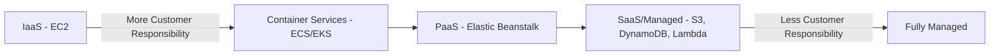

# How to Implement the Shared Responsibility Model on AWS

Author: [nawazdhandala](https://github.com/nawazdhandala)

Tags: AWS, Security, Cloud Architecture, Compliance

Description: A practical guide to implementing the AWS shared responsibility model with concrete steps for securing your side of the equation.

---

The shared responsibility model is one of those things everyone in AWS nods along about but few actually implement systematically. AWS secures the infrastructure - the physical data centers, the hypervisors, the managed service internals. You're responsible for everything you put on top of that. The tricky part is knowing exactly where AWS's responsibility ends and yours begins, because it shifts depending on which services you use.

Let's cut through the theory and look at how you actually implement your side of the shared responsibility model.

## The Responsibility Spectrum

Not all AWS services carry the same customer responsibility. The more managed the service, the less you have to worry about.



With EC2, you're responsible for the operating system, patching, firewall configuration, and everything above. With Lambda, AWS handles the runtime, scaling, and OS - you just handle your code and IAM configuration. Choosing the right service model is itself a security decision.

## Identity and Access Management - Your Most Critical Responsibility

No matter which services you use, IAM is always your responsibility. This is where most AWS security incidents start.

This Terraform configuration sets up an IAM baseline with enforced MFA, password policies, and least-privilege roles.

```hcl
# Enforce a strong password policy
resource "aws_iam_account_password_policy" "strict" {
  minimum_password_length        = 14
  require_lowercase_characters   = true
  require_uppercase_characters   = true
  require_numbers                = true
  require_symbols                = true
  allow_users_to_change_password = true
  max_password_age               = 90
  password_reuse_prevention      = 24
}

# Policy that denies all actions unless MFA is present
resource "aws_iam_policy" "enforce_mfa" {
  name = "enforce-mfa-policy"
  policy = jsonencode({
    Version = "2012-10-17"
    Statement = [
      {
        Sid    = "DenyAllExceptMFAManagement"
        Effect = "Deny"
        NotAction = [
          "iam:CreateVirtualMFADevice",
          "iam:EnableMFADevice",
          "iam:GetUser",
          "iam:ListMFADevices",
          "iam:ListVirtualMFADevices",
          "iam:ResyncMFADevice",
          "sts:GetSessionToken"
        ]
        Resource = "*"
        Condition = {
          BoolIfExists = {
            "aws:MultiFactorAuthPresent" = "false"
          }
        }
      }
    ]
  })
}

# Break-glass emergency access role with strict conditions
resource "aws_iam_role" "emergency_access" {
  name = "emergency-access-role"
  assume_role_policy = jsonencode({
    Version = "2012-10-17"
    Statement = [
      {
        Effect = "Allow"
        Principal = {
          AWS = "arn:aws:iam::${var.account_id}:root"
        }
        Action = "sts:AssumeRole"
        Condition = {
          Bool = {
            "aws:MultiFactorAuthPresent" = "true"
          }
          IpAddress = {
            "aws:SourceIp" = var.allowed_ip_ranges
          }
        }
      }
    ]
  })
}
```

The root account should have MFA enabled and should never be used for daily operations. Create individual IAM users or, better yet, use AWS IAM Identity Center (formerly SSO) to federate from your identity provider.

## Network Security - Your Responsibility for IaaS

When you're running EC2 instances or containers, network security falls squarely on your plate.

Here's a Python script that audits your security groups for overly permissive rules.

```python
import boto3

def audit_security_groups():
    """Find security groups with dangerous inbound rules."""
    ec2 = boto3.client('ec2')
    findings = []

    response = ec2.describe_security_groups()
    for sg in response['SecurityGroups']:
        for rule in sg.get('IpPermissions', []):
            for ip_range in rule.get('IpRanges', []):
                cidr = ip_range.get('CidrIp', '')
                # Flag rules that allow traffic from anywhere
                if cidr == '0.0.0.0/0':
                    port_info = f"Port {rule.get('FromPort', 'ALL')}"
                    if rule.get('IpProtocol') == '-1':
                        port_info = "ALL ports"

                    findings.append({
                        'SecurityGroupId': sg['GroupId'],
                        'SecurityGroupName': sg['GroupName'],
                        'VpcId': sg.get('VpcId', 'EC2-Classic'),
                        'Rule': f"{port_info} open to 0.0.0.0/0",
                        'Severity': 'CRITICAL' if rule.get('FromPort') in [22, 3389, 3306, 5432] else 'HIGH'
                    })

    if findings:
        print(f"Found {len(findings)} overly permissive rules:")
        for f in findings:
            print(f"  [{f['Severity']}] {f['SecurityGroupId']} - {f['Rule']}")
    else:
        print("No overly permissive security group rules found.")

    return findings

audit_security_groups()
```

Run this regularly. Better yet, use AWS Config rules to continuously evaluate security group configurations and automatically remediate violations.

## Data Encryption - Always Your Responsibility

AWS provides the tools, but turning them on is up to you. You're responsible for choosing what to encrypt, managing your keys, and ensuring encryption is enforced.

This CloudFormation template creates an S3 bucket with every security control you should enable.

```yaml
AWSTemplateFormatVersion: '2010-09-09'
Resources:
  SecureBucket:
    Type: AWS::S3::Bucket
    Properties:
      BucketName: !Sub "${AWS::AccountId}-secure-data"
      # Enable default encryption
      BucketEncryption:
        ServerSideEncryptionConfiguration:
          - ServerSideEncryptionByDefault:
              SSEAlgorithm: aws:kms
              KMSMasterKeyID: !Ref DataEncryptionKey
            BucketKeyEnabled: true
      # Enable versioning for data recovery
      VersioningConfiguration:
        Status: Enabled
      # Block all public access
      PublicAccessBlockConfiguration:
        BlockPublicAcls: true
        BlockPublicPolicy: true
        IgnorePublicAcls: true
        RestrictPublicBuckets: true
      # Enable access logging
      LoggingConfiguration:
        DestinationBucketName: !Ref LoggingBucket
        LogFilePrefix: s3-access-logs/

  # Bucket policy that enforces encryption in transit
  SecureBucketPolicy:
    Type: AWS::S3::BucketPolicy
    Properties:
      Bucket: !Ref SecureBucket
      PolicyDocument:
        Statement:
          - Sid: DenyUnencryptedTransport
            Effect: Deny
            Principal: "*"
            Action: "s3:*"
            Resource:
              - !GetAtt SecureBucket.Arn
              - !Sub "${SecureBucket.Arn}/*"
            Condition:
              Bool:
                aws:SecureTransport: false
```

## Patching and Vulnerability Management

For EC2 instances, patching is 100% your responsibility. AWS Systems Manager Patch Manager can automate this.

This configuration sets up automated patching with a maintenance window.

```hcl
# Patch baseline for Amazon Linux 2
resource "aws_ssm_patch_baseline" "production" {
  name             = "production-patch-baseline"
  operating_system = "AMAZON_LINUX_2"

  approval_rule {
    approve_after_days = 7  # Give patches 7 days before auto-approval
    compliance_level   = "HIGH"

    patch_filter {
      key    = "CLASSIFICATION"
      values = ["Security", "Bugfix"]
    }

    patch_filter {
      key    = "SEVERITY"
      values = ["Critical", "Important"]
    }
  }
}

# Maintenance window for patching
resource "aws_ssm_maintenance_window" "patch_window" {
  name              = "weekly-patch-window"
  schedule          = "cron(0 2 ? * SUN *)"  # Every Sunday at 2 AM
  duration          = 3   # 3-hour window
  cutoff            = 1   # Stop scheduling 1 hour before end
  allow_unassociated_targets = false
}

# Target all instances tagged for patching
resource "aws_ssm_maintenance_window_target" "patch_targets" {
  window_id     = aws_ssm_maintenance_window.patch_window.id
  name          = "production-servers"
  resource_type = "INSTANCE"

  targets {
    key    = "tag:PatchGroup"
    values = ["production"]
  }
}
```

## Incident Response - Your Responsibility

AWS will notify you about infrastructure issues, but detecting and responding to security incidents in your workloads is on you. Set up automated detection and response.

This EventBridge rule triggers a Lambda function when GuardDuty finds high-severity threats.

```python
import boto3
import json
import os

def handle_guardduty_finding(event, context):
    """Automatically respond to high-severity GuardDuty findings."""
    finding = event['detail']
    severity = finding['severity']
    finding_type = finding['type']

    sns = boto3.client('sns')
    ec2 = boto3.client('ec2')

    # For high severity findings, take immediate action
    if severity >= 7.0:
        # If an EC2 instance is compromised, isolate it
        if 'Resource' in finding and finding['Resource'].get('ResourceType') == 'Instance':
            instance_id = finding['Resource']['InstanceDetails']['InstanceId']

            # Create an isolation security group
            vpc_id = finding['Resource']['InstanceDetails']['NetworkInterfaces'][0]['VpcId']
            isolation_sg = ec2.create_security_group(
                GroupName=f'isolation-{instance_id}',
                Description=f'Isolation group for compromised instance {instance_id}',
                VpcId=vpc_id
            )

            # Replace all security groups with the isolation group (no rules = no traffic)
            ec2.modify_instance_attribute(
                InstanceId=instance_id,
                Groups=[isolation_sg['GroupId']]
            )

            print(f"Isolated instance {instance_id} due to finding: {finding_type}")

        # Notify the security team
        sns.publish(
            TopicArn=os.environ['SECURITY_TOPIC_ARN'],
            Subject=f'HIGH SEVERITY: {finding_type}',
            Message=json.dumps(finding, indent=2)
        )

    return {'statusCode': 200}
```

## Continuous Compliance Checking

AWS Config is essential for continuously monitoring your compliance with the shared responsibility model. Set up Config rules that check whether you're meeting your obligations.

```yaml
# AWS Config rules for shared responsibility compliance
Resources:
  EncryptedVolumes:
    Type: AWS::Config::ConfigRule
    Properties:
      ConfigRuleName: encrypted-volumes
      Source:
        Owner: AWS
        SourceIdentifier: ENCRYPTED_VOLUMES

  RootMFAEnabled:
    Type: AWS::Config::ConfigRule
    Properties:
      ConfigRuleName: root-account-mfa-enabled
      Source:
        Owner: AWS
        SourceIdentifier: ROOT_ACCOUNT_MFA_ENABLED

  S3BucketEncryption:
    Type: AWS::Config::ConfigRule
    Properties:
      ConfigRuleName: s3-bucket-server-side-encryption-enabled
      Source:
        Owner: AWS
        SourceIdentifier: S3_BUCKET_SERVER_SIDE_ENCRYPTION_ENABLED
```

## Making It Operational

The shared responsibility model isn't a one-time exercise. Build it into your operations. Create runbooks that your team follows for provisioning new resources. Automate compliance checks that run continuously. Review your security posture monthly.

The organizations that get breached aren't usually the ones with sophisticated attackers - they're the ones that forgot their side of the deal. They left an S3 bucket public, used overly broad IAM policies, or didn't patch their instances for months.

For monitoring your compliance posture across all these areas, check out our guide on [logging and monitoring best practices on AWS](https://oneuptime.com/blog/post/2026-02-12-logging-monitoring-best-practices-aws/view). You can also explore [compliance automation on AWS](https://oneuptime.com/blog/post/2026-02-12-compliance-automation-aws/view) for more advanced approaches to staying compliant at scale.
