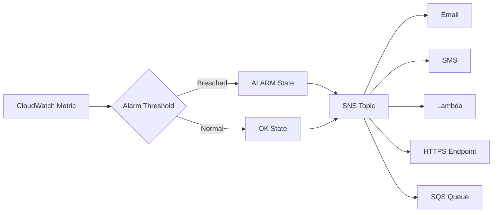

# How to Set Up SNS Notifications from CloudWatch Alarms

Author: [nawazdhandala](https://github.com/nawazdhandala)

Tags: AWS, CloudWatch, SNS, Alarms, Notifications

Description: Learn how to configure Amazon SNS notifications from CloudWatch Alarms to alert your team via email, SMS, Lambda, and other channels when things go wrong.

---

CloudWatch Alarms are only useful if someone actually knows they fired. That's where SNS comes in. Amazon Simple Notification Service acts as the bridge between CloudWatch detecting a problem and your team finding out about it. Whether you want emails, SMS messages, Slack notifications, or automated remediation through Lambda, SNS is how you wire it all together.

This guide covers everything from basic email notifications to multi-channel alerting setups that scale with your infrastructure.

## The Basics: How Alarms and SNS Work Together

The flow is straightforward. A CloudWatch Alarm monitors a metric. When the metric breaches a threshold, the alarm changes state (usually from OK to ALARM). State changes trigger actions, and those actions are SNS topic ARNs. SNS then fans out the notification to all subscribers on that topic.



You can configure actions for three state transitions:
- **ALARM** - metric breached the threshold
- **OK** - metric returned to normal
- **INSUFFICIENT_DATA** - not enough data to evaluate

## Step 1: Create an SNS Topic

First, create an SNS topic that your alarms will publish to:

```bash
# Create an SNS topic for alarm notifications
aws sns create-topic --name infrastructure-alerts

# The output gives you the topic ARN - save this
# arn:aws:sns:us-east-1:123456789012:infrastructure-alerts
```

For better organization, I'd suggest creating separate topics for different severity levels:

```bash
# Create topics for different severity levels
aws sns create-topic --name critical-alerts
aws sns create-topic --name warning-alerts
aws sns create-topic --name info-alerts
```

## Step 2: Add Subscribers

Now subscribe your team to the topic.

**Email subscription:**

```bash
# Subscribe an email address
aws sns subscribe \
  --topic-arn arn:aws:sns:us-east-1:123456789012:critical-alerts \
  --protocol email \
  --notification-endpoint oncall@company.com
```

The recipient will get a confirmation email they must click. Subscriptions don't activate until confirmed.

**SMS subscription:**

```bash
# Subscribe a phone number for SMS
aws sns subscribe \
  --topic-arn arn:aws:sns:us-east-1:123456789012:critical-alerts \
  --protocol sms \
  --notification-endpoint "+15551234567"
```

**Lambda subscription:**

```bash
# Subscribe a Lambda function for automated response
aws sns subscribe \
  --topic-arn arn:aws:sns:us-east-1:123456789012:critical-alerts \
  --protocol lambda \
  --notification-endpoint arn:aws:lambda:us-east-1:123456789012:function:alarm-handler
```

**HTTPS endpoint (for webhooks):**

```bash
# Subscribe an HTTPS endpoint
aws sns subscribe \
  --topic-arn arn:aws:sns:us-east-1:123456789012:critical-alerts \
  --protocol https \
  --notification-endpoint "https://hooks.company.com/alerts"
```

## Step 3: Create a CloudWatch Alarm with SNS Actions

Now create an alarm that publishes to your SNS topic:

```bash
# Create an EC2 CPU utilization alarm with SNS notification
aws cloudwatch put-metric-alarm \
  --alarm-name "HighCPU-WebServer" \
  --alarm-description "CPU exceeds 80% for 10 minutes" \
  --metric-name CPUUtilization \
  --namespace AWS/EC2 \
  --statistic Average \
  --period 300 \
  --threshold 80 \
  --comparison-operator GreaterThanThreshold \
  --evaluation-periods 2 \
  --alarm-actions arn:aws:sns:us-east-1:123456789012:critical-alerts \
  --ok-actions arn:aws:sns:us-east-1:123456789012:info-alerts \
  --dimensions Name=InstanceId,Value=i-0123456789abcdef0
```

Notice the `--ok-actions` parameter. This sends a notification when the alarm recovers, which is just as important as knowing when it fires. Nobody wants to wonder if that 3 AM alarm resolved itself.

## CloudFormation Template

For infrastructure-as-code, here's a complete setup:

```yaml
# CloudFormation template for SNS-integrated CloudWatch alarms
AWSTemplateFormatVersion: '2010-09-09'
Description: CloudWatch alarms with SNS notifications

Parameters:
  AlertEmail:
    Type: String
    Description: Email address for alarm notifications

Resources:
  CriticalAlertsTopic:
    Type: AWS::SNS::Topic
    Properties:
      TopicName: critical-alerts
      DisplayName: Critical Infrastructure Alerts

  EmailSubscription:
    Type: AWS::SNS::Subscription
    Properties:
      TopicArn: !Ref CriticalAlertsTopic
      Protocol: email
      Endpoint: !Ref AlertEmail

  HighCPUAlarm:
    Type: AWS::CloudWatch::Alarm
    Properties:
      AlarmName: HighCPU-Production
      AlarmDescription: Production server CPU is too high
      MetricName: CPUUtilization
      Namespace: AWS/EC2
      Statistic: Average
      Period: 300
      EvaluationPeriods: 2
      Threshold: 80
      ComparisonOperator: GreaterThanThreshold
      AlarmActions:
        - !Ref CriticalAlertsTopic
      OKActions:
        - !Ref CriticalAlertsTopic
      Dimensions:
        - Name: InstanceId
          Value: i-0123456789abcdef0

  HighMemoryAlarm:
    Type: AWS::CloudWatch::Alarm
    Properties:
      AlarmName: HighMemory-Production
      AlarmDescription: Production server memory is running low
      MetricName: mem_used_percent
      Namespace: CWAgent
      Statistic: Average
      Period: 300
      EvaluationPeriods: 2
      Threshold: 90
      ComparisonOperator: GreaterThanThreshold
      AlarmActions:
        - !Ref CriticalAlertsTopic
      OKActions:
        - !Ref CriticalAlertsTopic
```

## Customizing Notification Messages

By default, SNS sends the raw CloudWatch alarm message, which is JSON that looks terrible in an email. You can improve this with a Lambda function that formats the message:

```python
# Lambda function to format CloudWatch alarm notifications
import json
import boto3

sns = boto3.client('sns')

def lambda_handler(event, context):
    # Parse the CloudWatch alarm message from SNS
    message = json.loads(event['Records'][0]['Sns']['Message'])

    alarm_name = message['AlarmName']
    state = message['NewStateValue']
    reason = message['NewStateReason']
    timestamp = message['StateChangeTime']
    region = message['Region']

    # Build a human-readable message
    if state == 'ALARM':
        severity = 'CRITICAL'
        emoji_text = '[ALERT]'
    elif state == 'OK':
        severity = 'RESOLVED'
        emoji_text = '[OK]'
    else:
        severity = 'WARNING'
        emoji_text = '[WARNING]'

    formatted = f"""{emoji_text} {severity}: {alarm_name}

State: {state}
Time: {timestamp}
Region: {region}

Reason: {reason}

View in Console: https://{region}.console.aws.amazon.com/cloudwatch/home?region={region}#alarmsV2:alarm/{alarm_name}
"""

    # Send the formatted message to a different topic
    sns.publish(
        TopicArn='arn:aws:sns:us-east-1:123456789012:formatted-alerts',
        Subject=f'{emoji_text} {alarm_name} is {state}',
        Message=formatted
    )

    return {'statusCode': 200}
```

## Setting Up SNS Message Filtering

If you have one topic but want subscribers to only receive certain types of notifications, use SNS message filtering:

```bash
# Subscribe with a filter policy - only receive ALARM state notifications
aws sns subscribe \
  --topic-arn arn:aws:sns:us-east-1:123456789012:infrastructure-alerts \
  --protocol email \
  --notification-endpoint oncall@company.com \
  --attributes '{
    "FilterPolicy": "{\"NewStateValue\": [\"ALARM\"]}"
  }'
```

This way, the on-call person only gets emails when things break, not when they recover. Meanwhile, the ops dashboard subscription can receive everything.

## Multi-Region Setup

For applications that span multiple regions, you need SNS topics in each region since CloudWatch alarms can only publish to topics in the same region:

```bash
# Create topics in each region your application runs in
for region in us-east-1 us-west-2 eu-west-1; do
  aws sns create-topic --name critical-alerts --region $region

  aws sns subscribe \
    --topic-arn "arn:aws:sns:${region}:123456789012:critical-alerts" \
    --protocol email \
    --notification-endpoint oncall@company.com \
    --region $region
done
```

## SNS Topic Policy

Make sure your SNS topic allows CloudWatch to publish to it:

```json
// SNS topic policy allowing CloudWatch to publish
{
  "Version": "2012-10-17",
  "Statement": [
    {
      "Sid": "AllowCloudWatchAlarms",
      "Effect": "Allow",
      "Principal": {
        "Service": "cloudwatch.amazonaws.com"
      },
      "Action": "SNS:Publish",
      "Resource": "arn:aws:sns:us-east-1:123456789012:critical-alerts",
      "Condition": {
        "ArnLike": {
          "aws:SourceArn": "arn:aws:cloudwatch:us-east-1:123456789012:alarm:*"
        }
      }
    }
  ]
}
```

Apply the policy:

```bash
# Set the topic policy
aws sns set-topic-attributes \
  --topic-arn arn:aws:sns:us-east-1:123456789012:critical-alerts \
  --attribute-name Policy \
  --attribute-value file://topic-policy.json
```

## Testing Your Setup

Always test your alarm notifications before you need them in production:

```bash
# Force an alarm state change to test notifications
aws cloudwatch set-alarm-state \
  --alarm-name "HighCPU-WebServer" \
  --state-value ALARM \
  --state-reason "Testing notification pipeline"

# Wait a moment for the notification to arrive, then reset
aws cloudwatch set-alarm-state \
  --alarm-name "HighCPU-WebServer" \
  --state-value OK \
  --state-reason "Test complete"
```

This is one of those things that's easy to skip but will save you during an actual incident. I've seen setups where the SNS subscription was never confirmed, and the team didn't find out until a real outage hit.

## Best Practices

**Use separate topics for severity levels.** Critical alerts should go to the on-call phone. Warnings should go to email. Info notifications can go to a Slack channel. Mixing everything into one topic leads to alert fatigue.

**Always set OK actions.** Your team needs to know when issues resolve, not just when they start.

**Add alarm descriptions.** When someone gets paged at 2 AM, the alarm description should tell them what the alarm means and what to do about it.

**Confirm all subscriptions.** Unconfirmed email subscriptions silently drop messages. Check periodically that all subscribers are confirmed.

**Consider delivery status logging.** Enable SNS delivery status logging so you can verify that notifications are actually being delivered. Failed deliveries won't generate their own alerts otherwise.

For more advanced integrations, check out our guides on [integrating CloudWatch with PagerDuty](https://oneuptime.com/blog/post/cloudwatch-alarms-pagerduty/view) and [integrating CloudWatch with Slack](https://oneuptime.com/blog/post/cloudwatch-alarms-slack/view).

## Wrapping Up

SNS is the notification backbone of AWS monitoring. Getting the basics right - topics, subscriptions, and alarm actions - takes maybe 15 minutes, but it's the difference between catching problems early and finding out from your users. Start simple with email alerts, then add Lambda-based formatting, Slack integration, and automated remediation as your needs grow.
