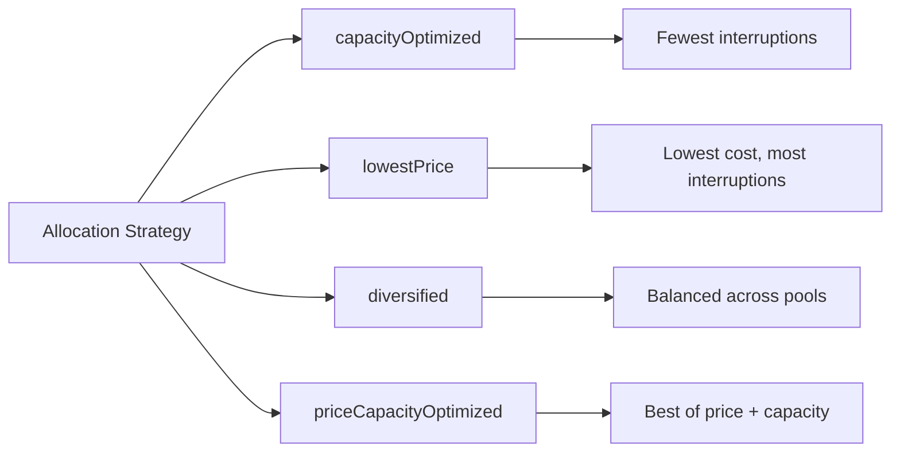

# How to Use Spot Fleet for Diversified Spot Instance Requests

Author: [nawazdhandala](https://github.com/nawazdhandala)

Tags: AWS, EC2, Spot Fleet, Spot Instances, Cost Optimization

Description: Learn how to use AWS Spot Fleet to request capacity across multiple instance types, AZs, and pools for maximum availability and savings.

---

A single Spot Instance request is fine for quick experiments, but for real workloads you need something more robust. That's where Spot Fleet comes in. Spot Fleet lets you request a target capacity across multiple instance types, Availability Zones, and Spot pools in a single API call. It handles the allocation, diversification, and replacement of instances automatically.

Think of Spot Fleet as a smart orchestrator that spreads your Spot requests across the broadest possible set of capacity pools, dramatically reducing the chance of widespread interruption.

## Spot Fleet vs Auto Scaling Group with Spot

Before we dive in, let's address the obvious question: should you use Spot Fleet or an Auto Scaling group with mixed instance types?

For most new projects, AWS recommends Auto Scaling groups with mixed instance policies. They integrate better with load balancers, support lifecycle hooks, and work with instance refresh. However, Spot Fleet still has its place - it's simpler for batch workloads, supports the `lowestPrice` allocation strategy with instance weighting, and can request a target capacity in terms of vCPUs or memory rather than instance count.

Use Spot Fleet when you're running batch or stateless workers. Use ASG with mixed instances when you need load balancer integration and lifecycle management.

## Creating a Basic Spot Fleet Request

A Spot Fleet request specifies the target capacity you want and the launch specifications that describe which instances to launch.

This command creates a Spot Fleet that targets 20 instances across multiple instance types:

```bash
# Create a Spot Fleet request
aws ec2 request-spot-fleet \
  --spot-fleet-request-config '{
    "IamFleetRole": "arn:aws:iam::123456789012:role/aws-ec2-spot-fleet-role",
    "TargetCapacity": 20,
    "SpotPrice": "0.10",
    "TerminateInstancesWithExpiration": true,
    "Type": "maintain",
    "AllocationStrategy": "capacityOptimized",
    "LaunchSpecifications": [
      {
        "ImageId": "ami-0abcdef1234567890",
        "InstanceType": "m5.large",
        "SubnetId": "subnet-111,subnet-222,subnet-333",
        "SecurityGroups": [{"GroupId": "sg-0123456789abcdef0"}],
        "TagSpecifications": [
          {
            "ResourceType": "instance",
            "Tags": [{"Key": "Name", "Value": "spot-worker"}]
          }
        ]
      },
      {
        "ImageId": "ami-0abcdef1234567890",
        "InstanceType": "m5a.large",
        "SubnetId": "subnet-111,subnet-222,subnet-333",
        "SecurityGroups": [{"GroupId": "sg-0123456789abcdef0"}]
      },
      {
        "ImageId": "ami-0abcdef1234567890",
        "InstanceType": "m4.large",
        "SubnetId": "subnet-111,subnet-222,subnet-333",
        "SecurityGroups": [{"GroupId": "sg-0123456789abcdef0"}]
      },
      {
        "ImageId": "ami-0abcdef1234567890",
        "InstanceType": "c5.large",
        "SubnetId": "subnet-111,subnet-222,subnet-333",
        "SecurityGroups": [{"GroupId": "sg-0123456789abcdef0"}]
      }
    ]
  }'
```

The `Type: "maintain"` setting means the fleet will automatically replace interrupted instances to maintain your target capacity. If you only need a one-time batch, use `"request"` instead.

## Allocation Strategies

The allocation strategy determines how Spot Fleet distributes instances across the pools you've defined. This choice has a major impact on both cost and interruption rates.

**capacityOptimized** - Launches from the pools with the most available capacity. Best for minimizing interruptions. This is what AWS recommends for most workloads.

**lowestPrice** - Launches from the cheapest pool. Maximizes savings but concentrates instances, increasing interruption risk.

**diversified** - Spreads instances evenly across all pools. Good middle ground between cost and availability.

**priceCapacityOptimized** - Newer strategy that considers both price and capacity. Picks pools that are both cheap and have good availability.

Here's how they compare:



For production workloads, stick with `capacityOptimized` or `priceCapacityOptimized`.

## Using Launch Templates with Spot Fleet

Launch Templates are the recommended way to define your fleet's instance configuration. They support versioning and additional features that launch specifications don't.

This Spot Fleet configuration uses a Launch Template with multiple overrides for different instance types:

```json
{
  "IamFleetRole": "arn:aws:iam::123456789012:role/aws-ec2-spot-fleet-role",
  "TargetCapacity": 20,
  "Type": "maintain",
  "AllocationStrategy": "capacityOptimized",
  "LaunchTemplateConfigs": [
    {
      "LaunchTemplateSpecification": {
        "LaunchTemplateId": "lt-0123456789abcdef0",
        "Version": "$Latest"
      },
      "Overrides": [
        {"InstanceType": "m5.large", "SubnetId": "subnet-111"},
        {"InstanceType": "m5.large", "SubnetId": "subnet-222"},
        {"InstanceType": "m5a.large", "SubnetId": "subnet-111"},
        {"InstanceType": "m5a.large", "SubnetId": "subnet-222"},
        {"InstanceType": "c5.large", "SubnetId": "subnet-111"},
        {"InstanceType": "c5.large", "SubnetId": "subnet-222"},
        {"InstanceType": "m5d.large", "SubnetId": "subnet-111"},
        {"InstanceType": "m5d.large", "SubnetId": "subnet-222"},
        {"InstanceType": "r5.large", "SubnetId": "subnet-111"},
        {"InstanceType": "r5.large", "SubnetId": "subnet-222"}
      ]
    }
  ]
}
```

Each override creates a separate capacity pool. With 5 instance types across 2 subnets, you get 10 pools. The fleet picks from these based on your allocation strategy.

## Instance Weighting

Not all instances are equal. If your workload is CPU-bound, an m5.xlarge (4 vCPUs) provides twice the capacity of an m5.large (2 vCPUs). Instance weighting lets you express this so the fleet can do the math.

When using weighted capacity, Spot Fleet counts each instance's contribution toward the target based on its weight:

```json
{
  "TargetCapacity": 40,
  "Type": "maintain",
  "AllocationStrategy": "capacityOptimized",
  "LaunchTemplateConfigs": [
    {
      "LaunchTemplateSpecification": {
        "LaunchTemplateId": "lt-0123456789abcdef0",
        "Version": "$Latest"
      },
      "Overrides": [
        {
          "InstanceType": "m5.large",
          "WeightedCapacity": 2,
          "SubnetId": "subnet-111"
        },
        {
          "InstanceType": "m5.xlarge",
          "WeightedCapacity": 4,
          "SubnetId": "subnet-111"
        },
        {
          "InstanceType": "m5.2xlarge",
          "WeightedCapacity": 8,
          "SubnetId": "subnet-111"
        }
      ]
    }
  ]
}
```

With a target of 40 and these weights, the fleet might launch 20 m5.large instances, or 10 m5.xlarge, or 5 m5.2xlarge, or any mix that adds up to 40.

## Monitoring Your Spot Fleet

Once your fleet is running, monitor it to track fulfillment and interruptions.

These commands help you check the current status and history of your Spot Fleet:

```bash
# Check fleet status
aws ec2 describe-spot-fleet-requests \
  --spot-fleet-request-ids sfr-12345678-1234-1234-1234-123456789012 \
  --query 'SpotFleetRequestConfigs[].{
    State:SpotFleetRequestState,
    Target:SpotFleetRequestConfig.TargetCapacity,
    Fulfilled:SpotFleetRequestConfig.FulfilledCapacity
  }'

# List instances in the fleet
aws ec2 describe-spot-fleet-instances \
  --spot-fleet-request-id sfr-12345678-1234-1234-1234-123456789012 \
  --query 'ActiveInstances[].{ID:InstanceId,Type:InstanceType,Health:InstanceHealth}'

# View fleet history
aws ec2 describe-spot-fleet-request-history \
  --spot-fleet-request-id sfr-12345678-1234-1234-1234-123456789012 \
  --start-time $(date -u -d '1 hour ago' +%Y-%m-%dT%H:%M:%S)
```

## Terraform Example

Here's a complete Terraform setup for a Spot Fleet:

```hcl
resource "aws_spot_fleet_request" "workers" {
  iam_fleet_role                      = aws_iam_role.spot_fleet.arn
  spot_price                          = "0.10"
  target_capacity                     = 20
  allocation_strategy                 = "capacityOptimized"
  terminate_instances_with_expiration = true
  fleet_type                          = "maintain"

  launch_template_config {
    launch_template_specification {
      id      = aws_launch_template.worker.id
      version = aws_launch_template.worker.latest_version
    }

    overrides {
      instance_type = "m5.large"
      subnet_id     = var.subnet_a
    }
    overrides {
      instance_type = "m5a.large"
      subnet_id     = var.subnet_a
    }
    overrides {
      instance_type = "c5.large"
      subnet_id     = var.subnet_b
    }
    overrides {
      instance_type = "m5.large"
      subnet_id     = var.subnet_b
    }
  }

  tags = {
    Name = "spot-worker-fleet"
  }
}
```

## Modifying Fleet Capacity

You can scale your fleet up or down by modifying the target capacity:

```bash
# Scale up to 30 instances
aws ec2 modify-spot-fleet-request \
  --spot-fleet-request-id sfr-12345678-1234-1234-1234-123456789012 \
  --target-capacity 30

# Scale down to 10 instances
aws ec2 modify-spot-fleet-request \
  --spot-fleet-request-id sfr-12345678-1234-1234-1234-123456789012 \
  --target-capacity 10
```

When scaling down, the fleet terminates instances based on the allocation strategy in reverse. With `capacityOptimized`, it removes instances from the pools most likely to be interrupted anyway.

## Cancelling a Spot Fleet

When you're done, cancel the fleet. Make sure to decide whether to terminate the running instances or leave them running.

```bash
# Cancel fleet and terminate all instances
aws ec2 cancel-spot-fleet-requests \
  --spot-fleet-request-ids sfr-12345678-1234-1234-1234-123456789012 \
  --terminate-instances

# Cancel fleet but keep instances running
aws ec2 cancel-spot-fleet-requests \
  --spot-fleet-request-ids sfr-12345678-1234-1234-1234-123456789012 \
  --no-terminate-instances
```

## Summary

Spot Fleet is a powerful tool for running diversified Spot capacity at scale. By spreading requests across many instance types and AZs, you minimize the impact of interruptions while maximizing your savings. Use the `capacityOptimized` allocation strategy, include at least 6-10 instance types, and spread across all available AZs. For workloads that need load balancer integration and advanced lifecycle management, consider using [Auto Scaling groups with mixed instances](https://oneuptime.com/blog/post/mix-on-demand-spot-instances-auto-scaling-groups/view) instead.
