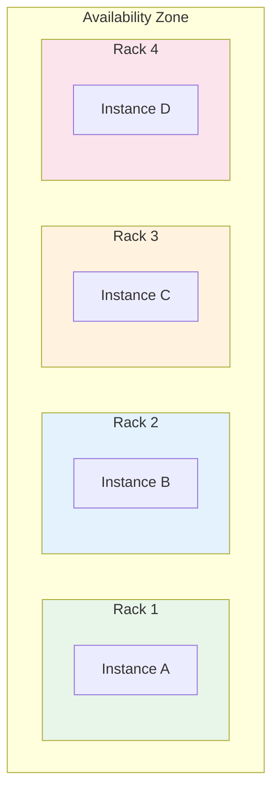

# How to Use Spread Placement Groups for High Availability

Author: [nawazdhandala](https://github.com/nawazdhandala)

Tags: AWS, EC2, Placement Groups, High Availability, Fault Tolerance

Description: Learn how to use EC2 spread placement groups to maximize availability by ensuring instances run on distinct underlying hardware.

---

When you're running a small set of critical instances, the worst thing that can happen is a hardware failure taking out multiple instances at once. If two database replicas happen to sit on the same physical host and that host dies, you've lost your quorum. Spread placement groups prevent this by guaranteeing that each instance runs on separate underlying hardware.

This isn't about performance - it's about survival. Let's set it up.

## How Spread Placement Groups Work

A spread placement group ensures that each instance is placed on a distinct physical rack, with its own network and power source. If a rack fails, only one instance in the group is affected.



There's an important limitation: spread placement groups support a maximum of 7 instances per Availability Zone. If you need more than 7 instances per AZ, look at partition placement groups instead.

## When to Use Spread Placement Groups

Spread placement groups are perfect for:

- **Database clusters** - Ensure replicas are on different hardware (MongoDB, Cassandra, Redis clusters)
- **ZooKeeper / etcd ensembles** - Quorum-based systems where losing multiple nodes means losing the quorum
- **Kafka brokers** - Keep brokers on separate racks to prevent partition leader loss
- **Critical application tiers** - Small sets of instances that must stay available
- **Active-active failover pairs** - Primary and secondary nodes that shouldn't share hardware

They're not the right choice for large-scale workloads (more than 7 instances per AZ) or for workloads that need low inter-node latency (use cluster placement groups for that).

## Creating a Spread Placement Group

The process is straightforward:

```bash
# Create a spread placement group
aws ec2 create-placement-group \
  --group-name critical-db-spread \
  --strategy spread \
  --spread-level rack \
  --tag-specifications 'ResourceType=placement-group,Tags=[{Key=Name,Value=critical-db-spread},{Key=Service,Value=database}]'
```

The `spread-level` can be `rack` (each instance on a different rack) or `host` (each instance on a different physical host). Rack-level gives you network and power isolation, which is what you typically want.

## Launching Instances into a Spread Group

Here's how to launch instances that are guaranteed to be on separate hardware:

```bash
# Launch database replicas on separate hardware
for i in 1 2 3; do
  aws ec2 run-instances \
    --image-id ami-0abcdef1234567890 \
    --instance-type r5.2xlarge \
    --count 1 \
    --placement GroupName=critical-db-spread \
    --subnet-id subnet-0123456789abcdef0 \
    --key-name my-keypair \
    --security-group-ids sg-0123456789abcdef0 \
    --tag-specifications "ResourceType=instance,Tags=[{Key=Name,Value=db-replica-$i},{Key=Role,Value=database}]"
done
```

Each launch request goes to a different rack. If AWS can't place the instance on a unique rack (because all 7 per-AZ slots are used or capacity is low), the launch fails rather than silently placing instances on shared hardware. This fail-safe behavior is exactly what you want for critical infrastructure.

## Multi-AZ Spread Configuration

For maximum availability, spread your instances across multiple AZs. You get 7 instances per AZ, so a 3-AZ spread gives you up to 21 instances on completely separate hardware.

This Terraform configuration creates a spread placement group with instances across multiple AZs:

```hcl
resource "aws_placement_group" "db_spread" {
  name         = "db-spread"
  strategy     = "spread"
  spread_level = "rack"
}

# Data source to get AZ-specific subnets
data "aws_subnets" "private" {
  filter {
    name   = "vpc-id"
    values = [var.vpc_id]
  }
  filter {
    name   = "tag:Tier"
    values = ["private"]
  }
}

resource "aws_instance" "db_replica" {
  count = 3

  ami                    = var.db_ami_id
  instance_type          = "r5.2xlarge"
  key_name               = var.key_name
  subnet_id              = data.aws_subnets.private.ids[count.index % length(data.aws_subnets.private.ids)]
  vpc_security_group_ids = [aws_security_group.db.id]

  placement_group = aws_placement_group.db_spread.id

  root_block_device {
    volume_type = "gp3"
    volume_size = 100
    encrypted   = true
  }

  tags = {
    Name = "db-replica-${count.index + 1}"
    Role = "database"
  }
}
```

## Spread Groups with Auto Scaling

You can use spread placement groups with Auto Scaling groups. The ASG will place instances according to the spread rules:

```bash
# Create ASG with spread placement group
aws autoscaling create-auto-scaling-group \
  --auto-scaling-group-name critical-service-asg \
  --launch-template LaunchTemplateId=lt-0123456789abcdef0,Version='$Latest' \
  --min-size 3 \
  --max-size 7 \
  --desired-capacity 5 \
  --vpc-zone-identifier "subnet-111,subnet-222,subnet-333" \
  --placement-group critical-db-spread
```

Remember the 7-per-AZ limit. If your ASG spans 3 AZs and you set max-size to more than 21, the ASG might fail to launch instances when it hits the spread limit. Set your max-size accordingly.

## Handling the 7-Instance Limit

The 7-instance-per-AZ limit is the main constraint of spread placement groups. Here are strategies for working around it:

**Use multiple AZs** - With 3 AZs, you get 21 slots. Most spread-worthy workloads don't need more than this.

**Use partition placement groups** - If you need more instances with hardware isolation, partition placement groups give you up to 7 partitions per AZ, each on separate racks, with unlimited instances per partition.

**Split into multiple spread groups** - If your application has separate tiers (e.g., primary DB + read replicas + cache), put each tier in its own spread group.

```bash
# Separate spread groups for different tiers
aws ec2 create-placement-group --group-name db-primary-spread --strategy spread
aws ec2 create-placement-group --group-name db-replica-spread --strategy spread
aws ec2 create-placement-group --group-name cache-spread --strategy spread
```

## Verifying Placement

After launching instances, verify they're actually on separate hardware:

```bash
# Check instance placement details
aws ec2 describe-instances \
  --filters "Name=placement-group-name,Values=critical-db-spread" \
  --query 'Reservations[].Instances[].{
    ID:InstanceId,
    Name:Tags[?Key==`Name`].Value|[0],
    AZ:Placement.AvailabilityZone,
    HostId:Placement.HostId,
    State:State.Name
  }' \
  --output table
```

Each instance should show a different HostId, confirming they're on separate physical hardware.

## Monitoring Spread Group Health

Keeping tabs on the health of instances in a spread group is critical since these are typically your most important instances. Set up CloudWatch alarms for:

- **StatusCheckFailed_System** - Detects underlying hardware problems
- **StatusCheckFailed_Instance** - Detects OS-level issues

```bash
# Create alarm for system status check failures
aws cloudwatch put-metric-alarm \
  --alarm-name "db-replica-1-system-check" \
  --metric-name StatusCheckFailed_System \
  --namespace AWS/EC2 \
  --statistic Maximum \
  --period 60 \
  --evaluation-periods 2 \
  --threshold 1 \
  --comparison-operator GreaterThanOrEqualToThreshold \
  --dimensions Name=InstanceId,Value=i-1234567890abcdef0 \
  --alarm-actions arn:aws:sns:us-east-1:123456789012:ops-alerts
```

For comprehensive monitoring of your critical spread-group instances, including application-level health checks and automated incident response, consider using [OneUptime's monitoring platform](https://oneuptime.com/blog/post/configure-health-checks-ec2-load-balancer/view) to get real-time visibility into your infrastructure health.

## Cost Considerations

Spread placement groups don't cost extra. There's no additional charge for using them. The only cost consideration is that if capacity is limited on distinct racks, your instance launch might fail, and you'd need to either retry, use a different instance type, or use a different AZ.

Since spread groups are typically used for small, critical clusters, the 7-per-AZ limit rarely impacts cost optimization. You're not running hundreds of instances in a spread group - you're protecting your most important handful.

## Summary

Spread placement groups are a simple, no-cost way to protect your critical small clusters from correlated hardware failures. They guarantee each instance runs on a distinct rack with independent network and power. Use them for database clusters, quorum-based systems, and any small set of instances where losing multiple nodes simultaneously would be catastrophic. The 7-instance-per-AZ limit is the main constraint, but for the workloads spread groups are designed for, it's rarely a problem. For larger distributed systems, check out [partition placement groups](https://oneuptime.com/blog/post/partition-placement-groups-large-distributed-systems/view).
