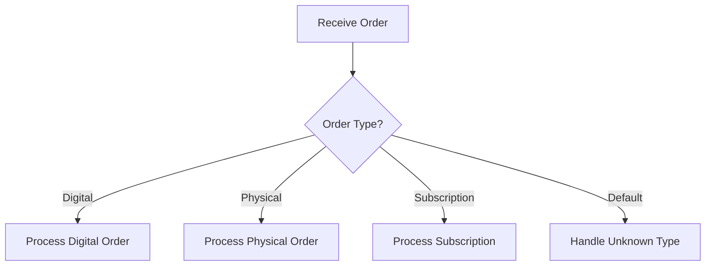

# Use Step Functions Choice State for Branching Logic

Author: [nawazdhandala](https://github.com/nawazdhandala)

Tags: AWS, Step Functions, Serverless

Description: Learn how to use the AWS Step Functions Choice state to implement conditional branching, routing, and decision logic in your workflows.

---

Real-world workflows aren't linear. Orders take different paths based on payment status. Notifications go through different channels based on user preferences. Data processing steps vary based on the type of input. The Step Functions Choice state handles all of this by evaluating conditions and routing execution to different branches.

Think of it as the if/else of your state machine.

## How Choice States Work

A Choice state evaluates one or more conditions against the current state input and routes to the appropriate next state. It doesn't execute any tasks itself - it just makes decisions.



Every Choice state needs at least one rule in the `Choices` array and should have a `Default` state for cases that don't match any rule.

## Basic Comparison Operators

Choice states support a wide range of comparison operators. Here are the most common ones.

This routes based on a string value in the input:

```json
{
  "RouteByStatus": {
    "Type": "Choice",
    "Choices": [
      {
        "Variable": "$.status",
        "StringEquals": "approved",
        "Next": "ProcessApproved"
      },
      {
        "Variable": "$.status",
        "StringEquals": "rejected",
        "Next": "HandleRejection"
      },
      {
        "Variable": "$.status",
        "StringEquals": "pending",
        "Next": "WaitForApproval"
      }
    ],
    "Default": "HandleUnknownStatus"
  }
}
```

And here's numeric comparison for routing based on order value:

```json
{
  "RouteByOrderValue": {
    "Type": "Choice",
    "Choices": [
      {
        "Variable": "$.orderTotal",
        "NumericGreaterThan": 10000,
        "Next": "HighValueProcess"
      },
      {
        "Variable": "$.orderTotal",
        "NumericGreaterThanEquals": 1000,
        "Next": "MediumValueProcess"
      },
      {
        "Variable": "$.orderTotal",
        "NumericLessThan": 1000,
        "Next": "StandardProcess"
      }
    ],
    "Default": "StandardProcess"
  }
}
```

The available comparison operators include: `StringEquals`, `StringGreaterThan`, `StringLessThan`, `StringMatches` (with wildcards), `NumericEquals`, `NumericGreaterThan`, `NumericLessThan`, `BooleanEquals`, `TimestampEquals`, `TimestampGreaterThan`, `TimestampLessThan`, and `IsPresent`, `IsNull`, `IsString`, `IsNumeric`, `IsBoolean`.

## Combining Conditions with And/Or/Not

Simple comparisons aren't always enough. You can combine multiple conditions using `And`, `Or`, and `Not`.

This routes based on multiple criteria at once:

```json
{
  "ComplexRouting": {
    "Type": "Choice",
    "Choices": [
      {
        "And": [
          {
            "Variable": "$.isPremiumCustomer",
            "BooleanEquals": true
          },
          {
            "Variable": "$.orderTotal",
            "NumericGreaterThan": 500
          }
        ],
        "Next": "PremiumFastTrack"
      },
      {
        "Or": [
          {
            "Variable": "$.region",
            "StringEquals": "us-east-1"
          },
          {
            "Variable": "$.region",
            "StringEquals": "us-west-2"
          }
        ],
        "Next": "ProcessDomestic"
      },
      {
        "Not": {
          "Variable": "$.emailVerified",
          "BooleanEquals": true
        },
        "Next": "RequestVerification"
      }
    ],
    "Default": "ProcessInternational"
  }
}
```

Premium customers with orders over $500 get fast-tracked. Orders from US regions go through domestic processing. Unverified emails get routed to verification. Everything else goes to international processing.

## Pattern Matching with StringMatches

The `StringMatches` operator supports wildcards, which is handy for routing based on patterns.

This routes based on file extensions or URL patterns:

```json
{
  "RouteByFileType": {
    "Type": "Choice",
    "Choices": [
      {
        "Variable": "$.fileName",
        "StringMatches": "*.jpg",
        "Next": "ProcessImage"
      },
      {
        "Variable": "$.fileName",
        "StringMatches": "*.pdf",
        "Next": "ProcessDocument"
      },
      {
        "Variable": "$.fileName",
        "StringMatches": "*.csv",
        "Next": "ProcessSpreadsheet"
      }
    ],
    "Default": "ProcessGenericFile"
  }
}
```

The `*` wildcard matches any sequence of characters. Note that only `*` is supported - there's no regex matching in Choice states. If you need complex pattern matching, do it in a Lambda function and return a routing key.

## Checking for Missing Data

Sometimes you need to branch based on whether a field exists or is null. The `IsPresent` and `IsNull` operators handle this.

This checks for optional fields before processing:

```json
{
  "CheckOptionalFields": {
    "Type": "Choice",
    "Choices": [
      {
        "Not": {
          "Variable": "$.shippingAddress",
          "IsPresent": true
        },
        "Next": "RequestShippingAddress"
      },
      {
        "Variable": "$.paymentMethod",
        "IsNull": true,
        "Next": "RequestPayment"
      },
      {
        "And": [
          {
            "Variable": "$.shippingAddress",
            "IsPresent": true
          },
          {
            "Not": {
              "Variable": "$.paymentMethod",
              "IsNull": true
            }
          }
        ],
        "Next": "ProcessOrder"
      }
    ],
    "Default": "CollectInformation"
  }
}
```

## Real-World Example: Support Ticket Routing

Let's build a practical example - routing support tickets to the right team based on priority, category, and customer tier.

First, a Lambda function enriches the ticket with customer data:

```javascript
// enrichTicket.js - Adds customer information to the ticket
const { DynamoDBClient } = require('@aws-sdk/client-dynamodb');
const { DynamoDBDocumentClient, GetCommand } = require('@aws-sdk/lib-dynamodb');

const ddbClient = DynamoDBDocumentClient.from(new DynamoDBClient({}));

exports.handler = async (event) => {
  const { customerId, subject, body, category } = event;

  // Look up customer tier
  const customer = await ddbClient.send(new GetCommand({
    TableName: 'Customers',
    Key: { customerId }
  }));

  // Determine priority from keywords
  const urgentKeywords = ['down', 'outage', 'critical', 'emergency', 'broken'];
  const isUrgent = urgentKeywords.some(keyword =>
    subject.toLowerCase().includes(keyword) ||
    body.toLowerCase().includes(keyword)
  );

  return {
    ...event,
    customerTier: customer.Item?.tier || 'standard',
    priority: isUrgent ? 'urgent' : 'normal',
    enrichedAt: new Date().toISOString()
  };
};
```

Now the Choice state routes based on the enriched data:

```json
{
  "Comment": "Support ticket routing workflow",
  "StartAt": "EnrichTicket",
  "States": {
    "EnrichTicket": {
      "Type": "Task",
      "Resource": "arn:aws:lambda:us-east-1:123456789:function:enrich-ticket",
      "Next": "RouteTicket"
    },
    "RouteTicket": {
      "Type": "Choice",
      "Choices": [
        {
          "And": [
            {
              "Variable": "$.priority",
              "StringEquals": "urgent"
            },
            {
              "Variable": "$.customerTier",
              "StringEquals": "enterprise"
            }
          ],
          "Next": "EscalateToSeniorEngineer"
        },
        {
          "Variable": "$.priority",
          "StringEquals": "urgent",
          "Next": "AssignToOnCall"
        },
        {
          "Variable": "$.category",
          "StringEquals": "billing",
          "Next": "RouteToBilling"
        },
        {
          "Variable": "$.category",
          "StringEquals": "technical",
          "Next": "RouteToEngineering"
        }
      ],
      "Default": "RouteToGeneralSupport"
    },
    "EscalateToSeniorEngineer": {
      "Type": "Task",
      "Resource": "arn:aws:lambda:us-east-1:123456789:function:assign-ticket",
      "Parameters": {
        "ticket.$": "$",
        "queue": "senior-engineering",
        "sla": "1hour"
      },
      "End": true
    },
    "AssignToOnCall": {
      "Type": "Task",
      "Resource": "arn:aws:lambda:us-east-1:123456789:function:assign-ticket",
      "Parameters": {
        "ticket.$": "$",
        "queue": "on-call",
        "sla": "4hours"
      },
      "End": true
    },
    "RouteToBilling": {
      "Type": "Task",
      "Resource": "arn:aws:lambda:us-east-1:123456789:function:assign-ticket",
      "Parameters": {
        "ticket.$": "$",
        "queue": "billing",
        "sla": "24hours"
      },
      "End": true
    },
    "RouteToEngineering": {
      "Type": "Task",
      "Resource": "arn:aws:lambda:us-east-1:123456789:function:assign-ticket",
      "Parameters": {
        "ticket.$": "$",
        "queue": "engineering",
        "sla": "8hours"
      },
      "End": true
    },
    "RouteToGeneralSupport": {
      "Type": "Task",
      "Resource": "arn:aws:lambda:us-east-1:123456789:function:assign-ticket",
      "Parameters": {
        "ticket.$": "$",
        "queue": "general",
        "sla": "24hours"
      },
      "End": true
    }
  }
}
```

## Choice State Best Practices

Always include a `Default` state. If none of your conditions match and there's no default, the execution fails. Put your most specific conditions first, since Step Functions evaluates them in order and takes the first match. Keep your conditions simple - if you need complex logic, put it in a Lambda function and use the Choice state to route based on a simple output field.

For more on building resilient Step Functions workflows, check out our post on [handling errors and retries in Step Functions](https://oneuptime.com/blog/post/2026-02-12-handle-errors-retries-step-functions/view).

## Wrapping Up

The Choice state is how you add intelligence to your workflows. Instead of running the same sequence of steps every time, your workflow can adapt based on the data it's processing. Combined with other state types like Wait and Parallel, you can model surprisingly complex business logic without writing orchestration code. The key is keeping each Choice state focused on one decision and letting the state machine's structure handle the overall flow.
