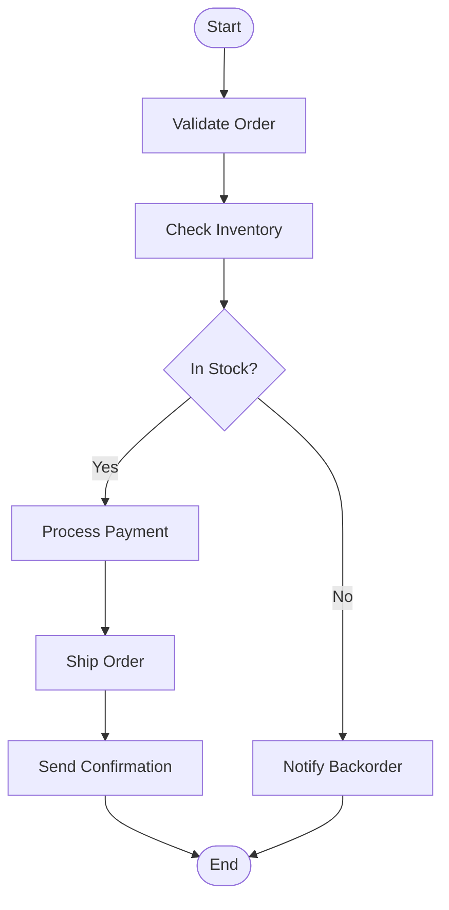

# Use Step Functions for Orchestrating Serverless Workflows

Author: [nawazdhandala](https://github.com/nawazdhandala)

Tags: AWS, Step Functions, Serverless, Lambda

Description: Learn how to use AWS Step Functions to orchestrate multi-step serverless workflows with built-in error handling, retries, and visual monitoring.

---

When your serverless application grows beyond a single Lambda function, you need something to coordinate the work. Chaining Lambdas together by having one invoke another gets messy fast. You lose visibility, error handling becomes a nightmare, and debugging feels like detective work.

AWS Step Functions solves this by giving you a state machine that orchestrates your Lambda functions (and other AWS services) with built-in error handling, retries, and a visual workflow editor.

## What Step Functions Actually Does

Think of Step Functions as a conductor for an orchestra. Each musician (Lambda function) knows how to play their part, but someone needs to manage the timing, handle mistakes, and make sure everything flows together. That's Step Functions.

You define your workflow as a state machine using Amazon States Language (ASL), which is just JSON. Each state in the machine does something - runs a Lambda, waits, makes a decision, or processes data in parallel.



## Creating Your First State Machine

Let's build an order processing workflow. We'll start with the state machine definition.

This definition chains three Lambda functions together in sequence:

```json
{
  "Comment": "Order processing workflow",
  "StartAt": "ValidateOrder",
  "States": {
    "ValidateOrder": {
      "Type": "Task",
      "Resource": "arn:aws:lambda:us-east-1:123456789:function:validate-order",
      "Next": "CheckInventory",
      "Catch": [
        {
          "ErrorEquals": ["ValidationError"],
          "Next": "OrderFailed"
        }
      ]
    },
    "CheckInventory": {
      "Type": "Task",
      "Resource": "arn:aws:lambda:us-east-1:123456789:function:check-inventory",
      "Next": "ProcessPayment",
      "Retry": [
        {
          "ErrorEquals": ["States.TaskFailed"],
          "IntervalSeconds": 2,
          "MaxAttempts": 3,
          "BackoffRate": 2.0
        }
      ]
    },
    "ProcessPayment": {
      "Type": "Task",
      "Resource": "arn:aws:lambda:us-east-1:123456789:function:process-payment",
      "Next": "OrderComplete"
    },
    "OrderComplete": {
      "Type": "Succeed"
    },
    "OrderFailed": {
      "Type": "Fail",
      "Error": "OrderProcessingFailed",
      "Cause": "Order validation failed"
    }
  }
}
```

Notice the `Catch` and `Retry` fields. This is one of the biggest advantages of Step Functions - error handling is declarative and built into the workflow definition itself.

## Writing the Lambda Functions

Each Lambda function in the workflow receives input and returns output. The output of one state becomes the input to the next.

This validation function checks the order data and passes it along:

```javascript
// validateOrder.js - First step in the order workflow
exports.handler = async (event) => {
  console.log('Validating order:', JSON.stringify(event));

  const { orderId, items, customerId } = event;

  // Check for required fields
  if (!orderId || !items || !customerId) {
    // This error name matches our Catch block
    const error = new Error('Missing required order fields');
    error.name = 'ValidationError';
    throw error;
  }

  if (items.length === 0) {
    const error = new Error('Order must contain at least one item');
    error.name = 'ValidationError';
    throw error;
  }

  // Calculate total and pass enriched data to next step
  const total = items.reduce((sum, item) => sum + (item.price * item.quantity), 0);

  return {
    ...event,
    orderTotal: total,
    validatedAt: new Date().toISOString(),
    status: 'validated'
  };
};
```

The inventory check function queries your database and returns availability:

```javascript
// checkInventory.js - Verifies all items are available
const { DynamoDBClient } = require('@aws-sdk/client-dynamodb');
const { DynamoDBDocumentClient, GetCommand } = require('@aws-sdk/lib-dynamodb');

const ddbClient = DynamoDBDocumentClient.from(new DynamoDBClient({}));

exports.handler = async (event) => {
  const { items } = event;
  const unavailable = [];

  for (const item of items) {
    const result = await ddbClient.send(new GetCommand({
      TableName: 'Inventory',
      Key: { productId: item.productId }
    }));

    if (!result.Item || result.Item.quantity < item.quantity) {
      unavailable.push(item.productId);
    }
  }

  if (unavailable.length > 0) {
    return {
      ...event,
      inventoryStatus: 'insufficient',
      unavailableItems: unavailable
    };
  }

  return {
    ...event,
    inventoryStatus: 'available',
    inventoryCheckedAt: new Date().toISOString()
  };
};
```

## Deploying with SAM

Here's a SAM template that creates the state machine and its Lambda functions.

This template defines the full workflow including IAM roles:

```yaml
AWSTemplateFormatVersion: '2010-09-09'
Transform: AWS::Serverless-2016-10-31

Resources:
  OrderStateMachine:
    Type: AWS::Serverless::StateMachine
    Properties:
      DefinitionUri: statemachine/order-processing.asl.json
      DefinitionSubstitutions:
        ValidateOrderArn: !GetAtt ValidateOrderFunction.Arn
        CheckInventoryArn: !GetAtt CheckInventoryFunction.Arn
        ProcessPaymentArn: !GetAtt ProcessPaymentFunction.Arn
      Policies:
        - LambdaInvokePolicy:
            FunctionName: !Ref ValidateOrderFunction
        - LambdaInvokePolicy:
            FunctionName: !Ref CheckInventoryFunction
        - LambdaInvokePolicy:
            FunctionName: !Ref ProcessPaymentFunction

  ValidateOrderFunction:
    Type: AWS::Serverless::Function
    Properties:
      Handler: validateOrder.handler
      Runtime: nodejs20.x
      CodeUri: src/

  CheckInventoryFunction:
    Type: AWS::Serverless::Function
    Properties:
      Handler: checkInventory.handler
      Runtime: nodejs20.x
      CodeUri: src/

  ProcessPaymentFunction:
    Type: AWS::Serverless::Function
    Properties:
      Handler: processPayment.handler
      Runtime: nodejs20.x
      CodeUri: src/
```

## Starting an Execution

You can start a workflow execution from another Lambda, the CLI, or API Gateway.

This starts the state machine with order data as input:

```javascript
// startOrder.js - Kicks off the order processing workflow
const { SFNClient, StartExecutionCommand } = require('@aws-sdk/client-sfn');

const sfnClient = new SFNClient({});

exports.handler = async (event) => {
  const order = JSON.parse(event.body);

  const result = await sfnClient.send(new StartExecutionCommand({
    stateMachineArn: process.env.STATE_MACHINE_ARN,
    name: `order-${order.orderId}-${Date.now()}`,
    input: JSON.stringify(order)
  }));

  return {
    statusCode: 202,
    body: JSON.stringify({
      message: 'Order processing started',
      executionArn: result.executionArn
    })
  };
};
```

## Input and Output Processing

Step Functions lets you filter and transform data between states using InputPath, OutputPath, and ResultPath.

This state definition only passes relevant fields to the Lambda and merges the result back:

```json
{
  "CheckInventory": {
    "Type": "Task",
    "Resource": "arn:aws:lambda:us-east-1:123456789:function:check-inventory",
    "InputPath": "$.items",
    "ResultPath": "$.inventoryResult",
    "OutputPath": "$",
    "Next": "ProcessPayment"
  }
}
```

`InputPath` selects what data the Lambda receives. `ResultPath` decides where to put the Lambda's output within the overall state. `OutputPath` filters what gets passed to the next state. These three fields give you fine-grained control over data flow without modifying your Lambda functions.

## Monitoring Executions

The Step Functions console shows you a visual representation of each execution, highlighting which state is running, which succeeded, and which failed. It's one of the best debugging experiences in AWS.

For production workloads, you'll want to set up CloudWatch alarms on execution failures and timeouts. Check out our post on [monitoring serverless workflows](https://oneuptime.com/blog/post/2026-02-12-monitor-step-functions-executions-console/view) for more details on setting this up properly.

## When to Use Step Functions

Step Functions shines when you have multi-step processes that need coordination, visibility, and reliable error handling. Order processing, ETL pipelines, user onboarding flows, and approval workflows are all great fits. If you're just calling one Lambda from another, you probably don't need it yet. But the moment you add a third step or need retry logic, reach for Step Functions instead of building that plumbing yourself.

## Wrapping Up

Step Functions takes the chaos out of multi-step serverless workflows. You get visual debugging, declarative error handling, and automatic retries without writing that infrastructure code yourself. The learning curve for Amazon States Language is real, but once you've built a couple of workflows, the productivity gains are significant.
