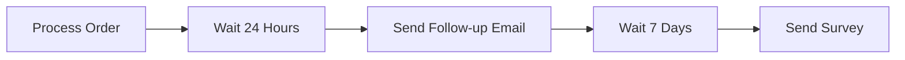

# Use Step Functions Wait State for Delays

Author: [nawazdhandala](https://github.com/nawazdhandala)

Tags: AWS, Step Functions, Serverless

Description: Learn how to use the AWS Step Functions Wait state to add delays, schedule future actions, and implement time-based logic in your workflows.

---

Sometimes your workflow needs to wait. Maybe you're sending a follow-up email 24 hours after sign-up. Maybe you're polling an external service every 30 seconds until it's ready. Maybe you need to schedule something for a specific date and time. The Step Functions Wait state handles all of these cases without keeping a Lambda function running (and billing you) the whole time.

## How the Wait State Works

The Wait state pauses the execution for a specified amount of time or until a specific timestamp. During this pause, you're not consuming any compute resources. Step Functions handles the scheduling internally. You pay for one state transition, not for the waiting time.

This is a huge advantage over other approaches like sleeping inside a Lambda function (which would time out after 15 minutes anyway) or using SQS delay queues (which max out at 15 minutes).



## Fixed Duration Waits

The simplest Wait state pauses for a fixed number of seconds.

This waits exactly 60 seconds before proceeding:

```json
{
  "WaitOneMinute": {
    "Type": "Wait",
    "Seconds": 60,
    "Next": "CheckStatus"
  }
}
```

You can wait up to one year with Standard workflows, which is the maximum execution duration. For longer waits, you'd need to break the workflow into stages.

## Dynamic Duration Waits

Sometimes the wait duration isn't known at design time - it comes from the input data. Use `SecondsPath` to reference a value in the state input.

This reads the delay duration from the workflow input:

```json
{
  "DynamicWait": {
    "Type": "Wait",
    "SecondsPath": "$.waitTimeSeconds",
    "Next": "ProcessResult"
  }
}
```

If your input is `{"waitTimeSeconds": 3600, "orderId": "123"}`, the workflow waits one hour. This is useful when different items need different cooldown periods.

## Waiting Until a Specific Timestamp

Instead of waiting a duration, you can wait until a specific date and time. Use the `Timestamp` field for a hardcoded time or `TimestampPath` for a dynamic one.

This waits until a scheduled delivery time from the input:

```json
{
  "WaitForDeliveryWindow": {
    "Type": "Wait",
    "TimestampPath": "$.scheduledDeliveryTime",
    "Next": "StartDelivery"
  }
}
```

The timestamp must be in ISO 8601 format: `2026-03-15T14:30:00Z`. Your Lambda function can calculate this and include it in the workflow input.

Here's a function that calculates a future timestamp:

```javascript
// scheduleFollowUp.js - Calculates when to send a follow-up
exports.handler = async (event) => {
  const { signUpDate, followUpDelayHours } = event;

  // Calculate the follow-up timestamp
  const followUpTime = new Date(signUpDate);
  followUpTime.setHours(followUpTime.getHours() + followUpDelayHours);

  // Adjust for business hours (9 AM - 5 PM ET)
  const hour = followUpTime.getUTCHours() - 5; // EST offset
  if (hour < 9) {
    followUpTime.setUTCHours(14); // Set to 9 AM ET
  } else if (hour >= 17) {
    followUpTime.setDate(followUpTime.getDate() + 1);
    followUpTime.setUTCHours(14); // Next day 9 AM ET
  }

  return {
    ...event,
    followUpTimestamp: followUpTime.toISOString()
  };
};
```

## Polling Pattern with Wait States

One of the most common uses for Wait states is polling - checking a long-running operation periodically until it completes.

This workflow polls an external job until it finishes or times out:

```json
{
  "Comment": "Poll for job completion",
  "StartAt": "StartJob",
  "States": {
    "StartJob": {
      "Type": "Task",
      "Resource": "arn:aws:lambda:us-east-1:123456789:function:start-job",
      "Next": "WaitForCompletion"
    },
    "WaitForCompletion": {
      "Type": "Wait",
      "Seconds": 30,
      "Next": "CheckJobStatus"
    },
    "CheckJobStatus": {
      "Type": "Task",
      "Resource": "arn:aws:lambda:us-east-1:123456789:function:check-job-status",
      "Next": "IsJobComplete"
    },
    "IsJobComplete": {
      "Type": "Choice",
      "Choices": [
        {
          "Variable": "$.status",
          "StringEquals": "COMPLETED",
          "Next": "ProcessResults"
        },
        {
          "Variable": "$.status",
          "StringEquals": "FAILED",
          "Next": "HandleFailure"
        },
        {
          "Variable": "$.pollCount",
          "NumericGreaterThan": 60,
          "Next": "HandleTimeout"
        }
      ],
      "Default": "WaitForCompletion"
    },
    "ProcessResults": {
      "Type": "Task",
      "Resource": "arn:aws:lambda:us-east-1:123456789:function:process-results",
      "End": true
    },
    "HandleFailure": {
      "Type": "Fail",
      "Error": "JobFailed",
      "Cause": "The external job failed"
    },
    "HandleTimeout": {
      "Type": "Fail",
      "Error": "PollingTimeout",
      "Cause": "Job did not complete within polling limit"
    }
  }
}
```

The check-status function increments a counter to track how many times we've polled:

```javascript
// checkJobStatus.js - Checks if external job is done
const axios = require('axios');

exports.handler = async (event) => {
  const { jobId, pollCount = 0 } = event;

  // Call external service to check job status
  const response = await axios.get(
    `https://api.external-service.com/jobs/${jobId}`
  );

  return {
    ...event,
    status: response.data.status,
    result: response.data.result || null,
    pollCount: pollCount + 1
  };
};
```

## Progressive Backoff Polling

Polling every 30 seconds is fine, but sometimes you want to start frequent and back off over time. You can achieve this with a dynamic wait.

This workflow increases the wait time with each poll attempt:

```json
{
  "CalculateWaitTime": {
    "Type": "Pass",
    "Parameters": {
      "waitTime.$": "States.MathAdd(States.MathMultiply($.pollCount, 10), 10)",
      "maxWait": 300
    },
    "ResultPath": "$.waitConfig",
    "Next": "DynamicWait"
  },
  "DynamicWait": {
    "Type": "Wait",
    "SecondsPath": "$.waitConfig.waitTime",
    "Next": "CheckStatus"
  }
}
```

Alternatively, you can calculate the wait time in your Lambda function:

```javascript
// calculateBackoff.js - Determines how long to wait before next poll
exports.handler = async (event) => {
  const { pollCount = 0 } = event;

  // Start at 10s, increase by 10s each poll, cap at 5 minutes
  const waitSeconds = Math.min(10 + (pollCount * 10), 300);

  return {
    ...event,
    waitTimeSeconds: waitSeconds,
    pollCount: pollCount + 1
  };
};
```

## Scheduled Email Drip Campaign

Here's a practical example - a drip campaign that sends emails at specific intervals after user sign-up.

This workflow sends a series of emails with delays between each one:

```json
{
  "Comment": "New user email drip campaign",
  "StartAt": "SendWelcomeEmail",
  "States": {
    "SendWelcomeEmail": {
      "Type": "Task",
      "Resource": "arn:aws:lambda:us-east-1:123456789:function:send-email",
      "Parameters": {
        "userId.$": "$.userId",
        "template": "welcome",
        "email.$": "$.email"
      },
      "ResultPath": "$.emailResults.welcome",
      "Next": "WaitOneDay"
    },
    "WaitOneDay": {
      "Type": "Wait",
      "Seconds": 86400,
      "Next": "SendGettingStartedEmail"
    },
    "SendGettingStartedEmail": {
      "Type": "Task",
      "Resource": "arn:aws:lambda:us-east-1:123456789:function:send-email",
      "Parameters": {
        "userId.$": "$.userId",
        "template": "getting_started",
        "email.$": "$.email"
      },
      "ResultPath": "$.emailResults.gettingStarted",
      "Next": "WaitThreeDays"
    },
    "WaitThreeDays": {
      "Type": "Wait",
      "Seconds": 259200,
      "Next": "CheckEngagement"
    },
    "CheckEngagement": {
      "Type": "Task",
      "Resource": "arn:aws:lambda:us-east-1:123456789:function:check-engagement",
      "Next": "IsUserEngaged"
    },
    "IsUserEngaged": {
      "Type": "Choice",
      "Choices": [
        {
          "Variable": "$.engaged",
          "BooleanEquals": true,
          "Next": "SendProTipsEmail"
        }
      ],
      "Default": "SendReEngagementEmail"
    },
    "SendProTipsEmail": {
      "Type": "Task",
      "Resource": "arn:aws:lambda:us-east-1:123456789:function:send-email",
      "Parameters": {
        "userId.$": "$.userId",
        "template": "pro_tips",
        "email.$": "$.email"
      },
      "End": true
    },
    "SendReEngagementEmail": {
      "Type": "Task",
      "Resource": "arn:aws:lambda:us-east-1:123456789:function:send-email",
      "Parameters": {
        "userId.$": "$.userId",
        "template": "re_engagement",
        "email.$": "$.email"
      },
      "End": true
    }
  }
}
```

This workflow runs for about 4 days total. With Standard workflows, that's no problem. And during the wait periods, you're not paying for any compute.

## Costs During Waits

A common question: do you pay while the workflow is waiting? No. You pay per state transition, not per second of execution time. A workflow that waits 30 days costs the same as one that waits 30 seconds - one state transition in, one state transition out.

## Monitoring Long-Running Workflows

When you have workflows that wait for hours or days, monitoring becomes important. You'll want to track how many executions are currently in a waiting state and alert if any have been waiting longer than expected. For guidance on monitoring Step Functions, see our post on [monitoring Step Functions executions in the console](https://oneuptime.com/blog/post/2026-02-12-monitor-step-functions-executions-console/view).

## Wrapping Up

The Wait state is simple but surprisingly powerful. It lets you add time-based logic to your workflows without burning compute resources. Whether you're building polling loops, drip campaigns, or scheduled actions, the Wait state handles the timing while you focus on the business logic. Just remember that you need Standard workflows for waits longer than 5 minutes, since Express workflows have a 5-minute maximum duration.
