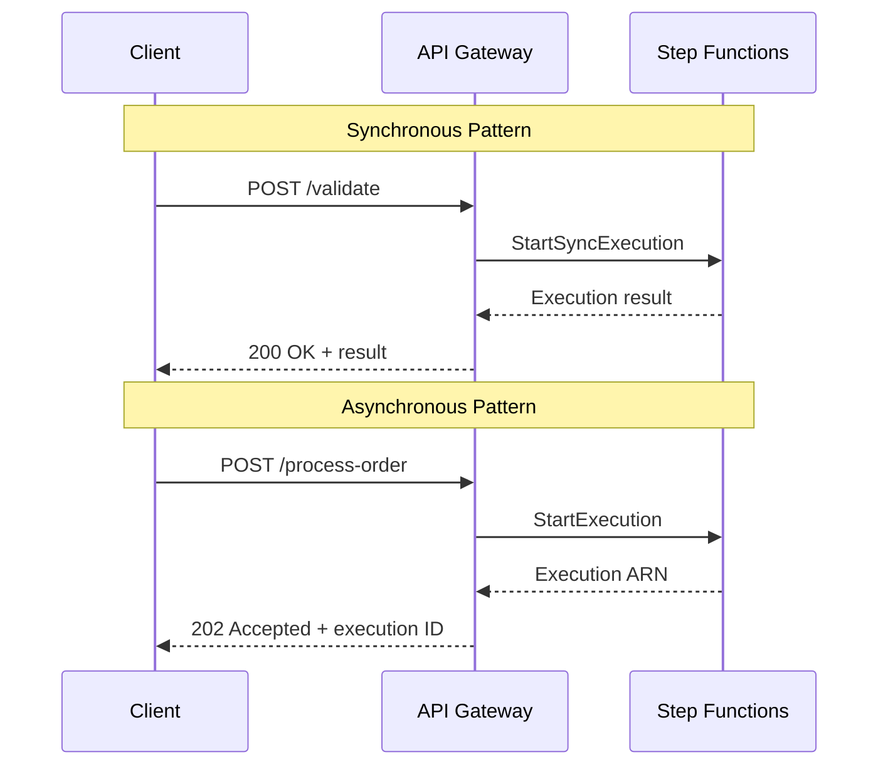

# Use Step Functions with API Gateway

Author: [nawazdhandala](https://github.com/nawazdhandala)

Tags: AWS, Step Functions, API Gateway, Serverless

Description: Learn how to trigger Step Functions workflows directly from API Gateway for synchronous and asynchronous API-driven workflow execution.

---

API Gateway and Step Functions are a natural pair. Instead of having API Gateway call a Lambda function that then starts a Step Functions execution, you can connect them directly. This eliminates the middleman Lambda and gives you two powerful patterns: synchronous execution (wait for the result) and asynchronous execution (fire and forget).

## Synchronous vs Asynchronous

The choice between sync and async depends on your use case. Synchronous integrations are for when the client needs the result right away - form submissions, data validations, quick calculations. Asynchronous integrations are for long-running processes where the client just needs confirmation that the work started.



## Setting Up Asynchronous Integration

The async pattern starts an execution and returns immediately. This works with Standard workflows.

First, create an IAM role that allows API Gateway to start Step Functions executions:

```json
{
  "Version": "2012-10-17",
  "Statement": [
    {
      "Effect": "Allow",
      "Action": "states:StartExecution",
      "Resource": "arn:aws:states:us-east-1:123456789:stateMachine:OrderProcessor"
    }
  ]
}
```

Then configure API Gateway to use an AWS service integration. Here's the SAM template:

```yaml
AWSTemplateFormatVersion: '2010-09-09'
Transform: AWS::Serverless-2016-10-31

Resources:
  OrderApi:
    Type: AWS::Serverless::Api
    Properties:
      StageName: prod
      DefinitionBody:
        openapi: "3.0"
        info:
          title: "Order API"
          version: "1.0"
        paths:
          /orders:
            post:
              x-amazon-apigateway-integration:
                type: aws
                httpMethod: POST
                uri: !Sub "arn:aws:apigateway:${AWS::Region}:states:action/StartExecution"
                credentials: !GetAtt ApiGatewayStepFunctionsRole.Arn
                requestTemplates:
                  application/json: !Sub |
                    {
                      "stateMachineArn": "${OrderStateMachine.Arn}",
                      "input": "$util.escapeJavaScript($input.body)"
                    }
                responses:
                  "200":
                    statusCode: "202"
                    responseTemplates:
                      application/json: |
                        {
                          "executionId": "$input.json('executionArn').split(':').get(7)",
                          "status": "processing"
                        }
              responses:
                "202":
                  description: "Order accepted for processing"
```

The request template maps the API request body to the Step Functions StartExecution input. The response template extracts the execution ID from the ARN and returns a clean response.

## Setting Up Synchronous Integration

Synchronous execution works with Express workflows. The client waits for the workflow to complete and gets the result back.

This SAM template connects API Gateway to a synchronous Express workflow:

```yaml
Resources:
  ValidationApi:
    Type: AWS::Serverless::Api
    Properties:
      StageName: prod
      DefinitionBody:
        openapi: "3.0"
        info:
          title: "Validation API"
          version: "1.0"
        paths:
          /validate:
            post:
              x-amazon-apigateway-integration:
                type: aws
                httpMethod: POST
                uri: !Sub "arn:aws:apigateway:${AWS::Region}:states:action/StartSyncExecution"
                credentials: !GetAtt ApiRole.Arn
                requestTemplates:
                  application/json: !Sub |
                    {
                      "stateMachineArn": "${ValidationStateMachine.Arn}",
                      "input": "$util.escapeJavaScript($input.body)"
                    }
                responses:
                  "200":
                    statusCode: "200"
                    responseTemplates:
                      application/json: |
                        #set($output = $util.parseJson($input.json('output')))
                        $output

  ValidationStateMachine:
    Type: AWS::Serverless::StateMachine
    Properties:
      Type: EXPRESS
      DefinitionUri: statemachine/validation.asl.json
      Policies:
        - LambdaInvokePolicy:
            FunctionName: !Ref ValidateFunction
```

## HTTP API Integration (Simpler)

If you're using HTTP APIs (the newer, cheaper API Gateway type), the integration is even simpler.

This creates an HTTP API with a Step Functions integration:

```yaml
Resources:
  HttpApi:
    Type: AWS::ApiGatewayV2::Api
    Properties:
      Name: OrderHttpApi
      ProtocolType: HTTP

  StepFunctionsIntegration:
    Type: AWS::ApiGatewayV2::Integration
    Properties:
      ApiId: !Ref HttpApi
      IntegrationType: AWS_PROXY
      IntegrationSubtype: StepFunctions-StartExecution
      PayloadFormatVersion: "1.0"
      CredentialsArn: !GetAtt HttpApiRole.Arn
      RequestParameters:
        StateMachineArn: !Ref OrderStateMachine
        Input: "$request.body"

  OrderRoute:
    Type: AWS::ApiGatewayV2::Route
    Properties:
      ApiId: !Ref HttpApi
      RouteKey: "POST /orders"
      Target: !Sub "integrations/${StepFunctionsIntegration}"
```

HTTP APIs handle the request/response mapping automatically, which saves you from writing those Velocity templates.

## Checking Execution Status

For async workflows, clients need a way to check if their request is done. Add a status endpoint.

This Lambda function checks the status of a Step Functions execution:

```javascript
// getExecutionStatus.js - Returns current status of a workflow execution
const { SFNClient, DescribeExecutionCommand } = require('@aws-sdk/client-sfn');

const sfnClient = new SFNClient({});
const STATE_MACHINE_ARN = process.env.STATE_MACHINE_ARN;

exports.handler = async (event) => {
  const executionId = event.pathParameters.executionId;

  // Reconstruct the full execution ARN from the ID
  const executionArn = `${STATE_MACHINE_ARN.replace(
    ':stateMachine:',
    ':execution:'
  )}:${executionId}`;

  try {
    const result = await sfnClient.send(new DescribeExecutionCommand({
      executionArn
    }));

    const response = {
      executionId,
      status: result.status,
      startDate: result.startDate
    };

    // Include output only if execution is complete
    if (result.status === 'SUCCEEDED') {
      response.output = JSON.parse(result.output);
      response.stopDate = result.stopDate;
    }

    if (result.status === 'FAILED') {
      response.error = result.error;
      response.cause = result.cause;
    }

    return {
      statusCode: 200,
      headers: { 'Content-Type': 'application/json' },
      body: JSON.stringify(response)
    };
  } catch (error) {
    if (error.name === 'ExecutionDoesNotExist') {
      return {
        statusCode: 404,
        body: JSON.stringify({ message: 'Execution not found' })
      };
    }
    throw error;
  }
};
```

## Request Validation

API Gateway can validate requests before they reach Step Functions, saving you state transitions on invalid input.

This model validates the request body at the API Gateway level:

```yaml
Resources:
  OrderModel:
    Type: AWS::ApiGateway::Model
    Properties:
      RestApiId: !Ref OrderApi
      ContentType: application/json
      Schema:
        type: object
        required:
          - customerId
          - items
        properties:
          customerId:
            type: string
            minLength: 1
          items:
            type: array
            minItems: 1
            items:
              type: object
              required:
                - productId
                - quantity
              properties:
                productId:
                  type: string
                quantity:
                  type: integer
                  minimum: 1

  RequestValidator:
    Type: AWS::ApiGateway::RequestValidator
    Properties:
      RestApiId: !Ref OrderApi
      ValidateRequestBody: true
```

## Error Response Mapping

When a synchronous execution fails, you want to return a meaningful HTTP error, not a raw Step Functions error.

This response mapping converts Step Functions errors to proper HTTP responses:

```yaml
responses:
  "200":
    statusCode: "200"
    responseTemplates:
      application/json: |
        #set($status = $input.json('status'))
        #if($status == "SUCCEEDED")
          $input.json('output')
        #elseif($status == "FAILED")
          #set($context.responseOverride.status = 400)
          {
            "error": $input.json('error'),
            "message": $input.json('cause')
          }
        #else
          #set($context.responseOverride.status = 500)
          {"error": "Unexpected execution status: $status"}
        #end
```

## Full Client Example

Here's how a client interacts with both patterns.

This shows the async pattern with polling:

```javascript
// Client code for async workflow
async function submitOrder(orderData) {
  // Start the workflow
  const response = await fetch('https://api.example.com/orders', {
    method: 'POST',
    headers: { 'Content-Type': 'application/json' },
    body: JSON.stringify(orderData)
  });

  const { executionId } = await response.json();

  // Poll for completion
  let status = 'RUNNING';
  while (status === 'RUNNING') {
    await new Promise(resolve => setTimeout(resolve, 2000));

    const statusResponse = await fetch(
      `https://api.example.com/orders/${executionId}/status`
    );
    const result = await statusResponse.json();
    status = result.status;

    if (status === 'SUCCEEDED') {
      return result.output;
    }

    if (status === 'FAILED') {
      throw new Error(result.error);
    }
  }
}
```

## Monitoring the Integration

Set up CloudWatch alarms on both API Gateway and Step Functions metrics. Watch for 5xx errors on the API side and execution failures on the Step Functions side. A spike in API Gateway errors without corresponding Step Functions failures usually means your integration mapping has a problem. For more on this, see our post on [monitoring Step Functions executions](https://oneuptime.com/blog/post/2026-02-12-monitor-step-functions-executions-console/view).

## Wrapping Up

Connecting API Gateway directly to Step Functions gives you a clean architecture for API-driven workflows. Use synchronous Express workflows for fast, request-response patterns. Use asynchronous Standard workflows for long-running processes with a status polling endpoint. Either way, you skip the unnecessary Lambda proxy and get a simpler, cheaper system.
