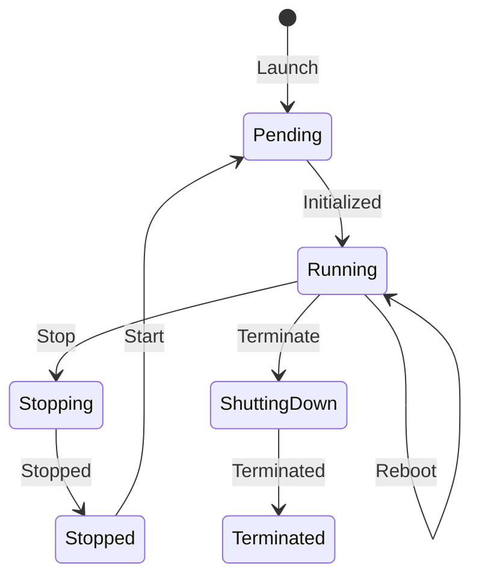

# How to Stop, Start, and Terminate EC2 Instances

Author: [nawazdhandala](https://github.com/nawazdhandala)

Tags: AWS, EC2, Instance Management, Cost Optimization, Infrastructure

Description: Understanding the differences between stopping, starting, hibernating, and terminating EC2 instances, with practical examples for each operation.

---

Managing the lifecycle of EC2 instances is something you'll do constantly. Whether you're shutting down development environments overnight to save money, rebooting instances for maintenance, or decommissioning old servers, you need to understand the differences between stop, start, reboot, and terminate. Each one behaves differently, and choosing the wrong one can either waste money or destroy data.

## Instance States Explained

An EC2 instance moves through several states during its lifecycle:



Each transition has different implications for your data, IP address, and billing.

## Stopping an Instance

Stopping an instance is like shutting down a computer. The instance powers off, but your EBS volumes (including the root volume) are preserved.

### What Happens When You Stop

- **EBS volumes persist** - all data on attached EBS volumes is saved
- **Instance store data is lost** - if your instance type has local NVMe storage, that data is gone
- **Public IP changes** - the auto-assigned public IP is released (use an [Elastic IP](https://oneuptime.com/blog/post/2026-02-12-assign-elastic-ip-address-to-ec2-instance/view) to prevent this)
- **Private IP stays** - the private IP in your VPC doesn't change
- **Billing stops for compute** - you stop paying for the instance hours
- **EBS charges continue** - you still pay for EBS volume storage

### Via the Console

Select the instance > Instance state > Stop instance > Confirm

### Via the CLI

```bash
# Stop an EC2 instance
aws ec2 stop-instances --instance-ids i-0123456789abcdef0

# Wait for it to fully stop
aws ec2 wait instance-stopped --instance-ids i-0123456789abcdef0
echo "Instance stopped"
```

### Stop Multiple Instances at Once

```bash
# Stop multiple instances (e.g., dev environment at end of day)
aws ec2 stop-instances --instance-ids \
    i-0123456789abcdef0 \
    i-0987654321fedcba0 \
    i-0abcdef1234567890
```

## Starting a Stopped Instance

Starting brings a stopped instance back to life. The instance may launch on different physical hardware than before.

### What Happens When You Start

- **EBS volumes reattach** - your data is right where you left it
- **New public IP assigned** - unless you have an Elastic IP
- **Instance may move to different host** - this is normal and usually transparent
- **User data scripts may run again** - depending on how they're configured
- **Billing resumes** - compute charges start again

### Via the CLI

```bash
# Start a stopped instance
aws ec2 start-instances --instance-ids i-0123456789abcdef0

# Wait for it to be running
aws ec2 wait instance-running --instance-ids i-0123456789abcdef0

# Also wait for status checks to pass
aws ec2 wait instance-status-ok --instance-ids i-0123456789abcdef0
echo "Instance is running and healthy"
```

## Rebooting an Instance

A reboot is equivalent to an OS-level restart. It's faster than stop/start because the instance stays on the same physical host.

### What Happens When You Reboot

- **Everything stays the same** - public IP, private IP, instance store data, all preserved
- **Brief interruption** - typically 1-3 minutes
- **Billing continues** - no pause in charges
- **Status checks temporarily fail** - normal during reboot

```bash
# Reboot an instance
aws ec2 reboot-instances --instance-ids i-0123456789abcdef0
```

Use reboot when you need to restart a service or apply a kernel update, and you don't need to change the instance type.

## Terminating an Instance

Terminating is permanent. The instance is deleted, and by default, the root EBS volume is also deleted.

### What Happens When You Terminate

- **Instance is permanently deleted** - you cannot undo this
- **Root volume is deleted** - unless `DeleteOnTermination` is set to false
- **Additional EBS volumes may or may not be deleted** - depends on the `DeleteOnTermination` setting for each volume
- **Elastic IP is disassociated** - but not released (you still own it)
- **Instance store data is lost** - permanently
- **Billing stops** - after the instance enters "terminated" state

### Via the Console

Select the instance > Instance state > Terminate instance > Confirm

### Via the CLI

```bash
# Terminate an instance (this is permanent!)
aws ec2 terminate-instances --instance-ids i-0123456789abcdef0
```

### Protect Against Accidental Termination

For important instances, enable termination protection:

```bash
# Enable termination protection
aws ec2 modify-instance-attribute \
    --instance-id i-0123456789abcdef0 \
    --disable-api-termination

# Now this will fail:
aws ec2 terminate-instances --instance-ids i-0123456789abcdef0
# Error: The instance 'i-0123456789abcdef0' may not be terminated.
```

To terminate a protected instance, you first have to disable the protection:

```bash
# Disable termination protection when you really want to terminate
aws ec2 modify-instance-attribute \
    --instance-id i-0123456789abcdef0 \
    --no-disable-api-termination

# Now termination will work
aws ec2 terminate-instances --instance-ids i-0123456789abcdef0
```

### Preserve the Root Volume

If you want the root volume to survive termination:

```bash
# Change the root volume to persist after termination
aws ec2 modify-instance-attribute \
    --instance-id i-0123456789abcdef0 \
    --block-device-mappings '[{"DeviceName":"/dev/xvda","Ebs":{"DeleteOnTermination":false}}]'
```

## Hibernating an Instance

Hibernation saves the instance's RAM to the root EBS volume, then stops the instance. When you start it again, the RAM is restored and your applications resume exactly where they left off.

### Requirements for Hibernation

- Instance must be EBS-backed
- Root volume must be encrypted
- Root volume must be large enough to hold the RAM contents
- Instance type must support hibernation (most do)
- Must be enabled at launch - you can't enable it later

```bash
# Launch an instance with hibernation enabled
aws ec2 run-instances \
    --image-id ami-0123456789abcdef0 \
    --instance-type m5.large \
    --hibernation-options Configured=true \
    --block-device-mappings '[{"DeviceName":"/dev/xvda","Ebs":{"VolumeSize":30,"Encrypted":true}}]' \
    --key-name my-key
```

```bash
# Hibernate the instance (saves RAM state to disk)
aws ec2 stop-instances \
    --instance-ids i-0123456789abcdef0 \
    --hibernate
```

Hibernation is useful for instances running long-running processes that you want to pause and resume without restarting from scratch.

## Cost Optimization with Stop/Start Schedules

One of the easiest ways to cut AWS costs is stopping non-production instances when nobody's using them. A typical dev environment running 24/7 costs the same as 3.5 environments that run only during business hours.

### Simple Schedule Script

```bash
#!/bin/bash
# Stop dev instances at end of day, start them in the morning

ACTION=$1  # "stop" or "start"

# Find instances tagged as dev environment
DEV_INSTANCES=$(aws ec2 describe-instances \
    --filters "Name=tag:Environment,Values=dev" "Name=instance-state-name,Values=running" \
    --query 'Reservations[].Instances[].InstanceId' \
    --output text)

if [ "$ACTION" = "stop" ]; then
    if [ -n "$DEV_INSTANCES" ]; then
        echo "Stopping dev instances: $DEV_INSTANCES"
        aws ec2 stop-instances --instance-ids $DEV_INSTANCES
    else
        echo "No running dev instances to stop"
    fi
elif [ "$ACTION" = "start" ]; then
    # For start, we need to find stopped instances
    STOPPED_INSTANCES=$(aws ec2 describe-instances \
        --filters "Name=tag:Environment,Values=dev" "Name=instance-state-name,Values=stopped" \
        --query 'Reservations[].Instances[].InstanceId' \
        --output text)

    if [ -n "$STOPPED_INSTANCES" ]; then
        echo "Starting dev instances: $STOPPED_INSTANCES"
        aws ec2 start-instances --instance-ids $STOPPED_INSTANCES
    else
        echo "No stopped dev instances to start"
    fi
fi
```

Schedule this with AWS EventBridge (CloudWatch Events) and Lambda, or use AWS Instance Scheduler for a managed solution.

### Using AWS Instance Scheduler

AWS provides the Instance Scheduler solution that handles stop/start schedules through tags:

```
Tag: Schedule = office-hours
```

Where "office-hours" is defined as Monday-Friday, 8am-6pm in your timezone. Instances with this tag automatically stop and start on schedule.

## Force Stopping a Stuck Instance

Occasionally, an instance gets stuck in the "stopping" state. If it's been more than 15 minutes:

```bash
# Force stop an instance that's stuck
aws ec2 stop-instances \
    --instance-ids i-0123456789abcdef0 \
    --force
```

Force stop is like pulling the power cord. You might lose data that hasn't been flushed to disk. Use it only when the normal stop isn't working.

## Monitoring Instance State Changes

Track when instances change state to catch unexpected shutdowns or terminations:

```bash
# Describe instance state changes
aws ec2 describe-instance-status \
    --instance-ids i-0123456789abcdef0 \
    --query 'InstanceStatuses[0].[InstanceState.Name,SystemStatus.Status,InstanceStatus.Status]'
```

Set up CloudWatch Events to trigger notifications on instance state changes, or use [OneUptime](https://oneuptime.com) to monitor your instances and get alerted when they go down unexpectedly.

## Quick Reference

| Action | Data Preserved? | Public IP | Billing | Reversible? |
|--------|----------------|-----------|---------|-------------|
| Stop | EBS: Yes, Instance Store: No | Changes | Stops (compute) | Yes |
| Start | N/A | May change | Resumes | N/A |
| Reboot | All preserved | Same | Continues | N/A |
| Hibernate | EBS + RAM: Yes | Changes | Stops | Yes |
| Terminate | Root vol: Usually No | Released | Stops | No |

Understanding these differences is essential for managing your EC2 infrastructure effectively. Use stops for cost savings, reboots for maintenance, hibernation for state preservation, and termination only when you're genuinely done with an instance.
