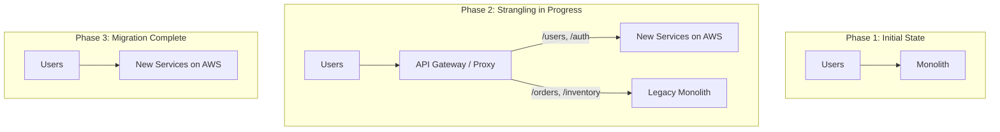

# How to Implement the Strangler Fig Pattern for AWS Migration

Author: [nawazdhandala](https://github.com/nawazdhandala)

Tags: AWS, Migration, Strangler Fig, Microservices, Architecture

Description: Learn how to use the strangler fig pattern to incrementally migrate a monolithic application to AWS without risky big-bang deployments.

---

Rewriting a legacy application from scratch is one of the most common mistakes in software engineering. It takes longer than expected, introduces new bugs, and often fails to replicate subtle behaviors that the old system handled correctly. The strangler fig pattern offers a better approach: you incrementally replace pieces of the old system with new implementations, routing traffic between old and new until the old system is entirely replaced.

The name comes from strangler fig trees in the rainforest. They grow around an existing tree, gradually replacing it, until the original tree is gone and only the fig remains. Your new system does the same thing to the old one.

## How the Pattern Works

The basic idea has three phases:

1. **Transform** - Build a new implementation of one feature/module on AWS
2. **Coexist** - Run both old and new side by side, routing specific traffic to the new system
3. **Eliminate** - Once the new implementation is proven, stop routing to the old one

You repeat this for each module until the entire application has been migrated.



## Step 1: Set Up the Routing Layer

The routing layer is the key component. It sits in front of both the old and new systems and decides where each request goes. API Gateway is a natural fit for this.

```bash
# Create an API Gateway REST API
aws apigateway create-rest-api \
  --name "migration-proxy" \
  --description "Strangler fig routing layer" \
  --endpoint-configuration types=REGIONAL
```

Configure routes to point to different backends based on the path.

```bash
# Get the root resource ID
ROOT_ID=$(aws apigateway get-resources \
  --rest-api-id "abc123" \
  --query "items[?path=='/'].id" \
  --output text)

# Create a resource for the migrated path
aws apigateway create-resource \
  --rest-api-id "abc123" \
  --parent-id "$ROOT_ID" \
  --path-part "users"

# Point /users to the new Lambda-based service
aws apigateway put-method \
  --rest-api-id "abc123" \
  --resource-id "users-resource-id" \
  --http-method ANY \
  --authorization-type NONE

aws apigateway put-integration \
  --rest-api-id "abc123" \
  --resource-id "users-resource-id" \
  --http-method ANY \
  --type AWS_PROXY \
  --integration-http-method POST \
  --uri "arn:aws:apigateway:us-east-1:lambda:path/2015-03-31/functions/arn:aws:lambda:us-east-1:123456789:function:users-service/invocations"

# Create a catch-all proxy for everything else -> legacy system
aws apigateway create-resource \
  --rest-api-id "abc123" \
  --parent-id "$ROOT_ID" \
  --path-part "{proxy+}"

aws apigateway put-integration \
  --rest-api-id "abc123" \
  --resource-id "proxy-resource-id" \
  --http-method ANY \
  --type HTTP_PROXY \
  --integration-http-method ANY \
  --uri "http://legacy-server.internal.example.com/{proxy}"
```

## Step 2: Migrate Your First Feature

Pick the right feature to migrate first. Ideal candidates are:

- Well-defined boundaries (clear inputs and outputs)
- Low risk (not the payment system on day one)
- High value (something that benefits from modern infrastructure)
- Independent (minimal coupling with other modules)

User authentication is a common first candidate. Here's what the new implementation might look like as a Lambda function.

```python
import json
import boto3
import hashlib
import os

# New user authentication service running on Lambda + DynamoDB
dynamodb = boto3.resource('dynamodb')
users_table = dynamodb.Table(os.environ['USERS_TABLE'])

def handler(event, context):
    path = event['path']
    method = event['httpMethod']

    if path == '/users/login' and method == 'POST':
        return handle_login(json.loads(event['body']))
    elif path == '/users/profile' and method == 'GET':
        return handle_get_profile(event)
    else:
        return {'statusCode': 404, 'body': 'Not found'}

def handle_login(body):
    email = body.get('email')
    password = body.get('password')

    # Look up user in DynamoDB (migrated from legacy database)
    response = users_table.get_item(Key={'email': email})
    user = response.get('Item')

    if not user:
        return {'statusCode': 401, 'body': json.dumps({'error': 'Invalid credentials'})}

    # Verify password
    password_hash = hashlib.sha256(
        (password + user['salt']).encode()
    ).hexdigest()

    if password_hash != user['password_hash']:
        return {'statusCode': 401, 'body': json.dumps({'error': 'Invalid credentials'})}

    # Generate session token
    token = generate_session_token(user['user_id'])

    return {
        'statusCode': 200,
        'body': json.dumps({
            'token': token,
            'user_id': user['user_id']
        })
    }

def handle_get_profile(event):
    # Extract user from auth token
    token = event['headers'].get('Authorization', '').replace('Bearer ', '')
    user_id = validate_token(token)

    if not user_id:
        return {'statusCode': 401, 'body': 'Unauthorized'}

    response = users_table.get_item(Key={'user_id': user_id})
    user = response.get('Item', {})

    return {
        'statusCode': 200,
        'body': json.dumps({
            'user_id': user.get('user_id'),
            'email': user.get('email'),
            'name': user.get('name')
        })
    }
```

## Step 3: Data Migration Strategy

You need to get data from the legacy database into the new service's data store. There are two approaches:

### Approach A: Bulk Migration + Change Data Capture

Migrate all existing data, then capture ongoing changes.

```python
import boto3
import pymysql

# Migrate users from legacy MySQL to DynamoDB
def migrate_users():
    # Connect to legacy database
    legacy_db = pymysql.connect(
        host='legacy-db.internal',
        user='readonly',
        password='password',
        database='app'
    )

    # DynamoDB target
    dynamodb = boto3.resource('dynamodb')
    table = dynamodb.Table('users')

    cursor = legacy_db.cursor(pymysql.cursors.DictCursor)
    cursor.execute("SELECT * FROM users")

    # Batch write to DynamoDB
    with table.batch_writer() as batch:
        for row in cursor:
            batch.put_item(Item={
                'user_id': str(row['id']),
                'email': row['email'],
                'name': row['name'],
                'password_hash': row['password_hash'],
                'salt': row['salt'],
                'created_at': row['created_at'].isoformat(),
                'migrated': True
            })

    print(f"Migrated {cursor.rowcount} users")
    legacy_db.close()
```

### Approach B: Read-Through Migration

The new service checks its own data store first, and if the data isn't there, reads from the legacy system and caches it.

```python
def get_user(user_id):
    # Try new data store first
    response = users_table.get_item(Key={'user_id': user_id})
    if 'Item' in response:
        return response['Item']

    # Fall back to legacy database
    user = legacy_db_query(f"SELECT * FROM users WHERE id = %s", user_id)
    if user:
        # Migrate this record on-the-fly
        users_table.put_item(Item={
            'user_id': str(user['id']),
            'email': user['email'],
            'name': user['name'],
            'password_hash': user['password_hash'],
            'salt': user['salt'],
            'migrated': True
        })
        return user

    return None
```

## Step 4: Implement Feature Flags

Use feature flags to control the rollout. This lets you gradually shift traffic and quickly roll back if something goes wrong.

```python
import boto3

# Use AWS AppConfig or a simple DynamoDB table for feature flags
dynamodb = boto3.resource('dynamodb')
flags_table = dynamodb.Table('feature-flags')

def is_feature_enabled(feature_name, user_id=None):
    """Check if a feature is enabled, optionally for a specific user."""
    response = flags_table.get_item(Key={'feature': feature_name})
    flag = response.get('Item', {})

    # Check if it's enabled globally
    if flag.get('enabled', False):
        return True

    # Check percentage rollout
    if user_id and flag.get('percentage', 0) > 0:
        hash_val = int(hashlib.md5(user_id.encode()).hexdigest()[:8], 16)
        return (hash_val % 100) < flag['percentage']

    # Check allowlist
    if user_id and user_id in flag.get('allowlist', []):
        return True

    return False

# In the routing layer
def route_request(request):
    if is_feature_enabled('new-user-service', request.user_id):
        return forward_to_new_service(request)
    else:
        return forward_to_legacy(request)
```

## Step 5: Monitor Both Systems

During the coexistence phase, you need to compare the behavior of old and new systems. Log everything and watch for discrepancies.

```python
import logging
import time

logger = logging.getLogger('migration')

def compare_responses(endpoint, request_data):
    """Call both old and new systems and compare responses."""
    # Call new system (primary)
    start = time.time()
    new_response = call_new_service(endpoint, request_data)
    new_latency = time.time() - start

    # Call old system (shadow - don't return this to user)
    start = time.time()
    old_response = call_legacy_service(endpoint, request_data)
    old_latency = time.time() - start

    # Log comparison
    if new_response != old_response:
        logger.warning(
            f"Response mismatch on {endpoint}: "
            f"new={new_response}, old={old_response}"
        )

    logger.info(
        f"Latency comparison {endpoint}: "
        f"new={new_latency:.3f}s, old={old_latency:.3f}s"
    )

    return new_response  # Always return the new response
```

For monitoring both systems during migration, [OneUptime](https://oneuptime.com/blog/post/2026-02-06-aws-cloudwatch-logs-exporter-opentelemetry-collector/view) can help you track the health and performance of both the legacy and new components side by side.

## Step 6: Cut Over and Clean Up

Once a module is stable on the new system:

1. Route 100% of traffic to the new service
2. Keep the legacy code running for a rollback period (2-4 weeks)
3. Remove the legacy code and routing rules
4. Clean up the old database tables

```bash
# Update API Gateway to remove legacy proxy for migrated paths
aws apigateway delete-integration \
  --rest-api-id "abc123" \
  --resource-id "legacy-proxy-id" \
  --http-method ANY

# Deploy the updated API
aws apigateway create-deployment \
  --rest-api-id "abc123" \
  --stage-name "production" \
  --description "Removed legacy proxy for /users"
```

## Migration Tracking

Keep a simple tracker for which modules have been migrated. You can also use [AWS Migration Hub Refactor Spaces](https://oneuptime.com/blog/post/2026-02-12-aws-migration-hub-refactor-spaces/view) to manage the routing and migration state.

| Module | Status | Start Date | Completion | Traffic % New |
|--------|--------|-----------|------------|--------------|
| Auth | Complete | Jan 15 | Feb 1 | 100% |
| Users | In Progress | Feb 1 | - | 50% |
| Orders | Not Started | - | - | 0% |
| Inventory | Not Started | - | - | 0% |
| Reports | Not Started | - | - | 0% |

## Wrapping Up

The strangler fig pattern isn't glamorous, but it works. You avoid the risk of a big-bang rewrite, you can stop at any point if priorities change, and each migrated module is immediately providing value in the new environment. The key is picking the right routing layer, having a solid data migration strategy, and monitoring both systems throughout the process. Take it one module at a time, and before you know it, the old system is gone.
