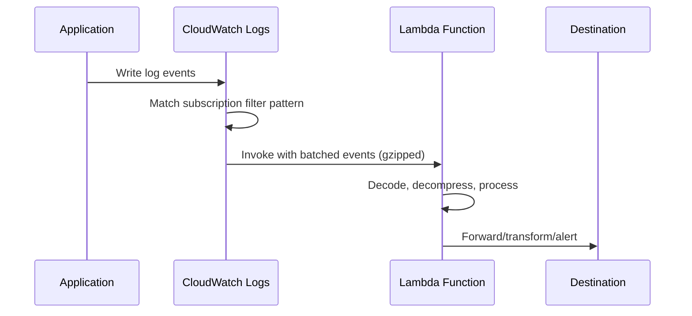

# How to Stream CloudWatch Logs to Lambda for Processing

Author: [nawazdhandala](https://github.com/nawazdhandala)

Tags: AWS, CloudWatch, Lambda, Logging, Serverless

Description: Learn how to use CloudWatch subscription filters to stream logs to Lambda functions for real-time processing, alerting, enrichment, and forwarding.

---

Subscription filters are the mechanism CloudWatch uses to stream log events to other services in real time. While you can stream directly to Kinesis or OpenSearch, streaming to Lambda gives you the most flexibility. Your Lambda function can parse, transform, filter, enrich, and route log events anywhere you want - Slack, PagerDuty, a database, a third-party logging service, or just another AWS service.

This is different from metric filters (which create CloudWatch metrics from log patterns). Subscription filters give you access to the actual log event data, so you can do much more with it.

## How It Works

When you create a subscription filter on a log group, CloudWatch batches matching log events and invokes your Lambda function with those events. The events arrive base64-encoded and gzipped.



CloudWatch batches events to be efficient - it doesn't invoke Lambda for every single log line. Batches can contain multiple log events from the same log stream.

## Setting Up the Lambda Function

Here's a complete Lambda function that decodes the incoming log events and processes them:

```python
import gzip
import json
import base64
import os
import urllib.request

def handler(event, context):
    """Process CloudWatch Logs subscription filter events."""
    # Step 1: Decode and decompress the log data
    compressed = base64.b64decode(event['awslogs']['data'])
    payload = json.loads(gzip.decompress(compressed))

    log_group = payload['logGroup']
    log_stream = payload['logStream']
    log_events = payload['logEvents']

    print(f"Received {len(log_events)} events from {log_group}/{log_stream}")

    for log_event in log_events:
        message = log_event['message']
        timestamp = log_event['timestamp']

        # Step 2: Parse the log message
        try:
            parsed = json.loads(message)
        except json.JSONDecodeError:
            parsed = {'raw': message}

        # Step 3: Process based on content
        if parsed.get('level') == 'ERROR':
            send_alert(log_group, parsed, timestamp)

        if parsed.get('event') == 'order_completed':
            track_business_metric(parsed)

    return {'statusCode': 200}


def send_alert(log_group, parsed_log, timestamp):
    """Send an alert to Slack for error-level logs."""
    webhook_url = os.environ.get('SLACK_WEBHOOK_URL')
    if not webhook_url:
        return

    message = {
        'text': f"Error in {log_group}",
        'blocks': [
            {
                'type': 'section',
                'text': {
                    'type': 'mrkdwn',
                    'text': f"*Error detected in `{log_group}`*\n"
                            f"```{json.dumps(parsed_log, indent=2)[:1000]}```"
                }
            }
        ]
    }

    req = urllib.request.Request(
        webhook_url,
        data=json.dumps(message).encode('utf-8'),
        headers={'Content-Type': 'application/json'}
    )
    urllib.request.urlopen(req)


def track_business_metric(parsed_log):
    """Forward business events to a tracking system."""
    # Example: write to DynamoDB, SQS, or an external API
    print(f"Business event: order_completed, value={parsed_log.get('orderValue')}")
```

The Node.js version:

```javascript
const zlib = require('zlib');

exports.handler = async (event) => {
  // Decode and decompress the log data
  const payload = Buffer.from(event.awslogs.data, 'base64');
  const decompressed = zlib.gunzipSync(payload);
  const logData = JSON.parse(decompressed.toString());

  const { logGroup, logStream, logEvents } = logData;
  console.log(`Received ${logEvents.length} events from ${logGroup}`);

  for (const logEvent of logEvents) {
    let parsed;
    try {
      parsed = JSON.parse(logEvent.message);
    } catch {
      parsed = { raw: logEvent.message };
    }

    // Route events based on content
    if (parsed.level === 'ERROR') {
      await handleError(logGroup, parsed, logEvent.timestamp);
    }

    if (parsed.statusCode >= 500) {
      await trackServerError(logGroup, parsed);
    }
  }

  return { statusCode: 200 };
};

async function handleError(logGroup, parsed, timestamp) {
  // Send to Slack, PagerDuty, etc.
  console.log(`ERROR in ${logGroup}: ${parsed.message || parsed.raw}`);
}

async function trackServerError(logGroup, parsed) {
  console.log(`5xx in ${logGroup}: ${parsed.statusCode} on ${parsed.endpoint}`);
}
```

## Creating the Subscription Filter

Deploy the Lambda, then create the subscription filter:

```bash
# Give CloudWatch Logs permission to invoke the Lambda
aws lambda add-permission \
  --function-name "log-processor" \
  --statement-id "allow-cloudwatch-logs" \
  --principal "logs.amazonaws.com" \
  --action "lambda:InvokeFunction" \
  --source-arn "arn:aws:logs:us-east-1:123456789012:log-group:/myapp/production/api:*" \
  --source-account "123456789012"

# Create the subscription filter
aws logs put-subscription-filter \
  --log-group-name "/myapp/production/api" \
  --filter-name "error-processor" \
  --filter-pattern '{ $.level = "ERROR" }' \
  --destination-arn "arn:aws:lambda:us-east-1:123456789012:function:log-processor"
```

The `filter-pattern` works the same way as metric filter patterns. You can use JSON patterns, text patterns, or an empty string to match everything. Filtering at the subscription level reduces the number of Lambda invocations and keeps costs down.

## Use Case: Real-Time Error Alerting

One of the most common uses is real-time alerting that's more flexible than CloudWatch Alarms:

```python
import json
import base64
import gzip
import os
import boto3
from datetime import datetime

sns = boto3.client('sns')

def handler(event, context):
    """Send detailed error alerts via SNS."""
    compressed = base64.b64decode(event['awslogs']['data'])
    payload = json.loads(gzip.decompress(compressed))

    errors = []
    for log_event in payload['logEvents']:
        try:
            parsed = json.loads(log_event['message'])
            if parsed.get('level') == 'ERROR':
                errors.append({
                    'timestamp': datetime.utcfromtimestamp(
                        log_event['timestamp'] / 1000
                    ).isoformat(),
                    'service': parsed.get('service', 'unknown'),
                    'message': parsed.get('msg', parsed.get('message', 'No message')),
                    'endpoint': parsed.get('endpoint', 'N/A'),
                    'requestId': parsed.get('requestId', 'N/A'),
                })
        except json.JSONDecodeError:
            continue

    if errors:
        # Group errors and send a single notification
        subject = f"{len(errors)} error(s) in {payload['logGroup']}"
        body = f"Log Group: {payload['logGroup']}\n"
        body += f"Log Stream: {payload['logStream']}\n\n"

        for err in errors[:10]:  # Limit to 10 errors per notification
            body += f"Time: {err['timestamp']}\n"
            body += f"Service: {err['service']}\n"
            body += f"Message: {err['message']}\n"
            body += f"Endpoint: {err['endpoint']}\n"
            body += f"Request ID: {err['requestId']}\n"
            body += "-" * 40 + "\n"

        sns.publish(
            TopicArn=os.environ['ALERT_TOPIC_ARN'],
            Subject=subject[:100],
            Message=body
        )

    return {'statusCode': 200}
```

## Use Case: Log Enrichment and Forwarding

Enrich log events with additional context before forwarding them:

```python
import json
import base64
import gzip
import boto3
import os
from datetime import datetime

dynamodb = boto3.resource('dynamodb')
firehose = boto3.client('firehose')
user_table = dynamodb.Table('Users')

def handler(event, context):
    """Enrich logs with user data and forward to Firehose."""
    compressed = base64.b64decode(event['awslogs']['data'])
    payload = json.loads(gzip.decompress(compressed))

    enriched_records = []

    for log_event in payload['logEvents']:
        try:
            parsed = json.loads(log_event['message'])
        except json.JSONDecodeError:
            continue

        # Enrich with user data if userId is present
        user_id = parsed.get('userId')
        if user_id:
            try:
                user = user_table.get_item(Key={'userId': user_id}).get('Item', {})
                parsed['userPlan'] = user.get('plan', 'unknown')
                parsed['userRegion'] = user.get('region', 'unknown')
            except Exception:
                pass  # Don't fail if enrichment fails

        # Add metadata
        parsed['_logGroup'] = payload['logGroup']
        parsed['_processedAt'] = datetime.utcnow().isoformat()

        enriched_records.append({
            'Data': json.dumps(parsed).encode('utf-8') + b'\n'
        })

    # Forward enriched records to Firehose (which delivers to S3/OpenSearch)
    if enriched_records:
        # Firehose accepts up to 500 records per batch
        for i in range(0, len(enriched_records), 500):
            batch = enriched_records[i:i + 500]
            firehose.put_record_batch(
                DeliveryStreamName=os.environ['FIREHOSE_STREAM'],
                Records=batch
            )

    return {'statusCode': 200}
```

## Subscription Filter Limits

Each log group can have up to 2 subscription filters. If you need more destinations, have your Lambda function fan out to multiple targets.

Also, CloudWatch Logs subscription filters have a throughput limit. If your log group produces more than 10,000 events per second, events may be dropped. For very high-volume log groups, consider using a Kinesis Data Stream as an intermediate buffer.

## CloudFormation Setup

Here's the full infrastructure as code:

```yaml
Resources:
  LogProcessorFunction:
    Type: AWS::Lambda::Function
    Properties:
      FunctionName: log-processor
      Runtime: python3.12
      Handler: index.handler
      Timeout: 60
      MemorySize: 256
      Role: !GetAtt LogProcessorRole.Arn
      Environment:
        Variables:
          SLACK_WEBHOOK_URL: !Ref SlackWebhookUrl

  LogProcessorPermission:
    Type: AWS::Lambda::Permission
    Properties:
      FunctionName: !Ref LogProcessorFunction
      Action: lambda:InvokeFunction
      Principal: logs.amazonaws.com
      SourceArn: !Sub 'arn:aws:logs:${AWS::Region}:${AWS::AccountId}:log-group:/myapp/production/api:*'

  ErrorSubscriptionFilter:
    Type: AWS::Logs::SubscriptionFilter
    DependsOn: LogProcessorPermission
    Properties:
      LogGroupName: /myapp/production/api
      FilterName: error-processor
      FilterPattern: '{ $.level = "ERROR" }'
      DestinationArn: !GetAtt LogProcessorFunction.Arn
```

## Wrapping Up

Streaming CloudWatch Logs to Lambda opens up a world of possibilities beyond what CloudWatch's built-in features offer. Real-time alerting with rich context, log enrichment, custom routing, forwarding to third-party services - Lambda gives you complete control over how you handle your log data. Start with error alerting, and expand from there as you identify more use cases. For the broader picture of CloudWatch log subscriptions, see our post on [setting up CloudWatch Log subscriptions](https://oneuptime.com/blog/post/cloudwatch-log-subscriptions/view).
