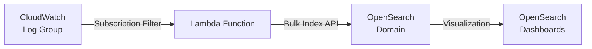

# How to Stream CloudWatch Logs to OpenSearch

Author: [nawazdhandala](https://github.com/nawazdhandala)

Tags: AWS, CloudWatch, OpenSearch, Logging, Elasticsearch

Description: Learn how to stream CloudWatch Logs to Amazon OpenSearch Service for full-text search, advanced analytics, and visualization with OpenSearch Dashboards.

---

CloudWatch Logs Insights is solid for ad-hoc queries, but it has limitations. The query language isn't as expressive as Lucene or OpenSearch's query DSL. You can't create complex visualizations or correlation-based alerts. And if you want to combine log analysis with trace data or application performance monitoring, you need something more powerful.

Amazon OpenSearch Service (the managed Elasticsearch/OpenSearch cluster) fills these gaps. By streaming your CloudWatch Logs to OpenSearch, you get full-text search with Lucene syntax, Kibana/OpenSearch Dashboards for visualization, and the ability to set up complex alerting rules. Let's set it up.

## Architecture

The streaming pipeline looks like this:



CloudWatch sends matching log events to a Lambda function, which transforms and indexes them into OpenSearch. AWS provides a built-in blueprint for this Lambda function, so you don't have to write it from scratch.

## Prerequisites

You'll need an OpenSearch domain already running. If you don't have one:

```bash
# Create an OpenSearch domain (this takes 15-20 minutes)
aws opensearch create-domain \
  --domain-name "log-analytics" \
  --engine-version "OpenSearch_2.11" \
  --cluster-config '{
    "InstanceType": "r6g.large.search",
    "InstanceCount": 2,
    "DedicatedMasterEnabled": false,
    "ZoneAwarenessEnabled": true,
    "ZoneAwarenessConfig": { "AvailabilityZoneCount": 2 }
  }' \
  --ebs-options '{
    "EBSEnabled": true,
    "VolumeType": "gp3",
    "VolumeSize": 100
  }' \
  --access-policies '{
    "Version": "2012-10-17",
    "Statement": [
      {
        "Effect": "Allow",
        "Principal": { "AWS": "*" },
        "Action": "es:*",
        "Resource": "arn:aws:es:us-east-1:123456789012:domain/log-analytics/*"
      }
    ]
  }'
```

## Method 1: Using the AWS Console (Quickest)

The fastest path is the console-based setup:

1. Go to CloudWatch > Log groups.
2. Select your log group.
3. Click Actions > Subscription filters > Create Amazon OpenSearch Service subscription filter.
4. Select your OpenSearch domain.
5. Choose the Lambda execution role.
6. Set the log format and filter pattern.
7. Click Start streaming.

AWS creates the Lambda function automatically using the `LogsToElasticsearch` blueprint.

## Method 2: Manual Setup with Lambda

For more control, set up the Lambda function yourself. Here's the streaming function:

```python
import boto3
import gzip
import json
import base64
import os
import datetime
from opensearchpy import OpenSearch, RequestsHttpConnection
from requests_aws4auth import AWS4Auth

# OpenSearch connection setup
region = os.environ['AWS_REGION']
host = os.environ['OPENSEARCH_ENDPOINT']
credentials = boto3.Session().get_credentials()
awsauth = AWS4Auth(credentials.access_key, credentials.secret_key,
                   region, 'es', session_token=credentials.token)

opensearch = OpenSearch(
    hosts=[{'host': host, 'port': 443}],
    http_auth=awsauth,
    use_ssl=True,
    verify_certs=True,
    connection_class=RequestsHttpConnection
)

def handler(event, context):
    """Process CloudWatch Logs subscription filter events."""
    # Decode and decompress the log data
    compressed = base64.b64decode(event['awslogs']['data'])
    payload = json.loads(gzip.decompress(compressed))

    log_group = payload['logGroup']
    log_stream = payload['logStream']
    log_events = payload['logEvents']

    # Generate today's index name (daily rotation)
    today = datetime.datetime.utcnow().strftime('%Y.%m.%d')
    index_name = f"cwl-{today}"

    # Build bulk index request
    bulk_body = []
    for event in log_events:
        # Try to parse the message as JSON for structured indexing
        try:
            message_data = json.loads(event['message'])
        except (json.JSONDecodeError, TypeError):
            message_data = {'raw_message': event['message']}

        doc = {
            '@timestamp': datetime.datetime.utcfromtimestamp(
                event['timestamp'] / 1000
            ).isoformat() + 'Z',
            'log_group': log_group,
            'log_stream': log_stream,
            'message_id': event['id'],
            **message_data
        }

        # Bulk index action
        bulk_body.append({'index': {'_index': index_name}})
        bulk_body.append(doc)

    if bulk_body:
        response = opensearch.bulk(body=bulk_body)
        if response['errors']:
            failed = [item for item in response['items'] if 'error' in item.get('index', {})]
            print(f"Failed to index {len(failed)} documents")
        else:
            print(f"Indexed {len(log_events)} documents to {index_name}")

    return {'statusCode': 200}
```

Deploy this Lambda with the right environment variables and IAM permissions:

```bash
# Create the Lambda function
aws lambda create-function \
  --function-name "cloudwatch-to-opensearch" \
  --runtime python3.12 \
  --handler index.handler \
  --role arn:aws:iam::123456789012:role/LambdaOpenSearchRole \
  --timeout 300 \
  --memory-size 256 \
  --environment "Variables={OPENSEARCH_ENDPOINT=search-log-analytics-abc123.us-east-1.es.amazonaws.com}" \
  --zip-file fileb://function.zip
```

## Creating the Subscription Filter

With the Lambda function ready, create the subscription filter:

```bash
# Grant CloudWatch Logs permission to invoke the Lambda
aws lambda add-permission \
  --function-name "cloudwatch-to-opensearch" \
  --statement-id "cloudwatch-logs-invoke" \
  --principal "logs.us-east-1.amazonaws.com" \
  --action "lambda:InvokeFunction" \
  --source-arn "arn:aws:logs:us-east-1:123456789012:log-group:/myapp/production/api:*"

# Create the subscription filter
aws logs put-subscription-filter \
  --log-group-name "/myapp/production/api" \
  --filter-name "stream-to-opensearch" \
  --filter-pattern "" \
  --destination-arn "arn:aws:lambda:us-east-1:123456789012:function:cloudwatch-to-opensearch"
```

## Index Templates for Better Mapping

Create an index template in OpenSearch so fields get the right data types:

```bash
# Create an index template via the OpenSearch API
curl -XPUT "https://search-log-analytics-abc123.us-east-1.es.amazonaws.com/_index_template/cwl-template" \
  -H 'Content-Type: application/json' \
  -d '{
    "index_patterns": ["cwl-*"],
    "template": {
      "settings": {
        "number_of_shards": 2,
        "number_of_replicas": 1,
        "index.refresh_interval": "30s"
      },
      "mappings": {
        "properties": {
          "@timestamp": { "type": "date" },
          "log_group": { "type": "keyword" },
          "log_stream": { "type": "keyword" },
          "level": { "type": "keyword" },
          "service": { "type": "keyword" },
          "endpoint": { "type": "keyword" },
          "statusCode": { "type": "integer" },
          "duration": { "type": "float" },
          "message": { "type": "text" },
          "raw_message": { "type": "text" },
          "userId": { "type": "keyword" },
          "requestId": { "type": "keyword" }
        }
      }
    }
  }'
```

## Index Lifecycle Management

You don't want to keep indices growing forever. Set up an ISM (Index State Management) policy to roll over and delete old indices:

```json
{
  "policy": {
    "policy_id": "cwl-lifecycle",
    "description": "Manage CloudWatch log indices lifecycle",
    "default_state": "hot",
    "states": [
      {
        "name": "hot",
        "actions": [],
        "transitions": [
          { "state_name": "warm", "conditions": { "min_index_age": "7d" } }
        ]
      },
      {
        "name": "warm",
        "actions": [
          { "replica_count": { "number_of_replicas": 0 } },
          { "force_merge": { "max_num_segments": 1 } }
        ],
        "transitions": [
          { "state_name": "delete", "conditions": { "min_index_age": "30d" } }
        ]
      },
      {
        "name": "delete",
        "actions": [{ "delete": {} }],
        "transitions": []
      }
    ]
  }
}
```

## Streaming Multiple Log Groups

For multiple log groups, create a subscription filter for each one. You can use the same Lambda function:

```bash
# Stream multiple log groups to the same Lambda
for log_group in "/myapp/production/api" "/myapp/production/worker" "/aws/lambda/order-processor"; do
  filter_name=$(echo "$log_group" | tr '/' '-' | sed 's/^-//')

  aws logs put-subscription-filter \
    --log-group-name "$log_group" \
    --filter-name "opensearch-${filter_name}" \
    --filter-pattern "" \
    --destination-arn "arn:aws:lambda:us-east-1:123456789012:function:cloudwatch-to-opensearch"

  echo "Created subscription filter for $log_group"
done
```

## Monitoring the Pipeline

Keep an eye on the Lambda function's own metrics to make sure the pipeline is healthy:

- **Errors**: If the Lambda fails, logs aren't getting indexed.
- **Duration**: If the function takes too long, increase the timeout or memory.
- **Throttles**: If you're hitting concurrency limits, request a limit increase.
- **Iterator age**: In the CloudWatch subscription metrics, check how far behind the streaming is.

You can set up alarms on these metrics to get notified of pipeline issues. See our [CloudWatch dashboards guide](https://oneuptime.com/blog/post/create-cloudwatch-dashboards-application-monitoring/view) for creating a pipeline health dashboard.

## Wrapping Up

Streaming CloudWatch Logs to OpenSearch gives you the best of both worlds: CloudWatch for ingestion and real-time monitoring, OpenSearch for deep analysis and visualization. The setup involves a Lambda function, a subscription filter, and some index management, but once it's running, you get powerful log search and analytics capabilities. For an alternative approach using Kinesis Firehose, check out our post on [streaming CloudWatch Logs to Lambda](https://oneuptime.com/blog/post/stream-cloudwatch-logs-lambda-processing/view).
