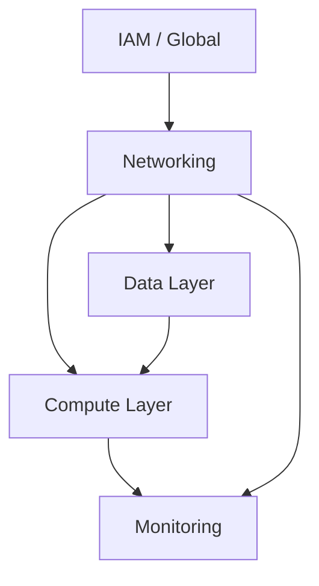

# How to Structure Terraform Projects for Large AWS Deployments

Author: [nawazdhandala](https://github.com/nawazdhandala)

Tags: AWS, Terraform, Architecture, DevOps

Description: A practical guide to organizing Terraform code for large-scale AWS deployments with multiple accounts, environments, and teams.

---

When a Terraform project starts small, a single directory with a few `.tf` files works fine. But as your AWS deployment grows - multiple accounts, dozens of services, several teams - that flat structure falls apart fast. State files become bottlenecks, plan times balloon, and a change to one component risks breaking something unrelated.

This post covers proven patterns for organizing Terraform at scale, based on what actually works in production rather than theoretical ideals.

## The Problem with Monolithic Terraform

A single Terraform state file containing everything has several issues:

- **Slow plans**: Every `terraform plan` evaluates every resource, even if you only changed one thing
- **Blast radius**: A mistake in any resource can affect the entire deployment
- **State locking**: Only one person can run plan/apply at a time
- **Team conflicts**: Multiple teams editing the same state creates merge issues

The solution is splitting your Terraform into smaller, independent state files. But how you split it matters.

## Directory Structure

Here's a structure that scales well for large AWS deployments:

```
terraform/
  modules/             # Reusable module definitions
    vpc/
    ecs-cluster/
    rds/
    s3-bucket/
    lambda-function/

  environments/        # Environment-specific configurations
    dev/
      us-east-1/
        networking/
        compute/
        data/
      backend.tf
    staging/
      us-east-1/
        networking/
        compute/
        data/
      backend.tf
    prod/
      us-east-1/
        networking/
        compute/
        data/
      us-west-2/
        networking/
        compute/
        data/
      backend.tf

  global/              # Account-level resources
    iam/
    organizations/
    route53/
```

## Splitting by Component

The most important decision is how to split your Terraform into separate state files. Split by blast radius and ownership:

```
# Each of these gets its own state file
environments/prod/us-east-1/
  networking/          # VPC, subnets, NAT gateways
    main.tf
    variables.tf
    outputs.tf
    backend.tf

  compute/             # ECS, EC2, Lambda
    main.tf
    variables.tf
    outputs.tf
    backend.tf

  data/                # RDS, ElastiCache, S3
    main.tf
    variables.tf
    outputs.tf
    backend.tf
```

Each component has its own backend configuration:

```hcl
# environments/prod/us-east-1/networking/backend.tf
terraform {
  backend "s3" {
    bucket         = "mycompany-terraform-state"
    key            = "prod/us-east-1/networking/terraform.tfstate"
    region         = "us-east-1"
    dynamodb_table = "terraform-locks"
    encrypt        = true
  }
}
```

## Sharing Data Between Components

When components are in separate state files, they need a way to share data. Terraform remote state data sources handle this:

```hcl
# environments/prod/us-east-1/compute/main.tf

# Read outputs from the networking component
data "terraform_remote_state" "networking" {
  backend = "s3"
  config = {
    bucket = "mycompany-terraform-state"
    key    = "prod/us-east-1/networking/terraform.tfstate"
    region = "us-east-1"
  }
}

# Use the VPC ID from networking
module "ecs_cluster" {
  source = "../../../modules/ecs-cluster"

  vpc_id     = data.terraform_remote_state.networking.outputs.vpc_id
  subnet_ids = data.terraform_remote_state.networking.outputs.private_subnet_ids
}
```

An alternative is using SSM Parameter Store or Terraform Cloud outputs, which decouples components more cleanly:

```hcl
# In the networking component - write to SSM
resource "aws_ssm_parameter" "vpc_id" {
  name  = "/terraform/prod/us-east-1/vpc_id"
  type  = "String"
  value = module.vpc.vpc_id
}

# In the compute component - read from SSM
data "aws_ssm_parameter" "vpc_id" {
  name = "/terraform/prod/us-east-1/vpc_id"
}
```

## Module Design

Modules should be focused and reusable. A good module handles one thing well.

```hcl
# modules/vpc/main.tf
variable "name" {
  description = "Name prefix for all VPC resources"
  type        = string
}

variable "cidr_block" {
  description = "CIDR block for the VPC"
  type        = string
}

variable "availability_zones" {
  description = "List of AZs to use"
  type        = list(string)
}

variable "private_subnet_cidrs" {
  description = "CIDR blocks for private subnets"
  type        = list(string)
}

variable "public_subnet_cidrs" {
  description = "CIDR blocks for public subnets"
  type        = list(string)
}

resource "aws_vpc" "this" {
  cidr_block           = var.cidr_block
  enable_dns_hostnames = true
  enable_dns_support   = true

  tags = {
    Name = var.name
  }
}

# Private subnets
resource "aws_subnet" "private" {
  count             = length(var.private_subnet_cidrs)
  vpc_id            = aws_vpc.this.id
  cidr_block        = var.private_subnet_cidrs[count.index]
  availability_zone = var.availability_zones[count.index]

  tags = {
    Name = "${var.name}-private-${var.availability_zones[count.index]}"
    Tier = "private"
  }
}

output "vpc_id" {
  description = "The ID of the VPC"
  value       = aws_vpc.this.id
}

output "private_subnet_ids" {
  description = "IDs of private subnets"
  value       = aws_subnet.private[*].id
}
```

## Environment Parity with Terragrunt

For large deployments, Terragrunt reduces duplication across environments. It wraps Terraform and provides DRY configurations:

```hcl
# terragrunt.hcl at the root
remote_state {
  backend = "s3"
  config = {
    bucket         = "mycompany-terraform-state"
    key            = "${path_relative_to_include()}/terraform.tfstate"
    region         = "us-east-1"
    encrypt        = true
    dynamodb_table = "terraform-locks"
  }
}

# Common variables
inputs = {
  project_name = "mycompany"
}
```

```hcl
# environments/prod/us-east-1/networking/terragrunt.hcl
include "root" {
  path = find_in_parent_folders()
}

terraform {
  source = "../../../../modules/vpc"
}

inputs = {
  name                 = "prod-vpc"
  cidr_block           = "10.0.0.0/16"
  availability_zones   = ["us-east-1a", "us-east-1b", "us-east-1c"]
  private_subnet_cidrs = ["10.0.1.0/24", "10.0.2.0/24", "10.0.3.0/24"]
  public_subnet_cidrs  = ["10.0.101.0/24", "10.0.102.0/24", "10.0.103.0/24"]
}
```

## Dependency Management

Components depend on each other. Networking must exist before compute. The dependency graph for a typical setup looks like this:



Terragrunt can express these dependencies explicitly:

```hcl
# environments/prod/us-east-1/compute/terragrunt.hcl
dependency "networking" {
  config_path = "../networking"
}

dependency "data" {
  config_path = "../data"
}

inputs = {
  vpc_id     = dependency.networking.outputs.vpc_id
  subnet_ids = dependency.networking.outputs.private_subnet_ids
  db_endpoint = dependency.data.outputs.db_endpoint
}
```

## State File Organization

A consistent naming convention for state files keeps things manageable:

```
s3://mycompany-terraform-state/
  global/iam/terraform.tfstate
  global/route53/terraform.tfstate
  prod/us-east-1/networking/terraform.tfstate
  prod/us-east-1/compute/terraform.tfstate
  prod/us-east-1/data/terraform.tfstate
  prod/us-west-2/networking/terraform.tfstate
  staging/us-east-1/networking/terraform.tfstate
  dev/us-east-1/networking/terraform.tfstate
```

## Team Ownership

In large organizations, different teams own different components. Structure your code to match team boundaries:

```
terraform/
  platform-team/       # VPC, shared infrastructure
    modules/
    environments/

  app-team-a/          # Team A's services
    modules/
    environments/

  app-team-b/          # Team B's services
    modules/
    environments/
```

Each team gets their own state files, their own CI pipelines, and their own blast radius.

For automating these deployments through CI, check out [running Terraform plan as a pull request check](https://oneuptime.com/blog/post/terraform-plan-pull-request-check/view).

## Summary

The key principles for structuring large Terraform projects are: split by blast radius, use modules for reusability, share data through remote state or SSM, and align code ownership with team boundaries. Starting with a good structure is much easier than refactoring later, so take the time to set it up right even if your deployment is still small. Your future self will appreciate it.
