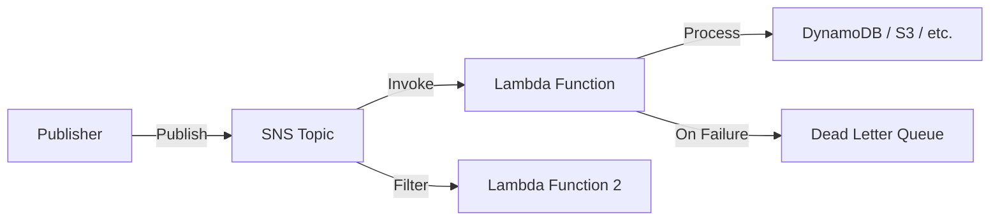

# How to Subscribe a Lambda Function to SNS

Author: [nawazdhandala](https://github.com/nawazdhandala)

Tags: AWS, SNS, Lambda, Serverless, Event-Driven

Description: Learn how to subscribe AWS Lambda functions to SNS topics for event-driven processing, including permissions, message handling, error management, and filtering.

---

Subscribing a Lambda function to an SNS topic is the foundation of event-driven architectures on AWS. When a message hits the topic, SNS invokes your Lambda function asynchronously with the message payload. No polling, no servers to manage, and it scales automatically with message volume.

Let's set this up properly with the right permissions, error handling, and message processing patterns.

## The Architecture



## Creating the Subscription

First, create the subscription using the CLI. You need both the topic ARN and the Lambda function ARN.

```bash
# Subscribe a Lambda function to an SNS topic
aws sns subscribe \
  --topic-arn arn:aws:sns:us-east-1:123456789012:order-notifications \
  --protocol lambda \
  --notification-endpoint arn:aws:lambda:us-east-1:123456789012:function:process-orders
```

But wait - this alone isn't enough. SNS needs permission to invoke your Lambda function. Without this, messages will fail silently.

```bash
# Grant SNS permission to invoke the Lambda function
aws lambda add-permission \
  --function-name process-orders \
  --statement-id sns-invoke \
  --action lambda:InvokeFunction \
  --principal sns.amazonaws.com \
  --source-arn arn:aws:sns:us-east-1:123456789012:order-notifications
```

## Writing the Lambda Handler

The SNS event structure wraps your message in a specific format. Here's how to handle it in Python.

```python
import json

def handler(event, context):
    """Process SNS messages.

    SNS sends events with a 'Records' array, where each record
    contains the SNS message details.
    """
    for record in event['Records']:
        sns_message = record['Sns']

        # Extract the key fields
        message_id = sns_message['MessageId']
        subject = sns_message.get('Subject', '')
        raw_message = sns_message['Message']
        timestamp = sns_message['Timestamp']
        topic_arn = sns_message['TopicArn']

        # Parse the message body (assuming JSON)
        try:
            message = json.loads(raw_message)
        except json.JSONDecodeError:
            # Handle plain text messages
            message = {'text': raw_message}

        # Extract message attributes for routing logic
        attributes = sns_message.get('MessageAttributes', {})
        event_type = attributes.get('event_type', {}).get('Value', 'unknown')

        print(f'Processing {event_type} message {message_id}')

        # Route to the appropriate handler based on event type
        if event_type == 'order_created':
            handle_new_order(message)
        elif event_type == 'order_cancelled':
            handle_cancellation(message)
        else:
            print(f'Unknown event type: {event_type}')

def handle_new_order(order):
    """Process a new order."""
    order_id = order.get('order_id')
    amount = order.get('total_amount')
    print(f'New order {order_id}: ${amount}')
    # Add your business logic here

def handle_cancellation(order):
    """Handle an order cancellation."""
    order_id = order.get('order_id')
    print(f'Cancelling order {order_id}')
    # Add your cancellation logic here
```

And the equivalent in Node.js.

```javascript
// Lambda handler for SNS events in Node.js
exports.handler = async (event) => {
  for (const record of event.Records) {
    const snsMessage = record.Sns;

    const messageId = snsMessage.MessageId;
    const subject = snsMessage.Subject || '';
    const timestamp = snsMessage.Timestamp;

    // Parse the message body
    let message;
    try {
      message = JSON.parse(snsMessage.Message);
    } catch {
      message = { text: snsMessage.Message };
    }

    // Get message attributes for routing
    const eventType = snsMessage.MessageAttributes?.event_type?.Value || 'unknown';

    console.log(`Processing ${eventType} message ${messageId}`);

    switch (eventType) {
      case 'order_created':
        await handleNewOrder(message);
        break;
      case 'order_cancelled':
        await handleCancellation(message);
        break;
      default:
        console.log(`Unhandled event type: ${eventType}`);
    }
  }
};

async function handleNewOrder(order) {
  console.log(`New order ${order.orderId}: $${order.totalAmount}`);
  // Business logic here
}

async function handleCancellation(order) {
  console.log(`Cancelling order ${order.orderId}`);
  // Cancellation logic here
}
```

## Setting Up with CDK

CDK handles the permissions automatically when you add the subscription, which is much cleaner than doing it manually.

```typescript
import * as cdk from 'aws-cdk-lib';
import * as lambda from 'aws-cdk-lib/aws-lambda';
import * as sns from 'aws-cdk-lib/aws-sns';
import * as snsSubscriptions from 'aws-cdk-lib/aws-sns-subscriptions';
import * as sqs from 'aws-cdk-lib/aws-sqs';

// Create the SNS topic
const orderTopic = new sns.Topic(this, 'OrderNotifications', {
  topicName: 'order-notifications',
});

// Create the Lambda function
const orderProcessor = new lambda.Function(this, 'OrderProcessor', {
  runtime: lambda.Runtime.PYTHON_3_12,
  handler: 'index.handler',
  code: lambda.Code.fromAsset('lambda/order-processor'),
  timeout: cdk.Duration.seconds(30),
  memorySize: 256,
});

// Create a dead letter queue for failed messages
const dlq = new sqs.Queue(this, 'OrderProcessorDLQ', {
  queueName: 'order-processor-dlq',
  retentionPeriod: cdk.Duration.days(14),
});

// Subscribe the Lambda to the topic with a filter policy
// CDK automatically sets up the Lambda invoke permission
orderTopic.addSubscription(
  new snsSubscriptions.LambdaSubscription(orderProcessor, {
    // Only deliver messages matching this filter
    filterPolicy: {
      event_type: sns.SubscriptionFilter.stringFilter({
        allowlist: ['order_created', 'order_updated'],
      }),
    },
    // Send failed invocations to the DLQ
    deadLetterQueue: dlq,
  })
);
```

## Message Filtering

Filtering at the subscription level means your Lambda function only gets invoked for relevant messages. This reduces invocations and costs.

```bash
# Add a filter policy to an existing subscription
aws sns set-subscription-attributes \
  --subscription-arn arn:aws:sns:us-east-1:123456789012:order-notifications:abc123 \
  --attribute-name FilterPolicy \
  --attribute-value '{
    "event_type": ["order_created", "order_updated"],
    "priority": ["high"]
  }'
```

You can also use more advanced filter operations.

```python
import json
import boto3

sns = boto3.client('sns')

# Subscribe with an advanced filter policy
sns.subscribe(
    TopicArn='arn:aws:sns:us-east-1:123456789012:order-notifications',
    Protocol='lambda',
    Endpoint='arn:aws:lambda:us-east-1:123456789012:function:high-value-processor',
    Attributes={
        'FilterPolicy': json.dumps({
            # Only orders above $100
            'order_amount': [{'numeric': ['>=', 100]}],
            # Only from specific regions
            'region': ['us-east', 'us-west'],
        }),
        'FilterPolicyScope': 'MessageAttributes',
    }
)
```

## Error Handling and Dead Letter Queues

When your Lambda function throws an error, SNS retries the invocation. By default, it retries up to 3 times. After exhausting retries, the message is lost unless you've configured a dead letter queue (DLQ).

```bash
# Set up a DLQ for the subscription
# First, create an SQS queue for failed messages
aws sqs create-queue --queue-name order-processor-dlq

# Then set the redrive policy on the subscription
aws sns set-subscription-attributes \
  --subscription-arn arn:aws:sns:us-east-1:123456789012:order-notifications:abc123 \
  --attribute-name RedrivePolicy \
  --attribute-value '{"deadLetterTargetArn": "arn:aws:sqs:us-east-1:123456789012:order-processor-dlq"}'
```

Your Lambda function should be designed to handle failures gracefully.

```python
import json
import traceback

def handler(event, context):
    """Process SNS messages with error handling."""
    failed_records = []

    for record in event['Records']:
        try:
            message = json.loads(record['Sns']['Message'])
            process_message(message)
        except Exception as e:
            # Log the error but continue processing other records
            print(f'Error processing message {record["Sns"]["MessageId"]}: {e}')
            traceback.print_exc()
            failed_records.append(record['Sns']['MessageId'])

    if failed_records:
        # Raise an error so SNS retries for the failed messages
        # Note: SNS will retry ALL messages in the batch, not just failed ones
        raise Exception(f'Failed to process {len(failed_records)} messages')

def process_message(message):
    """Your actual business logic goes here."""
    # This will be retried if it fails
    pass
```

## Testing Locally

You can test your Lambda handler locally by simulating the SNS event structure.

```python
# test_handler.py
import json
from index import handler

# Simulate an SNS event
test_event = {
    'Records': [
        {
            'Sns': {
                'MessageId': 'test-123',
                'Subject': 'Test Message',
                'Message': json.dumps({
                    'order_id': 'ORD-TEST-001',
                    'total_amount': 149.99,
                }),
                'Timestamp': '2026-02-12T10:30:00.000Z',
                'TopicArn': 'arn:aws:sns:us-east-1:123456789012:order-notifications',
                'MessageAttributes': {
                    'event_type': {
                        'Type': 'String',
                        'Value': 'order_created',
                    }
                },
            }
        }
    ]
}

# Run the handler
handler(test_event, None)
```

Lambda-to-SNS subscriptions are the backbone of serverless event-driven systems on AWS. Combine them with message filtering to build efficient pub/sub patterns, and always configure a DLQ so you don't lose messages when things go wrong.

For other subscription types, check out [subscribing SQS queues for fan-out](https://oneuptime.com/blog/post/subscribe-an-sqs-queue-to-sns/view) and [subscribing HTTP endpoints](https://oneuptime.com/blog/post/subscribe-an-http-https-endpoint-to-sns/view).
