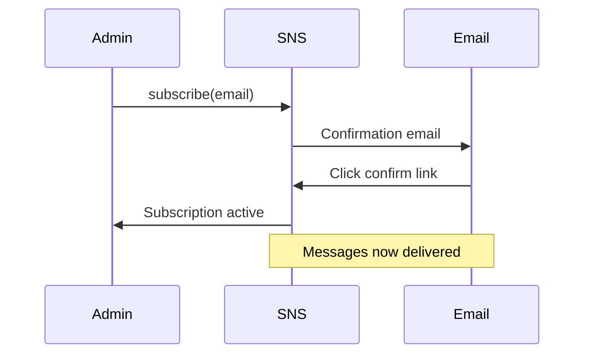

# How to Subscribe an Email Endpoint to SNS

Author: [nawazdhandala](https://github.com/nawazdhandala)

Tags: AWS, SNS, Email, Notifications

Description: Learn how to subscribe email addresses to Amazon SNS topics, handle confirmation, set up message filtering, and manage email notification formatting.

---

Email subscriptions are one of the most common SNS use cases. Want to get notified when a deployment fails, when a CloudWatch alarm fires, or when a customer places a high-value order? Subscribe an email address to the relevant topic. It's quick to set up, but there are some quirks around confirmation, formatting, and filtering that are worth knowing about.

## Creating the Subscription

Subscribe an email address using the CLI.

```bash
# Subscribe an email address to an SNS topic
aws sns subscribe \
  --topic-arn arn:aws:sns:us-east-1:123456789012:order-notifications \
  --protocol email \
  --notification-endpoint alerts@example.com
```

The response includes a subscription ARN that says "pending confirmation."

```json
{
  "SubscriptionArn": "pending confirmation"
}
```

This is important: the subscription doesn't work until the email recipient clicks the confirmation link. AWS sends a confirmation email with a link that the subscriber must click. There's no way around this - it's a spam prevention measure.

## Confirmation Workflow

Here's the flow.



You can check if a subscription has been confirmed.

```bash
# List subscriptions and check their status
aws sns list-subscriptions-by-topic \
  --topic-arn arn:aws:sns:us-east-1:123456789012:order-notifications
```

Pending subscriptions show `PendingConfirmation` as the ARN.

## Subscribing with Python

For programmatic subscription management.

```python
import boto3

sns = boto3.client('sns', region_name='us-east-1')

def subscribe_email(topic_arn, email_address, filter_policy=None):
    """Subscribe an email address to an SNS topic.

    The subscriber will receive a confirmation email they must click.
    Optionally provide a filter policy to only receive matching messages.
    """
    params = {
        'TopicArn': topic_arn,
        'Protocol': 'email',
        'Endpoint': email_address,
    }

    # Add a filter policy if provided
    if filter_policy:
        import json
        params['Attributes'] = {
            'FilterPolicy': json.dumps(filter_policy)
        }

    response = sns.subscribe(**params)
    print(f'Subscription created for {email_address}: {response["SubscriptionArn"]}')
    return response['SubscriptionArn']

# Subscribe with no filter - receives all messages
topic = 'arn:aws:sns:us-east-1:123456789012:order-notifications'
subscribe_email(topic, 'all-alerts@example.com')

# Subscribe with a filter - only receives high priority messages
subscribe_email(
    topic,
    'urgent-alerts@example.com',
    filter_policy={'priority': ['high', 'critical']}
)

# Subscribe with a filter for specific event types
subscribe_email(
    topic,
    'orders-team@example.com',
    filter_policy={'event_type': ['order_created', 'order_cancelled']}
)
```

## Email-JSON Protocol

By default, email subscriptions send the raw message text. If you want the full SNS message envelope (including attributes, subject, timestamp), use the `email-json` protocol instead.

```bash
# Subscribe with email-json for structured messages
aws sns subscribe \
  --topic-arn arn:aws:sns:us-east-1:123456789012:order-notifications \
  --protocol email-json \
  --notification-endpoint dev-team@example.com
```

The email body with `email-json` looks like this.

```json
{
  "Type": "Notification",
  "MessageId": "abc123-def456",
  "TopicArn": "arn:aws:sns:us-east-1:123456789012:order-notifications",
  "Subject": "New Order Alert",
  "Message": "{\"orderId\": \"ORD-12345\", \"amount\": 99.99}",
  "Timestamp": "2026-02-12T10:30:00.000Z",
  "MessageAttributes": {
    "event_type": {
      "Type": "String",
      "Value": "order_created"
    }
  }
}
```

## Message Filtering

Filter policies are powerful. They let different email subscribers receive different subsets of messages from the same topic. This avoids creating multiple topics for different alert levels.

```python
import json
import boto3

sns = boto3.client('sns')

topic_arn = 'arn:aws:sns:us-east-1:123456789012:alerts'

# Subscribe the on-call engineer - only critical alerts
sns.subscribe(
    TopicArn=topic_arn,
    Protocol='email',
    Endpoint='oncall@example.com',
    Attributes={
        'FilterPolicy': json.dumps({
            'severity': ['critical'],
        }),
        'FilterPolicyScope': 'MessageAttributes',
    }
)

# Subscribe the ops team - critical and warning alerts
sns.subscribe(
    TopicArn=topic_arn,
    Protocol='email',
    Endpoint='ops-team@example.com',
    Attributes={
        'FilterPolicy': json.dumps({
            'severity': ['critical', 'warning'],
        }),
        'FilterPolicyScope': 'MessageAttributes',
    }
)

# Subscribe management - only critical alerts about specific services
sns.subscribe(
    TopicArn=topic_arn,
    Protocol='email',
    Endpoint='management@example.com',
    Attributes={
        'FilterPolicy': json.dumps({
            'severity': ['critical'],
            'service': ['payments', 'authentication'],
        }),
        'FilterPolicyScope': 'MessageAttributes',
    }
)
```

## Publishing with Subject Lines

When publishing to a topic with email subscribers, include a subject line to make emails easier to scan.

```bash
# Publish with a subject line for email subscribers
aws sns publish \
  --topic-arn arn:aws:sns:us-east-1:123456789012:alerts \
  --subject "[CRITICAL] Payment Service Down" \
  --message "The payment service in us-east-1 is returning 500 errors. Last healthy response was at 10:25 UTC." \
  --message-attributes '{
    "severity": {"DataType": "String", "StringValue": "critical"},
    "service": {"DataType": "String", "StringValue": "payments"}
  }'
```

## Managing Email Subscriptions

Some common management tasks.

```bash
# List all email subscriptions for a topic
aws sns list-subscriptions-by-topic \
  --topic-arn arn:aws:sns:us-east-1:123456789012:alerts \
  --query 'Subscriptions[?Protocol==`email`]'

# Unsubscribe an email address
aws sns unsubscribe \
  --subscription-arn arn:aws:sns:us-east-1:123456789012:alerts:abc123-def456

# Update a subscription's filter policy
aws sns set-subscription-attributes \
  --subscription-arn arn:aws:sns:us-east-1:123456789012:alerts:abc123-def456 \
  --attribute-name FilterPolicy \
  --attribute-value '{"severity": ["critical", "warning", "info"]}'
```

## Bulk Email Subscription Script

If you need to subscribe a list of email addresses at once.

```python
import boto3
import json
import time

sns = boto3.client('sns')

def bulk_subscribe_emails(topic_arn, emails, filter_policy=None):
    """Subscribe multiple email addresses to a topic.

    Adds a small delay between subscriptions to avoid throttling.
    """
    results = []

    for email in emails:
        try:
            params = {
                'TopicArn': topic_arn,
                'Protocol': 'email',
                'Endpoint': email,
            }

            if filter_policy:
                params['Attributes'] = {
                    'FilterPolicy': json.dumps(filter_policy)
                }

            response = sns.subscribe(**params)
            results.append({
                'email': email,
                'status': 'subscribed',
                'arn': response['SubscriptionArn']
            })
            print(f'Subscribed: {email}')

            # Small delay to avoid API throttling
            time.sleep(0.1)

        except Exception as e:
            results.append({
                'email': email,
                'status': 'failed',
                'error': str(e)
            })
            print(f'Failed: {email} - {e}')

    return results

# Subscribe the whole team
topic = 'arn:aws:sns:us-east-1:123456789012:team-alerts'
emails = [
    'alice@example.com',
    'bob@example.com',
    'carol@example.com',
    'dave@example.com',
]

results = bulk_subscribe_emails(
    topic,
    emails,
    filter_policy={'severity': ['critical', 'warning']}
)
```

## Limitations and Alternatives

Email subscriptions have some limitations to be aware of:

- **Confirmation required**: Every email subscription needs manual confirmation. You can't automate this.
- **No rich HTML**: SNS email messages are plain text only. If you need formatted emails, use SNS to trigger a Lambda that sends emails through SES instead.
- **Delivery isn't guaranteed**: Email delivery depends on the recipient's mail server. Some messages may end up in spam folders.
- **Rate limits**: SNS throttles email delivery to prevent abuse.

For alerting, email subscriptions work great combined with [CloudWatch alarms and SNS](https://oneuptime.com/blog/post/2026-02-12-use-sns-with-cloudwatch-alarms/view). For more sophisticated notification workflows, consider subscribing a [Lambda function](https://oneuptime.com/blog/post/2026-02-12-subscribe-a-lambda-function-to-sns/view) that can format and route messages through SES.
