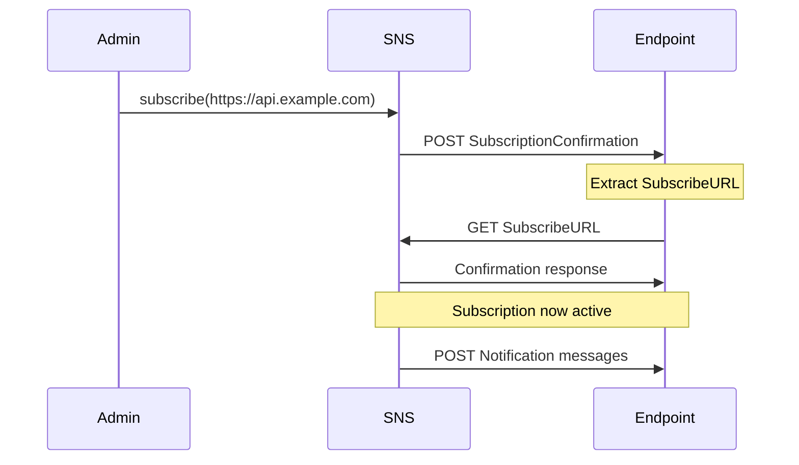

# How to Subscribe an HTTP/HTTPS Endpoint to SNS

Author: [nawazdhandala](https://github.com/nawazdhandala)

Tags: AWS, SNS, HTTP, Webhooks, Integration

Description: Learn how to subscribe HTTP and HTTPS endpoints to SNS topics for webhook-style notifications, including confirmation handling, signature verification, and retry policies.

---

Subscribing an HTTP/HTTPS endpoint to SNS essentially turns SNS into a webhook delivery system. When a message is published to the topic, SNS sends an HTTP POST to your endpoint with the message payload. This is useful for integrating with external systems, custom microservices, or third-party APIs that need to receive notifications from AWS.

There's more complexity here compared to other subscription types because your endpoint needs to handle subscription confirmation and should verify message signatures for security.

## Creating the Subscription

```bash
# Subscribe an HTTPS endpoint to an SNS topic
aws sns subscribe \
  --topic-arn arn:aws:sns:us-east-1:123456789012:order-notifications \
  --protocol https \
  --notification-endpoint https://api.example.com/webhooks/sns
```

SNS will immediately send a subscription confirmation POST to your endpoint. Your endpoint MUST respond to this confirmation request before it will receive any actual messages.

## The Confirmation Flow



## Building the Endpoint

Your endpoint needs to handle three types of SNS requests:
1. **SubscriptionConfirmation** - confirming a new subscription
2. **Notification** - actual message delivery
3. **UnsubscribeConfirmation** - confirming an unsubscribe

Here's a complete Express.js endpoint that handles all three.

```javascript
const express = require('express');
const https = require('https');
const crypto = require('crypto');

const app = express();

// SNS sends raw text, not JSON content-type headers
// We need to parse the raw body
app.use('/webhooks/sns', express.text({ type: '*/*' }));

app.post('/webhooks/sns', async (req, res) => {
  let message;
  try {
    message = JSON.parse(req.body);
  } catch {
    return res.status(400).send('Invalid JSON');
  }

  // Always verify the message signature first
  if (!verifySnsSignature(message)) {
    console.error('Invalid SNS signature - rejecting message');
    return res.status(403).send('Invalid signature');
  }

  const messageType = req.headers['x-amz-sns-message-type'];

  switch (messageType) {
    case 'SubscriptionConfirmation':
      // SNS is asking us to confirm the subscription
      await confirmSubscription(message);
      return res.status(200).send('Confirmed');

    case 'Notification':
      // This is an actual message delivery
      await handleNotification(message);
      return res.status(200).send('OK');

    case 'UnsubscribeConfirmation':
      console.log('Unsubscribe confirmed');
      return res.status(200).send('OK');

    default:
      console.log(`Unknown message type: ${messageType}`);
      return res.status(400).send('Unknown type');
  }
});

async function confirmSubscription(message) {
  // Visit the SubscribeURL to confirm the subscription
  const subscribeUrl = message.SubscribeURL;
  console.log(`Confirming subscription: ${subscribeUrl}`);

  return new Promise((resolve, reject) => {
    https.get(subscribeUrl, (response) => {
      console.log(`Subscription confirmed: ${response.statusCode}`);
      resolve();
    }).on('error', reject);
  });
}

async function handleNotification(message) {
  const subject = message.Subject || '';
  const body = message.Message;

  // Parse the message body (assuming JSON)
  let payload;
  try {
    payload = JSON.parse(body);
  } catch {
    payload = { text: body };
  }

  console.log(`Received notification - Subject: ${subject}`);
  console.log('Payload:', payload);

  // Your business logic here
  await processMessage(payload);
}

async function processMessage(payload) {
  // Implement your message processing
  console.log('Processing:', payload);
}

app.listen(3000, () => {
  console.log('SNS webhook endpoint listening on port 3000');
});
```

## Signature Verification

This is critical for security. Without signature verification, anyone can send fake SNS messages to your endpoint.

```javascript
const https = require('https');
const crypto = require('crypto');

// Fields included in the signature, in order, by message type
const NOTIFICATION_FIELDS = [
  'Message', 'MessageId', 'Subject', 'Timestamp',
  'TopicArn', 'Type'
];

const SUBSCRIPTION_FIELDS = [
  'Message', 'MessageId', 'SubscribeURL', 'Timestamp',
  'Token', 'TopicArn', 'Type'
];

function verifySnsSignature(message) {
  // Only accept signatures from SNS
  const certUrl = message.SigningCertURL || message.SigningCertUrl;

  // Verify the certificate URL is from AWS
  if (!certUrl || !certUrl.startsWith('https://sns.')) {
    return false;
  }

  // In production, download and cache the certificate
  // Then verify the signature against the signing string
  const signingFields = message.Type === 'Notification'
    ? NOTIFICATION_FIELDS
    : SUBSCRIPTION_FIELDS;

  // Build the string to sign
  let stringToSign = '';
  for (const field of signingFields) {
    if (message[field] !== undefined) {
      stringToSign += `${field}\n${message[field]}\n`;
    }
  }

  // For a complete implementation, you would:
  // 1. Download the certificate from SigningCertURL
  // 2. Extract the public key
  // 3. Verify the signature using crypto.createVerify()

  return true; // Simplified - implement full verification for production
}
```

For a Python Flask endpoint.

```python
import json
import requests
from flask import Flask, request, jsonify

app = Flask(__name__)

@app.route('/webhooks/sns', methods=['POST'])
def sns_webhook():
    """Handle incoming SNS messages."""
    # Parse the raw request body
    try:
        message = json.loads(request.data)
    except json.JSONDecodeError:
        return 'Invalid JSON', 400

    message_type = request.headers.get('x-amz-sns-message-type')

    if message_type == 'SubscriptionConfirmation':
        # Confirm the subscription by visiting the URL
        subscribe_url = message.get('SubscribeURL')
        if subscribe_url:
            response = requests.get(subscribe_url)
            print(f'Subscription confirmed: {response.status_code}')
        return 'Confirmed', 200

    elif message_type == 'Notification':
        # Process the actual message
        subject = message.get('Subject', '')
        body = message.get('Message', '')

        try:
            payload = json.loads(body)
        except json.JSONDecodeError:
            payload = {'text': body}

        print(f'Notification received - Subject: {subject}')
        process_notification(payload)
        return 'OK', 200

    elif message_type == 'UnsubscribeConfirmation':
        print('Unsubscribe confirmed')
        return 'OK', 200

    return 'Unknown message type', 400

def process_notification(payload):
    """Your business logic here."""
    print(f'Processing: {payload}')

if __name__ == '__main__':
    app.run(port=3000)
```

## Delivery Retry Policies

SNS retries failed HTTP deliveries based on a configurable retry policy. The default policy includes multiple phases with increasing backoff.

```bash
# Set a custom delivery policy for HTTP subscriptions
aws sns set-subscription-attributes \
  --subscription-arn arn:aws:sns:us-east-1:123456789012:order-notifications:abc123 \
  --attribute-name DeliveryPolicy \
  --attribute-value '{
    "healthyRetryPolicy": {
      "numRetries": 10,
      "numNoDelayRetries": 0,
      "minDelayTarget": 5,
      "maxDelayTarget": 300,
      "numMinDelayRetries": 2,
      "numMaxDelayRetries": 3,
      "backoffFunction": "exponential"
    }
  }'
```

This policy retries up to 10 times with exponential backoff, starting at 5 seconds and going up to 300 seconds between retries.

## Setting Up with CDK

```typescript
import * as sns from 'aws-cdk-lib/aws-sns';
import * as snsSubscriptions from 'aws-cdk-lib/aws-sns-subscriptions';

const topic = new sns.Topic(this, 'OrderNotifications');

// Subscribe an HTTPS endpoint
topic.addSubscription(
  new snsSubscriptions.UrlSubscription(
    'https://api.example.com/webhooks/sns',
    {
      protocol: sns.SubscriptionProtocol.HTTPS,
      rawMessageDelivery: true,  // Skip the SNS envelope
      filterPolicy: {
        event_type: sns.SubscriptionFilter.stringFilter({
          allowlist: ['order_created', 'order_shipped'],
        }),
      },
    }
  )
);
```

## Tips for Production

- **Always use HTTPS**, not HTTP. SNS supports HTTP but your messages travel in plain text.
- **Verify signatures** to prevent spoofed messages.
- **Respond quickly** with a 200 status code. Do heavy processing asynchronously (e.g., put the message in a local queue and return immediately).
- **Enable raw message delivery** if you don't need the SNS metadata envelope.
- **Set up monitoring** for failed deliveries - check the `NumberOfNotificationsFailed` metric in CloudWatch.

For more on SNS delivery monitoring, see [configuring SNS message delivery policies](https://oneuptime.com/blog/post/2026-02-12-configure-sns-message-delivery-policies/view) and [using SNS with CloudWatch alarms](https://oneuptime.com/blog/post/2026-02-12-use-sns-with-cloudwatch-alarms/view).
