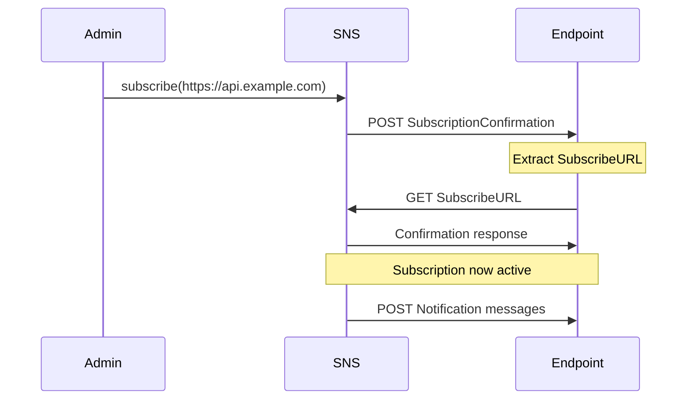

# How to Subscribe an HTTP/HTTPS Endpoint to SNS

Author: [nawazdhandala](https://github.com/nawazdhandala)

Tags: AWS, SNS, HTTP, Webhook, Integration

Description: Learn how to subscribe HTTP and HTTPS endpoints to SNS topics for webhook-style notifications, including confirmation handling, signature verification, and retry policies.

---

Subscribing an HTTP/HTTPS endpoint to SNS essentially turns SNS into a webhook delivery system. When a message is published to the topic, SNS sends an HTTP POST to your endpoint with the message payload. This is useful for integrating with external systems, custom microservices, or third-party APIs that need to receive notifications from AWS.

There's more complexity here compared to other subscription types because your endpoint needs to handle subscription confirmation and should verify message signatures for security.

## Creating the Subscription

```bash
# Subscribe an HTTPS endpoint to an SNS topic

aws sns subscribe \
  --topic-arn arn:aws:sns:us-east-1:123456789012:order-notifications \
  --protocol https \
  --notification-endpoint https://api.example.com/webhooks/sns
```

SNS will immediately send a subscription confirmation POST to your endpoint. Your endpoint MUST respond to this confirmation request before it will receive any actual messages.

## The Confirmation Flow


```mermaid
sequenceDiagram
    participant Admin
    participant SNS
    participant Endpoint
    Admin->>SNS: subscribe(https://api.example.com)
    SNS->>Endpoint: POST SubscriptionConfirmation
    Note over Endpoint: Extract SubscribeURL
    Endpoint->>SNS: GET SubscribeURL
    SNS->>Endpoint: Confirmation response
    Note over SNS,Endpoint: Subscription now active
    SNS->>Endpoint: POST Notification messages
```

## Building the Endpoint

Your endpoint needs to handle three types of SNS requests:
1. **SubscriptionConfirmation** - confirming a new subscription
2. **Notification** - actual message delivery
3. **UnsubscribeConfirmation** - confirming an unsubscribe

Here's an Express.js endpoint that handles all three.

```javascript
const express = require('express');
const https = require('https');
const crypto = require('crypto');

const app = express();

// SNS sends raw text, not JSON content-type headers
// We need to parse the raw body
app.use('/webhooks/sns', express.text({ type: '*/*' }));

app.post('/webhooks/sns', async (req, res) => {
  let message;
  try {
    message = JSON.parse(req.body);
  } catch {
    return res.status(400).send('Invalid JSON');
  }

  // Always verify the message signature first
  if (!(await verifySnsSignature(message))) {
    console.error('Invalid SNS signature - rejecting message');
    return res.status(403).send('Invalid signature');
  }

  const messageType = req.headers['x-amz-sns-message-type'];

  switch (messageType) {
    case 'SubscriptionConfirmation':
      // SNS is asking us to confirm the subscription
      await confirmSubscription(message);
      return res.status(200).send('Confirmed');

    case 'Notification':
      // This is an actual message delivery
      await handleNotification(message);
      return res.status(200).send('OK');

    case 'UnsubscribeConfirmation':
      console.log('Unsubscribe confirmed');
      return res.status(200).send('OK');

    default:
      console.log(`Unknown message type: ${messageType}`);
      return res.status(400).send('Unknown type');
  }
});

async function confirmSubscription(message) {
  // Visit the SubscribeURL to confirm the subscription
  const subscribeUrl = message.SubscribeURL;
  console.log(`Confirming subscription: ${subscribeUrl}`);

  return new Promise((resolve, reject) => {
    https.get(subscribeUrl, (response) => {
      console.log(`Subscription confirmed: ${response.statusCode}`);
      resolve();
    }).on('error', reject);
  });
}

async function handleNotification(message) {
  const subject = message.Subject || '';
  const body = message.Message;

  // Parse the message body (assuming JSON)
  let payload;
  try {
    payload = JSON.parse(body);
  } catch {
    payload = { text: body };
  }

  console.log(`Received notification - Subject: ${subject}`);
  console.log('Payload:', payload);

  // Your business logic here
  await processMessage(payload);
}

async function processMessage(payload) {
  // Implement your message processing
  console.log('Processing:', payload);
}

app.listen(3000, () => {
  console.log('SNS webhook endpoint listening on port 3000');
});
```

## Signature Verification

This is critical for security. Without signature verification, anyone can send fake SNS messages to your endpoint.

```javascript
const certificateCache = new Map();

// Fields included in the signature, in order, by message type
const NOTIFICATION_FIELDS = [
  'Message', 'MessageId', 'Subject', 'Timestamp',
  'TopicArn', 'Type'
];

const SUBSCRIPTION_FIELDS = [
  'Message', 'MessageId', 'SubscribeURL', 'Timestamp',
  'Token', 'TopicArn', 'Type'
];

function isValidSigningCertUrl(certUrl) {
  try {
    const url = new URL(certUrl);
    return url.protocol === 'https:' &&
      /^sns\.[a-z0-9-]+\.amazonaws\.com(\.cn)?$/.test(url.hostname) &&
      url.pathname.startsWith('/SimpleNotificationService-') &&
      url.pathname.endsWith('.pem');
  } catch {
    return false;
  }
}

async function downloadCertificate(certUrl) {
  if (certificateCache.has(certUrl)) {
    return certificateCache.get(certUrl);
  }

  const certificate = await new Promise((resolve, reject) => {
    https.get(certUrl, (response) => {
      if (response.statusCode !== 200) {
        response.resume();
        reject(new Error(`Certificate download failed: ${response.statusCode}`));
        return;
      }

      let body = '';
      response.setEncoding('utf8');
      response.on('data', (chunk) => {
        body += chunk;
      });
      response.on('end', () => resolve(body));
    }).on('error', reject);
  });

  certificateCache.set(certUrl, certificate);
  return certificate;
}

function buildStringToSign(message) {
  const signingFields = message.Type === 'Notification'
    ? NOTIFICATION_FIELDS
    : SUBSCRIPTION_FIELDS;

  return signingFields
    .filter((field) => message[field] !== undefined)
    .map((field) => `${field}\n${message[field]}`)
    .join('\n');
}

async function verifySnsSignature(message) {
  const certUrl = message.SigningCertURL;

  if (!isValidSigningCertUrl(certUrl) || !message.Signature) {
    return false;
  }

  try {
    const certificate = await downloadCertificate(certUrl);
    const algorithm = message.SignatureVersion === '2' ? 'RSA-SHA256' : 'RSA-SHA1';
    const verifier = crypto.createVerify(algorithm);
    verifier.update(buildStringToSign(message), 'utf8');
    verifier.end();

    return verifier.verify(certificate, message.Signature, 'base64');
  } catch {
    return false;
  }
}
```

For a Python Flask endpoint.

```python
import base64
import json
import re
from urllib.parse import urlparse

import requests
from cryptography import x509
from cryptography.hazmat.primitives.asymmetric import padding
from cryptography.hazmat.primitives import hashes
from flask import Flask, request

app = Flask(__name__)
certificate_cache = {}

NOTIFICATION_FIELDS = [
    'Message', 'MessageId', 'Subject', 'Timestamp',
    'TopicArn', 'Type',
]

SUBSCRIPTION_FIELDS = [
    'Message', 'MessageId', 'SubscribeURL', 'Timestamp',
    'Token', 'TopicArn', 'Type',
]

@app.route('/webhooks/sns', methods=['POST'])
def sns_webhook():
    """Handle incoming SNS messages."""
    # Parse the raw request body
    try:
        message = json.loads(request.data)
    except json.JSONDecodeError:
        return 'Invalid JSON', 400

    message_type = request.headers.get('x-amz-sns-message-type')

    if not verify_sns_signature(message):
        return 'Invalid signature', 403

    if message_type == 'SubscriptionConfirmation':
        # Confirm the subscription by visiting the URL
        subscribe_url = message.get('SubscribeURL')
        if subscribe_url:
            response = requests.get(subscribe_url)
            print(f'Subscription confirmed: {response.status_code}')
        return 'Confirmed', 200

    elif message_type == 'Notification':
        # Process the actual message
        subject = message.get('Subject', '')
        body = message.get('Message', '')

        try:
            payload = json.loads(body)
        except json.JSONDecodeError:
            payload = {'text': body}

        print(f'Notification received - Subject: {subject}')
        process_notification(payload)
        return 'OK', 200

    elif message_type == 'UnsubscribeConfirmation':
        print('Unsubscribe confirmed')
        return 'OK', 200

    return 'Unknown message type', 400

def process_notification(payload):
    """Your business logic here."""
    print(f'Processing: {payload}')

def is_valid_signing_cert_url(cert_url):
    """Only trust regional SNS certificate URLs."""
    try:
        parsed = urlparse(cert_url)
    except TypeError:
        return False

    return (
        parsed.scheme == 'https'
        and re.match(r'^sns\.[a-z0-9-]+\.amazonaws\.com(\.cn)?$', parsed.netloc)
        and parsed.path.startswith('/SimpleNotificationService-')
        and parsed.path.endswith('.pem')
    )

def get_certificate(cert_url):
    """Download and cache the SNS signing certificate."""
    if cert_url not in certificate_cache:
        response = requests.get(cert_url, timeout=5)
        response.raise_for_status()
        certificate_cache[cert_url] = x509.load_pem_x509_certificate(response.content)

    return certificate_cache[cert_url]

def build_string_to_sign(message):
    """Build the canonical SNS string without a trailing newline."""
    fields = NOTIFICATION_FIELDS if message.get('Type') == 'Notification' else SUBSCRIPTION_FIELDS
    parts = []
    for field in fields:
        if field in message:
            parts.append(f'{field}\n{message[field]}')

    return '\n'.join(parts)

def verify_sns_signature(message):
    """Verify the SNS message signature."""
    cert_url = message.get('SigningCertURL')
    signature = message.get('Signature')
    if not is_valid_signing_cert_url(cert_url) or not signature:
        return False

    try:
        certificate = get_certificate(cert_url)
        hash_algorithm = hashes.SHA256() if message.get('SignatureVersion') == '2' else hashes.SHA1()
        certificate.public_key().verify(
            base64.b64decode(signature),
            build_string_to_sign(message).encode('utf-8'),
            padding.PKCS1v15(),
            hash_algorithm,
        )
        return True
    except Exception:
        return False

if __name__ == '__main__':
    app.run(port=3000)
```

## Delivery Retry Policies

SNS retries failed HTTP deliveries based on a configurable retry policy. A delivery policy can include multiple phases with increasing backoff.

```bash
# Set a custom delivery policy for HTTP subscriptions
aws sns set-subscription-attributes \
  --subscription-arn arn:aws:sns:us-east-1:123456789012:order-notifications:abc123 \
  --attribute-name DeliveryPolicy \
  --attribute-value '{
    "healthyRetryPolicy": {
      "numRetries": 10,
      "numNoDelayRetries": 0,
      "minDelayTarget": 5,
      "maxDelayTarget": 300,
      "numMinDelayRetries": 2,
      "numMaxDelayRetries": 3,
      "backoffFunction": "exponential"
    }
  }'
```

This policy retries up to 10 times with exponential backoff, starting at 5 seconds and going up to 300 seconds between retries.

## Setting Up with CDK

```typescript
import * as sns from 'aws-cdk-lib/aws-sns';
import * as snsSubscriptions from 'aws-cdk-lib/aws-sns-subscriptions';

const topic = new sns.Topic(this, 'OrderNotifications');

// Subscribe an HTTPS endpoint
topic.addSubscription(
  new snsSubscriptions.UrlSubscription(
    'https://api.example.com/webhooks/sns',
    {
      protocol: sns.SubscriptionProtocol.HTTPS,
      rawMessageDelivery: false,  // Keep the SNS envelope for signature verification
      filterPolicy: {
        event_type: sns.SubscriptionFilter.stringFilter({
          allowlist: ['order_created', 'order_shipped'],
        }),
      },
    }
  )
);
```

## Tips for Production

- **Always use HTTPS**, not HTTP. SNS supports HTTP but your messages travel in plain text.
- **Verify signatures** to prevent spoofed messages.
- **Respond quickly** with a 200 status code. Do heavy processing asynchronously (e.g., put the message in a local queue and return immediately).
- **Enable raw message delivery** if you don't need the SNS metadata envelope.
- **Set up monitoring** for failed deliveries - check the `NumberOfNotificationsFailed` metric in CloudWatch.

For more on SNS delivery monitoring, see [configuring SNS message delivery policies](https://oneuptime.com/blog/post/2026-02-12-configure-sns-message-delivery-policies/view) and [using SNS with CloudWatch alarms](https://oneuptime.com/blog/post/2026-02-12-use-sns-with-cloudwatch-alarms/view).
