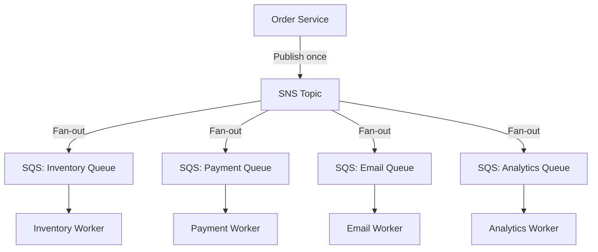

# How to Subscribe an SQS Queue to SNS (Fan-Out Pattern)

Author: [nawazdhandala](https://github.com/nawazdhandala)

Tags: AWS, SNS, SQS, Fan-Out, Messaging

Description: Learn how to implement the fan-out pattern by subscribing SQS queues to SNS topics, including permissions, dead letter queues, and filtering strategies.

---

The SNS-to-SQS fan-out pattern is one of the most useful architectural patterns in AWS. You publish a message once to an SNS topic, and it gets delivered to multiple SQS queues simultaneously. Each queue represents a different consumer or processing pipeline, and they all work independently. If one consumer is slow or fails, the others aren't affected.

## Why Fan-Out?

Consider an e-commerce system where an order event needs to trigger inventory updates, payment processing, email notifications, and analytics. Without fan-out, you'd need the publisher to know about all these consumers.



The publisher doesn't need to know about consumers. Adding a new consumer is just subscribing another queue - no changes to the publisher.

## Setting Up the Subscription

Create an SQS queue and subscribe it to an SNS topic.

```bash
# Create an SQS queue
aws sqs create-queue --queue-name order-inventory-queue

# Get the queue ARN (you'll need this for the subscription)
aws sqs get-queue-attributes \
  --queue-url https://sqs.us-east-1.amazonaws.com/123456789012/order-inventory-queue \
  --attribute-names QueueArn
```

Before subscribing, the SQS queue needs a policy that allows SNS to send messages to it.

```bash
# Set the SQS queue policy to allow SNS to send messages
aws sqs set-queue-attributes \
  --queue-url https://sqs.us-east-1.amazonaws.com/123456789012/order-inventory-queue \
  --attributes '{
    "Policy": "{\"Version\":\"2012-10-17\",\"Statement\":[{\"Sid\":\"AllowSNS\",\"Effect\":\"Allow\",\"Principal\":{\"Service\":\"sns.amazonaws.com\"},\"Action\":\"sqs:SendMessage\",\"Resource\":\"arn:aws:sqs:us-east-1:123456789012:order-inventory-queue\",\"Condition\":{\"ArnEquals\":{\"aws:SourceArn\":\"arn:aws:sns:us-east-1:123456789012:order-notifications\"}}}]}"
  }'
```

Now create the subscription.

```bash
# Subscribe the SQS queue to the SNS topic
aws sns subscribe \
  --topic-arn arn:aws:sns:us-east-1:123456789012:order-notifications \
  --protocol sqs \
  --notification-endpoint arn:aws:sqs:us-east-1:123456789012:order-inventory-queue
```

## Setting Up with Python

Here's a complete setup script that creates the queue, sets permissions, and creates the subscription.

```python
import json
import boto3

sns = boto3.client('sns')
sqs = boto3.client('sqs')

def setup_fanout_queue(topic_arn, queue_name, filter_policy=None):
    """Create an SQS queue and subscribe it to an SNS topic.

    Handles all the permission plumbing automatically.
    """
    # Create the SQS queue
    queue_response = sqs.create_queue(QueueName=queue_name)
    queue_url = queue_response['QueueUrl']

    # Get the queue ARN
    attrs = sqs.get_queue_attributes(
        QueueUrl=queue_url,
        AttributeNames=['QueueArn']
    )
    queue_arn = attrs['Attributes']['QueueArn']

    # Set the queue policy to allow SNS
    policy = {
        'Version': '2012-10-17',
        'Statement': [{
            'Sid': 'AllowSNSPublish',
            'Effect': 'Allow',
            'Principal': {'Service': 'sns.amazonaws.com'},
            'Action': 'sqs:SendMessage',
            'Resource': queue_arn,
            'Condition': {
                'ArnEquals': {'aws:SourceArn': topic_arn}
            }
        }]
    }

    sqs.set_queue_attributes(
        QueueUrl=queue_url,
        Attributes={'Policy': json.dumps(policy)}
    )

    # Subscribe the queue to the topic
    sub_params = {
        'TopicArn': topic_arn,
        'Protocol': 'sqs',
        'Endpoint': queue_arn,
    }

    if filter_policy:
        sub_params['Attributes'] = {
            'FilterPolicy': json.dumps(filter_policy),
            'FilterPolicyScope': 'MessageAttributes',
        }

    response = sns.subscribe(**sub_params)

    print(f'Queue {queue_name} subscribed to topic')
    print(f'  Queue URL: {queue_url}')
    print(f'  Subscription ARN: {response["SubscriptionArn"]}')

    return queue_url, response['SubscriptionArn']

# Set up multiple fan-out queues for different consumers
topic = 'arn:aws:sns:us-east-1:123456789012:order-notifications'

# Inventory queue - gets all order events
setup_fanout_queue(topic, 'order-inventory-queue')

# Payment queue - only gets payment-related events
setup_fanout_queue(
    topic, 'order-payment-queue',
    filter_policy={'event_type': ['payment_required', 'payment_completed']}
)

# Email queue - only gets customer-facing events
setup_fanout_queue(
    topic, 'order-email-queue',
    filter_policy={'event_type': ['order_confirmed', 'order_shipped']}
)
```

## Setting Up with CDK

CDK makes this much cleaner by handling all the IAM permissions automatically.

```typescript
import * as cdk from 'aws-cdk-lib';
import * as sns from 'aws-cdk-lib/aws-sns';
import * as sqs from 'aws-cdk-lib/aws-sqs';
import * as snsSubscriptions from 'aws-cdk-lib/aws-sns-subscriptions';

// Create the SNS topic
const orderTopic = new sns.Topic(this, 'OrderNotifications', {
  topicName: 'order-notifications',
});

// Create queues for different consumers
const inventoryQueue = new sqs.Queue(this, 'InventoryQueue', {
  queueName: 'order-inventory-queue',
  visibilityTimeout: cdk.Duration.seconds(300),
  retentionPeriod: cdk.Duration.days(7),
});

const paymentQueue = new sqs.Queue(this, 'PaymentQueue', {
  queueName: 'order-payment-queue',
  visibilityTimeout: cdk.Duration.seconds(60),
});

const emailQueue = new sqs.Queue(this, 'EmailQueue', {
  queueName: 'order-email-queue',
  visibilityTimeout: cdk.Duration.seconds(30),
});

// Subscribe queues to the topic - CDK sets up permissions automatically
orderTopic.addSubscription(
  new snsSubscriptions.SqsSubscription(inventoryQueue)
);

orderTopic.addSubscription(
  new snsSubscriptions.SqsSubscription(paymentQueue, {
    filterPolicy: {
      event_type: sns.SubscriptionFilter.stringFilter({
        allowlist: ['payment_required', 'payment_completed'],
      }),
    },
  })
);

orderTopic.addSubscription(
  new snsSubscriptions.SqsSubscription(emailQueue, {
    filterPolicy: {
      event_type: sns.SubscriptionFilter.stringFilter({
        allowlist: ['order_confirmed', 'order_shipped'],
      }),
    },
  })
);
```

## Raw Message Delivery

By default, SNS wraps messages in an SNS envelope before sending to SQS. This adds metadata but makes the message larger and harder to parse. Enable raw message delivery to get just the original message.

```bash
# Enable raw message delivery on an SQS subscription
aws sns set-subscription-attributes \
  --subscription-arn arn:aws:sns:us-east-1:123456789012:order-notifications:abc123 \
  --attribute-name RawMessageDelivery \
  --attribute-value true
```

With raw delivery enabled, your SQS consumer receives the message exactly as published. Without it, you get a wrapper like this.

```json
{
  "Type": "Notification",
  "MessageId": "abc-123",
  "TopicArn": "arn:aws:sns:us-east-1:123456789012:order-notifications",
  "Message": "{\"order_id\": \"ORD-12345\"}",
  "Timestamp": "2026-02-12T10:30:00.000Z"
}
```

## Processing Messages from the SQS Queue

Here's how a consumer reads and processes messages from the fan-out queue.

```python
import json
import boto3

sqs = boto3.client('sqs')

QUEUE_URL = 'https://sqs.us-east-1.amazonaws.com/123456789012/order-inventory-queue'

def process_messages():
    """Long-poll for messages and process them."""
    while True:
        response = sqs.receive_message(
            QueueUrl=QUEUE_URL,
            MaxNumberOfMessages=10,
            WaitTimeSeconds=20,  # Long polling
            MessageAttributeNames=['All'],
        )

        messages = response.get('Messages', [])
        if not messages:
            continue

        for msg in messages:
            try:
                # Parse the message body
                # If raw delivery is off, the actual message is nested
                body = json.loads(msg['Body'])

                # Check if it's wrapped in an SNS envelope
                if 'Message' in body and 'TopicArn' in body:
                    payload = json.loads(body['Message'])
                else:
                    payload = body

                # Process the message
                handle_inventory_update(payload)

                # Delete the message after successful processing
                sqs.delete_message(
                    QueueUrl=QUEUE_URL,
                    ReceiptHandle=msg['ReceiptHandle']
                )

            except Exception as e:
                print(f'Error processing message: {e}')
                # Message will become visible again after visibility timeout

def handle_inventory_update(order):
    """Update inventory based on the order."""
    print(f'Updating inventory for order {order.get("order_id")}')
    # Your inventory logic here

if __name__ == '__main__':
    process_messages()
```

## Dead Letter Queue for Failed Messages

Always configure a DLQ for your fan-out queues to catch messages that can't be processed.

```bash
# Create a dead letter queue
aws sqs create-queue --queue-name order-inventory-dlq

# Set the main queue's redrive policy
aws sqs set-queue-attributes \
  --queue-url https://sqs.us-east-1.amazonaws.com/123456789012/order-inventory-queue \
  --attributes '{
    "RedrivePolicy": "{\"deadLetterTargetArn\":\"arn:aws:sqs:us-east-1:123456789012:order-inventory-dlq\",\"maxReceiveCount\":\"3\"}"
  }'
```

The fan-out pattern with SNS and SQS is battle-tested and scales to massive throughput. It decouples your producers from consumers, makes adding new consumers trivial, and each consumer can process at its own pace without affecting others.

For setting up the SNS topic, see [creating an SNS topic](https://oneuptime.com/blog/post/create-an-sns-topic/view). For FIFO ordering guarantees, check out [SNS FIFO topics](https://oneuptime.com/blog/post/use-sns-fifo-topics-for-ordered-messaging/view).
