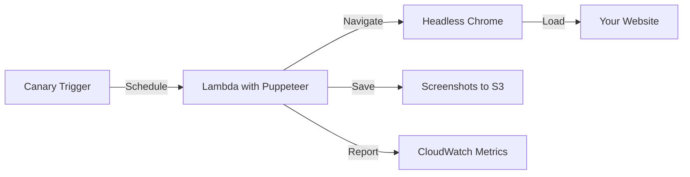

# How to Create Synthetic Monitoring Scripts for Website Flows

Author: [nawazdhandala](https://github.com/nawazdhandala)

Tags: AWS, CloudWatch, Synthetics, Browser Testing, Monitoring

Description: Learn how to write CloudWatch Synthetics browser-based canary scripts that test website flows like login, checkout, search, and navigation using Puppeteer.

---

API canaries test your backend, but they miss a whole class of problems: broken JavaScript, CSS rendering issues, slow page loads, missing images, broken forms, and client-side errors. Browser-based synthetic monitoring fills this gap by running an actual headless browser that navigates through your website just like a real user would.

CloudWatch Synthetics provides a Puppeteer-based runtime that can load pages, click buttons, fill in forms, take screenshots, and validate page content. This post covers practical patterns for writing browser canary scripts that test common website flows.

## How Browser Canaries Work

Browser canaries use Puppeteer (a headless Chrome automation library) through CloudWatch Synthetics' managed runtime. Each canary run launches a headless Chrome browser, navigates through your specified flow, takes screenshots at each step, and reports success or failure.



Screenshots are saved to S3 automatically, which is incredibly useful for debugging failures. When a canary fails at 3 AM, you can look at the screenshot to see exactly what the browser saw.

## Basic Page Load Test

The simplest browser canary loads a page and checks that it rendered correctly:

```javascript
const synthetics = require('Synthetics');
const log = require('SyntheticsLogger');

const loadPageAndValidate = async () => {
  // Get a Puppeteer page object
  const page = await synthetics.getPage();

  // Configure viewport
  await page.setViewport({ width: 1920, height: 1080 });

  // Step 1: Navigate to the home page
  const response = await page.goto('https://www.example.com', {
    waitUntil: 'networkidle0',  // Wait until no network requests for 500ms
    timeout: 30000,
  });

  // Verify the page loaded successfully
  if (response.status() !== 200) {
    throw new Error(`Home page returned status ${response.status()}`);
  }

  // Take a screenshot (saved to S3 automatically)
  await synthetics.takeScreenshot('homepage', 'loaded');

  // Verify key elements are present
  const title = await page.title();
  if (!title || title.includes('Error') || title.includes('404')) {
    throw new Error(`Unexpected page title: ${title}`);
  }

  // Check that the main content is visible
  const mainContent = await page.$('main, #app, .container');
  if (!mainContent) {
    throw new Error('Main content container not found on page');
  }

  // Check for JavaScript errors in the console
  page.on('console', (msg) => {
    if (msg.type() === 'error') {
      log.warn(`Console error: ${msg.text()}`);
    }
  });

  log.info(`Home page loaded successfully. Title: ${title}`);
};

exports.handler = async () => {
  return await loadPageAndValidate();
};
```

## Login Flow Test

Testing authentication flows is one of the most valuable things browser canaries can do:

```javascript
const synthetics = require('Synthetics');
const log = require('SyntheticsLogger');
const AWS = require('aws-sdk');

async function getTestCredentials() {
  const secretsManager = new AWS.SecretsManager();
  const secret = await secretsManager.getSecretValue({
    SecretId: 'canary/test-user-credentials',
  }).promise();
  return JSON.parse(secret.SecretString);
}

const testLoginFlow = async () => {
  const page = await synthetics.getPage();
  await page.setViewport({ width: 1920, height: 1080 });

  // Fetch test credentials from Secrets Manager
  const creds = await getTestCredentials();

  // Step 1: Navigate to login page
  log.info('Step 1: Navigate to login page');
  await page.goto('https://app.example.com/login', {
    waitUntil: 'networkidle0',
    timeout: 30000,
  });
  await synthetics.takeScreenshot('login', 'page-loaded');

  // Verify login form is present
  const emailField = await page.$('input[type="email"], input[name="email"], #email');
  const passwordField = await page.$('input[type="password"], input[name="password"], #password');
  if (!emailField || !passwordField) {
    throw new Error('Login form fields not found');
  }

  // Step 2: Enter credentials
  log.info('Step 2: Enter credentials');
  await emailField.click({ clickCount: 3 }); // Select all existing text
  await emailField.type(creds.email, { delay: 50 });
  await passwordField.click();
  await passwordField.type(creds.password, { delay: 50 });
  await synthetics.takeScreenshot('login', 'credentials-entered');

  // Step 3: Submit the form
  log.info('Step 3: Submit login form');
  const submitButton = await page.$('button[type="submit"], input[type="submit"], .login-button');
  if (!submitButton) {
    throw new Error('Submit button not found');
  }

  // Click and wait for navigation
  await Promise.all([
    page.waitForNavigation({ waitUntil: 'networkidle0', timeout: 15000 }),
    submitButton.click(),
  ]);
  await synthetics.takeScreenshot('login', 'after-submit');

  // Step 4: Verify we're logged in
  log.info('Step 4: Verify logged in state');
  const currentUrl = page.url();
  if (currentUrl.includes('/login') || currentUrl.includes('/signin')) {
    // Still on login page - check for error messages
    const errorMsg = await page.$('.error-message, .alert-danger, [role="alert"]');
    if (errorMsg) {
      const errorText = await page.evaluate(el => el.textContent, errorMsg);
      throw new Error(`Login failed with error: ${errorText}`);
    }
    throw new Error('Login failed - still on login page');
  }

  // Check for a logged-in indicator (user menu, avatar, dashboard, etc.)
  const loggedInIndicator = await page.$('.user-menu, .avatar, .dashboard, [data-testid="user-profile"]');
  if (!loggedInIndicator) {
    throw new Error('Logged in indicator not found - login may have failed');
  }

  log.info('Login flow completed successfully');
  await synthetics.takeScreenshot('login', 'logged-in');
};

exports.handler = async () => {
  return await testLoginFlow();
};
```

## Search Flow Test

Test that your search functionality works end to end:

```javascript
const synthetics = require('Synthetics');
const log = require('SyntheticsLogger');

const testSearchFlow = async () => {
  const page = await synthetics.getPage();
  await page.setViewport({ width: 1920, height: 1080 });

  // Step 1: Go to the home page
  await page.goto('https://www.example.com', {
    waitUntil: 'networkidle0',
    timeout: 30000,
  });

  // Step 2: Find and use the search box
  log.info('Step 2: Enter search query');
  const searchInput = await page.$('input[type="search"], input[name="q"], .search-input, #search');
  if (!searchInput) {
    throw new Error('Search input not found');
  }

  await searchInput.click();
  await searchInput.type('monitoring best practices', { delay: 30 });
  await synthetics.takeScreenshot('search', 'query-entered');

  // Step 3: Submit the search
  log.info('Step 3: Submit search');
  await page.keyboard.press('Enter');

  // Wait for search results to load
  await page.waitForSelector('.search-results, .results-container, [data-testid="search-results"]', {
    timeout: 10000,
  });
  await synthetics.takeScreenshot('search', 'results-loaded');

  // Step 4: Verify results
  log.info('Step 4: Verify search results');
  const results = await page.$$('.search-result, .result-item, [data-testid="result"]');

  if (results.length === 0) {
    // Check for "no results" message
    const noResults = await page.$('.no-results, .empty-state');
    if (noResults) {
      log.warn('Search returned no results - this might be expected');
    } else {
      throw new Error('No search results and no empty state message found');
    }
  } else {
    log.info(`Search returned ${results.length} results`);
  }

  // Step 5: Click on the first result
  if (results.length > 0) {
    log.info('Step 5: Click first result');
    const firstResult = results[0];
    const link = await firstResult.$('a');
    if (link) {
      await Promise.all([
        page.waitForNavigation({ waitUntil: 'networkidle0', timeout: 15000 }),
        link.click(),
      ]);
      await synthetics.takeScreenshot('search', 'result-page');

      // Verify the result page loaded
      const resultPageStatus = page.url();
      if (resultPageStatus.includes('/404') || resultPageStatus.includes('error')) {
        throw new Error(`Search result links to error page: ${resultPageStatus}`);
      }
      log.info(`Navigated to result: ${resultPageStatus}`);
    }
  }
};

exports.handler = async () => {
  return await testSearchFlow();
};
```

## Checkout Flow Test

Testing a checkout or purchase flow is one of the highest-value canaries:

```javascript
const synthetics = require('Synthetics');
const log = require('SyntheticsLogger');

const testCheckoutFlow = async () => {
  const page = await synthetics.getPage();
  await page.setViewport({ width: 1920, height: 1080 });

  // Step 1: Navigate to a product page
  log.info('Step 1: Go to product page');
  await page.goto('https://shop.example.com/products/test-product', {
    waitUntil: 'networkidle0',
    timeout: 30000,
  });
  await synthetics.takeScreenshot('checkout', 'product-page');

  // Verify product page loaded
  const productTitle = await page.$('.product-title, h1');
  if (!productTitle) throw new Error('Product title not found');

  const price = await page.$('.price, .product-price');
  if (!price) throw new Error('Product price not found');

  // Step 2: Add to cart
  log.info('Step 2: Add to cart');
  const addToCartBtn = await page.$('.add-to-cart, button[data-action="add-cart"], #add-to-cart');
  if (!addToCartBtn) throw new Error('Add to cart button not found');

  await addToCartBtn.click();

  // Wait for cart update confirmation
  await page.waitForSelector('.cart-notification, .cart-count, .added-to-cart', {
    timeout: 5000,
  });
  await synthetics.takeScreenshot('checkout', 'added-to-cart');
  log.info('Product added to cart');

  // Step 3: Go to cart
  log.info('Step 3: Navigate to cart');
  const cartLink = await page.$('.cart-link, a[href*="cart"], .cart-icon');
  if (cartLink) {
    await Promise.all([
      page.waitForNavigation({ waitUntil: 'networkidle0', timeout: 15000 }),
      cartLink.click(),
    ]);
  } else {
    await page.goto('https://shop.example.com/cart', {
      waitUntil: 'networkidle0',
    });
  }
  await synthetics.takeScreenshot('checkout', 'cart-page');

  // Verify cart has items
  const cartItems = await page.$$('.cart-item, .line-item, [data-testid="cart-item"]');
  if (cartItems.length === 0) {
    throw new Error('Cart is empty after adding product');
  }
  log.info(`Cart has ${cartItems.length} item(s)`);

  // Step 4: Verify checkout button exists (don't actually complete purchase)
  const checkoutBtn = await page.$('.checkout-button, a[href*="checkout"], #checkout');
  if (!checkoutBtn) {
    throw new Error('Checkout button not found on cart page');
  }

  // Step 5: Clean up - remove the item from cart
  log.info('Step 5: Clean up cart');
  const removeBtn = await page.$('.remove-item, .delete-item, button[data-action="remove"]');
  if (removeBtn) {
    await removeBtn.click();
    await page.waitForTimeout(2000); // Wait for cart update
    log.info('Test item removed from cart');
  }

  await synthetics.takeScreenshot('checkout', 'cleanup-complete');
  log.info('Checkout flow test completed successfully');
};

exports.handler = async () => {
  return await testCheckoutFlow();
};
```

## Performance Monitoring

Measure real page load performance metrics:

```javascript
const synthetics = require('Synthetics');
const log = require('SyntheticsLogger');

const measurePerformance = async () => {
  const page = await synthetics.getPage();
  await page.setViewport({ width: 1920, height: 1080 });

  await page.goto('https://www.example.com', {
    waitUntil: 'networkidle0',
    timeout: 30000,
  });

  // Get Web Vitals-style performance metrics
  const metrics = await page.evaluate(() => {
    const nav = performance.getEntriesByType('navigation')[0];
    const paint = performance.getEntriesByType('paint');

    const fcp = paint.find(p => p.name === 'first-contentful-paint');

    return {
      domContentLoaded: nav.domContentLoadedEventEnd - nav.startTime,
      loadComplete: nav.loadEventEnd - nav.startTime,
      firstContentfulPaint: fcp ? fcp.startTime : null,
      ttfb: nav.responseStart - nav.startTime,
      domInteractive: nav.domInteractive - nav.startTime,
      resourceCount: performance.getEntriesByType('resource').length,
    };
  });

  log.info(`Performance metrics: ${JSON.stringify(metrics, null, 2)}`);

  // Validate performance thresholds
  if (metrics.ttfb > 800) {
    throw new Error(`TTFB too high: ${metrics.ttfb}ms (threshold: 800ms)`);
  }

  if (metrics.firstContentfulPaint && metrics.firstContentfulPaint > 2500) {
    throw new Error(`FCP too high: ${metrics.firstContentfulPaint}ms (threshold: 2500ms)`);
  }

  if (metrics.loadComplete > 5000) {
    throw new Error(`Page load too slow: ${metrics.loadComplete}ms (threshold: 5000ms)`);
  }

  await synthetics.takeScreenshot('performance', 'loaded');
  log.info('All performance thresholds met');
};

exports.handler = async () => {
  return await measurePerformance();
};
```

## Handling Dynamic Content and SPAs

Single-page applications require special handling since content loads asynchronously:

```javascript
const synthetics = require('Synthetics');
const log = require('SyntheticsLogger');

const testSPA = async () => {
  const page = await synthetics.getPage();
  await page.setViewport({ width: 1920, height: 1080 });

  // For SPAs, networkidle0 might fire too early
  await page.goto('https://app.example.com/dashboard', {
    waitUntil: 'networkidle2',  // Allows up to 2 in-flight requests
    timeout: 30000,
  });

  // Wait for a specific element that indicates the SPA has fully loaded
  await page.waitForSelector('[data-testid="dashboard-loaded"], .dashboard-content', {
    visible: true,
    timeout: 15000,
  });

  // Wait for loading spinners to disappear
  await page.waitForFunction(() => {
    const spinners = document.querySelectorAll('.loading, .spinner, [data-loading="true"]');
    return spinners.length === 0;
  }, { timeout: 10000 });

  await synthetics.takeScreenshot('spa', 'fully-loaded');

  // Now interact with the loaded SPA
  const tabs = await page.$$('.tab, .nav-item');
  if (tabs.length > 1) {
    // Click the second tab and verify content updates
    await tabs[1].click();
    await page.waitForTimeout(2000); // Allow for transition/loading
    await synthetics.takeScreenshot('spa', 'second-tab');
  }

  log.info('SPA test completed successfully');
};

exports.handler = async () => {
  return await testSPA();
};
```

## Error Detection

Catch JavaScript errors and failed network requests:

```javascript
const synthetics = require('Synthetics');
const log = require('SyntheticsLogger');

const detectErrors = async () => {
  const page = await synthetics.getPage();
  const jsErrors = [];
  const failedRequests = [];

  // Capture JavaScript errors
  page.on('pageerror', (error) => {
    jsErrors.push(error.message);
    log.warn(`JS Error: ${error.message}`);
  });

  // Capture failed network requests
  page.on('requestfailed', (request) => {
    failedRequests.push({
      url: request.url(),
      reason: request.failure().errorText,
    });
    log.warn(`Failed request: ${request.url()} - ${request.failure().errorText}`);
  });

  await page.goto('https://www.example.com', {
    waitUntil: 'networkidle0',
    timeout: 30000,
  });

  await synthetics.takeScreenshot('errors', 'page-loaded');

  // Report findings
  if (jsErrors.length > 0) {
    throw new Error(`${jsErrors.length} JavaScript error(s): ${jsErrors.join('; ')}`);
  }

  if (failedRequests.length > 0) {
    const critical = failedRequests.filter(r => !r.url.includes('analytics') && !r.url.includes('tracking'));
    if (critical.length > 0) {
      throw new Error(`${critical.length} failed request(s): ${JSON.stringify(critical)}`);
    }
  }

  log.info('No errors detected');
};

exports.handler = async () => {
  return await detectErrors();
};
```

## Wrapping Up

Browser-based synthetic monitoring catches the class of problems that API tests miss - rendering issues, broken client-side code, slow page loads, and broken user flows. The key is keeping your scripts maintainable by using data-testid attributes for selectors (more stable than CSS classes), adding generous timeouts for dynamic content, and taking screenshots at every step for debugging. Start with your most critical user flow - usually the landing page and login - then expand to cover checkout, search, and other key paths. For the infrastructure setup, see our [CloudWatch Synthetics canaries guide](https://oneuptime.com/blog/post/2026-02-12-cloudwatch-synthetics-canaries/view), and for API-specific testing, check out [synthetic monitoring for API endpoints](https://oneuptime.com/blog/post/2026-02-12-synthetic-monitoring-scripts-api-endpoints/view).
