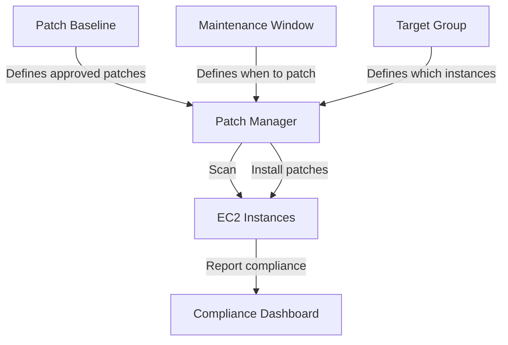

# How to Use Systems Manager Patch Manager

Author: [nawazdhandala](https://github.com/nawazdhandala)

Tags: AWS, Systems Manager, Patch Manager, Security, DevOps

Description: Automate OS patching across your EC2 fleet using AWS Systems Manager Patch Manager, including patch baselines, maintenance windows, and compliance reporting.

---

Patching servers is one of those tasks that's boring but critical. Skip it and you're running vulnerable software. Do it manually and you'll burn hours every month. Do it wrong and you'll take down production.

AWS Systems Manager Patch Manager automates the entire process. You define what patches to install, when to install them, and which instances to target. Patch Manager handles the rest - scanning for missing patches, downloading them, installing them, and rebooting if necessary. It even gives you compliance reports so you can prove to auditors that your fleet is up to date.

## How Patch Manager Works



The workflow involves three components:

1. **Patch baselines** define which patches are approved for installation
2. **Maintenance windows** define when patching happens
3. **Targets** define which instances get patched

## Step 1: Understand Patch Baselines

A patch baseline is a set of rules that determine which patches are approved. AWS provides default baselines for each OS, but you should create custom ones.

View the default baselines:

```bash
# List default patch baselines
aws ssm describe-patch-baselines \
  --filters "Key=OWNER,Values=AWS" \
  --query 'BaselineIdentities[*].{Id:BaselineId,Name:BaselineName,OS:OperatingSystem}'
```

## Step 2: Create a Custom Patch Baseline

Here's a patch baseline for Amazon Linux 2 that auto-approves security patches after 3 days:

```bash
# Create a custom patch baseline for Amazon Linux 2
aws ssm create-patch-baseline \
  --name "MyOrg-AmazonLinux2-Production" \
  --operating-system "AMAZON_LINUX_2" \
  --description "Production patch baseline - auto-approve security patches after 3 days" \
  --approval-rules '{
    "PatchRules": [
      {
        "PatchFilterGroup": {
          "PatchFilters": [
            {"Key": "CLASSIFICATION", "Values": ["Security"]},
            {"Key": "SEVERITY", "Values": ["Critical", "Important"]}
          ]
        },
        "ApproveAfterDays": 3,
        "ComplianceLevel": "CRITICAL",
        "EnableNonSecurity": false
      },
      {
        "PatchFilterGroup": {
          "PatchFilters": [
            {"Key": "CLASSIFICATION", "Values": ["Security"]},
            {"Key": "SEVERITY", "Values": ["Medium", "Low"]}
          ]
        },
        "ApproveAfterDays": 7,
        "ComplianceLevel": "HIGH"
      },
      {
        "PatchFilterGroup": {
          "PatchFilters": [
            {"Key": "CLASSIFICATION", "Values": ["Bugfix"]}
          ]
        },
        "ApproveAfterDays": 14,
        "ComplianceLevel": "MEDIUM"
      }
    ]
  }' \
  --rejected-patches "kernel*" \
  --rejected-patches-action "BLOCK"
```

This baseline:
- Auto-approves Critical/Important security patches after 3 days
- Auto-approves Medium/Low security patches after 7 days
- Auto-approves bugfix patches after 14 days
- Blocks all kernel patches (those need separate testing)

For Ubuntu:

```bash
# Create a patch baseline for Ubuntu
aws ssm create-patch-baseline \
  --name "MyOrg-Ubuntu-Production" \
  --operating-system "UBUNTU" \
  --description "Ubuntu production patch baseline" \
  --approval-rules '{
    "PatchRules": [
      {
        "PatchFilterGroup": {
          "PatchFilters": [
            {"Key": "PRIORITY", "Values": ["Required", "Important"]}
          ]
        },
        "ApproveAfterDays": 3,
        "ComplianceLevel": "CRITICAL"
      },
      {
        "PatchFilterGroup": {
          "PatchFilters": [
            {"Key": "SECTION", "Values": ["libs", "admin", "utils"]}
          ]
        },
        "ApproveAfterDays": 7,
        "ComplianceLevel": "MEDIUM"
      }
    ]
  }'
```

## Step 3: Register the Baseline as Default

Set your custom baseline as the default for the OS:

```bash
# Register as the default patch baseline for Amazon Linux 2
aws ssm register-default-patch-baseline \
  --baseline-id pb-0abc123def456

# Verify
aws ssm get-default-patch-baseline \
  --operating-system AMAZON_LINUX_2
```

## Step 4: Create Patch Groups

Patch groups let you assign different baselines to different sets of instances. Tag your instances with a `Patch Group` tag:

```bash
# Tag instances for their patch group
aws ec2 create-tags \
  --resources i-0abc123 i-0def456 i-0ghi789 \
  --tags "Key=Patch Group,Value=Production-WebServers"

aws ec2 create-tags \
  --resources i-0jkl012 i-0mno345 \
  --tags "Key=Patch Group,Value=Production-Databases"
```

Register the patch group with your baseline:

```bash
# Associate the patch group with the baseline
aws ssm register-patch-baseline-for-patch-group \
  --baseline-id pb-0abc123def456 \
  --patch-group "Production-WebServers"
```

## Step 5: Scan for Missing Patches

Before installing anything, scan to see what's missing:

```bash
# Scan instances for missing patches (scan only, don't install)
aws ssm send-command \
  --document-name "AWS-RunPatchBaseline" \
  --targets "Key=tag:Patch Group,Values=Production-WebServers" \
  --parameters '{"Operation":["Scan"]}' \
  --comment "Scan for missing patches"
```

Check the results:

```bash
# View patch compliance for an instance
aws ssm describe-instance-patch-states \
  --instance-ids i-0abc123def456 \
  --query 'InstancePatchStates[*].{Instance:InstanceId,Installed:InstalledCount,Missing:MissingCount,Failed:FailedCount,NotApplicable:NotApplicableCount}'
```

To see which specific patches are missing:

```bash
# List missing patches for an instance
aws ssm describe-instance-patches \
  --instance-id i-0abc123def456 \
  --filters "Key=State,Values=Missing" \
  --query 'Patches[*].{Title:Title,Classification:Classification,Severity:Severity,State:State}'
```

## Step 6: Create a Maintenance Window

Maintenance windows define when patching occurs. You don't want patches installing during business hours.

```bash
# Create a maintenance window - every Sunday at 2 AM UTC, 3 hour duration
aws ssm create-maintenance-window \
  --name "Production-PatchWindow" \
  --schedule "cron(0 2 ? * SUN *)" \
  --duration 3 \
  --cutoff 1 \
  --allow-unassociated-targets \
  --description "Weekly patch window for production servers"
```

The `--cutoff 1` means stop starting new tasks 1 hour before the window ends. This gives running patches time to finish.

## Step 7: Register Targets

Tell the maintenance window which instances to patch:

```bash
# Register instances by tag
aws ssm register-target-with-maintenance-window \
  --window-id mw-0abc123def456 \
  --resource-type "INSTANCE" \
  --targets "Key=tag:Patch Group,Values=Production-WebServers" \
  --name "Production-WebServers"
```

## Step 8: Register the Patch Task

```bash
# Register the patching task
aws ssm register-task-with-maintenance-window \
  --window-id mw-0abc123def456 \
  --task-type "RUN_COMMAND" \
  --task-arn "AWS-RunPatchBaseline" \
  --targets "Key=WindowTargetIds,Values=target-id-from-above" \
  --task-invocation-parameters '{
    "RunCommand": {
      "Parameters": {
        "Operation": ["Install"],
        "RebootOption": ["RebootIfNeeded"]
      },
      "OutputS3BucketName": "my-patch-logs",
      "OutputS3KeyPrefix": "patch-results",
      "TimeoutSeconds": 3600,
      "Comment": "Weekly production patching"
    }
  }' \
  --max-concurrency "30%" \
  --max-errors "10%" \
  --service-role-arn arn:aws:iam::123456789012:role/MaintenanceWindowRole \
  --priority 1 \
  --name "Install-Patches"
```

Key settings:
- `"Operation": ["Install"]` - Actually install patches (use "Scan" for dry runs)
- `"RebootOption": ["RebootIfNeeded"]` - Reboot if patches require it
- `--max-concurrency "30%"` - Patch 30% of targets at a time
- `--max-errors "10%"` - Stop if more than 10% fail

## Compliance Reporting

After patching, check compliance across your fleet:

```bash
# Get overall patch compliance summary
aws ssm list-compliance-summaries \
  --filters "Key=ComplianceType,Values=Patch" \
  --query 'ComplianceSummaryItems[*].{Type:ComplianceType,Compliant:CompliantSummary.CompliantCount,NonCompliant:NonCompliantSummary.NonCompliantCount}'

# Get compliance for specific instances
aws ssm list-resource-compliance-summaries \
  --filters "Key=ComplianceType,Values=Patch" \
  --query 'ResourceComplianceSummaryItems[*].{Instance:ResourceId,Status:Status,NonCompliant:NonCompliantSummary}'
```

## Handling Kernel Patches

Kernel patches are special because they always require a reboot and can cause issues. Handle them separately:

```bash
# Create a separate baseline that ONLY includes kernel patches
aws ssm create-patch-baseline \
  --name "MyOrg-KernelPatches" \
  --operating-system "AMAZON_LINUX_2" \
  --approval-rules '{
    "PatchRules": [
      {
        "PatchFilterGroup": {
          "PatchFilters": [
            {"Key": "CLASSIFICATION", "Values": ["Security"]},
            {"Key": "SEVERITY", "Values": ["Critical"]}
          ]
        },
        "ApproveAfterDays": 14,
        "ComplianceLevel": "CRITICAL"
      }
    ]
  }' \
  --approved-patches "kernel*" \
  --approved-patches-compliance-level "CRITICAL"
```

Schedule kernel patches on a different maintenance window with a longer duration and more conservative rate controls.

## Pre and Post Patch Scripts

Run custom scripts before and after patching:

```bash
# Register a pre-patch task (runs before patching starts)
aws ssm register-task-with-maintenance-window \
  --window-id mw-0abc123def456 \
  --task-type "RUN_COMMAND" \
  --task-arn "AWS-RunShellScript" \
  --targets "Key=WindowTargetIds,Values=target-id" \
  --task-invocation-parameters '{
    "RunCommand": {
      "Parameters": {
        "commands": [
          "#!/bin/bash",
          "echo \"Pre-patch: Draining instance from load balancer\"",
          "aws elbv2 deregister-targets --target-group-arn $TG_ARN --targets Id=$(curl -s http://169.254.169.254/latest/meta-data/instance-id)",
          "sleep 30",
          "echo \"Instance drained, ready for patching\""
        ]
      }
    }
  }' \
  --priority 0 \
  --name "Pre-Patch-Drain"
```

```bash
# Register a post-patch task (runs after patching completes)
aws ssm register-task-with-maintenance-window \
  --window-id mw-0abc123def456 \
  --task-type "RUN_COMMAND" \
  --task-arn "AWS-RunShellScript" \
  --targets "Key=WindowTargetIds,Values=target-id" \
  --task-invocation-parameters '{
    "RunCommand": {
      "Parameters": {
        "commands": [
          "#!/bin/bash",
          "echo \"Post-patch: Re-registering with load balancer\"",
          "aws elbv2 register-targets --target-group-arn $TG_ARN --targets Id=$(curl -s http://169.254.169.254/latest/meta-data/instance-id)",
          "echo \"Post-patch: Verifying application health\"",
          "for i in $(seq 1 10); do",
          "  STATUS=$(curl -s -o /dev/null -w \"%{http_code}\" localhost:8080/health)",
          "  if [ \"$STATUS\" = \"200\" ]; then echo \"Health check passed\"; exit 0; fi",
          "  sleep 5",
          "done",
          "echo \"WARNING: Health check failed after patching\"",
          "exit 1"
        ]
      }
    }
  }' \
  --priority 2 \
  --name "Post-Patch-Verify"
```

Tasks with lower priority numbers run first. So priority 0 (pre-patch) runs before priority 1 (patching) which runs before priority 2 (post-patch).

## Staging Patches

Always test patches in a non-production environment first:

1. Create a staging maintenance window that runs a few days before production
2. Use the same patch baseline
3. Monitor staging for issues
4. Production patching happens only if staging succeeds

```bash
# Staging window - Thursday 2 AM
aws ssm create-maintenance-window \
  --name "Staging-PatchWindow" \
  --schedule "cron(0 2 ? * THU *)" \
  --duration 3 \
  --cutoff 1

# Production window - Sunday 2 AM (3 days after staging)
aws ssm create-maintenance-window \
  --name "Production-PatchWindow" \
  --schedule "cron(0 2 ? * SUN *)" \
  --duration 3 \
  --cutoff 1
```

## Monitoring

Track patch compliance over time. If compliance drops, you've either got new patches or failed installations. For comprehensive monitoring of your patching operations and post-patch application health, [OneUptime](https://oneuptime.com) can correlate patch events with application performance metrics, helping you catch patch-related issues quickly.

For running ad-hoc commands on your instances outside of maintenance windows, see our guide on [Systems Manager Run Command](https://oneuptime.com/blog/post/systems-manager-run-command/view).
