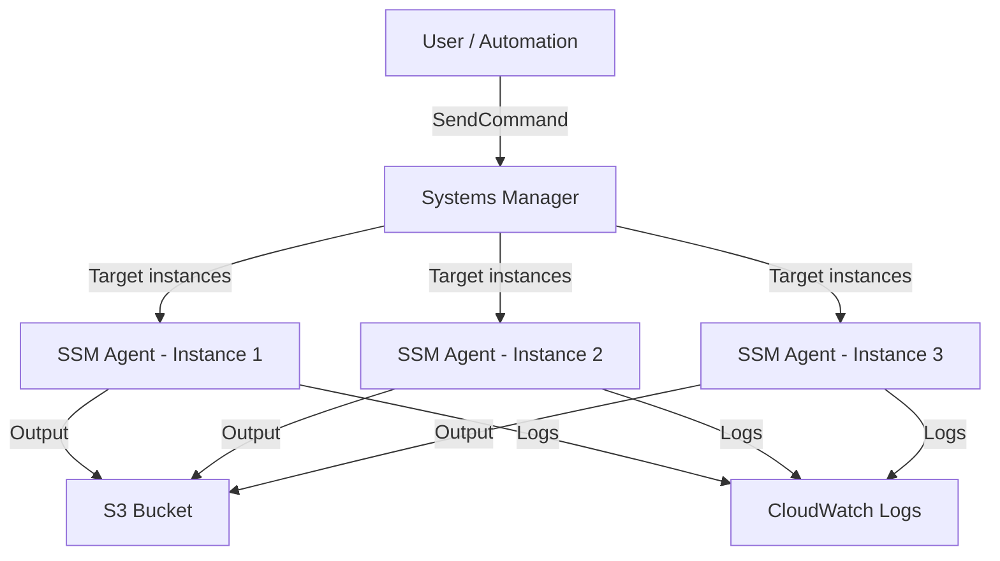

# How to Use Systems Manager Run Command

Author: [nawazdhandala](https://github.com/nawazdhandala)

Tags: AWS, Systems Manager, Run Command, EC2, DevOps

Description: Learn how to use AWS Systems Manager Run Command to execute commands across multiple EC2 instances simultaneously, with output logging and error handling.

---

When you need to run a command on one EC2 instance, you SSH in. When you need to run it on fifty instances, you need Systems Manager Run Command. It lets you execute shell scripts, PowerShell commands, or pre-built automation documents across hundreds of instances simultaneously - all without SSH access, open ports, or bastion hosts.

Run Command uses the same SSM agent as Session Manager, so if you've already set that up, you're halfway there.

## How Run Command Works



You send a command, specify targets (by instance ID, tag, or resource group), and SSM distributes it to all matching instances. Each instance executes the command independently and reports back.

## Prerequisites

Each target instance needs:

- The SSM agent installed and running
- An IAM instance profile with `AmazonSSMManagedInstanceCore` attached
- Outbound connectivity to Systems Manager endpoints (internet or VPC endpoints)

See our guide on [Session Manager setup](https://oneuptime.com/blog/post/2026-02-12-systems-manager-session-manager/view) for detailed IAM and agent configuration.

## Running Your First Command

The simplest example - run a shell command on a single instance:

```bash
# Run a command on a single instance
aws ssm send-command \
  --instance-ids "i-0abc123def456" \
  --document-name "AWS-RunShellScript" \
  --parameters 'commands=["uptime","df -h","free -m"]' \
  --comment "Check system health"
```

Run it on multiple instances:

```bash
# Run on multiple instances
aws ssm send-command \
  --instance-ids "i-0abc123" "i-0def456" "i-0ghi789" \
  --document-name "AWS-RunShellScript" \
  --parameters 'commands=["systemctl status nginx"]'
```

## Targeting by Tags

Instead of listing instance IDs, target by tags. This is much more practical for fleets:

```bash
# Run on all instances with a specific tag
aws ssm send-command \
  --targets "Key=tag:Environment,Values=production" \
  --document-name "AWS-RunShellScript" \
  --parameters 'commands=["df -h"]' \
  --comment "Check disk space on production instances"

# Target by multiple tags
aws ssm send-command \
  --targets "Key=tag:Environment,Values=production" "Key=tag:Application,Values=web-api" \
  --document-name "AWS-RunShellScript" \
  --parameters 'commands=["curl -s localhost:8080/health"]'
```

## Multi-Line Scripts

For longer scripts, pass them as a JSON array:

```bash
# Run a multi-line script
aws ssm send-command \
  --targets "Key=tag:Environment,Values=production" \
  --document-name "AWS-RunShellScript" \
  --parameters '{
    "commands": [
      "#!/bin/bash",
      "set -e",
      "echo \"=== System Info ===\"",
      "hostname",
      "uptime",
      "echo \"\"",
      "echo \"=== Disk Usage ===\"",
      "df -h /",
      "echo \"\"",
      "echo \"=== Memory ===\"",
      "free -m",
      "echo \"\"",
      "echo \"=== Top Processes ===\"",
      "ps aux --sort=-%mem | head -10"
    ],
    "executionTimeout": ["300"]
  }' \
  --comment "System health check"
```

## Capturing Output

### To S3

Store command output in S3 for later review:

```bash
# Run command with S3 output logging
aws ssm send-command \
  --targets "Key=tag:Environment,Values=production" \
  --document-name "AWS-RunShellScript" \
  --parameters 'commands=["df -h","free -m","netstat -tlnp"]' \
  --output-s3-bucket-name "my-ssm-output-bucket" \
  --output-s3-key-prefix "run-command-output" \
  --comment "System health check with S3 logging"
```

### To CloudWatch Logs

```bash
# Run command with CloudWatch output
aws ssm send-command \
  --targets "Key=tag:Environment,Values=production" \
  --document-name "AWS-RunShellScript" \
  --parameters 'commands=["systemctl status nginx"]' \
  --cloud-watch-output-config '{"CloudWatchLogGroupName":"/ssm/run-command","CloudWatchOutputEnabled":true}'
```

### Viewing Output from CLI

```bash
# Get the command ID from send-command output, then check results
COMMAND_ID="abc-123-def"

# List all invocations (one per instance)
aws ssm list-command-invocations \
  --command-id $COMMAND_ID \
  --details \
  --query 'CommandInvocations[*].{Instance:InstanceId,Status:Status,Output:CommandPlugins[0].Output}'
```

For a specific instance:

```bash
# Get output from a specific instance
aws ssm get-command-invocation \
  --command-id $COMMAND_ID \
  --instance-id i-0abc123def456 \
  --query '{Status:Status,Output:StandardOutputContent,Error:StandardErrorContent}'
```

## Common Use Cases

### Deploying Configuration Changes

```bash
# Update nginx configuration across all web servers
aws ssm send-command \
  --targets "Key=tag:Role,Values=web-server" \
  --document-name "AWS-RunShellScript" \
  --parameters '{
    "commands": [
      "#!/bin/bash",
      "set -e",
      "# Download new config from S3",
      "aws s3 cp s3://my-configs/nginx/default.conf /etc/nginx/sites-available/default",
      "# Test the configuration",
      "nginx -t",
      "# Reload nginx",
      "systemctl reload nginx",
      "echo \"Nginx configuration updated successfully\""
    ]
  }' \
  --comment "Update nginx configuration"
```

### Collecting Logs

```bash
# Gather application logs from all instances
aws ssm send-command \
  --targets "Key=tag:Application,Values=orders-api" \
  --document-name "AWS-RunShellScript" \
  --parameters '{
    "commands": [
      "#!/bin/bash",
      "INSTANCE_ID=$(curl -s http://169.254.169.254/latest/meta-data/instance-id)",
      "TIMESTAMP=$(date +%Y%m%d-%H%M%S)",
      "# Package the last 1000 lines of application logs",
      "tail -1000 /var/log/myapp/application.log | gzip > /tmp/logs-${INSTANCE_ID}-${TIMESTAMP}.gz",
      "# Upload to S3",
      "aws s3 cp /tmp/logs-${INSTANCE_ID}-${TIMESTAMP}.gz s3://my-log-collection/incident-2026-02/${INSTANCE_ID}/",
      "rm /tmp/logs-${INSTANCE_ID}-${TIMESTAMP}.gz",
      "echo \"Logs collected and uploaded\""
    ]
  }' \
  --output-s3-bucket-name "my-ssm-output-bucket" \
  --comment "Collect application logs for incident investigation"
```

### Security Patching

```bash
# Check for and list available security updates
aws ssm send-command \
  --targets "Key=tag:Environment,Values=staging" \
  --document-name "AWS-RunShellScript" \
  --parameters '{
    "commands": [
      "#!/bin/bash",
      "echo \"=== Available Security Updates ===\"",
      "yum check-update --security 2>/dev/null || true",
      "echo \"\"",
      "echo \"=== Current Kernel ===\"",
      "uname -r"
    ]
  }' \
  --comment "Check available security patches"
```

For full patch management, see our guide on [Systems Manager Patch Manager](https://oneuptime.com/blog/post/2026-02-12-systems-manager-patch-manager/view).

## Built-in SSM Documents

AWS provides many pre-built documents. Here are the most useful ones:

```bash
# Install or update the SSM agent
aws ssm send-command \
  --targets "Key=tag:Environment,Values=production" \
  --document-name "AWS-UpdateSSMAgent"

# Install or update the CloudWatch agent
aws ssm send-command \
  --targets "Key=tag:Environment,Values=production" \
  --document-name "AmazonCloudWatch-ManageAgent" \
  --parameters '{"action":["configure"],"mode":["ec2"],"optionalConfigurationSource":["ssm"],"optionalConfigurationLocation":["/cloudwatch-agent/config"]}'

# Run a PowerShell script on Windows instances
aws ssm send-command \
  --targets "Key=tag:OS,Values=Windows" \
  --document-name "AWS-RunPowerShellScript" \
  --parameters 'commands=["Get-Service | Where-Object {$_.Status -eq \"Running\"} | Select-Object Name, Status"]'
```

List available documents:

```bash
# List AWS-provided documents
aws ssm list-documents \
  --filters "Key=Owner,Values=Amazon" \
  --query 'DocumentIdentifiers[*].{Name:Name,Platform:PlatformTypes}'
```

## Rate Controls

When running commands across many instances, you don't want to hit them all at once. Use rate controls:

```bash
# Run on maximum 10 instances at a time
aws ssm send-command \
  --targets "Key=tag:Environment,Values=production" \
  --document-name "AWS-RunShellScript" \
  --parameters 'commands=["systemctl restart myapp"]' \
  --max-concurrency "10" \
  --max-errors "2" \
  --comment "Rolling restart of application"
```

Or use percentages:

```bash
# Run on 25% of instances at a time, stop if more than 10% fail
aws ssm send-command \
  --targets "Key=tag:Environment,Values=production" \
  --document-name "AWS-RunShellScript" \
  --parameters 'commands=["systemctl restart myapp"]' \
  --max-concurrency "25%" \
  --max-errors "10%" \
  --comment "Rolling restart with rate limiting"
```

`--max-errors` tells SSM to stop sending commands if failures exceed the threshold. This prevents cascading issues.

## Creating Custom Documents

For commands you run frequently, create a custom SSM document:

```bash
# Create a custom document for application restarts
aws ssm create-document \
  --name "MyOrg-RestartApplication" \
  --document-type "Command" \
  --content '{
    "schemaVersion": "2.2",
    "description": "Restart the application with health check verification",
    "parameters": {
      "ServiceName": {
        "type": "String",
        "description": "Name of the systemd service to restart",
        "default": "myapp"
      },
      "HealthCheckUrl": {
        "type": "String",
        "description": "URL to check after restart",
        "default": "http://localhost:8080/health"
      }
    },
    "mainSteps": [
      {
        "action": "aws:runShellScript",
        "name": "RestartAndVerify",
        "inputs": {
          "runCommand": [
            "#!/bin/bash",
            "set -e",
            "SERVICE={{ServiceName}}",
            "HEALTH_URL={{HealthCheckUrl}}",
            "echo \"Restarting $SERVICE...\"",
            "systemctl restart $SERVICE",
            "sleep 10",
            "for i in $(seq 1 12); do",
            "  STATUS=$(curl -s -o /dev/null -w \"%{http_code}\" $HEALTH_URL || echo 000)",
            "  if [ \"$STATUS\" = \"200\" ]; then",
            "    echo \"Health check passed after restart\"",
            "    exit 0",
            "  fi",
            "  echo \"Attempt $i: HTTP $STATUS, waiting...\"",
            "  sleep 5",
            "done",
            "echo \"Health check failed after restart\"",
            "exit 1"
          ]
        }
      }
    ]
  }'
```

Use it:

```bash
aws ssm send-command \
  --targets "Key=tag:Application,Values=orders-api" \
  --document-name "MyOrg-RestartApplication" \
  --parameters '{"ServiceName":["orders-api"],"HealthCheckUrl":["http://localhost:8080/health"]}'
```

## Monitoring and Alerting

Track Run Command usage and failures with CloudWatch. For comprehensive operational visibility, [OneUptime](https://oneuptime.com) can help you monitor command execution across your fleet and alert when automated maintenance tasks fail.

For automated patching workflows, check our guide on [Systems Manager Patch Manager](https://oneuptime.com/blog/post/2026-02-12-systems-manager-patch-manager/view).
