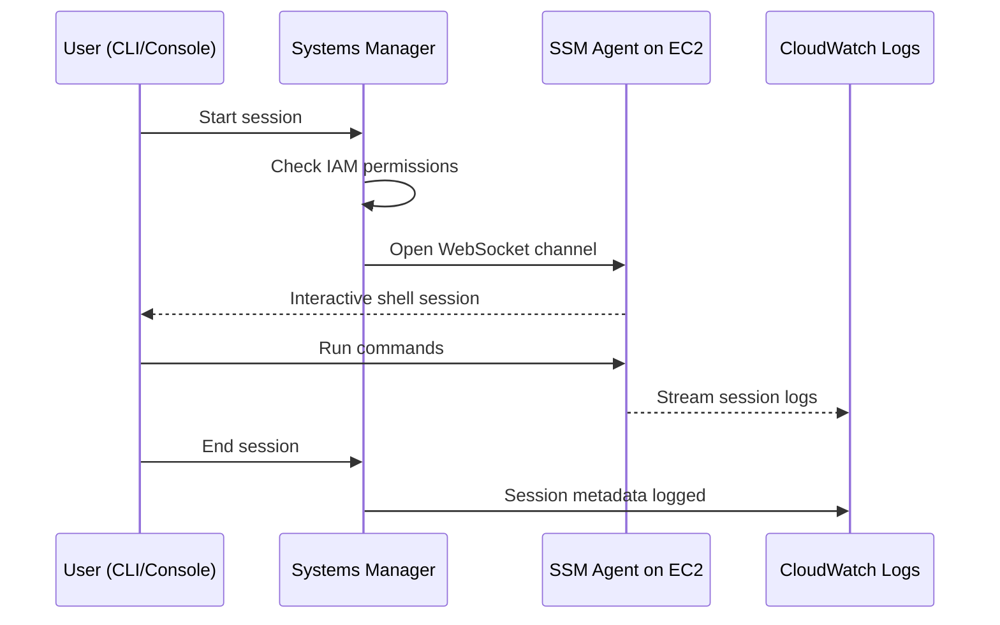

# How to Use Systems Manager Session Manager for EC2 Access

Author: [nawazdhandala](https://github.com/nawazdhandala)

Tags: AWS, Systems Manager, Session Manager, EC2, Security

Description: Replace SSH with AWS Systems Manager Session Manager for secure, audited, and keyless access to EC2 instances without opening inbound ports.

---

SSH keys are a security headache. You've got to generate them, distribute them, rotate them, and somehow make sure nobody leaves them on a laptop that gets stolen. Plus you need port 22 open on your security groups, which is one more attack surface.

AWS Systems Manager Session Manager eliminates all of that. It gives you shell access to EC2 instances through the SSM agent - no SSH keys, no open ports, no bastion hosts. Access is controlled through IAM, and every session is logged to CloudTrail and optionally to S3 or CloudWatch.

## How It Works



The SSM agent on the instance creates an outbound WebSocket connection to the Systems Manager service. Your commands travel through that encrypted channel. There's no inbound connection to the instance at all.

## Prerequisites

You need three things:

1. The SSM agent installed and running on the instance
2. An IAM instance profile with SSM permissions
3. Outbound internet access (or VPC endpoints) from the instance

## Step 1: Set Up the IAM Instance Profile

Your EC2 instances need a role that allows them to communicate with Systems Manager:

```bash
# Create the role
aws iam create-role \
  --role-name SSMInstanceRole \
  --assume-role-policy-document '{
    "Version": "2012-10-17",
    "Statement": [{
      "Effect": "Allow",
      "Principal": {"Service": "ec2.amazonaws.com"},
      "Action": "sts:AssumeRole"
    }]
  }'

# Attach the managed policy for SSM
aws iam attach-role-policy \
  --role-name SSMInstanceRole \
  --policy-arn arn:aws:iam::aws:policy/AmazonSSMManagedInstanceCore

# Create and associate instance profile
aws iam create-instance-profile \
  --instance-profile-name SSMInstanceProfile

aws iam add-role-to-instance-profile \
  --instance-profile-name SSMInstanceProfile \
  --role-name SSMInstanceRole
```

Attach the profile to your EC2 instance:

```bash
# Attach to a running instance
aws ec2 associate-iam-instance-profile \
  --instance-id i-0abc123def456 \
  --iam-instance-profile Name=SSMInstanceProfile
```

For new instances, include it in the launch template:

```bash
aws ec2 run-instances \
  --image-id ami-0abcdef1234567890 \
  --instance-type t3.medium \
  --iam-instance-profile Name=SSMInstanceProfile \
  --security-group-ids sg-noinbound123
```

Notice you don't need to allow port 22 in the security group. In fact, you can have a security group with no inbound rules at all.

## Step 2: Install the SSM Agent

Amazon Linux 2, Amazon Linux 2023, and most recent Ubuntu AMIs come with the SSM agent pre-installed. For older AMIs:

```bash
# Amazon Linux / Amazon Linux 2
sudo yum install -y amazon-ssm-agent
sudo systemctl enable amazon-ssm-agent
sudo systemctl start amazon-ssm-agent

# Ubuntu
sudo snap install amazon-ssm-agent --classic
sudo systemctl enable snap.amazon-ssm-agent.amazon-ssm-agent.service
sudo systemctl start snap.amazon-ssm-agent.amazon-ssm-agent.service
```

Verify the agent is running:

```bash
sudo systemctl status amazon-ssm-agent
```

## Step 3: Install the Session Manager Plugin (Local Machine)

To use Session Manager from the CLI, install the plugin on your local machine:

```bash
# macOS
curl "https://s3.amazonaws.com/session-manager-downloads/plugin/latest/mac/sessionmanager-bundle.zip" -o "sessionmanager-bundle.zip"
unzip sessionmanager-bundle.zip
sudo ./sessionmanager-bundle/install -i /usr/local/sessionmanagerplugin -b /usr/local/bin/session-manager-plugin

# Verify installation
session-manager-plugin --version
```

For Linux:

```bash
# Linux (64-bit)
curl "https://s3.amazonaws.com/session-manager-downloads/plugin/latest/ubuntu_64bit/session-manager-plugin.deb" -o "session-manager-plugin.deb"
sudo dpkg -i session-manager-plugin.deb
```

## Step 4: Start a Session

```bash
# Start an interactive session
aws ssm start-session --target i-0abc123def456
```

That's it. You get a shell on the instance. No SSH key needed.

You can also connect through the AWS Console: go to Systems Manager > Session Manager > Start a session, select your instance, and click "Start session."

## Port Forwarding

Session Manager can forward ports, which is incredibly useful for accessing databases and internal services:

```bash
# Forward local port 5432 to the instance's port 5432 (PostgreSQL)
aws ssm start-session \
  --target i-0abc123def456 \
  --document-name AWS-StartPortForwardingSession \
  --parameters '{"portNumber":["5432"],"localPortNumber":["5432"]}'
```

Now connect to `localhost:5432` with your database client. The traffic tunnels through SSM.

For forwarding to a remote host through the instance:

```bash
# Forward to an RDS instance through the EC2 instance
aws ssm start-session \
  --target i-0abc123def456 \
  --document-name AWS-StartPortForwardingSessionToRemoteHost \
  --parameters '{"host":["mydb.cluster-abc123.us-east-1.rds.amazonaws.com"],"portNumber":["5432"],"localPortNumber":["5432"]}'
```

This replaces the need for SSH tunnels through bastion hosts.

## Configuring Session Preferences

Configure Session Manager to log sessions and set default shell preferences:

```bash
# Create a session preferences document
aws ssm update-document \
  --name "SSM-SessionManagerRunShell" \
  --document-version '$LATEST' \
  --content '{
    "schemaVersion": "1.0",
    "description": "Session Manager preferences",
    "sessionType": "Standard_Stream",
    "inputs": {
      "s3BucketName": "my-session-logs-bucket",
      "s3KeyPrefix": "session-logs",
      "s3EncryptionEnabled": true,
      "cloudWatchLogGroupName": "/ssm/session-logs",
      "cloudWatchEncryptionEnabled": true,
      "idleSessionTimeout": "20",
      "maxSessionDuration": "120",
      "kmsKeyId": "arn:aws:kms:us-east-1:123456789:key/abc-123",
      "runAsEnabled": true,
      "runAsDefaultUser": "ec2-user",
      "shellProfile": {
        "linux": "/bin/bash",
        "windows": ""
      }
    }
  }'
```

Key settings:

- **s3BucketName** - Store session logs in S3 for auditing
- **cloudWatchLogGroupName** - Stream session logs to CloudWatch
- **idleSessionTimeout** - Auto-terminate idle sessions (minutes)
- **maxSessionDuration** - Maximum session length (minutes)
- **runAsDefaultUser** - Which OS user the session runs as
- **kmsKeyId** - Encrypt session data in transit

## IAM Policies for Users

Control who can start sessions and to which instances:

Allow sessions to all instances:

```json
{
  "Version": "2012-10-17",
  "Statement": [
    {
      "Effect": "Allow",
      "Action": "ssm:StartSession",
      "Resource": "arn:aws:ec2:us-east-1:123456789:instance/*"
    },
    {
      "Effect": "Allow",
      "Action": [
        "ssm:TerminateSession",
        "ssm:ResumeSession"
      ],
      "Resource": "arn:aws:ssm:*:*:session/${aws:username}-*"
    }
  ]
}
```

Restrict to specific instances by tag:

```json
{
  "Version": "2012-10-17",
  "Statement": [
    {
      "Effect": "Allow",
      "Action": "ssm:StartSession",
      "Resource": "arn:aws:ec2:us-east-1:123456789:instance/*",
      "Condition": {
        "StringEquals": {
          "ssm:resourceTag/Environment": "development"
        }
      }
    }
  ]
}
```

This lets developers access dev instances but not production.

## Using VPC Endpoints (No Internet Required)

If your instances don't have internet access, create VPC endpoints for Session Manager:

```bash
# Create the required VPC endpoints
aws ec2 create-vpc-endpoint \
  --vpc-id vpc-abc123 \
  --service-name com.amazonaws.us-east-1.ssm \
  --vpc-endpoint-type Interface \
  --subnet-ids subnet-abc subnet-def \
  --security-group-ids sg-endpoint123

aws ec2 create-vpc-endpoint \
  --vpc-id vpc-abc123 \
  --service-name com.amazonaws.us-east-1.ssmmessages \
  --vpc-endpoint-type Interface \
  --subnet-ids subnet-abc subnet-def \
  --security-group-ids sg-endpoint123

aws ec2 create-vpc-endpoint \
  --vpc-id vpc-abc123 \
  --service-name com.amazonaws.us-east-1.ec2messages \
  --vpc-endpoint-type Interface \
  --subnet-ids subnet-abc subnet-def \
  --security-group-ids sg-endpoint123
```

You need all three endpoints: `ssm`, `ssmmessages`, and `ec2messages`.

## SSH Through Session Manager

If you still need SSH (for tools like SCP), you can tunnel SSH through Session Manager:

Add this to your `~/.ssh/config`:

```
# SSH through Session Manager
Host i-*
    ProxyCommand sh -c "aws ssm start-session --target %h --document-name AWS-StartSSHSession --parameters 'portNumber=%p'"

# Example: connect to a specific instance
Host my-server
    HostName i-0abc123def456
    User ec2-user
    ProxyCommand sh -c "aws ssm start-session --target %h --document-name AWS-StartSSHSession --parameters 'portNumber=%p'"
```

Now `ssh my-server` tunnels through Session Manager. You still need an SSH key on the instance, but you don't need port 22 open.

## Auditing Sessions

Every session is tracked. View active and past sessions:

```bash
# List active sessions
aws ssm describe-sessions --state Active

# List recent sessions
aws ssm describe-sessions --state History \
  --query 'Sessions[*].{Id:SessionId,Target:Target,User:Owner,Start:StartDate,End:EndDate}'
```

Session logs (when configured) capture every command typed and every output produced. This is invaluable for security audits and incident investigation.

For comprehensive monitoring of your infrastructure access patterns and security events, [OneUptime](https://oneuptime.com) can aggregate Systems Manager session data alongside application metrics. Also check our guide on [Systems Manager Run Command](https://oneuptime.com/blog/post/systems-manager-run-command/view) for running commands across multiple instances without interactive sessions.
