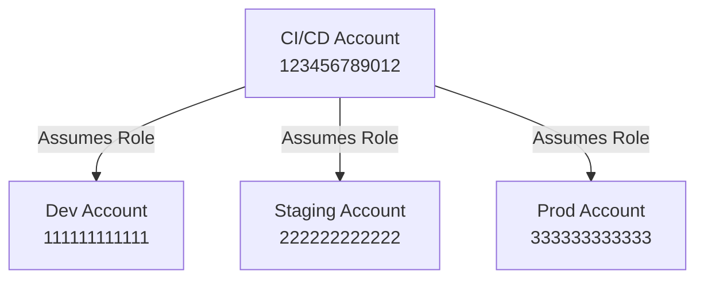

# How to Use Terraform with Assume Role for Cross-Account Access

Author: [nawazdhandala](https://github.com/nawazdhandala)

Tags: AWS, Terraform, IAM, Security, Multi-Account

Description: Set up cross-account Terraform deployments using IAM assume role, including trust policies, provider configuration, and CI/CD pipeline integration for multi-account AWS.

---

Most serious AWS setups use multiple accounts - one for development, one for staging, one for production, maybe a shared services account for CI/CD. Terraform needs to deploy to all of them, but you don't want separate credentials for each. Assume role lets you authenticate once and then switch between accounts using IAM roles.

This guide covers the full setup: creating roles in target accounts, configuring trust policies, setting up the Terraform provider, and integrating with CI/CD pipelines.

## The Multi-Account Pattern

Here's the typical setup. A central account (often called "management" or "CI/CD") holds the credentials. Target accounts have roles that the central account can assume.



The CI/CD account authenticates with its own credentials, then assumes a deployment role in whichever target account it needs to work with.

## Step 1: Create the Deployment Role in Target Accounts

Each target account needs an IAM role that Terraform will assume. Create this role in the target account.

```hcl
# Run this in the target account (e.g., dev, staging, prod)

# The role that Terraform will assume
resource "aws_iam_role" "terraform_deploy" {
  name = "TerraformDeployRole"

  # Trust policy - who can assume this role
  assume_role_policy = jsonencode({
    Version = "2012-10-17"
    Statement = [
      {
        Effect = "Allow"
        Principal = {
          AWS = "arn:aws:iam::123456789012:root"  # CI/CD account
        }
        Action = "sts:AssumeRole"
        Condition = {
          StringEquals = {
            # Optional: require an external ID for extra security
            "sts:ExternalId" = "terraform-deploy-2026"
          }
        }
      }
    ]
  })

  max_session_duration = 3600  # 1 hour

  tags = {
    ManagedBy = "terraform"
    Purpose   = "Cross-account Terraform deployment"
  }
}

# Attach permissions to the role
# Scope this down based on what Terraform needs to create
resource "aws_iam_role_policy_attachment" "terraform_deploy" {
  role       = aws_iam_role.terraform_deploy.name
  policy_arn = "arn:aws:iam::aws:policy/AdministratorAccess"
}
```

For production, you should scope down the permissions instead of using AdministratorAccess. Create a custom policy that only allows the actions Terraform needs.

```hcl
# More restrictive policy for production
resource "aws_iam_policy" "terraform_deploy" {
  name = "TerraformDeployPolicy"

  policy = jsonencode({
    Version = "2012-10-17"
    Statement = [
      {
        Effect = "Allow"
        Action = [
          "ec2:*",
          "ecs:*",
          "rds:*",
          "s3:*",
          "elasticloadbalancing:*",
          "cloudwatch:*",
          "logs:*",
          "lambda:*",
          "dynamodb:*",
          "route53:*",
          "acm:*",
          "secretsmanager:*",
          "ssm:*",
          "iam:Get*",
          "iam:List*",
          "iam:CreateRole",
          "iam:DeleteRole",
          "iam:AttachRolePolicy",
          "iam:DetachRolePolicy",
          "iam:PutRolePolicy",
          "iam:DeleteRolePolicy",
          "iam:PassRole",
          "iam:CreateServiceLinkedRole",
          "iam:CreateInstanceProfile",
          "iam:AddRoleToInstanceProfile",
          "iam:RemoveRoleFromInstanceProfile",
          "iam:DeleteInstanceProfile",
        ]
        Resource = "*"
      },
      {
        Effect = "Deny"
        Action = [
          "iam:CreateUser",
          "iam:CreateAccessKey",
          "organizations:*",
        ]
        Resource = "*"
      }
    ]
  })
}
```

## Step 2: Create the Assuming Identity in the CI/CD Account

In your CI/CD account, create a user or role that's allowed to assume roles in target accounts.

```hcl
# Run this in the CI/CD account

# IAM user for CI/CD (or use a role if running on EC2/ECS)
resource "aws_iam_user" "terraform_ci" {
  name = "terraform-ci"
}

# Policy that allows assuming roles in target accounts
resource "aws_iam_user_policy" "assume_roles" {
  name = "AssumeTargetAccountRoles"
  user = aws_iam_user.terraform_ci.name

  policy = jsonencode({
    Version = "2012-10-17"
    Statement = [
      {
        Effect = "Allow"
        Action = "sts:AssumeRole"
        Resource = [
          "arn:aws:iam::111111111111:role/TerraformDeployRole",  # Dev
          "arn:aws:iam::222222222222:role/TerraformDeployRole",  # Staging
          "arn:aws:iam::333333333333:role/TerraformDeployRole",  # Prod
        ]
      }
    ]
  })
}
```

## Step 3: Configure the Terraform Provider

Now configure Terraform to assume the target role.

```hcl
# Provider for the dev account
provider "aws" {
  region = "us-east-1"

  assume_role {
    role_arn     = "arn:aws:iam::111111111111:role/TerraformDeployRole"
    session_name = "terraform-dev"
    external_id  = "terraform-deploy-2026"
  }
}
```

For deploying to multiple accounts from the same configuration, use provider aliases.

```hcl
# Default provider - dev account
provider "aws" {
  region = "us-east-1"

  assume_role {
    role_arn     = "arn:aws:iam::111111111111:role/TerraformDeployRole"
    session_name = "terraform-dev"
  }
}

# Staging account
provider "aws" {
  alias  = "staging"
  region = "us-east-1"

  assume_role {
    role_arn     = "arn:aws:iam::222222222222:role/TerraformDeployRole"
    session_name = "terraform-staging"
  }
}

# Production account
provider "aws" {
  alias  = "production"
  region = "us-east-1"

  assume_role {
    role_arn     = "arn:aws:iam::333333333333:role/TerraformDeployRole"
    session_name = "terraform-production"
  }
}

# Use specific providers on resources
resource "aws_s3_bucket" "staging_data" {
  provider = aws.staging
  bucket   = "staging-data-bucket"
}
```

## Using Variables for the Role ARN

Don't hardcode role ARNs. Use variables so the same configuration works across environments.

```hcl
variable "target_account_role_arn" {
  description = "ARN of the IAM role to assume in the target account"
  type        = string
}

variable "deploy_region" {
  description = "AWS region to deploy to"
  type        = string
  default     = "us-east-1"
}

provider "aws" {
  region = var.deploy_region

  assume_role {
    role_arn     = var.target_account_role_arn
    session_name = "terraform-deploy"
  }
}
```

Then use different `.tfvars` files per environment.

```hcl
# dev.tfvars
target_account_role_arn = "arn:aws:iam::111111111111:role/TerraformDeployRole"
deploy_region           = "us-east-1"

# production.tfvars
target_account_role_arn = "arn:aws:iam::333333333333:role/TerraformDeployRole"
deploy_region           = "us-east-1"
```

## CI/CD Integration

### GitHub Actions

```yaml
name: Deploy Infrastructure
on:
  push:
    branches: [main]

jobs:
  deploy-dev:
    runs-on: ubuntu-latest
    env:
      AWS_ACCESS_KEY_ID: ${{ secrets.AWS_ACCESS_KEY_ID }}
      AWS_SECRET_ACCESS_KEY: ${{ secrets.AWS_SECRET_ACCESS_KEY }}
    steps:
      - uses: actions/checkout@v4
      - uses: hashicorp/setup-terraform@v3

      - name: Deploy to Dev
        run: |
          terraform init
          terraform apply -auto-approve -var-file=dev.tfvars

  deploy-prod:
    needs: deploy-dev
    runs-on: ubuntu-latest
    environment: production  # Requires manual approval
    env:
      AWS_ACCESS_KEY_ID: ${{ secrets.AWS_ACCESS_KEY_ID }}
      AWS_SECRET_ACCESS_KEY: ${{ secrets.AWS_SECRET_ACCESS_KEY }}
    steps:
      - uses: actions/checkout@v4
      - uses: hashicorp/setup-terraform@v3

      - name: Deploy to Production
        run: |
          terraform init
          terraform apply -auto-approve -var-file=production.tfvars
```

### Using OIDC Instead of Access Keys

For better security, use OIDC federation so your CI/CD platform doesn't need long-lived AWS credentials. Check out our guide on [configuring AWS provider authentication](https://oneuptime.com/blog/post/configure-aws-provider-authentication-in-terraform/view) for the full OIDC setup.

## Chained Assume Role

Sometimes you need to assume a role in the CI/CD account first, then assume another role in the target account. This is called "chained" or "double hop" assume role.

```hcl
# Terraform doesn't support chained assume role directly,
# but you can use the AWS CLI to get intermediate credentials

# Option 1: Use a profile with source_profile
# ~/.aws/config
# [profile ci]
# role_arn = arn:aws:iam::123456789012:role/CIRole
# source_profile = default
#
# [profile deploy-prod]
# role_arn = arn:aws:iam::333333333333:role/TerraformDeployRole
# source_profile = ci

provider "aws" {
  region  = "us-east-1"
  profile = "deploy-prod"
}
```

## Troubleshooting

Common issues with assume role setups.

```bash
# Error: "is not authorized to perform: sts:AssumeRole"
# The assuming identity doesn't have permission to assume the target role
# Check: IAM policy on the assuming identity

# Error: "The security token included in the request is invalid"
# The external ID doesn't match
# Check: external_id in provider matches the trust policy

# Test assume role manually
aws sts assume-role \
  --role-arn "arn:aws:iam::111111111111:role/TerraformDeployRole" \
  --role-session-name "test" \
  --external-id "terraform-deploy-2026"
```

## Wrapping Up

Cross-account assume role is the standard pattern for multi-account Terraform deployments. Set up roles in each target account with appropriate permissions, configure trust policies to control who can assume them, and use provider configuration to switch between accounts. Combined with OIDC federation for CI/CD, you get a setup with no long-lived credentials and granular access control.

For managing the state across these accounts, see our guide on [Terraform state with S3 backend](https://oneuptime.com/blog/post/terraform-state-with-s3-backend-and-dynamodb-locking/view).
