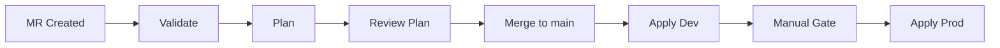

# How to Set Up Terraform CI/CD with GitLab CI for AWS

Author: [nawazdhandala](https://github.com/nawazdhandala)

Tags: AWS, Terraform, GitLab CI, CI/CD, DevOps

Description: Build a Terraform CI/CD pipeline with GitLab CI for AWS deployments, covering plan on merge requests, apply on merge, OIDC authentication, and environment gates.

---

GitLab CI is a natural choice for Terraform pipelines if your organization runs on GitLab. It has built-in support for environments, manual approvals, and artifact passing between stages. Combined with Terraform, you get a deployment workflow that's auditable, repeatable, and hard to mess up.

This guide covers setting up a complete Terraform pipeline with GitLab CI - from basic plan/apply to OIDC authentication, environment protection, and multi-environment deployments.

## Pipeline Design

The flow follows the same pattern as any Terraform CI/CD pipeline: validate on every push, plan on merge requests, and apply after merge.



## Project Structure

```
infrastructure/
  environments/
    dev/
      main.tf
      backend.tf
      terraform.tfvars
    production/
      main.tf
      backend.tf
      terraform.tfvars
  modules/
    vpc/
    ecs/
  .gitlab-ci.yml
```

## Authentication with OIDC

GitLab supports OIDC federation with AWS, eliminating the need for stored credentials.

Set up the OIDC provider in AWS first.

```hcl
# One-time setup in your AWS account
resource "aws_iam_openid_connect_provider" "gitlab" {
  url             = "https://gitlab.com"
  client_id_list  = ["https://gitlab.com"]
  thumbprint_list = ["b3dd7606d2b5a8b4a13771dbecc9ee1cecafa38a"]
}

resource "aws_iam_role" "gitlab_terraform" {
  name = "GitLabTerraformRole"

  assume_role_policy = jsonencode({
    Version = "2012-10-17"
    Statement = [{
      Effect = "Allow"
      Principal = {
        Federated = aws_iam_openid_connect_provider.gitlab.arn
      }
      Action = "sts:AssumeRoleWithWebIdentity"
      Condition = {
        StringEquals = {
          "gitlab.com:aud" = "https://gitlab.com"
        }
        StringLike = {
          # Restrict to your specific project
          "gitlab.com:sub" = "project_path:mygroup/infrastructure:ref_type:branch:ref:main"
        }
      }
    }]
  })
}

resource "aws_iam_role_policy_attachment" "gitlab_terraform" {
  role       = aws_iam_role.gitlab_terraform.name
  policy_arn = "arn:aws:iam::aws:policy/AdministratorAccess"
}
```

If you're not using OIDC, store AWS credentials as CI/CD variables in GitLab: `AWS_ACCESS_KEY_ID` and `AWS_SECRET_ACCESS_KEY` as masked, protected variables.

## Basic GitLab CI Configuration

Here's the complete `.gitlab-ci.yml`.

```yaml
# .gitlab-ci.yml

# Use the official Terraform image
image:
  name: hashicorp/terraform:1.7.0
  entrypoint: [""]

# Define pipeline stages
stages:
  - validate
  - plan
  - apply

# Cache Terraform providers across jobs
cache:
  key: terraform-providers
  paths:
    - environments/**/.terraform/providers

# Common variables
variables:
  TF_IN_AUTOMATION: "true"  # Adjust output for CI
  TF_INPUT: "false"          # Never prompt for input

# Template for OIDC authentication
.aws_auth:
  id_tokens:
    GITLAB_OIDC_TOKEN:
      aud: https://gitlab.com
  before_script:
    - |
      # Get AWS credentials via OIDC
      export $(printf "AWS_ACCESS_KEY_ID=%s AWS_SECRET_ACCESS_KEY=%s AWS_SESSION_TOKEN=%s" \
        $(aws sts assume-role-with-web-identity \
        --role-arn ${AWS_ROLE_ARN} \
        --role-session-name "gitlab-ci-${CI_JOB_ID}" \
        --web-identity-token ${GITLAB_OIDC_TOKEN} \
        --duration-seconds 3600 \
        --query 'Credentials.[AccessKeyId,SecretAccessKey,SessionToken]' \
        --output text))

# ============================================================
# VALIDATE STAGE
# ============================================================

validate:
  stage: validate
  script:
    - cd environments/dev
    - terraform init -backend=false
    - terraform validate
    - terraform fmt -check -recursive ../../
  rules:
    - if: $CI_PIPELINE_SOURCE == "merge_request_event"
    - if: $CI_COMMIT_BRANCH == "main"

# ============================================================
# PLAN STAGE
# ============================================================

plan:dev:
  stage: plan
  variables:
    AWS_ROLE_ARN: "arn:aws:iam::123456789012:role/GitLabTerraformRole"
  before_script:
    - apk add --no-cache aws-cli  # Install AWS CLI for OIDC
  script:
    - cd environments/dev
    - terraform init
    - terraform plan -out=dev.tfplan
  artifacts:
    paths:
      - environments/dev/dev.tfplan
      - environments/dev/.terraform
      - environments/dev/.terraform.lock.hcl
    expire_in: 1 day
  rules:
    - if: $CI_PIPELINE_SOURCE == "merge_request_event"
    - if: $CI_COMMIT_BRANCH == "main"

plan:production:
  stage: plan
  variables:
    AWS_ROLE_ARN: "arn:aws:iam::123456789012:role/GitLabTerraformRole"
  before_script:
    - apk add --no-cache aws-cli
  script:
    - cd environments/production
    - terraform init
    - terraform plan -out=prod.tfplan
  artifacts:
    paths:
      - environments/production/prod.tfplan
      - environments/production/.terraform
      - environments/production/.terraform.lock.hcl
    expire_in: 1 day
  rules:
    - if: $CI_PIPELINE_SOURCE == "merge_request_event"
    - if: $CI_COMMIT_BRANCH == "main"

# ============================================================
# APPLY STAGE
# ============================================================

apply:dev:
  stage: apply
  variables:
    AWS_ROLE_ARN: "arn:aws:iam::123456789012:role/GitLabTerraformRole"
  environment:
    name: dev
    url: https://dev.example.com
  script:
    - cd environments/dev
    - terraform apply dev.tfplan
  dependencies:
    - plan:dev
  rules:
    - if: $CI_COMMIT_BRANCH == "main"
      when: on_success

apply:production:
  stage: apply
  variables:
    AWS_ROLE_ARN: "arn:aws:iam::123456789012:role/GitLabTerraformRole"
  environment:
    name: production
    url: https://www.example.com
  script:
    - cd environments/production
    - terraform apply prod.tfplan
  dependencies:
    - plan:production
  rules:
    - if: $CI_COMMIT_BRANCH == "main"
      when: manual  # Require manual trigger for production
  allow_failure: false
```

## Key Design Decisions

### Saved Plans

Notice how we save the plan as an artifact and apply it in a later job. This ensures that what gets applied is exactly what was reviewed. Without saved plans, the apply step would re-plan, and conditions might have changed between the review and the apply.

### Manual Gates

The `when: manual` setting on the production apply job creates a button in the GitLab UI that someone has to click. This is your manual approval gate.

### Environment Tracking

The `environment` keyword connects the job to GitLab's environment tracking. You can see deployment history, rollback links, and current status in the GitLab UI.

## Protecting Environments

In GitLab, go to Settings > CI/CD > Environments and configure protection rules.

For production:
- Set "Required approval" to 1 or more
- Restrict "Allowed to deploy" to maintainers only
- Optionally add deployment freeze windows

This adds a formal approval step before the manual trigger can be clicked.

## Using GitLab Terraform State Backend

GitLab has a built-in Terraform state backend. It's convenient for smaller projects.

```hcl
# backend.tf
terraform {
  backend "http" {
    # GitLab manages the actual URL and auth
  }
}
```

```yaml
# In .gitlab-ci.yml, add these variables
variables:
  TF_STATE_NAME: "dev"
  TF_ADDRESS: "${CI_API_V4_URL}/projects/${CI_PROJECT_ID}/terraform/state/${TF_STATE_NAME}"
  TF_HTTP_ADDRESS: ${TF_ADDRESS}
  TF_HTTP_LOCK_ADDRESS: ${TF_ADDRESS}/lock
  TF_HTTP_LOCK_METHOD: POST
  TF_HTTP_UNLOCK_ADDRESS: ${TF_ADDRESS}/lock
  TF_HTTP_UNLOCK_METHOD: DELETE
  TF_HTTP_USERNAME: gitlab-ci-token
  TF_HTTP_PASSWORD: ${CI_JOB_TOKEN}
```

For larger projects, I'd still recommend S3 backend with DynamoDB locking - see our [state management guide](https://oneuptime.com/blog/post/terraform-state-with-s3-backend-and-dynamodb-locking/view).

## Merge Request Integration

GitLab can display Terraform plan output directly in the merge request widget.

```yaml
plan:dev:
  stage: plan
  script:
    - cd environments/dev
    - terraform init
    - terraform plan -out=dev.tfplan
    - terraform show -json dev.tfplan > dev.plan.json
  artifacts:
    paths:
      - environments/dev/dev.tfplan
    reports:
      terraform:
        - environments/dev/dev.plan.json
```

The `reports.terraform` artifact makes the plan visible in the MR UI.

## Preventing Concurrent Applies

Use GitLab's resource group to prevent concurrent deployments to the same environment.

```yaml
apply:production:
  stage: apply
  resource_group: production  # Only one job at a time
  environment:
    name: production
  # ... rest of the job
```

This queues jobs instead of running them concurrently. Critical for Terraform, where concurrent applies corrupt state.

## Notifications

Add Slack notifications for deployment events.

```yaml
notify:success:
  stage: .post
  script:
    - |
      curl -X POST ${SLACK_WEBHOOK} \
        -H 'Content-Type: application/json' \
        -d "{\"text\": \"Terraform apply succeeded for ${CI_ENVIRONMENT_NAME} - ${CI_COMMIT_SHORT_SHA}\"}"
  rules:
    - if: $CI_COMMIT_BRANCH == "main"
      when: on_success

notify:failure:
  stage: .post
  script:
    - |
      curl -X POST ${SLACK_WEBHOOK} \
        -H 'Content-Type: application/json' \
        -d "{\"text\": \"Terraform apply FAILED for ${CI_ENVIRONMENT_NAME} - ${CI_COMMIT_SHORT_SHA}\"}"
  rules:
    - if: $CI_COMMIT_BRANCH == "main"
      when: on_failure
```

## Post-Deployment Validation

After applying, verify that your infrastructure is healthy. Add a validation step that checks your services.

```yaml
validate:deployment:
  stage: .post
  script:
    - |
      # Simple health check
      for i in $(seq 1 30); do
        if curl -sf https://dev.example.com/health; then
          echo "Health check passed"
          exit 0
        fi
        echo "Attempt $i failed, retrying in 10s..."
        sleep 10
      done
      echo "Health check failed after 30 attempts"
      exit 1
  rules:
    - if: $CI_COMMIT_BRANCH == "main"
```

For comprehensive post-deployment monitoring, pair this with [OneUptime](https://oneuptime.com/blog/post/aws-cloudwatch-alternatives/view) to get alerts when deployments affect service health.

## Wrapping Up

GitLab CI provides everything you need for Terraform pipelines - built-in environments, manual approval gates, MR integration, and OIDC authentication. Start with the basic plan/apply pipeline, add environment protection and notifications, and you'll have a deployment workflow your team can trust.

For the GitHub Actions equivalent, see our guide on [Terraform CI/CD with GitHub Actions](https://oneuptime.com/blog/post/terraform-cicd-github-actions-for-aws/view). And for managed state, check out [Terraform Cloud with AWS](https://oneuptime.com/blog/post/terraform-cloud-with-aws/view).
